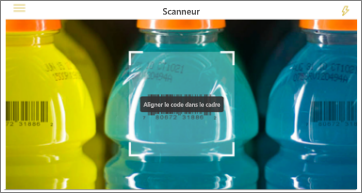
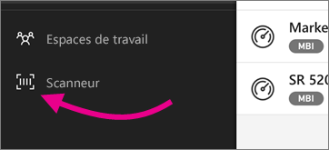

# Scanner un code-barres avec votre appareil à partir de l’application mobile Power BI
Scannez des codes-barres dans le monde réel pour accéder directement à des informations décisionnelles filtrées dans l’application mobile Power BI.

S’applique à :

|  |  |  |  |
|:--- |:--- |:--- |:--- |
|iPhone |iPad |Téléphones Android |Tablettes Android |

Supposons qu’un collègue ait [marqué un champ de code-barres dans un rapport Power BI Desktop](../../desktop-mobile-barcodes.md) et partagé le rapport avec vous. 

Quand vous scannez un code-barres de produit avec le scanner de l’application Power BI de votre appareil, vous voyez le rapport (ou une liste de rapports) avec ce code-barres. Vous pouvez ouvrir ce rapport filtré selon ce code-barres.

## Scanner un code-barres avec le scanner de Power BI
1. Dans la barre de navigation, appuyez sur **Autres options** (...), puis sur **Scanneur**.

    

2. Si votre appareil photo n’est pas activé, vous devez autoriser l’application Power BI à l’utiliser. Il s’agit d’une autorisation à usage unique. 
4. Pointez le scanner sur un code-barres de produit. Une liste des rapports associés à ce code-barres s’affiche.
5. Appuyez sur le nom du rapport, automatiquement filtré selon ce code-barres, pour l’ouvrir sur votre appareil.

## Filtrer selon d’autres codes-barres dans un rapport
Quand vous consultez un rapport filtré selon un code-barres sur votre appareil, vous pouvez filtrer ce rapport en fonction d’un autre code-barres.

* Si l’icône de code-barres contient un filtre , cela signifie que le filtre est actif et que le rapport est déjà filtré selon un code-barres. 
* Si l’icône ne contient pas de filtre , cela signifie que le filtre est inactif et que le rapport n’a pas été filtré selon un code-barres. 

Dans ces deux cas, appuyez sur l’icône pour ouvrir un petit menu avec un scanner flottant.

* Dirigez le scanner sur le nouvel élément pour modifier la valeur de code-barres du filtre du rapport. 
* Sélectionnez **Effacer le filtre à code-barres** pour rétablir le rapport non filtré.
* Sélectionnez **Filtrer par codes-barres récents** pour remplacer le filtre du rapport par l’un des codes-barres que vous avez scannés durant la session active.

## Problèmes lors de la lecture d’un code-barres
Les messages suivants peuvent s’afficher quand vous scannez le code-barres d’un produit.

### « Impossible de filtrer le rapport... »
Le rapport à filtrer est basé sur un modèle de données qui ne comprend pas cette valeur de code-barres. Par exemple, le produit « eau minérale » n’est pas inclus dans le rapport.  

### Tous les visuels du rapport ou une partie d’entre eux ne contiennent aucune valeur
La valeur de code-barres que vous avez scannée existe dans votre modèle, mais tous les visuels de votre rapport ou une partie d’entre eux ne contiennent pas cette valeur et, par conséquent, le filtrage va renvoyer un état vide. Essayez de consulter d’autres pages du rapport ou modifiez vos rapports dans Power BI Desktop afin qu’ils contiennent cette valeur. 

### « Apparemment, vous n’avez aucun rapport pouvant être filtré par code-barres. »
Cela signifie que vous n’avez aucun rapport prenant en charge les codes-barres. Le scanner de codes-barres peut filtrer uniquement les rapports qui possèdent une colonne marquée **Code-barres**.  

Vérifiez que vous ou le propriétaire du rapport avez marqué une colonne **Code-barres** dans Power BI Desktop. En savoir plus sur [le marquage d’un champ de code-barres dans Power BI Desktop](../../desktop-mobile-barcodes.md)

### « Impossible de filtrer le rapport - Il semble que ce code-barres n’existe pas dans les données du rapport. »
Le rapport que vous avez choisi de filtrer est basé sur un modèle de données qui ne comprend pas cette valeur de code-barres. Par exemple, le produit « eau minérale » n’est pas inclus dans le rapport. Vous pouvez scanner un autre produit, choisir un autre rapport (si plusieurs rapports sont disponibles) ou afficher le rapport sans filtrage. 

## Étapes suivantes
* [Marquer un champ de code-barres dans Power BI Desktop](../../desktop-mobile-barcodes.md)
* [Vignettes d’un tableau de bord dans Power BI](../end-user-tiles.md)
* [Tableaux de bord dans Power BI](../end-user-dashboards.md)

