# Afficher les tableaux de bord dans les applications mobiles Power BI
S’applique à :

|  |  |  |  | 
|:--- |:--- |:--- |:--- |:--- |
| [iPhone](mobile-apps-view-dashboard.md#view-dashboards-on-your-iphone) |[iPad](mobile-apps-view-dashboard.md#view-dashboards-on-your-ipad) |[Téléphones Android](mobile-apps-view-dashboard.md#view-dashboards-on-your-android-phone) |[Tablettes Android](mobile-apps-view-dashboard.md#view-dashboards-on-your-android-tablet) |

Un tableau de bord est un portail qui donne accès au cycle de vie et aux processus de votre entreprise. Il fournit une vue d’ensemble, un emplacement unique d’où surveiller l’état actuel des activités de l’entreprise.

## Créer des tableaux de bord dans le service Power BI (https://powerbi.com)
**Vous ne pouvez pas créer de tableaux de bord dans les applications mobiles.** 

Pour afficher des tableaux de bord et des rapports sur votre appareil mobile, vous devez les créer ou vous y connecter à partir d’un navigateur web. 

1. Accédez au service Power BI ([https://www.powerbi.com](https://www.powerbi.com)) et [créez un compte](../../fundamentals/service-self-service-signup-for-power-bi.md).
2. [Créez vos propres tableaux de bord et vos propres rapports Power BI](../../fundamentals/service-get-started.md) ou connectez-vous à des [applications Power BI](../../connect-data/service-connect-to-services.md) existantes pour divers services, tels que [Microsoft Dynamics CRM](../../connect-data/service-connect-to-services.md).

Voici un tableau de bord Power BI dans le service Power BI :

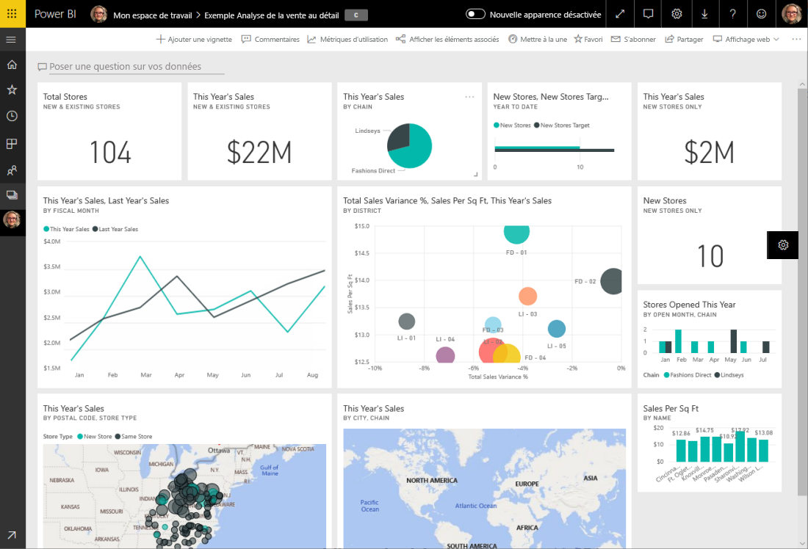

## Afficher des tableaux de bord sur votre iPhone
1. Ouvrez l’application Power BI sur votre iPhone et connectez-vous.
   
   Vous avez besoin de [télécharger l’application iPhone](https://go.microsoft.com/fwlink/?LinkId=522062) depuis l’Apple App Store ?
2. Appuyez sur un tableau de bord pour l’ouvrir.  
   
    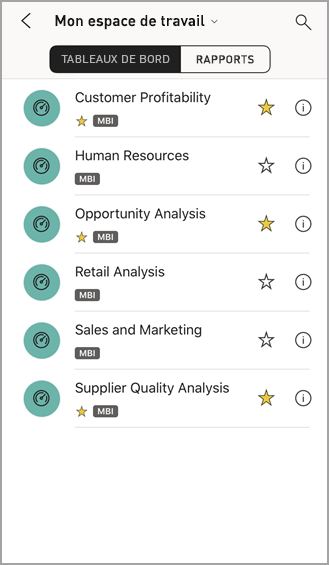
   
   * Les étoiles jaunes  indiquent les tableaux de bord favoris. 
   * La notation au-dessous de chaque nom de tableau de bord (dans cet exemple, MBI) :::image type="icon" source="././media/mobile-apps-view-dashboard/power-bi-dashboard-ios-medium-classification.png" border="false"::: montre comment les données de chaque tableau de bord sont classées. En savoir plus sur la [classification des données dans Power BI](../../create-reports/service-data-classification.md).
   
   Par défaut, les tableaux de bord Power BI ont une apparence un peu différente sur votre iPhone. Toutes les vignettes ont la même taille et elles sont disposées verticalement.
   
    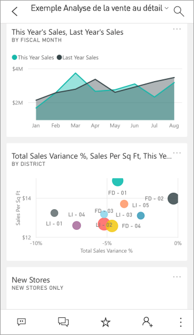
   
   > [!TIP]
   > Si vous êtes le propriétaire du tableau de bord, [dans le service Power BI](../../create-reports/service-create-dashboard-mobile-phone-view.md), vous pouvez créer une vue du tableau de bord spécifiquement pour les téléphones en mode portrait. 
   > 
   > 
   
    Ou faites simplement pivoter votre téléphone pour afficher le tableau de bord en mode paysage.
   
    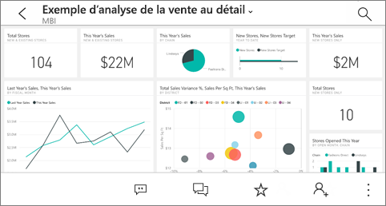
3. Balayez verticalement pour voir toutes les vignettes du tableau de bord. Vous pouvez soit :
   
   * [Appuyez sur une vignette](mobile-tiles-in-the-mobile-apps.md) pour l’ouvrir en mode focus et interagir avec elle.
   * Appuyez sur l’étoile  pour l’[ajouter aux favoris](mobile-apps-favorites.md).
   * Appuyez sur **Inviter**  pour [inviter un collègue](mobile-share-dashboard-from-the-mobile-apps.md) à consulter votre tableau de bord.
   * [Synchronisez le tableau de bord avec votre Apple Watch](mobile-apple-watch.md).
4. Pour revenir à la liste des tableaux de bord, appuyez sur la flèche à côté du titre du tableau de bord, puis sur **Mon espace de travail**.
   
   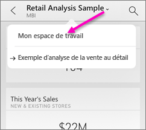

### Afficher les tableaux de bord en mode paysage sur votre iPhone
Faites simplement pivoter votre téléphone pour afficher les tableaux de bord en mode paysage. La disposition du tableau de bord passe d’une série de vignettes à l’affichage du tableau de bord dans son ensemble. Toutes les vignettes du tableau de bord sont disposées comme dans le service Power BI.

Vous pouvez utiliser le geste du « pincement » pour effectuer un zoom avant et arrière sur différentes zones de votre tableau de bord, ou faire un panoramique pour le parcourir. Et vous pouvez toujours [appuyer sur une vignette](mobile-tiles-in-the-mobile-apps.md) pour l’ouvrir en mode focus et interagir avec vos données.

## Afficher des tableaux de bord sur votre iPad
1. Ouvrez l’application Power BI.
   
   Vous devez d’abord [télécharger l’application iPad](https://go.microsoft.com/fwlink/?LinkId=522062) à partir de l’Apple App Store ?
2. Cliquez sur **Tableaux de bord** en haut de l’application.  
   
   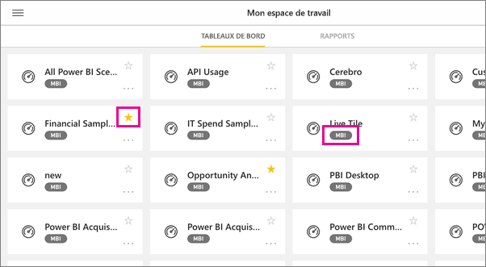
   
   * Les étoiles jaunes  indiquent les tableaux de bord favoris. 
   * La notation au-dessous de chaque nom de tableau de bord (dans cet exemple, MBI) :::image type="icon" source="././media/mobile-apps-view-dashboard/power-bi-dashboard-ios-medium-classification.png" border="false"::: montre comment les données de chaque tableau de bord sont classées. En savoir plus sur la [classification des données dans Power BI](../../create-reports/service-data-classification.md).
3. Vous pouvez partager un tableau de bord à partir de votre espace de travail. Appuyez sur les points de suspension ( **...** ) dans le coin inférieur droit de la vignette du tableau de bord, puis sur **Inviter d’autres personnes**.
   
   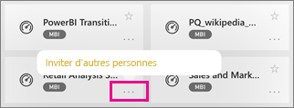
4. Vous pouvez aussi appuyer sur un tableau de bord pour l’ouvrir et voir les vignettes associées. Quand vous êtes dans le tableau de bord, vous pouvez :
   
   * [Appuyer sur une vignette pour interagir](mobile-tiles-in-the-mobile-apps.md) avec elle.
   * [Ouvrir les rapports](mobile-reports-in-the-mobile-apps.md) derrière les vignettes.
   * [Inviter d’autres personnes à afficher le tableau de bord](mobile-share-dashboard-from-the-mobile-apps.md).
   * [Annoter et partager une capture instantanée](mobile-annotate-and-share-a-tile-from-the-mobile-apps.md) de vignette.
5. Pour revenir à Mon espace de travail, appuyez sur le nom du tableau de bord dans le coin supérieur gauche, puis sur **Mon espace de travail**.
   
   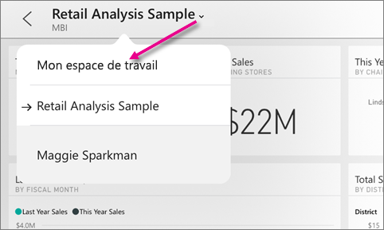

## Afficher des tableaux de bord sur votre téléphone Android
1. Ouvrez l’application Power BI sur votre téléphone Android et connectez-vous.
   
   Faut-il d’abord [télécharger l’application Android](https://go.microsoft.com/fwlink/?LinkID=544867) ?
2. Appuyez sur un tableau de bord pour l’ouvrir.   
   
   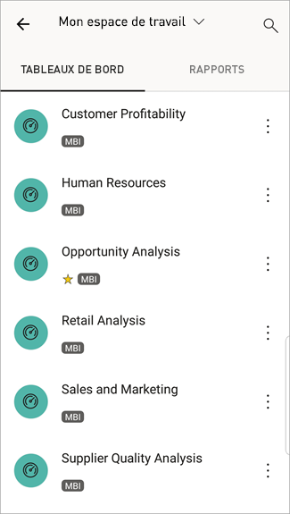

    Les étoiles jaunes  indiquent les tableaux de bord favoris. 

    Une notation au-dessous d’un nom de tableau de bord (dans cet exemple, MBI) :::image type="icon" source="././media/mobile-apps-view-dashboard/power-bi-android-dashboard-medium-classification.png" border="false"::: montre comment les données de chaque tableau de bord sont classées. En savoir plus sur la [classification des données dans Power BI](../../create-reports/service-data-classification.md).

    Les tableaux de bord Power BI ont une apparence un peu différente sur votre téléphone Android. Toutes les vignettes ont la même largeur et elles sont disposées verticalement.

    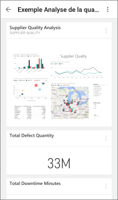

    Si vous êtes le propriétaire du tableau de bord, [dans le service Power BI](../../create-reports/service-create-dashboard-mobile-phone-view.md), vous pouvez créer une vue du tableau de bord spécifiquement pour les téléphones en mode portrait. 

1. Dans le tableau de bord, vous pouvez appuyer sur le bouton **Plus d’options** (...) vertical en regard du nom pour inviter un collègue, actualiser ou obtenir des informations sur le tableau de bord :
   
   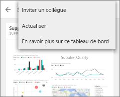
2. Balayez vers le haut ou vers le bas pour voir toutes les [vignettes du tableau de bord](mobile-tiles-in-the-mobile-apps.md). 
3. Pour revenir à la page d’accueil des tableaux de bord, appuyez sur le nom du tableau de bord pour ouvrir le cheminement de navigation, puis appuyez sur **Mon espace de travail**.   

## Afficher des tableaux de bord sur votre tablette Android
1. Ouvrez l’application Power BI sur votre tablette Android et connectez-vous.
   
   Faut-il d’abord [télécharger l’application Android](https://go.microsoft.com/fwlink/?LinkID=544867) ?
2. Appuyez sur un tableau de bord pour l’ouvrir.   
   
   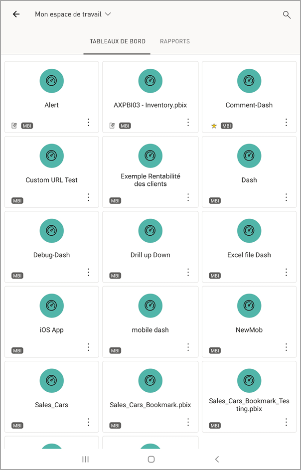
   
   * Les étoiles jaunes  indiquent les tableaux de bord qui ont été mis en favoris. 
   * La notation au-dessous de chaque nom de tableau de bord (dans cet exemple, MBI) :::image type="icon" source="././media/mobile-apps-view-dashboard/power-bi-android-dashboard-medium-classification.png" border="false"::: montre comment les données de chaque tableau de bord sont classées. En savoir plus sur la [classification des données dans Power BI](../../create-reports/service-data-classification.md).
3. Dans le tableau de bord, vous pouvez appuyer sur le bouton **Plus d’options** (...) vertical en regard du nom pour inviter un collègue, actualiser ou obtenir des informations sur le tableau de bord :
   
   
4. Balayez vers le haut ou vers le bas pour voir toutes les [vignettes du tableau de bord](mobile-tiles-in-the-mobile-apps.md). 
   
   Vous pouvez utiliser le geste du « pincement » pour effectuer un zoom avant et arrière sur différentes zones de votre tableau de bord, ou faire un panoramique pour le parcourir. Et vous pouvez toujours [appuyer sur une vignette](mobile-tiles-in-the-mobile-apps.md) pour l’ouvrir en mode focus et interagir avec vos données.
5. Pour revenir à la page d’accueil des tableaux de bord, appuyez sur le nom du tableau de bord pour ouvrir le cheminement de navigation, puis appuyez sur **Mon espace de travail** :
   
    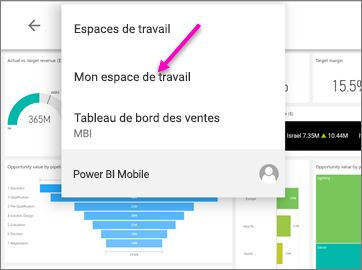

    Vous pouvez utiliser le geste du « pincement » pour effectuer un zoom avant et arrière sur différentes zones de votre tableau de bord, ou faire un panoramique pour le parcourir. Et vous pouvez toujours [appuyer sur une vignette](mobile-tiles-in-the-mobile-apps.md) pour l’ouvrir en mode focus et interagir avec vos données.

## Créer une vue téléphone d’un tableau de bord dans le service Power BI
Si vous êtes le propriétaire du tableau de bord, *dans le service Power BI*, vous pouvez créer une vue du tableau de bord spécifiquement pour les téléphones en mode portrait. 

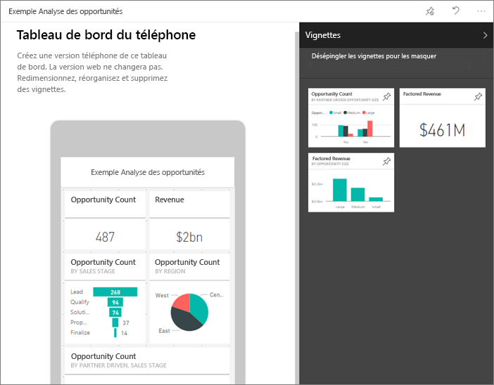

Pour en savoir plus sur la création d’une vue téléphone d’un tableau de bord, [cliquez ici](../../create-reports/service-create-dashboard-mobile-phone-view.md).

## Étapes suivantes
* [Télécharger l’application Android](https://go.microsoft.com/fwlink/?LinkID=544867) à partir de Google Play  
* [Prise en main de l’application Android pour Power BI](mobile-android-app-get-started.md)  
* [Qu’est-ce que Power BI ?](../../fundamentals/power-bi-overview.md)
* Vous avez des questions ? [Essayez d’interroger la communauté Power BI](https://community.powerbi.com/)
