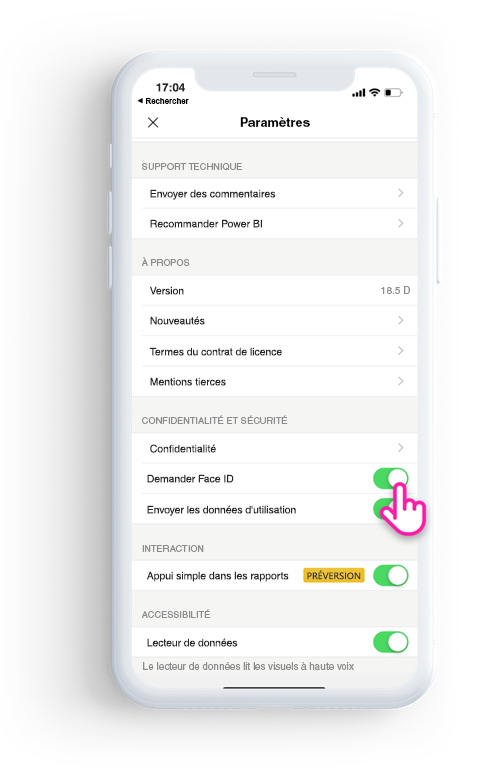

# Protéger l’application Power BI avec Face ID, Touch ID ou un code 

Dans de nombreux cas, les données gérées dans Power BI sont confidentielles. Elles doivent donc être protégées et n’être accessibles que par les utilisateurs autorisés. 

L’application Power BI pour iOS vous permet de protéger vos données en configurant une étape d’identification supplémentaire. Vous devrez fournir un Face ID, un Touch ID ou un code chaque fois que vous lancez l’application, ou que vous déplacez l’application de l’arrière-plan vers le premier plan.

|  |  |
|:--- |:--- |
| iPhone |iPad |

## Activer Face ID, Touch ID ou le code dans les paramètres de l’application

Pour utiliser l’identification supplémentaire dans Power BI, accédez aux paramètres de l’application situés sous **Confidentialité et sécurité**. Vous verrez l’option permettant d’activer Face ID, Touch ID ou le code, selon les fonctionnalités de votre appareil.

Une fois que ce paramètre est activé, chaque fois que vous lancerez Power BI ou que vous l’apporterez au premier plan, vous devrez fournir votre ID avant de pouvoir accéder à l’application. 

C’est iOS qui décide d’exiger un Face ID, un Touch ID ou un code, selon les fonctionnalités de votre appareil. Si votre appareil prend en charge la fonctionnalité Face ID, vous devrez utiliser un Face ID. Si votre appareil prend en charge la fonctionnalité Touch ID, vous devrez utiliser un Touch ID. Si aucun des deux n’est pris en charge, vous devrez fournir un code.

## Utiliser MDM pour appliquer les authentifications par Face ID, Touch ID ou code

Certaines organisations ont des stratégies de sécurité et des exigences de conformité qui imposent une étape d’identification supplémentaire pour pouvoir accéder aux données d’entreprise sensibles. 

L’application iOS Power BI Mobile permet aux administrateurs de contrôler ce paramètre en envoyant (push) les paramètres de configuration de l’application à partir de Microsoft Intune et d’autres solutions de gestion des appareils mobiles (MDM). Les administrateurs peuvent utiliser la stratégie de protection d’application afin d’activer ce paramètre pour tous les utilisateurs ou pour un groupe d’utilisateurs.

|Key  |Type  |Description  |
|---------|---------|---------|
| com.microsoft.powerbi.mobile.ForceDeviceAuthentication | Booléen | La valeur par défaut est false.  Lorsque cette propriété a la valeur True, l’application force les utilisateurs à s’identifier avec Face ID, Touch ID ou un code pour voir les données Power BI dans l’application. Si aucun Face ID, Touch ID ou code n’est configuré sur votre appareil, vous devrez en configurer un afin de pouvoir accéder à Power BI.  |

## Étapes suivantes

[Utiliser MDM pour configurer à distance l’application Power BI pour iOS](mobile-app-configuration.md)
