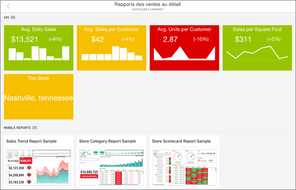
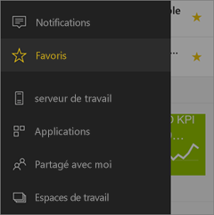
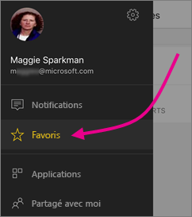
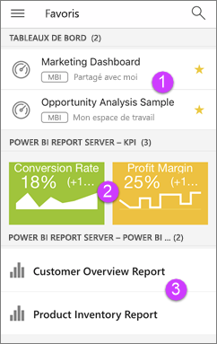

# Bien démarrer avec l’application mobile Power BI sur les appareils iOS
L’application Microsoft Power BI pour iOS sur iPhone, iPad ou iPod Touch permet de vivre l’expérience mobile de Power BI, Power BI Report Server et Reporting Services. Consultez les tableaux de bord de votre organisation et interagissez avec eux, localement et dans le cloud, en tout lieu, grâce à un accès mobile en direct via une interface tactile. Explorez les données des tableaux de bord et partagez-les avec vos collègues par e-mail ou SMS. Et tenez-vous au courant des données les plus à jour sur votre [Apple Watch](mobile-apple-watch.md).  

Vous créez des rapports Power BI dans Power BI Desktop, puis les publiez :

* [Publiez-les sur le service Power BI](../../service-get-started.md) puis créez des tableaux de bord.
* [Publiez-les localement sur Power BI Report Server](../../report-server/quickstart-create-powerbi-report.md).

Ensuite, dans l’application mobile Power BI pour iOS, vous pouvez manipuler vos tableaux de bord et rapports, tant en local que dans le cloud.

Découvrez les [nouveautés des applications mobiles Power BI](mobile-whats-new-in-the-mobile-apps.md).

## Télécharger l’application
[Téléchargez l’application iOS](http://go.microsoft.com/fwlink/?LinkId=522062 "Téléchargez l’application iPhone") à partir de l’Apple App Store sur votre iPhone, iPad ou iPod Touch.

Vous pouvez exécuter l’application Power BI pour iOS sur un iPhone 5 (ou version ultérieure) équipé d’iOS 10 (ou version ultérieure), Vous pouvez aussi l’exécuter sur un iPad ou un iPod Touch avec iOS version 10 ou ultérieure. 

## S’inscrire au service Power BI
Si vous ne vous êtes pas déjà inscrit, accédez à [powerbi.com](https://powerbi.microsoft.com/get-started/) puis, sous **Power BI - Collaboration et partage cloud**, sélectionnez **Essai gratuit**.

## Prise en main de l’application Power BI
1. Sur votre appareil iOS, ouvrez l’application Power BI.
2. Pour afficher vos tableaux de bord Power BI, appuyez sur **Power BI**.  
   Pour afficher vos rapports mobiles et indicateurs de performance clés Reporting Services, appuyez sur **SQL Server Reporting Services**.
   
   
   
   Lorsque vous êtes dans l’application, appuyez simplement sur le bouton de navigation globale  dans l’angle supérieur gauche pour passer naviguer entre les deux. 

## Essayer les exemples Power BI et Reporting Services
Même sans inscription, vous pouvez vous servir des exemples Power BI et Reporting Services. Après avoir téléchargé l’application, vous pouvez afficher les exemples ou vous lancer. Revenez aux exemples quand vous le souhaitez à partir du menu de navigation globale.

### Exemples de Power BI
Vous pouvez afficher et utiliser les exemples de tableau de bord Power BI, mais vous ne pouvez pas effectuer certaines opérations avec eux. Vous ne pouvez pas ouvrir les rapports associés aux tableaux de bord, partager les exemples ou les définir comme favoris.

1. Appuyez sur le bouton de navigation globale  en haut à gauche.
2. Appuyez sur l’icône d’engrenage dans l’angle supérieur droit , puis sur **Exemples Power BI**.
3. Choisissez un rôle et explorez l’exemple de tableau de bord associé.  
   
   
   
   > [!NOTE]
   > Certaines fonctionnalités ne sont pas disponibles dans les exemples. Par exemple, vous ne pouvez pas afficher les exemples de rapports qui sous-tendent les tableaux de bord. 
   > 
   > 

### Exemples de rapports mobiles Reporting Services
1. Appuyez sur le bouton de navigation globale  en haut à gauche.
2. Appuyez sur l’icône d’engrenage dans l’angle supérieur droit , puis sur **Exemples Reporting Services**.
3. Ouvrez le dossier Retail Reports ou Sales Reports pour explorer les indicateurs de performance clés et les rapports mobiles.
   
   

## Trouver votre contenu dans les applications mobiles Power BI
Dans les applications mobiles Power BI, vos tableaux de bord et rapports sont stockés dans des emplacements différents en fonction de leur provenance. En savoir plus sur la [recherche de votre contenu dans les applications mobiles](mobile-apps-quickstart-view-dashboard-report.md). Par ailleurs, vous pouvez toujours effectuer une recherche dans tout votre contenu dans les applications mobiles Power BI. 

En savoir plus sur la [recherche de votre contenu dans les applications mobiles](mobile-apps-quickstart-view-dashboard-report.md).

## Afficher vos tableaux de bord, indicateurs de performances clés et rapports favoris
Sur la page Favoris dans les applications mobiles, vous pouvez voir vos tableaux de bord Power BI favoris, ainsi que les indicateurs de performance clés et rapports Power BI Report Server et Reporting Services. Quand vous mettez un tableau de bord en *favoris* dans l’application mobile Power BI, vous pouvez y accéder à partir de tous les appareils, y compris dans le service Power BI dans votre navigateur. 

* Appuyez sur **Favoris**.
  
   
  
   Vous pouvez voir tous vos favoris regroupés sur cette page :
  
   
  
  1. Tableaux de bord dans le service Power BI
  2. Indicateurs de performance clés sur Power BI Report Server
  3. Rapports Power BI sur Power BI Report Server

Accédez à des informations supplémentaires sur les [favoris dans les applications mobiles Power BI](mobile-apps-favorites.md).

## Prise en charge des applications mobiles Power BI pour les entreprises
Les entreprises peuvent utiliser Microsoft Intune pour gérer les appareils et applications, dont les applications mobiles Power BI pour Android et iOS.

Microsoft Intune permet aux organisations de contrôler divers éléments, comme la nécessité de disposer d’un code confidentiel d’accès, la façon dont l’application traite les données et même le chiffrement des données de l’application quand cette dernière n’est pas utilisée.

> [!NOTE]
> Si vous utilisez l’application mobile Power BI sur votre appareil iOS et que votre organisation a configuré Microsoft Intune MAM, l’actualisation des données en arrière-plan est désactivée. La prochaine fois que vous ouvrez l’application, Power BI actualise les données à partir du service Power BI sur le web.
> 

En savoir plus sur la [configuration des applications mobiles Power BI avec Microsoft Intune](../../service-admin-mobile-intune.md). 

## Étapes suivantes

* [Qu’est-ce que Power BI ?](../../power-bi-overview.md)
* Vous avez des questions ? [Essayez d’interroger la communauté Power BI](http://community.powerbi.com/)

