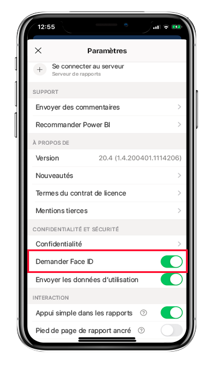
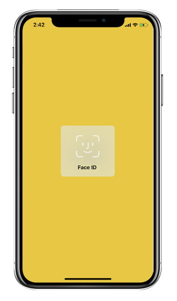
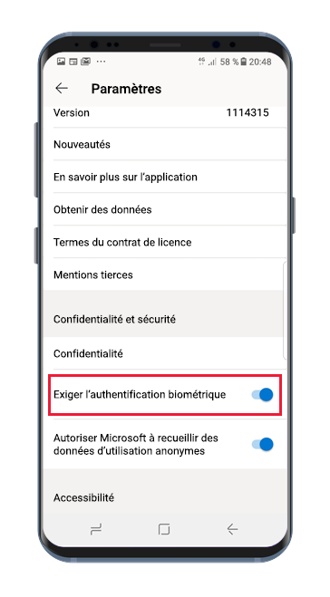
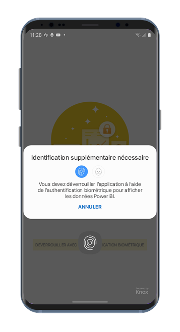

# Protéger l’application Power BI avec Face ID, Touch ID, un code secret ou des données biométriques 

Dans de nombreux cas, les données gérées dans Power BI sont confidentielles. Elles doivent donc être protégées et n’être accessibles que par les utilisateurs autorisés. 

Les applications Power BI pour iOS et Android vous permettent de protéger vos données en configurant une étape d’identification supplémentaire. Ensuite, chaque fois que l’application est lancée ou se retrouve au premier plan, l’utilisateur doit s’identifier. Sur iOS, l’utilisateur doit utiliser Face ID, Touch ID ou un code secret. Sur Android, l’utilisateur doit fournir des données biométriques (Fingerprint ID).

S’applique à :

|  |  |  |  |
|:--- |:--- |:--- |:--- |
|iPhone |iPad |Téléphones Android |Tablettes Android |

## Activer Face ID, Touch ID ou un code secret sur iOS

Pour utiliser l’identification supplémentaire dans l’application mobile Power BI pour iOS, accédez au paramètre d’application sous **Confidentialité et sécurité**. Notez l’option permettant d’activer Face ID, Touch ID ou le code secret. Les options disponibles dépendent des capacités de votre appareil.

Une fois que ce paramètre est activé, chaque fois que vous lancez Power BI ou que vous le placez au premier plan, vous devrez fournir votre ID avant de pouvoir accéder à l’application.

Le type d’ID que vous êtes invité à fournir dépend des capacités de votre appareil. Si votre appareil prend en charge la fonctionnalité Face ID, vous devrez utiliser un Face ID. Si votre appareil prend en charge la fonctionnalité Touch ID, vous devrez utiliser un Touch ID. Si aucun des deux n’est pris en charge, vous devrez fournir un code. L’image ci-dessous montre l’écran d’authentification de Face ID.

## Activer les données biométriques (Fingerprint ID) sur Android

Pour utiliser l’identification supplémentaire dans l’application mobile Power BI pour Android, accédez au paramètre d’application sous **Confidentialité et sécurité**. Notez l’option permettant d’activer les données biométriques.

Une fois que ce paramètre est activé, chaque fois que vous lancez Power BI ou que vous le placez au premier plan, vous devrez fournir vos données biométriques (Fingerprint ID) avant de pouvoir accéder à l’application.

L’image ci-dessous montre l’écran d’authentification par empreinte digitale.

>[!NOTE]
>Pour pouvoir utiliser le paramètre Exiger l’authentification biométrique de l’application mobile, vous devez d’abord configurer la biométrie sur votre appareil Android. Si votre appareil ne prend pas en charge la biométrie, vous ne pourrez pas sécuriser l’accès à vos données Power BI à l’aide de ce paramètre d’application mobile.
>
>Si votre administrateur a [activé l’accès sécurisé à distance](#mdm-enforcement-of-secure-access-to-your-power-bi-mobile-app) pour l’application mobile, vous devez configurer la biométrie sur votre appareil pour accéder à l’application (si ce n’est pas déjà fait). Si votre appareil ne prend pas en charge la biométrie, le paramètre distant ne vous affecte pas. L’accès à votre application mobile reste non sécurisé.

## Mise en place de MDM pour sécuriser l’accès à votre application mobile Power BI

Certaines organisations ont des stratégies de sécurité et des exigences de conformité qui imposent une étape d’identification supplémentaire pour pouvoir accéder aux données d’entreprise sensibles.

L’application mobile Power BI permet aux administrateurs de contrôler le paramètre d’accès sécurisé à l’application mobile en envoyant (push) les paramètres de configuration de l’application à partir de Microsoft Intune et d’autres solutions de gestion des appareils mobiles (MDM). Les administrateurs peuvent utiliser la stratégie de protection d’application afin d’activer ce paramètre pour tous les utilisateurs ou pour un groupe d’utilisateurs. Pour plus d’informations, consultez [Utiliser MDM pour configurer à distance l’application mobile Power BI](mobile-app-configuration.md#data-protection-settings-ios-and-android).

## Étapes suivantes
* [Utiliser MDM pour configurer à distance l’application mobile Power BI](mobile-app-configuration.md)
