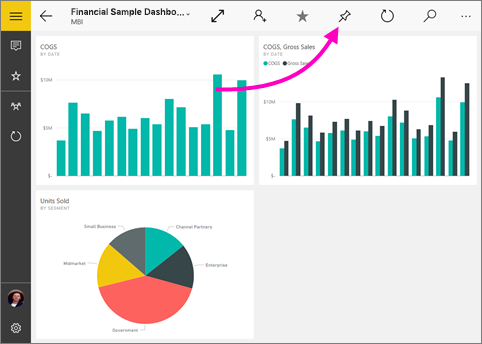
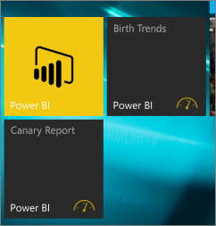

# Épingler un tableau de bord à l’écran d’accueil Windows 10 à partir de l’application mobile Power BI
Vous pouvez épingler des tableaux de bord Power BI à l’écran d’accueil de Windows à partir de l’application mobile Power BI pour Windows 10. Lorsque vous appuyez sur la vignette sur l’écran d’accueil, le tableau de bord s’ouvre dans l’application mobile Power BI pour Windows 10.

>[!NOTE]
>La prise en charge des applications mobiles Power BI pour les **téléphones utilisant Windows 10 Mobile** ne sera plus disponible après le 16 mars 2021. [En savoir plus](https://go.microsoft.com/fwlink/?linkid=2121400)

## Épingler un tableau de bord sur votre écran d’accueil sous forme de vignette
1. Ouvrez un tableau de bord.
2. Appuyez sur **Épingler au menu Démarrer** .
   
   
   
   Accédez à l’écran d’accueil de votre appareil pour voir la vignette.
   
   

## Étapes suivantes
* [Télécharger l’application mobile Power BI pour Windows 10](https://go.microsoft.com/fwlink/?LinkID=526478) à partir du Windows Store  
* [Prise en main de l’application mobile Power BI pour Windows 10](mobile-windows-10-phone-app-get-started.md)  
* [Qu’est-ce que Power BI ?](../../fundamentals/power-bi-overview.md)
* Vous avez des questions ? [Essayez d’interroger la communauté Power BI](https://community.powerbi.com/)
