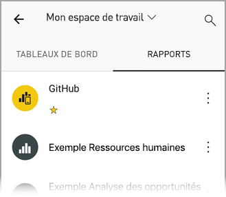
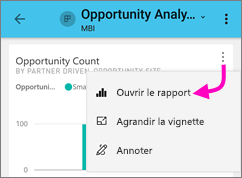
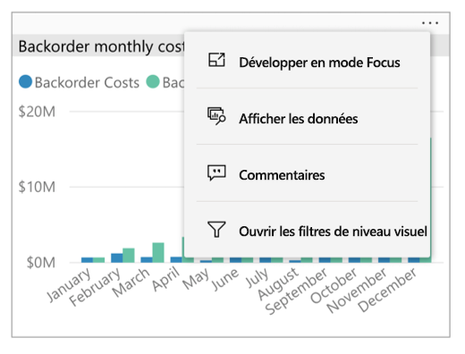
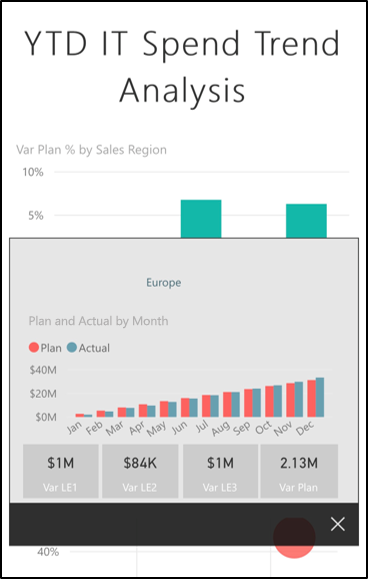
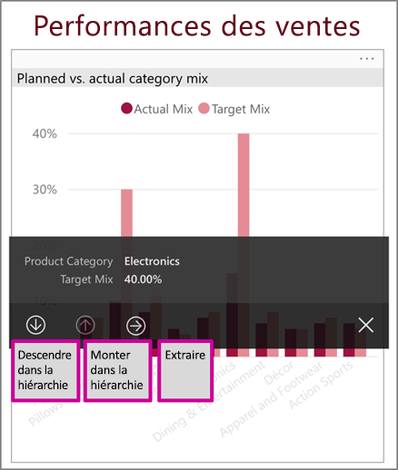
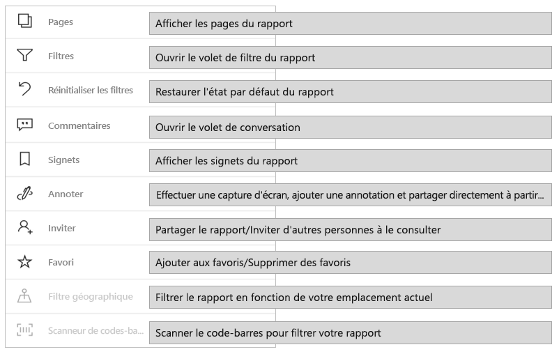
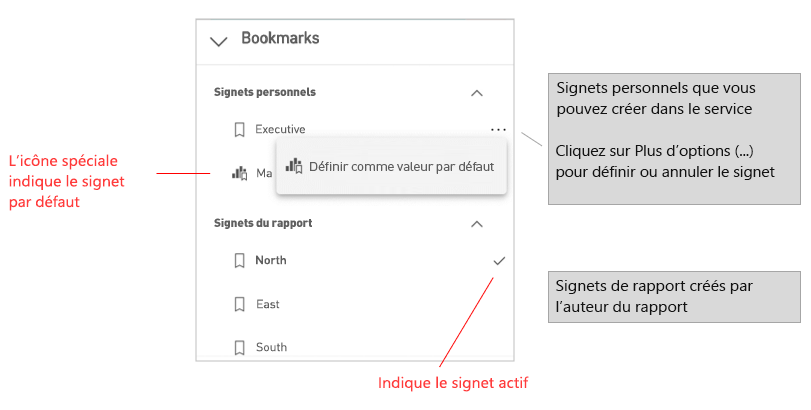
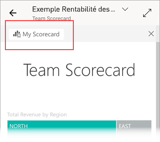

# Explorer des rapports dans les applications mobiles Power BI
S’applique à :

|  |  |  |  |  |
|:---: |:---: |:---: |:---: |:---: |
| iPhone |iPad |Téléphones Android |Tablettes Android |Appareils Windows 10 |

>[!NOTE]
>La prise en charge des applications mobiles Power BI pour les **téléphones utilisant Windows 10 Mobile** ne sera plus disponible après le 16 mars 2021. [En savoir plus](/legal/powerbi/powerbi-mobile/power-bi-mobile-app-end-of-support-for-windows-phones)

Un rapport Power BI est une vue interactive de vos données, avec des visuels qui représentent différents résultats et insights de ces données. L’affichage de rapports dans les applications mobiles Power BI est la troisième étape d’un processus en trois étapes :

1. [Créez des rapports dans Power BI Desktop](../../create-reports/desktop-report-view.md). Vous pouvez même [optimiser un rapport pour les téléphones](mobile-apps-view-phone-report.md) dans Power BI Desktop.
2. Publiez ces rapports dans le service Power BI [ (https://powerbi.com)](https://powerbi.com) ou [Power BI Report Server](../../report-server/get-started.md)).  
3. Exploitez les rapports dans les applications mobiles Power BI.

## Ouvrir un rapport Power BI dans l’application mobile
Les rapports Power BI sont stockés dans des emplacements différents dans l’application mobile, en fonction de leur provenance. Ils peuvent être situés dans Applications, Partagés avec moi, Espaces de travail (y compris Mon espace de travail) ou sur un serveur de rapports. Parfois, ils sont répertoriés dans un tableau de bord associé par lequel vous accédez à un rapport.

Dans les listes et les menus, vous trouverez une icône en regard du nom d’un rapport, qui vous aidera à comprendre que l’élément est un rapport :

Il existe deux icônes pour les rapports dans les applications mobiles Power BI :

*  indique un rapport qui sera présenté en mode paysage dans l’application. Il a une apparence identique à celle dans un navigateur.

*  indique un rapport qui a au moins une page optimisée pour le téléphone, et sera présenté en mode portrait.

> [!NOTE]
> Quand vous tenez votre téléphone en orientation paysage, vous obtenez toujours la disposition paysage, même si la page de rapport est en mode mobile.

Pour accéder à un rapport à partir d’un tableau de bord, appuyez sur **Plus d’options** (...) dans le coin supérieur droit d’une vignette, puis sur **Ouvrir un rapport** :
  
  
  
  Les vignettes ne peuvent pas toutes être ouvertes en tant que rapports. Par exemple, les vignettes créées quand vous posez une question dans la zone Questions et réponses n’ouvrent pas de rapports quand vous appuyez dessus.
  
## Faire un zoom avant sur vos données   
Utilisez le geste de pincement pour zoomer sur vos rapports et les examiner plus en détail. Faites un pincement inverse pour dézoomer à nouveau. Le pincement pour zoomer est pris en charge sur les tablettes et téléphones Android et iOS.

## Interagir avec les rapports
Une fois que vous avez ouvert un rapport dans l’application, vous pouvez commencer à l’utiliser. Vous pouvez faire beaucoup de choses avec votre rapport et les données qu’il contient. Dans le pied de page du rapport, vous trouverez les actions que vous pouvez effectuer sur le rapport. En appuyant brièvement ou longuement sur les données du rapport, vous pouvez aussi segmenter les données.

### Interaction d’appui simple ou d’appui double
Quand vous téléchargez l’application mobile Power BI, elle est définie pour une interaction avec appui simple. Cela signifie que quand vous appuyez dans un visuel pour effectuer une action, par exemple la sélection d’un élément d’un sélecteur, la sélection croisée, un clic sur un lien ou un bouton, etc., l’appui sélectionne le visuel et effectue aussi l’action souhaitée.

Si vous préférez, vous pouvez passer à l’interaction d’appui double. Avec l’interaction d’appui double, vous appuyez d’abord sur un visuel pour le sélectionner, puis vous rappuyez dans le visuel pour effectuer l’action souhaitée.

Pour passer à l’interaction d’appui double ou pour revenir à l’interaction d’appui simple, accédez à [Paramètres d’interaction de l’application](./mobile-app-interaction-settings.md).

### Comparaison entre le mode sélection unique et le mode sélection multiple pour la sélection de points de données

Dans un rapport, il faut appuyer sur un point de données pour le sélectionner. Vous pouvez choisir d’utiliser le mode sélection unique ou le mode sélection multiple. Dans le mode sélection unique, si l’on appuie sur un point de données pour le sélectionner, cette sélection remplace la précédente. En mode sélection multiple, si l’on appuie sur un point de données pour le sélectionner, la sélection est *ajoutée* à la sélection précédente, et le résultat combiné de toutes les sélections est mis en surbrillance dans tous les visuels du rapport.

Pour désélectionner un point de données sélectionné, il suffit d’appuyer à nouveau dessus.

Pour passer du mode sélection unique au mode sélection multiple et inversement, accédez aux [paramètres d’interaction de l’application](./mobile-app-interaction-settings.md).

### Utilisation de l’appui et de l’appui long
Un appui équivaut à un clic de souris. Par conséquent, si vous souhaitez effectuer la sélection croisée du rapport en fonction d’un point de données, appuyez sur ce point de données.
Si vous appuyez sur une valeur de segment, elle est sélectionnée et le reste du rapport est découpé en fonction de cette valeur.
Si vous appuyez sur un lien, un bouton ou un signet, l’action définie par l’auteur du rapport se produit.

Vous avez probablement remarqué que, si vous appuyez sur un visuel, une bordure apparaît. Dans le coin supérieur droit de la bordure, vous verrez **Plus d’options** (...). Si vous appuyez sur les points de suspension, vous verrez un menu d’actions que vous pouvez effectuer sur ce visuel :

### Info-bulle et actions d’exploration
Quand vous appuyez longuement sur un point de données, une info-bulle s’affiche et présente les valeurs que ce point de données représente :

Si l’auteur du rapport a configuré une info-bulle de la page de rapport, l’info-bulle par défaut est remplacée par celle de la page de rapport :

> [!NOTE]
> Les info-bulles de rapport sont prises en charge pour les appareils dont la taille est d’au moins 640 pixels et la fenêtre d’affichage d’au moins 320. Si votre appareil est plus petit, l’application affiche les info-bulles par défaut.

Les auteurs de rapports peuvent définir des hiérarchies dans les données et des relations entre les pages du rapport. Les hiérarchies permettent de monter ou descendre, et d’extraire une autre page de rapport à partir d’un visuel et d’une valeur. Ainsi, quand vous appuyez longuement sur une valeur, en plus de l’info-bulle, les options d’exploration pertinentes s’affichent dans le pied de page :

Quand vous appuyez sur une partie spécifique d’un visuel, puis sur l’option d’*extraction*, Power BI vous redirige vers une autre page du rapport, filtrée sur la valeur que vous avez choisie. L’auteur d’un rapport peut définir une ou plusieurs options d’extraction, chacune vous redirigeant vers une page différente. Dans ce cas, vous pouvez choisir l’option que vous voulez extraire. Le bouton Précédent vous ramène à la page précédente.

Pour plus d’informations, découvrez comment [ajouter l’extraction à Power BI Desktop](../../create-reports/desktop-drillthrough.md).
   
   > [!IMPORTANT]
   > Dans les applications mobiles Power BI, les actions d’exploration des visuels de matrice et de table sont activées par le biais des valeurs de cellules uniquement, et non par en-têtes de ligne ou de colonne.
   
   
   
### Utilisation des actions dans le pied de page du rapport
À partir du pied de page du rapport, vous pouvez effectuer plusieurs actions dans la page de rapport active ou le rapport entier. Le pied de page offre un accès rapide aux actions les plus couramment utilisées. Vous pouvez accéder à d’autres actions en appuyant sur le bouton **Plus d’options** (...) :

Vous pouvez effectuer les actions suivantes à partir du pied de page :
* Réinitialiser le filtre de rapport et rétablir l’état d’origine des sélections croisées.
* Ouvrir le volet de conversation pour voir ou ajouter des commentaires dans le rapport.
* Ouvrir le volet de filtre pour voir ou modifier le filtre actuellement appliqué au rapport.
* Lister toutes les pages du rapport. Un appui sur le nom d’une page permet de charger et de présenter cette page.
Vous pouvez passer d’une page de rapport à une autre, en effectuant un balayage du bord de l’écran vers le centre.
* Voir toutes les actions du rapport

#### Toutes les actions du rapport
Quand vous appuyez sur le bouton **Plus d’options** (...) dans le pied de page du rapport, vous voyez toutes les actions que vous pouvez effectuer sur un rapport :

Certaines des actions peuvent être désactivées, car elles dépendent de fonctionnalités du rapport spécifiques.
Par exemple :

L’option **Signets** est présente uniquement si les [signets](mobile-reports-in-the-mobile-apps.md#bookmarks) ont été définis dans le rapport. Les signets personnels que vous pouvez définir dans le service Power BI ainsi que les signets définis par le créateur du rapport sont affichés. Si l’un des signets a été défini comme signet par défaut, le rapport s’ouvre dans cette vue lors de son chargement.

L’option **Annoter et partager** peut être désactivée si une [stratégie de protection Intune](/intune/app-protection-policies) de votre organisation interdit le partage à partir d’une application mobile Power BI.

**Inviter** est activée uniquement si vous avez l’autorisation de partager le rapport avec d’autres utilisateurs. Vous disposez de cette autorisation uniquement si vous êtes le propriétaire du rapport ou si celui-ci vous a accordé l’autorisation de repartage.

**Filtrer par emplacement actuel** est activée si l’auteur du rapport l’a classé avec des données géographiques. Pour plus d’informations, découvrez comment [identifier des données géographiques dans un rapport](../../transform-model/desktop-mobile-geofiltering.md).

**Analyser pour filtrer le rapport par code-barres** est activée uniquement si le jeu de données dans votre rapport est balisé comme **code-barres**. Pour plus d’informations, découvrez comment [baliser des codes-barres dans Power BI Desktop](../../transform-model/desktop-mobile-barcodes.md).

### Signets

L’application mobile Power BI prend en charge aussi bien les signets de rapport que le créateur du rapport a définis que les signets personnels que vous pouvez définir dans le service Power BI. Le menu Signets se trouve sous **Autres options** (...) dans la [barre d’outils Actions du rapport](mobile-reports-in-the-mobile-apps.md#all-report-actions).

Les signets par défaut sont indiqués par une icône spéciale. Pour les signets personnels, vous pouvez définir, annuler ou changer le paramètre par défaut en appuyant sur **Plus d’options (...)** à côté du signet que vous voulez changer, puis en choisissant **Utiliser par défaut** ou **Effacer la valeur par défaut**.

Quand une vue de signet d’un rapport est ouverte, le nom du signet apparaît en haut du rapport.

[Découvrez-en plus sur les signets dans le service Power BI](../end-user-bookmarks.md).

## Actualiser vos données

Si vous n’avez pas la certitude d’afficher les données les plus récentes, vous pouvez extraire de nouvelles données dans votre rapport à partir du service Power BI :

* Sur les appareils iOS et les tablettes Android, tirez légèrement de haut en bas sur la page de rapport.
* Sur les téléphones Android, vous pouvez utiliser l’action d’extraction ou un bouton Actualiser, selon la façon dont vous avez configuré les [paramètres d’interaction](mobile-app-interaction-settings.md).
* Sur les appareils Windows, utilisez le bouton Actualiser en haut à droite de l’écran.

    Les pages de rapport qui ont l’[actualisation automatique de la page](../../create-reports/desktop-automatic-page-refresh.md) sont automatiquement actualisées en fonction de la configuration (application Windows uniquement).

>[!NOTE]
>Les méthodes d’actualisation ci-dessus n’actualisent pas le jeu de données sous-jacent. Au lieu de cela, elles mettent à jour le rapport que vous affichez sur l’application mobile avec toutes les nouvelles données susceptibles d’exister dans Power BI.

### Comment savoir quand mon rapport a été actualisé pour la dernière fois ?

Pour savoir à quel moment votre rapport a été actualisé pour la dernière fois, appuyez sur l’en-tête du rapport. L’arborescence de navigation du rapport s’affiche, avec notamment la date et l’heure de la dernière actualisation. 

 
## Configurer votre expérience avec les rapports
L’application mobile Power BI a un certain nombre de paramètres qui vous permettent de contrôler votre expérience avec les rapports. Actuellement, vous pouvez configurer
* **Interaction avec les visuels de rapport** : Vous pouvez choisir d’utiliser une interaction d’appui simple ou d’appui double.
* **Méthode d’actualisation des données** : Vous pouvez choisir d’avoir un bouton d’actualisation ou une action de balayage vers le bas pour actualiser les données d’un rapport.
* **Visibilité du pied de page des rapports** : Vous pouvez choisir d’avoir un pied de page ancré toujours visible ou un pied de page dynamique qui est masqué et réapparaît en fonction de vos actions (par exemple le défilement).

Pour plus d’informations sur le changement de ces paramètres, consultez [Paramètres d’interaction d’application](./mobile-app-interaction-settings.md).

## Étapes suivantes
* [Visualiser les rapports Power BI optimisés pour les téléphones et interagir avec eux](mobile-apps-view-phone-report.md)
* [Créer une version de rapport optimisée pour les téléphones](../../create-reports/desktop-create-phone-report.md)
* Vous avez des questions ? [Essayez d’interroger la communauté Power BI](https://community.powerbi.com/)