# Définir des alertes de données dans les applications mobiles Power BI
S’applique à :

|  |  |  |  |  |
|:--- |:--- |:--- |:--- |:--- |
| iPhone |iPad |Téléphones Android |Tablettes Android |Appareils Windows 10 |

Vous pouvez définir des alertes sur des tableaux de bord dans le service Power BI et les applications mobiles Power BI. Des alertes vous avertissent quand des données d’une vignette changent au-delà des limites que vous définissez. Les alertes fonctionnent pour les vignettes présentant un seul nombre, telles les cartes et les jauges, pas avec des données de streaming. Vous pouvez définir des alertes de données sur votre appareil mobile et les afficher dans le service Power BI et inversement. Vous seul pouvez voir les alertes de données que vous définissez, même si vous partagez un tableau de bord ou une capture instantanée de vignette.

Vous pouvez définir des alertes sur les vignettes si vous avez une licence Power BI Pro ou si le tableau de bord partagé se trouve dans une capacité Premium. 

> [!WARNING]
> Les notifications d’alerte pilotées par les données fournissent des informations sur vos données. Si votre appareil est volé, nous vous recommandons d’accéder au service Power BI pour désactiver toutes les règles d’alerte pilotées par les données. 
> 
> En savoir plus sur la [gestion des alertes de données dans le service Power BI](../../create-reports/service-set-data-alerts.md).
> 
> 

## Alertes de données sur un iPhone ou iPad
### Définir une alerte sur un iPhone ou iPad
1. Appuyez sur une vignette numérique ou de jauge dans le tableau de bord pour l’ouvrir en mode focus.  
   
   
2. Appuyez sur l’icône en forme de cloche  pour ajouter une alerte.  
3. Appuyez sur **Ajouter une règle d’alerte**.
   
   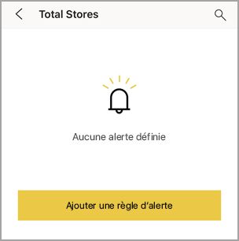
4. Choisissez de recevoir des alertes au-dessus ou en dessous d’une valeur et définissez la valeur en question.
   
   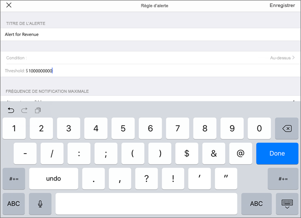
5. Indiquez si vous souhaitez recevoir des alertes toutes les heures ou quotidiennement et si vous voulez recevoir un courrier électronique quand vous recevez l’alerte.
   
   > [!NOTE]
   > Vous ne recevez pas d’alertes toutes les heures ou tous les jours, sauf si les données ont été réellement actualisées pendant la période en question.
   > 
   > 
6. Vous pouvez également modifier le titre de l’alerte.
7. Appuyez sur **Enregistrer**.
8. Une seule vignette peut avoir des alertes pour les valeurs à la fois au-dessus et en dessous des seuils. Dans **Gérer les alertes**, appuyez sur **Ajouter un règle d’alerte**.
   
   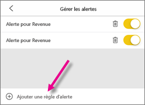

### Gérer les alertes sur votre iPhone ou iPad
Vous pouvez gérer des alertes spécifiques sur votre appareil mobile ou [gérer toutes les alertes dans le service Power BI](../../create-reports/service-set-data-alerts.md).

1. Dans un tableau de bord, appuyez sur une vignette numérique ou de jauge associée à une alerte.  
   
   

2. Appuyez sur l’icône en forme de cloche .  
3. Appuyez sur le nom de l’alerte pour la modifier, appuyez sur le curseur pour désactiver les alertes par courrier électronique ou sur la poubelle pour supprimer l’alerte.
   
    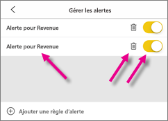

## Alertes de données sur un appareil Android
### Définir une alerte sur un appareil Android
1. Dans le tableau de bord Power BI, appuyez sur une vignette numérique ou de jauge pour l’ouvrir.  
2. Appuyez sur l’icône en forme de cloche  pour ajouter une alerte.  
   
   
3. Appuyez sur l’icône plus (+).
   
   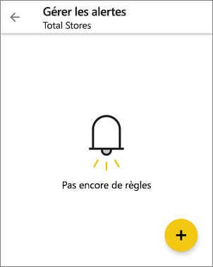
4. Choisissez de recevoir des alertes au-dessus ou en dessous d’une valeur et entrez la valeur en question.
   
   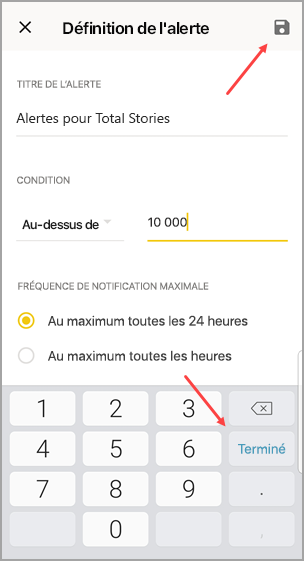
5. Appuyez sur **Terminé**.
6. Indiquez si vous souhaitez recevoir des alertes toutes les heures ou quotidiennement et si vous voulez recevoir un courrier électronique quand vous recevez l’alerte.
   
   > [!NOTE]
   > Vous ne recevez pas d’alertes toutes les heures ou tous les jours, sauf si les données ont été réellement actualisées pendant la période en question.
   > 
   > 
7. Vous pouvez également modifier le titre de l’alerte.
8. Appuyez sur **Enregistrer**.

### Gérer les alertes sur un appareil Android
Vous pouvez gérer des alertes spécifiques dans l’application mobile Power BI ou [gérer toutes les alertes dans le service Power BI](../../create-reports/service-set-data-alerts.md).

1. Dans un tableau de bord, appuyez sur une vignette de carte ou de jauge associée à une alerte.  
2. Appuyez sur l’icône en forme de cloche .  
3. Appuyez sur l’alerte pour modifier une valeur ou la désactiver.
   
    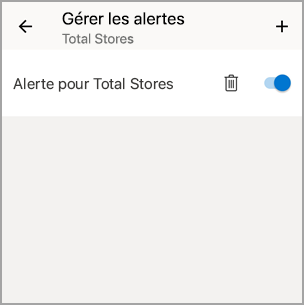
4. Appuyez sur l’icône plus (+) pour ajouter une autre alerte à la même vignette.
5. Pour supprimer complètement l’alerte, appuyez sur l’icône de la poubelle .

## Alertes de données sur un appareil Windows

>[!NOTE]
>La prise en charge des applications mobiles Power BI pour les **téléphones utilisant Windows 10 Mobile** ne sera plus disponible après le 16 mars 2021. [En savoir plus](https://go.microsoft.com/fwlink/?linkid=2121400)

### Définir des alertes de données sur un appareil Windows
1. Appuyez sur une vignette numérique ou de jauge dans le tableau de bord pour l’ouvrir.  
2. Appuyez sur l’icône en forme de cloche  pour ajouter une alerte.  
   
   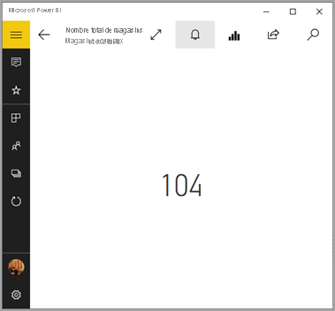
3. Appuyez sur l’icône plus (+).
   
   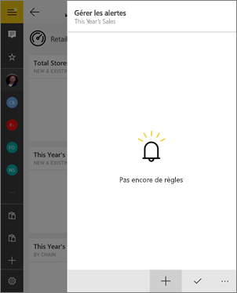
4. Choisissez de recevoir des alertes au-dessus ou en dessous d’une valeur et entrez la valeur en question.
   
   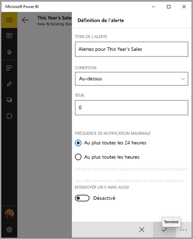
5. Indiquez si vous souhaitez recevoir des alertes toutes les heures ou quotidiennement et si vous voulez recevoir un courrier électronique quand vous recevez l’alerte.
   
   > [!NOTE]
   > Vous ne recevez pas d’alertes toutes les heures ou tous les jours, sauf si les données ont été réellement actualisées pendant la période en question.
   > 
   > 
6. Vous pouvez également modifier le titre de l’alerte.
7. Appuyez sur la coche.
8. Une seule vignette peut avoir des alertes pour les valeurs à la fois au-dessus et en dessous des seuils. Dans **Gérer les alertes**, appuyez sur le signe plus (+).
   
   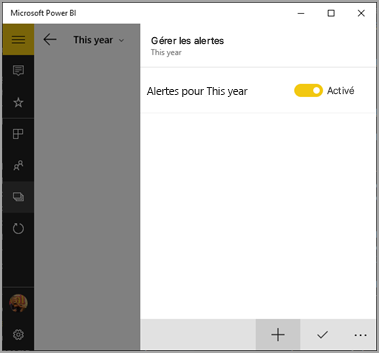

### Gérer les alertes sur un appareil Windows
Vous pouvez gérer des alertes spécifiques dans l’application mobile Power BI ou [gérer toutes les alertes dans le service Power BI](../../create-reports/service-set-data-alerts.md).

1. Dans un tableau de bord, appuyez sur une vignette de carte ou de jauge associée à une alerte.  
2. Appuyez sur l’icône en forme de cloche .  
   
   
3. Appuyez sur l’alerte pour modifier une valeur ou la désactiver.
   
    
4. Pour supprimer complètement l’alerte, cliquez avec le bouton droit ou appuyez de façon prolongée sur **Supprimer**.

## Recevoir des alertes
Vous recevez des alertes dans le [centre de notification](mobile-apps-notification-center.md) Power BI de votre appareil mobile ou dans le service Power BI, ainsi que des notifications concernant les nouveaux tableaux de bord qu’un utilisateur a partagés avec vous.

Les sources de données sont souvent configurées pour être actualisées tous les jours, même s’il est possible d’augmenter la fréquence. Lorsque les données du tableau de bord sont actualisées, si les données suivies atteignent un des seuils définis, cela a plusieurs conséquences.

1. Power BI vérifie si cela fait plus d’une heure ou plus de 24 heures (selon l’option sélectionnée) que la dernière alerte a été envoyée.
   
   Tant que les données se trouvent au-delà du seuil, vous recevez une alerte toutes les heures ou toutes les 24 heures.
2. Si vous avez défini l’alerte de façon à recevoir un courrier électronique, vous recevez un message semblable à celui-ci dans votre boîte de réception.
   
   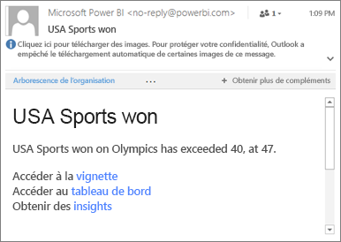
3. Power BI ajoute un message à votre [Centre de notification](mobile-apps-notification-center.md) et ajoute un point jaune à l’icône représentant une cloche  sur la barre de titre (iOS et Android) ou au bouton de navigation globale  (appareils Windows 10).

4. Appuyez sur l’icône représentant une cloche  ou sur le bouton de navigation globale  pour [ouvrir votre **Centre de notifications**](mobile-apps-notification-center.md) et consulter les détails de l’alerte.
   
     

> [!NOTE]
> Les alertes fonctionnent uniquement sur les données actualisées Lorsque les données sont actualisées, Power BI vérifie si une alerte est définie pour celles-ci. Si les données ont atteint un seuil d’alerte, une alerte est déclenchée.
> 
> 

## Conseils et résolution des problèmes
* Les alertes ne sont pas actuellement prises en charge pour les vignettes Bing ou les vignettes de carte avec des mesures au format date/heure.
* Les alertes fonctionnent uniquement avec des données numériques.
* Les alertes fonctionnent uniquement sur les données actualisées (pas sur les données statiques).
* Les alertes ne fonctionnent pas avec des vignettes contenant des données de streaming.

## Étapes suivantes
* [Gérer les alertes dans le service Power BI](../../create-reports/service-set-data-alerts.md)
* [Centre de notification mobile Power BI](mobile-apps-notification-center.md)
* Vous avez des questions ? [Essayez d’interroger la communauté Power BI](https://community.powerbi.com/)
