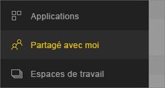
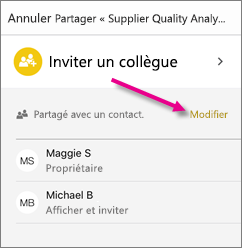
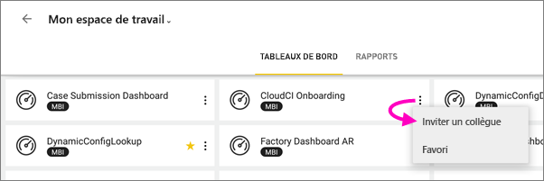
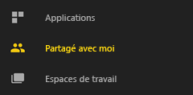
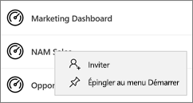
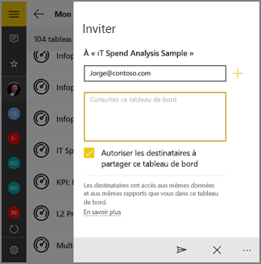

# Partager un tableau de bord ou un rapport à partir des applications mobiles Power BI
S’applique à :

|  |  |  |  |  |
|:--- |:--- |:--- |:--- |:--- |
| iPhone |iPad |Téléphones Android |Tablettes Android |Appareils Windows 10 |

Avec une [licence Power BI Pro](../../service-features-license-type.md), vous pouvez inviter d’autres utilisateurs à consulter vos tableaux de bord et vos rapports en partageant des liens à partir des applications mobiles Power BI. Vous pouvez partager avec d’autres personnes, au sein ou en dehors de votre organisation, avec ou sans un compte de messagerie d’entreprise. Ces personnes doivent également avoir une licence Power BI Pro ou le contenu doit avoir une [capacité Premium](../../service-premium-what-is.md).

À partir de l’application mobile Power BI pour iOS et Android, vous pouvez également [annoter et partager la capture instantanée d’une vignette, d’un rapport ou d’un visuel](mobile-annotate-and-share-a-tile-from-the-mobile-apps.md). 

## Partager à partir de votre iPhone
1. Dans la barre d’actions en bas du tableau de bord ou rapport, appuyez sur l’icône **Partager** .
   
   
2. Tapez les noms, séparés par des virgules, et un message pour accompagner votre invitation.
3. Pour autoriser le repartage, laissez cochée l’option **Autoriser les destinataires à repartager**.
   
   Le repartage permet à vos collègues de transférer le message d’invitation à d’autres membres de votre organisation par le biais du web ou des applications mobiles.
5. Cliquez sur **Envoyer** dans le coin supérieur droit.
   
   Les destinataires reçoivent une invitation par e-mail avec un lien direct vers le tableau de bord ou le rapport. L’invitation expire après un mois. Lorsqu’il est ouvert, dans un navigateur ou dans l’application mobile Power BI, il est ajouté à la section **Partagé avec moi** du compte Power BI de l’utilisateur.
   
   
   
   Découvrez d’autres [remarques sur le partage avec des collègues](../../service-share-dashboards.md).

### Annuler le partage à partir de votre iPhone
Vous pouvez uniquement annuler un partage dont vous êtes propriétaire.

1. Dans la barre d’actions en bas du tableau de bord ou rapport, appuyez sur l’icône **Partager** .
2. Appuyez sur **Inviter un collègue**.
   
   La liste des collègues avec qui vous avez partagé ce tableau de bord ou ce rapport s’affiche avec les mentions suivantes :
   
   * **Affichage** : Ils peuvent consulter, mais pas partager.
   * **Affichage et invitation** : Ils peuvent consulter et partager avec d’autres collègues.
1. Appuyez sur **Modifier**.
   
    
4. Pour annuler le partage, appuyez sur le cercle rouge en regard du nom et appuyez sur **Supprimer**.

## Partager à partir de votre iPad
1. Appuyez sur l’icône **Partager**  en haut à droite de votre tableau de bord ou rapport.
2. Tapez les adresses e-mail et un message pour accompagner votre invitation.
3. Pour autoriser le repartage, laissez cochée l’option **Autoriser les destinataires à repartager**.
   
   Le repartage permet à vos collègues de transférer le message d’invitation à d’autres membres de votre organisation par le biais du web ou des applications mobiles. 

4. Cliquez sur **Envoyer** dans le coin supérieur droit.
   
   Les destinataires reçoivent une invitation par e-mail avec un lien direct vers le tableau de bord ou le rapport. L’invitation expire après un mois. Lorsqu’il est ouvert, dans un navigateur ou dans l’application mobile Power BI, il est ajouté à la section **Partagé avec moi** du compte Power BI de l’utilisateur.
   
   
   
   Découvrez d’autres [remarques sur le partage avec des collègues](../../service-share-dashboards.md).

### Annuler le partage à partir de votre iPad
Vous pouvez uniquement annuler un partage dont vous êtes propriétaire.

1. Appuyez sur l’icône **Partager**  en haut à droite de votre tableau de bord ou rapport.
   
   La liste des collègues avec qui vous avez partagé ce tableau de bord ou ce rapport s’affiche avec les mentions suivantes :
   
   * **Affichage** : Ils peuvent consulter, mais pas partager.
   * **Affichage et invitation** : Ils peuvent consulter et partager avec d’autres collègues.
2. Appuyez sur **Modifier**.
3. Pour annuler le partage, appuyez sur le cercle rouge en regard du nom et appuyez sur **Supprimer**.

## Partager à partir de votre appareil Android
1. Dans la page d’accueil des tableaux de bord ou rapports, appuyez sur les points de suspension (...) et sur **Inviter un collègue**.
   
   
2. Ou, dans un tableau de bord ou un rapport, appuyez sur l’icône Inviter .

    Si vous êtes le propriétaire du tableau de bord, la liste des collègues avec qui vous avez partagé ce tableau de bord ou rapport s’affiche avec les mentions suivantes :

    -   **Affichage** : Ils peuvent consulter, mais pas partager.
    -   **Affichage et repartage** : Ils peuvent consulter et partager avec d’autres collègues.

1. Tapez les adresses de messagerie et un message pour accompagner votre invitation. Si vous ne le faites pas, Power BI envoie un message par défaut.
2. Pour autoriser le repartage, laissez l’option **Autoriser les destinataires à partager ce tableau de bord** sélectionnée.
   
   Le repartage permet à vos collègues de transférer le message d’invitation à d’autres membres de votre organisation par le biais du navigateur ou des applications mobiles.
   
1. Appuyez sur l’icône **Envoyer**  en haut à droite pour envoyer l’e-mail.
   
   Les destinataires reçoivent une invitation par e-mail avec un lien direct vers le tableau de bord. L’invitation expire après un mois. Lorsqu’il est ouvert, dans un navigateur ou dans l’application mobile Power BI, il est ajouté à la section **Partagé avec moi** du compte Power BI de l’utilisateur.
   
   
   
   Découvrez d’autres [remarques sur le partage de tableaux de bord avec vos collègues](../../service-share-dashboards.md).

### Annuler le partage à partir de votre appareil Android
Vous pouvez uniquement annuler un partage dont vous êtes propriétaire.

1. Appuyez sur l’icône Inviter en haut à droite de votre tableau de bord . 
   
   La liste des collègues avec qui vous avez partagé ce tableau de bord ou rapport apparaît.
2. Pour arrêter le partage avec un collègue, appuyez sur **X** à côté d’un nom \> **Supprimer**.

## Partager à partir de votre appareil Windows 10
1. Dans un tableau de bord ou rapport, appuyez sur l’icône Inviter .
   
   Sinon, dans la page d’accueil des tableaux de bord ou rapports, cliquez avec le bouton droit, ou effectuez un appui long et appuyez, sur **Inviter**.
   
   
   
   Si vous êtes le propriétaire du tableau de bord, la liste des collègues avec lesquels vous avez partagé ce tableau de bord s’affiche, avec les notes suivantes :
   
   **Affichage** : Ils peuvent consulter, mais pas partager.
   
   **Affichage et repartage** : Ils peuvent consulter et partager avec d’autres collègues.
2. Tapez les adresses e-mail et un message pour accompagner votre invitation. Si vous ne le faites pas, Power BI envoie un message par défaut.
   
   
3. Pour autoriser le repartage, laissez cochée l’option **Autoriser les destinataires à repartager**.
   
   Le repartage permet à vos collègues de partager avec d’autres personnes de votre organisation via le navigateur ou les applications mobiles.
   
1. Appuyez sur l’icône **Envoyer** .
   
   Les destinataires reçoivent une invitation par e-mail avec un lien direct vers le tableau de bord ou le rapport. L’invitation expire après un mois. Lorsqu’il est ouvert, dans un navigateur ou dans l’application mobile Power BI, il est ajouté à la section **Partagé avec moi** du compte Power BI de l’utilisateur.
   
   
   
   Découvrez d’autres [remarques sur le partage avec des collègues](../../service-share-dashboards.md).

## Étapes suivantes
* [Annoter et partager la capture instantanée d’une vignette, d’un rapport ou d’un visuel dans les applications mobiles](mobile-annotate-and-share-a-tile-from-the-mobile-apps.md)
* [Partager un tableau de bord ou un rapport dans Power BI](../../service-share-dashboards.md)
* Vous avez des questions ? [Essayez d’interroger la communauté Power BI](http://community.powerbi.com/)

