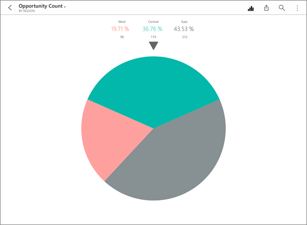
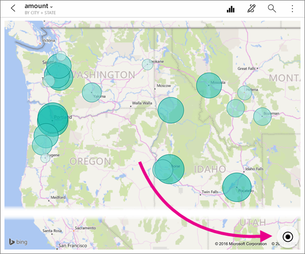
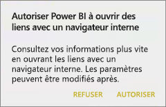
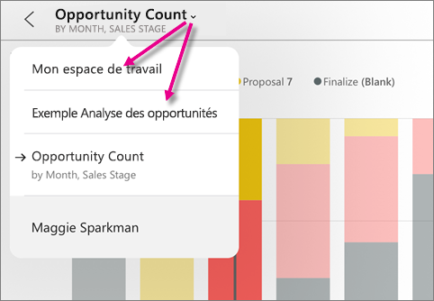
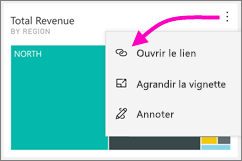
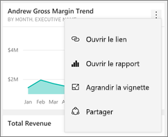
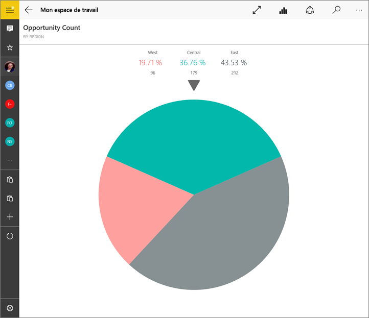
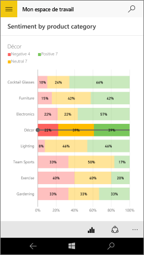

# Explorer les vignettes dans les applications mobiles Power BI
S’applique à :

|  |  |  |  |  |
|:--- |:--- |:--- |:--- |:--- |
| iPhone |iPad |Téléphones Android |Tablettes Android |Appareils Windows 10 |

Les vignettes sont des captures instantanées dynamiques de vos données qui sont épinglées dans un tableau de bord. Leurs valeurs changent à mesure que les données changent. **Vous [ajoutez des vignettes à un tableau de bord dans le service Power BI](../end-user-tiles.md).** 

Ensuite, dans les applications mobiles Power BI, vous ouvrez des vignettes en mode focus et interagissez avec elles. Vous pouvez ouvrir les vignettes avec tous les types d’éléments visuels, y compris des vignettes basées sur Bing et R.

## Vignettes dans les applications iOS

1. Ouvrez un [tableau de bord dans l’application mobile pour iOS](mobile-apps-view-dashboard.md).
2. Appuyez sur une vignette. Elle s’ouvre en mode focus, où il est plus facile de consulter et d’explorer ses données. En mode focus, vous pouvez :
   
   Dans un graphique en courbes, à barres ou à colonnes, appuyer pour afficher les valeurs de certaines parties de la visualisation.
   
    
   
   *Par exemple, dans ce graphique en courbes, les valeurs sélectionnées sont **This Year Sales (Ventes de cette année)** et **Last Year Sales (Ventes de l’année dernière)** pour le mois d’**août**.*  
   
   Dans un graphique en secteurs, appuyez sur un secteur du graphique pour afficher la valeur du segment en haut du graphique.  
   
   
3. Dans une carte, appuyez sur l’icône **Centrer la carte**  pour centrer la carte sur votre emplacement actuel.
   
     
4. Appuyer sur l’icône de partage  pour [annoter et partager une vignette](mobile-annotate-and-share-a-tile-from-the-mobile-apps.md) avec d’autres utilisateurs
5. [Ajoutez une alerte à la vignette](mobile-set-data-alerts-in-the-mobile-apps.md). Si les valeurs sont supérieures ou inférieures aux objectifs, Power BI vous avertit.
6. Parfois, le créateur du tableau de bord ajoute un lien sur une vignette. Le cas échéant, elle a donc une icône de lien  lorsqu’elle est en mode Focus :
   
    
   
    Les liens peuvent rediriger vers d’autres tableaux de bord Power BI ou vers une URL externe. Vous pouvez [cliquer sur le lien](../../service-dashboard-edit-tile.md#hyperlink) pour l’ouvrir dans l’application Power BI. Dans le cas d'un site externe, Power BI vous invite à l’autoriser.
   
    
   
    Une fois que vous avez ouvert le lien dans l’application Power BI, vous pouvez le copier et l’ouvrir dans une fenêtre de navigateur.
7. [Ouvrez le rapport](mobile-reports-in-the-mobile-apps.md)  sur lequel la vignette est basée.
8. Pour quitter le mode focus de la vignette, appuyez sur le nom de la vignette, puis sur le nom du tableau de bord ou **Mon espace de travail**.
   
    

## Vignettes dans l’application mobile pour les téléphones et tablettes Android
1. Ouvrez un [tableau de bord dans l’application mobile Power BI](mobile-apps-view-dashboard.md).
2. Appuyez sur une vignette pour l’ouvrir en mode focus, où il est plus facile de consulter et d’explorer ses données.
   
   
   
    En mode focus, vous pouvez :
   
   * Appuyer sur le graphique pour déplacer la barre dans un graphique en courbes, à barres, à colonnes ou en bulles, pour afficher les valeurs d’un point spécifique dans la visualisation.  
   * Appuyez sur l’icône de partage de capture instantanée  pour [annoter et partager la vignette](mobile-annotate-and-share-a-tile-from-the-mobile-apps.md) avec d’autres utilisateurs.
   * Cliquez sur l’icône Ouvrir le rapport  pour [afficher le rapport](mobile-reports-in-the-mobile-apps.md) dans l’application mobile.
3. Parfois, le créateur du tableau de bord ajoute un lien sur une vignette. Le cas échéant, lorsque vous appuyez sur le bouton de sélection vertical ( **...** ), vous pouvez afficher l’option **Ouvrir le lien**  :
   
    
   
    Les liens peuvent rediriger vers d’autres tableaux de bord Power BI ou vers une URL externe. Vous pouvez [cliquer sur le lien](../../service-dashboard-edit-tile.md#hyperlink) pour l’ouvrir dans l’application Power BI. Dans le cas d'un site externe, Power BI vous invite à l’autoriser.
   
    
   
    Une fois que vous avez ouvert le lien dans l’application Power BI, vous pouvez le copier et l’ouvrir dans une fenêtre de navigateur.
4. Appuyez sur la flèche dans le coin supérieur gauche pour fermer la vignette et revenir au tableau de bord.

## Vignettes dans l’application mobile Windows 10
1. Ouvrez un [tableau de bord dans l’application mobile Power BI](mobile-apps-view-dashboard.md) pour Windows 10.
2. Appuyer sur le bouton de sélection verticale sur la vignette. Vous pouvez ici : 
   
    
   
    [Partager une capture instantanée de la vignette](mobile-windows-10-phone-app-get-started.md).
   
    Appuyez sur **Ouvrir le rapport**  pour [afficher le rapport sous-jacent](mobile-reports-in-the-mobile-apps.md).
   
    [Ouvrez le lien](../../service-dashboard-edit-tile.md#hyperlink), s’il en a un. Les liens peuvent diriger vers des tableaux de bord Power BI ou vers une URL externe.
3. Appuyez sur **Agrandir la vignette** . Elle s’ouvre en mode focus, où il est plus facile de consulter et d’explorer ses données. Dans ce mode, vous pouvez :
   
   Faire pivoter un graphique en secteurs pour afficher les valeurs du secteur au-dessus du graphique.  
   
   
   
   Appuyer sur le graphique pour déplacer la barre dans un graphique en courbes, à barres, à colonnes ou en bulles, pour afficher les valeurs d’un point spécifique dans la visualisation.  
   
   
   
   *Dans ce graphique à barres, les valeurs pour la barre **Décoration** sont indiquées en haut du graphique.*
   
   Cliquez sur l’icône **Plein écran**  pour ouvrir la vignette en mode Plein écran, sans les barres de navigation et de menus.
   
   > [!NOTE]
   > Vous pouvez également [afficher des tableaux de bord et des rapports en mode Plein écran](mobile-windows-10-app-presentation-mode.md) dans l’application mobile Power BI pour Windows 10.
   > 
   > 
   
   Dans une carte, appuyez sur l’icône **Centrer la carte**  pour centrer la carte sur votre emplacement actuel.
   
   
   
   Appuyez sur l’icône Partager un instantané  pour [partager une vignette](mobile-windows-10-phone-app-get-started.md) avec d’autres personnes.   
   
   Appuyez sur l’icône Ouvrir le rapport  pour [afficher le rapport](mobile-reports-in-the-mobile-apps.md) sur lequel se base la vignette. 
4. Appuyez sur la flèche ou le bouton Précédent pour fermer la vignette et revenir au tableau de bord.

## Étapes suivantes
* [Qu’est-ce que Power BI ?](../../power-bi-overview.md)
* Vous avez des questions ? [Essayez d’interroger la communauté Power BI](http://community.powerbi.com/)

