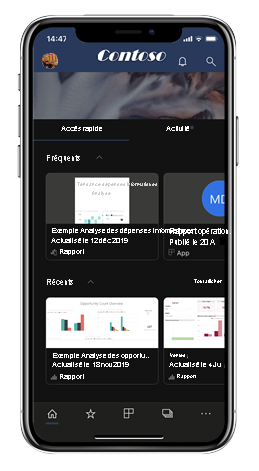
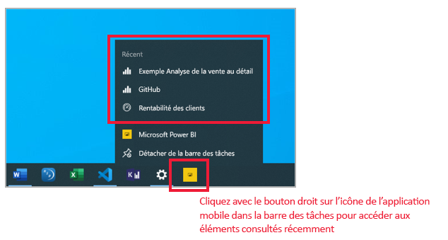
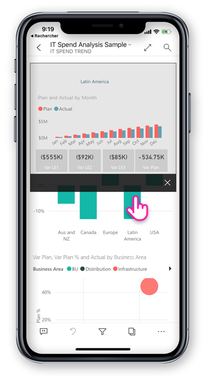
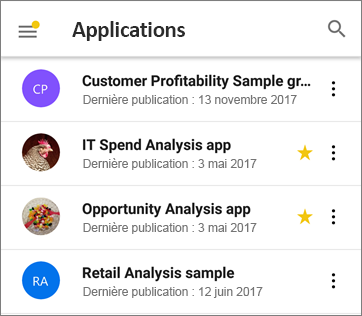
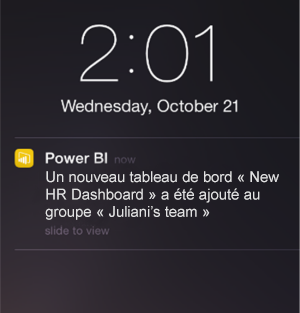

# Nouveautés dans les applications mobiles pour Power BI
Pour plus d’informations sur les nouveautés, consultez :

* [Blog de l’équipe Power BI pour les applications mobiles](https://powerbi.microsoft.com/blog/tag/mobile/)
* [Nouveautés dans Power BI Desktop](../../fundamentals/desktop-latest-update.md)  
* [Nouveautés dans le service Power BI](../../fundamentals/service-whats-new.md)

>[!NOTE]
>La prise en charge des applications mobiles Power BI pour les **téléphones utilisant Windows 10 Mobile** ne sera plus disponible après le 16 mars 2021. [En savoir plus](https://go.microsoft.com/fwlink/?linkid=2121400)

## Août 2020
### Nous avons amélioré la façon dont vous accédez à votre contenu (iOS et Android)
Vous pouvez désormais parcourir votre contenu rapidement et facilement à l’aide d’une **nouvelle arborescence de navigation**, disponible dans la liste déroulante d’en-tête des rapports, des tableaux de bord et des applications. Vous voyez en un coup d’œil la hiérarchie de localisation de votre contenu, et vous pouvez facilement naviguer dans la hiérarchie de contenu, accéder au contenu frère ou même revenir rapidement à votre page d’accueil. Si l’élément que vous affichez fait partie d’une application, l’arborescence affiche tout son contenu : sections, liens et tous les rapports et tableaux de bord. Si l’élément que vous affichez est un rapport, vous trouverez également une liste de toutes les pages de rapport visibles. Il n’a jamais été si facile de passer d’une page à une autre ! À tester dès maintenant ! 

### Partager à partir de Power BI à l’aide de vos applications favorites (iOS et Android)
Vous pouvez désormais partager des liens vers du contenu Power BI avec vos contacts. Utilisez la nouvelle action Partager dans l’en-tête pour envoyer le lien à l’aide de n’importe quelle application de collaboration sur votre appareil, comme Microsoft Teams, une application de messagerie, etc. Le lien capture la vue actuelle, ce qui vous permet de partager même des vues de rapport filtrées.

### Le pincement pour zoomer est désormais disponible dans toutes les vues de rapport, à la fois sur les téléphones et sur les tablettes (iOS et Android)   
Nous avons activé le pincement pour zoomer dans toutes les vues de rapport, ce qui vous permet d’effectuer un zoom avant et arrière sur le contenu de votre rapport, que vous soyez sur votre téléphone ou sur votre tablette.

### Lire automatiquement un diaporama au démarrage (Windows)
Vous pouvez choisir un rapport à lire automatiquement dans un diaporama quand l’application Power BI Windows est lancée. Cela est utile pour créer une expérience de type kiosque qui exécute un rapport dans des affichages publics sans aucune intervention manuelle. [En savoir plus](mobile-windows-10-app-presentation-mode.md#auto-play-a-slideshow-on-startup)

## Juillet 2020
### L’application mobile Power BI pour Windows prend désormais en charge la personnalisation de l’organisation
À présent, toutes les modifications apportées par l’administrateur à l’aspect de Power BI pour qu’il corresponde à l’image de votre organisation sont également répercutées dans l’application mobile Power BI. Ces modifications peuvent inclure un nouveau modèle de couleurs pour la barre de navigation supérieure, le logo de votre organisation et une image de bannière.  

### Désactiver l’authentification unique par le biais d’une configuration à distance (iOS et Android)
Les administrateurs informatiques peuvent désormais désactiver à distance l’authentification unique auprès de l’application mobile Power BI, ce qui améliore la sécurité et la conformité des autorisations sur les appareils multi-utilisateurs. [En savoir plus](mobile-app-configuration.md#disable-single-sign-on-ios-and-android)

## Juin 2020
### Afficher vos signets dans les diaporamas (Windows)
Vous pouvez à présent ajouter des signets de rapport et personnels dans vos diaporamas, automatiquement dans le cadre de la présentation, pour mettre en évidence des insights spécifiques dans vos données.
[Voyez par vous-même !](mobile-windows-10-app-presentation-mode.md#use-presentation-mode)

## Mai 2020
### Nous avons ajouté le mode Sombre à Power BI mobile (iOS)
Essayez le nouveau mode Sombre dans l’application mobile Power BI pour iOS13. Avec le mode Sombre, le texte clair s’affiche sur un arrière-plan sombre, réduisant ainsi la luminosité de l’écran et facilitant la visualisation de votre contenu. Vous pouvez basculer entre les thèmes dans les paramètres de l’apparence de l’application. [En savoir plus](mobile-apps-dark-mode.md)

### Appliquer des signets en mode Présentation (Windows)
À présent, lors de la présentation d’un rapport en mode Présentation, vous pouvez appliquer des signets personnels et de rapport aux pages de rapport, et ainsi créer un récit de vos données. [Voyez par vous-même !](mobile-windows-10-app-presentation-mode.md#use-presentation-mode)

## Avril 2020

### Le partage à partir d’espaces de travail est maintenant disponible
Nous avons ajouté la fonctionnalité de partage de rapports et de tableaux de bord à partir d’espaces de travail. Vous pouvez maintenant partager votre contenu à partir de « Mon espace de travail » et d’autres espaces de travail si leur propriétaire le permet, tout comme dans le service Power BI. 

### Les tableaux de bord prennent maintenant en charge le mode plein écran (iOS et Android)
Vous pouvez maintenant afficher vos tableaux de bord en mode plein écran, ce qui offre plus d’espace pour visualiser leur contenu. 

## Mars 2020

### Utiliser des raccourcis et la recherche Google pour lancer votre contenu (Android)
L’application Power BI intègre désormais des raccourcis et la recherche Google pour faciliter la recherche et le lancement de vos données. Vous pouvez créer des raccourcis pour accéder facilement à vos rapports et tableaux de bord favoris directement à partir de l’écran d’accueil de votre appareil. Vous pouvez également utiliser la recherche Google pour rechercher et ouvrir rapidement votre contenu Power BI. Découvrez-en plus sur les [raccourcis de l’application Android](mobile-app-quick-access-shortcuts.md) et la [recherche Google](mobile-app-find-access-google-search.md).

### Sécurité renforcée avec la protection d’appareil (préversion) (Android)
Utilisez les fonctionnalités de protection intégrées à votre appareil pour sécuriser votre application Power BI et bénéficier de la confidentialité dont vous avez besoin. Vous pouvez ainsi exiger l’authentification biométrique (Fingerprint ID) pour accéder à l’application Power BI. De cette façon, vos données restent privées et sont uniquement visibles par vous. [En savoir plus sur l’accès sécurisé natif](mobile-native-secure-access.md)

### Possibilité de scanner sur iPad
Vous pouvez désormais scanner des codes-barres pour filtrer vos rapports et utiliser des codes QR pour ouvrir rapidement des rapports directement avec votre iPad.  

### Expérience de filtrage mise à jour
Les filtres dans l’application Power BI bénéficient de nouvelles fonctionnalités et d’une nouvelle conception. Citons notamment une meilleure visibilité des filtres appliqués affectant les visuels d’un rapport ainsi que la possibilité de verrouiller et même de masquer des filtres. Ces changements assurent également une meilleure compatibilité avec le filtrage dans le service Power BI.

## Février 2020

### Mode de sélection multiple (Android et iOS)

Nous avons ajouté la possibilité de sélectionner plusieurs points de données sur une page de rapport. Lorsque la sélection multiple est activée, chaque point de données sur lequel vous appuyez est ajouté aux autres points de données sélectionnés, et les résultats combinés sont automatiquement mis en surbrillance dans tous les visuels de la page. Pour activer le mode de sélection multiple, accédez à la page [Paramètres de l’application mobile](./mobile-app-interaction-settings.md).

>[!NOTE]
>Le mode de sélection multiple sera pris en charge sur Power BI Report Server dans la prochaine version du serveur de rapports.

### Le pied de page du rapport peut maintenant être toujours visible dans l’application mobile sur iPhone

Sur votre iPhone, comme sur votre téléphone Android, vous pouvez maintenant décider d’ancrer le pied de page du rapport en bas de la page du rapport, où il est toujours visible et disponible, quelles que soient vos actions sur la page. Ceci facilite l’utilisation de toutes les options qu’il fournit. Pour ancrer le pied de page, basculez le commutateur **Pied de page du rapport ancré** dans la page [Paramètres de l’application mobile](./mobile-app-interaction-settings.md).

### Prise en charge des rapports PBIRS (préversion) (Windows)

Vous pouvez désormais ouvrir vos rapports Power BI Report Server (PBIRS) dans l’application Power BI.

### Accès rapide à vos éléments récents (Windows)

Cliquez avec le bouton droit sur l’icône de l’application Power BI dans la barre des tâches Windows pour obtenir la liste de tous les éléments que vous avez consultés récemment. Cliquez sur un élément de la liste pour effectuer une visite rapide.

## Janvier 2020

### Partager les annotations créées en mode de présentation (Windows)

Les annotations que vous créez pendant les présentations deviennent partie intégrante de la présentation et une composante clé de la discussion. Désormais, quand vos annotez les rapports en mode de présentation, vous pouvez partager un instantané de la page du rapport avec vos collègues. [En savoir plus](./mobile-windows-10-app-presentation-mode.md#use-presentation-mode)

## Décembre 2019

### Pied de page de rapport ancré et un bouton d’actualisation - nouvelles expériences pour l’interaction avec les rapports (Android)

Nous avons appris de nos utilisateurs Android que leur expérience d’utilisation des rapports n’était pas optimale : il est difficile d’utiliser le pied de page du rapport et la fonctionnalité Balayer pour actualiser est trop sensible sur certains appareils. Par conséquent, dans cette version, nous avons changé ces comportements :
* **Pied de page de rapport ancré** - maintenant, quand vous ouvrez un rapport sur votre téléphone, le pied de page du rapport est ancré en bas de la page du rapport, où il est toujours visible et disponible, quelles que soient vos actions sur la page. Ceci facilite l’utilisation de toutes les options qu’il fournit.
* **Bouton d’actualisation dans l’en-tête du rapport** - vous trouverez également un bouton d’actualisation dans l’en-tête du rapport, ce qui en facilite l’actualisation au moment exact où vous en décidez.

Les utilisateurs qui préfèrent le comportement précédent peuvent restaurer ces comportements avec les nouveaux [paramètres d’interaction](./mobile-app-interaction-settings.md) étendus de l’application mobile.

De plus, les administrateurs informatiques peuvent [remplacer à distance les nouveaux paramètres par défaut](./mobile-app-configuration.md#interaction-settings-ios-and-android) pour le compte de leurs utilisateurs, en utilisant l’outil MDM de leur choix avec un fichier de configuration d’application. De cette façon, le même comportement peut être configuré pour tous les utilisateurs d’une organisation.

> [!NOTE]
> Les paramètres d’interaction pour le bouton d’actualisation et pour l’ancrage du pied de page du rapport n’ont actuellement pas d’effet sur les rapports Report Server. Cela changera avec la version de Report Server de janvier.

### Définir des signets par défaut à partir de votre application mobile
Vous pouvez désormais définir des signets par défaut pour vos rapports directement à partir de votre application mobile Power BI. Ensuite, chaque fois que vous ouvrez un rapport, son signet par défaut est appliqué automatiquement. [En savoir plus](./mobile-reports-in-the-mobile-apps.md#bookmarks)

### Filtrage par localisation sur les tablettes Android
Le géofiltrage vous permet de filtrer vos rapports en fonction de votre localisation actuelle. Cette fonctionnalité est désormais également disponible dans l’application Power BI pour tablettes Android. [En savoir plus](./mobile-apps-geographic-filtering.md)

## Novembre 2019

### La nouvelle apparence de l’application Power BI est maintenant activée par défaut
 
Désormais, quand vous ouvrez l’application, les nouvelles barres de navigation et de recherche sont automatiquement activées, ce qui simplifie la recherche et l’ouverture du contenu. Utilisez la [page d’accueil](mobile-apps-home-page.md) de l’application comme point de départ. Vous obtenez un accès rapide à votre contenu le plus important, ainsi qu’un [flux d’activités](mobile-apps-home-page.md#activity-feed) qui vous permet de vous tenir informé de toutes vos dernières alertes et notifications, et plus encore.

### Voir l’ensemble de vos dernières activités Power BI
 
Le flux d’activités vous permet de suivre l’utilisation de votre contenu Power BI, en temps réel. Accédez simplement à la page d’accueil de l’application et ouvrez l’onglet Activité pour voir l’ensemble des notifications, alertes, commentaires, @mentions les plus récents, et plus encore. [En savoir plus](mobile-apps-home-page.md#activity-feed).

### Utiliser des signets dans vos rapports

L’application mobile Power BI prend désormais en charge les signets créés dans Power BI. Quand vous ouvrez l’application, vous pouvez tirer parti des signets créés par l’auteur du rapport et de tous les signets personnels que vous avez vous-même créés. [En savoir plus](mobile-reports-in-the-mobile-apps.md#bookmarks).

## Octobre 2019

### Prise en charge d’Android pour la configuration distante des paramètres d’accès au serveur de rapports

Nous avons ajouté la prise en charge d’Android pour la configuration distante des paramètres d’accès au serveur de rapports de l’application mobile Power BI. Les administrateurs informatiques peuvent désormais utiliser l’outil MDM de leur organisation pour configurer à distance ces paramètres sur les appareils iOS et Android. Pour plus d’informations, consultez [Configurer à distance l’accès d’une application mobile Power BI à un serveur de rapports](https://docs.microsoft.com/power-bi/report-server/configure-powerbi-mobile-apps-remote).

### Extraction interrapport

Ce mois-ci, nous avons ajouté la prise en charge de l’extraction interrapport. Vous pouvez maintenant appuyer sur un point de données pour accéder à d’autres rapports et pages de rapport. Quand vous accédez à une page cible, le contenu de cette page est filtré en fonction des paramètres d’extraction.

> [!NOTE]
> L’extraction interrapport est disponible uniquement si elle était activée lors de la création des rapports. [Découvrez-en plus sur l’extraction interrapport](https://docs.microsoft.com/power-bi/desktop-cross-report-drill-through).

### Étiquettes de sensibilité des données

Vous pouvez maintenant voir les étiquettes de sensibilité que les propriétaires de contenu ont définies sur les rapports, les tableaux de bord, les jeux de données et les dataflows pour classifier la sensibilité de leurs données. Les étiquettes de sensibilité déterminent la façon dont le contenu peut être partagé avec d’autres utilisateurs. [Découvrez-en plus sur les étiquettes de sensibilité des données dans Power BI](https://docs.microsoft.com/power-bi/admin/service-security-data-protection-overview).

### Prise en charge de la navigation personnalisée dans l’application (Windows)

La prise en charge de la navigation personnalisée dans les applications a été ajoutée pour les appareils Windows, après l’avoir été pour les appareils iOS et Android (voir l’[entrée Nouveautés pour le mois de septembre](#september-2019)).

## Septembre 2019

### Prise en charge de la navigation personnalisée dans l’application (iOS et Android)

Nous avons ajouté la prise en charge de la navigation personnalisée dans l’application. Désormais, quand vous ouvrez une application dans Power BI Mobile, l’expérience de navigation personnalisée créée par l’auteur de l’application est disponible. La navigation dans l’application peut être organisée par contenu et peut inclure de nouveaux éléments, comme des liens et des sections réductibles.
Découvrez plus d’informations sur la [navigation personnalisée](https://powerbi.microsoft.com/blog/designing-custom-navigation-for-power-bi-apps-is-now-available/).

## Août 2019

### Présentation de la nouvelle apparence de Power BI Mobile (version préliminaire) (iOS et Android)

Nous avons actualisé notre application et introduit de nouvelles expériences, en ajoutant une page d’accueil qui fournit un accès rapide à votre contenu fréquemment utilisé, ainsi que de nouveaux volets de navigation qui vous permettent de naviguer facilement dans l’application. Avec les expériences nouvelles et actualisées, vous pouvez maintenant trouver plus rapidement et facilement ce dont vous avez besoin, quand vous en avez besoin.
Étant donné que la nouvelle apparence est en préversion, vous devez l’activer pour l’utiliser.
En savoir plus sur la [Nouvelle apparence de Power BI Mobile](https://powerbi.microsoft.com/blog/introducing-power-bi-mobile-apps-new-look-preview/).

### Accès sécurisé avec le proxy d’application Azure Active Directory (AD) (iOS et Android)

Nous avons travaillé en partenariat avec l’équipe Azure Active Directory pour intégrer les applications mobiles Power BI au proxy d’application Azure Active Directory (Azure AD). Avec cette configuration, vous pouvez vous connecter au serveur de rapports hébergé dans les limites de l’entreprise à partir de l’application Power BI Mobile, sans devoir effectuer une configuration locale complexe. Pour plus d’informations, consultez [Intégration de Power BI Mobile et du proxy d’application Azure AD](https://powerbi.microsoft.com/blog/access-on-prem-report-server-from-your-power-bi-mobile-app-with-azure-active-directory-application-proxy/). Découvrez [comment configurer le proxy d’application Azure AD et Power BI](https://docs.microsoft.com/azure/active-directory/manage-apps/application-proxy-integrate-with-power-bi).

## Juillet 2019

### Info-bulles de page de rapport

Les info-bulles de page de rapport sont maintenant prises en charge lors de l’affichage des rapports dans votre application mobile. Il vous suffit d’appuyer longuement sur un visuel associé à une info-bulle de rapport, et celle-ci apparaîtra.  

 
> [!NOTE]
> Les info-bulles de rapport sont prises en charge pour les appareils dont la taille est supérieure à 640 pixels et la fenêtre d’affichage supérieure à 320. Les appareils plus petits utilisent les info-bulles par défaut.

## Juin 2019

### Lecture de code-barres maintenant disponible dans Android
Vous pouvez utiliser votre application Power BI sur Android (téléphone et tablette) pour scanner les codes-barres imprimés sur les produits ou les rayons de votre magasin afin d’afficher les rapports Power BI connexes filtrés en fonction de la valeur scannée. En savoir plus sur le [filtrage des données avec des codes-barres](mobile-apps-scan-barcode-iphone.md).

### Prise en charge des rapports PBIX hébergés dans PBI-RS sur la configuration ADFS (iOS, Android)

Les rapports Power BI (PBIX) hébergés dans PBI-RS avec une configuration ADFS sont maintenant accessibles à partir des applications mobiles Power BI.

## Mai 2019

### Prise en charge des raccourcis Siri (iOS)
Les utilisateurs peuvent créer des raccourcis Siri vers leurs tableaux de bord et rapports Power BI, puis les ouvrir directement à partir de l’interface vocale Siri. [Découvrez comment utiliser des raccourcis Siri dans l’application Power BI pour iOS](https://powerbi.microsoft.com/blog/introducing-siri-integration-with-power-bi-mobile-ios-app-preview/).

### Rechercher le contenu des appareils (iOS)
Intégration de Power BI à la recherche de contenu sur les appareils iOS (Spotlight). La recherche de contenu sur un iPhone ou un iPad inclut désormais les éléments Power BI. Lorsque les utilisateurs se servent de la recherche native de l’appareil, les rapports, tableaux de bord, applications, espaces de travail et personnes Power BI correspondant aux critères de recherche sont listés dans les résultats. [Consultez ce billet de blog pour en savoir plus](https://powerbi.microsoft.com/blog/introducing-siri-integration-with-power-bi-mobile-ios-app-preview/).

### Appui simple pour interagir avec un rapport - Disponibilité générale

L’appui simple est désormais en disponibilité générale et va devenir l’interaction tactile par défaut des nouveaux utilisateurs. Les utilisateurs pourront toujours le désactiver pour utiliser l’appui double dans les paramètres d’application.

### Amélioration de la protection par accès conditionnel (iOS, Android)

Nous avons intégré à Azure AD une [nouvelle fonctionnalité d’accès conditionnel basée sur la protection des applications](https://docs.microsoft.com/azure/active-directory/conditional-access/app-protection-based-conditional-access) afin d’augmenter la sécurité en limitant l’accès à Power BI avant que la stratégie d’application ne soit appliquée.

### Protection des appareils (iOS)

Les utilisateurs peuvent se servir de la protection intégrée de l’appareil pour sécuriser Power BI, en demandant un Face ID, un Touch ID ou un code secret pour accéder à Power BI. Cette protection peut être configurée par l’utilisateur à l’aide des paramètres de l’application, mais également par les administrateurs à l’aide d’Intune et de tout autre outil MDM. [En savoir plus](https://docs.microsoft.com/power-bi/consumer/mobile/mobile-ios-native-secure-access).

### Rapport d’une page dans un diaporama (Windows)

Dans les diaporamas, l’actualisation automatique est également prise en charge pour les rapports d’une seule page. De cette façon, si la source de données sous-jacente du rapport est mise à jour, nous récupérons les données pour mettre à jour la page.

## Avril 2019

### Visuel Influenceurs clés 

Le visuel Influenceurs clés est désormais disponible sur votre application mobile. Ce visuel vous permet, en quelques clics, d’effectuer une analyse des facteurs clés qui influencent vos données.

### Ajouter des commentaires au contenu des rapports (Android et iOS)

Vous pouvez désormais ajouter des commentaires dans les pages et les visuels des rapports. Pour plus d’informations sur l’ajout de commentaires aux rapports dans le service Power BI et Mobile, consultez [ce blog](https://powerbi.microsoft.com/blog/announcing-report-commenting-for-power-bi-service-and-mobile/). 

### Optimiser l’affichage avec le mode plein écran (Android et iOS)

Nous avons ajouté un nouveau bouton qui vous permet de contrôler quand apporter le focus sur vos données en supprimant les en-têtes et les pieds de page des rapports, vous donnant ainsi un espace maximal pour l’affichage de vos rapports.

## Mars 2019

### Prise en charge des utilisateurs invités externes dans les applications Power BI, (iOS, Android)

Vous pouvez accéder au contenu Power BI partagé avec vous à partir d’une autre organisation directement à partir de l’application (également appelée B2B). Apprenez-en davantage sur les applications mobiles Power BI B2B [ici](https://powerbi.microsoft.com/blog/power-bi-mobile-apps-now-support-azure-ad-b2b-guest-users/).

### Amélioration du mode de présentation Windows avec diaporama (Windows)

Avec un [diaporama](https://powerbi.microsoft.com/blog/enhancing-presentation-mode-with-slideshow-in-windows-power-bi-app/), vous pouvez utiliser les écrans publics de votre bureau pour exécuter les rapports Power BI en mode plein écran avec une rotation automatique entre les pages de rapport.  

### Prise en charge des rapports PBI-RS dans une configuration ADFS et WAP (iOS uniquement)

Les rapports Power BI (PBIX) qui sont hébergés dans PBI-RS avec une configuration ADFS sont désormais accessibles à partir de l’application Power BI pour iOS.

### Activation de l’interaction par appui simple avec les visuels de rapport

Nous avons modifié le mode d’interaction avec les rapports. Désormais, seul un appui est nécessaire pour interagir immédiatement avec les données d’un visuel, d’un bouton ou d’un segment. Les utilisateurs n’ont plus à appuyer sur un visuel pour le sélectionner puis à appuyer de nouveau pour interagir avec lui. Désormais, un seul appui suffit pour ces deux actions.

> [!NOTE]
> Les utilisateurs existants doivent activer ce comportement dans les paramètres de l’application. Pour plus d’informations, consultez l’article [Guide pratique pour configurer l’interaction par appui simple avec les rapports](https://docs.microsoft.com/power-bi/consumer/mobile/mobile-app-single-tap).

## Janvier - février 2019
 
### Visuels Visio

Activation de l’authentification unique (SSO) dans les visuels Visio afin qu’aucune étape de connexion supplémentaire ne soit nécessaire lors de l’affichage des rapports avec le visuel Visio dans l’application. 

### Commentaire sur l’application Power BI Mobile Windows dans les tableaux de bord à venir

Vous pouvez ajouter des commentaires directement dans des tableaux de bord et des vignettes spécifiques pour discuter de vos données. Toutes les personnes qui voient les tableaux de bord verront aussi vos commentaires. 

## Décembre 2018

### Le filtre est désormais disponible pour les rapports en paysage 

Le volet de filtre de rapport est désormais disponible pour les rapports en paysage (en plus du rapport sur téléphone).

## Novembre 2018

### En-tête de visuel moderne 

Les rapports qui utilisent le nouvel « en-tête de visuel moderne » n’allouent plus d’espace aux en-têtes, ce qui a pour effet d’avoir moins d’espace vide et plus de place pour vos visualisations.

### Mode de présentation amélioré (Windows)

Mode de présentation amélioré pour les appareils Surface Hub et Windows 10.  Profitez d’une nouvelle expérience de salle de réunion Surface Hub. Avec des outils de présentation et de collaboration améliorés et une vue grand écran optimisée, vous pouvez mieux vous concentrer sur vos données. Ce mode de présentation fournit également des outils qui vous aideront à présenter efficacement vos informations et favoriseront les discussions autour de vos données. Cliquez [ici](https://powerbi.microsoft.com/blog/presentation-mode-in-power-bi-windows-app/) pour savoir plus sur le mode de présentation.

### Disposition de rapports en mode Portrait sur les tablettes (iOS et Android)

Nous utilisons maintenant la disposition de rapport sur téléphone, quand elle existe, pour afficher les rapports sur votre tablette en mode portrait. En savoir plus sur la [création d’une disposition sur téléphone dans le service Power BI ou Desktop](https://docs.microsoft.com/power-bi/desktop-create-phone-report/).

### Prise en charge d’une chaîne de requête de rapport 

L’ouverture d’un lien de rapport incluant une chaîne de requête se fera désormais dans l’application mobile et sera préfiltrée selon les conditions définies dans la chaîne de requête. En savoir plus sur la [création d’une URL de rapport avec une chaîne de requête](https://docs.microsoft.com/power-bi/service-url-filters/).  

### Informations d’identification partagées (maintenant sur Android)

II n’a jamais été aussi facile de se connecter à Power BI à partir de votre application mobile. Avec les informations d’identification partagées, nous avons simplifié le processus de connexion avec d’autres informations d’identification d’applications Microsoft 365 sur l’appareil pour vous authentifier dans le service Power BI.

### URL dans l’application (maintenant sur Android) 

Les liens dans les rapports qui pointent vers d’autres artefacts Power BI s’ouvrent maintenant directement à l’intérieur de l’application. Vous pouvez ainsi créer des flux de navigation personnalisés, par exemple, en reliant un rapport à un tableau de bord.

### Afficher les données et copier les valeurs

Le menu d’actions pour les visuels du rapport (...) propose maintenant une option permettant d’afficher les données sous-jacentes dans un tableau. Dans le tableau, vous pouvez appuyer longuement pour sélectionner puis copier des valeurs (à condition qu’il n’existe aucune stratégie Intune empêchant la copie).

## Octobre 2018

### Préversion de rapport paginé (tous les appareils)

Des rapports paginés sont désormais disponibles sur le service Power BI. Les utilisateurs ayant accès à des rapports paginés dans le service Power BI peuvent également accéder à ces rapports à partir de leur application mobile. 

Lire le [billet de blog sur les rapports paginés dans l’application mobile](https://powerbi.microsoft.com/blog/power-bi-paginated-reports-also-available-in-power-bi-mobile-apps-preview/) de Power BI.

### Informations d’identification partagées (iOS)

II n’a jamais été aussi facile de se connecter à Power BI à partir de votre application mobile. Avec les informations d’identification partagées, nous avons simplifié le processus de connexion avec d’autres informations d’identification d’applications Microsoft 365 sur l’appareil pour vous authentifier dans le service Power BI.

### URL dans l’application (iOS) 

Les liens dans les rapports qui pointent vers d’autres artefacts Power BI s’ouvrent maintenant directement à l’intérieur de l’application. Vous pouvez ainsi créer des flux de navigation personnalisés, par exemple, en reliant un rapport à un tableau de bord.

### Prise en charge d’iOS12 et de watchOS 5 

Nous avons mis à jour l’application Power BI pour iOS, qui garantit un fonctionnement transparent avec le nouveau système d’exploitation sur les appareils mobiles et sur la montre connectée Watch.

## Septembre 2018

### Édition d’un rapport en mode téléphone dans le navigateur (tous les appareils)

Maintenant, vous pouvez créer un mode téléphone pour un rapport qui est déjà publié dans le service Power BI et pas seulement dans Power BI Desktop. Créez-le en mode édition dans votre navigateur.

### Commentaires dans les tableaux de bord (iOS et Android) 

Vous pouvez ajouter des commentaires directement dans des tableaux de bord et des vignettes spécifiques pour discuter de vos données. Toutes les personnes qui voient les tableaux de bord verront aussi vos commentaires. Vous pouvez aussi inclure d’autres personnes de votre organisation dans la conversation en les mentionnant avec @mentioning. Elles reçoivent alors une notification push avec @mentioned avec votre message sur leur téléphone mobile.

Actuellement disponible sur les appareils iOS et Android. Prise en charge de Windows prochainement.

Lisez le [billet de blog sur les commentaires dans les tableaux de bord](https://powerbi.microsoft.com/blog/announcing-dashboard-comments-in-power-bi/) Power BI.

### Authentification unique (Windows)

L’authentification unique (SSO) est l’une des fonctionnalités les plus demandées pour Power BI Mobile pour Windows. Maintenant, vous pouvez utiliser votre compte professionnel principal pour vous connecter non seulement à vos appareils mobiles Windows joints à un domaine, mais aussi au service Power BI de manière fluide. Découvrez plus en détail l’[authentification unique et les applications mobiles Windows](mobile-windows-10-app-single-sign-on-sso.md).

## Mois précédents

### Juillet 2018

#### iOS et Android uniquement

**Filtres partagés**

Vous pouvez maintenant recevoir des rapports avec des filtres et des segments partagés.

**Prise en charge des images d'arrière-plan**

Quand vous voyez un rapport en mode paysage sur votre appareil mobile, vous voyez les mêmes images d'arrière-plan que dans Power BI sur le web.

### Juin 2018

#### Rapports en mode Zone de dessin complète

Désormais, les barres d’action du haut et du bas disparaissent peu après le chargement de votre rapport pour vous permettre de voir immédiatement une plus grande partie du rapport.

#### Canevas plus grand pour les rapports sur téléphone

Nous avons agrandi le canevas de rapport sur téléphone de façon à avoir de la place pour davantage de visuels.

### May 2018

#### Extraction mobile : toutes les applications mobiles

Vous pouvez extraire à partir d’un point de données sélectionné vers une autre page de rapport dans les applications mobiles, si l’auteur du rapport a défini cette action. 

#### Bouton Précédent : toutes les applications mobiles

Désormais, lorsque vous parcourez un rapport en balayant, si vous choisissez une page de rapport dans la barre d’action ou à l’aide de l’option d’extraction, le bouton Précédent vous renvoie à la page précédente. 

#### Thèmes de tableau de bord : toutes les applications mobiles

Lorsque les auteurs de rapports personnalisent des thèmes de tableau de bord dans le service Power BI, l’apparence du tableau de bord est modifiée dans l’application mobile. Toutefois, les images d’arrière-plan n’apparaissent pas.

#### iOS : Configurer à distance l’accès d’une application mobile iOS Power BI à un serveur de rapports

Votre administrateur informatique peut désormais utiliser un outil MDM pour configurer l’accès d’une application mobile iOS Power BI à un serveur de rapports. Pour plus d’informations, consultez [Configurer à distance l’accès d’une application mobile iOS Power BI à un serveur de rapports](../../report-server/configure-powerbi-mobile-apps-remote.md).

#### Application Power BI pour la réalité mixte (Preview)

L’application Power BI pour la réalité mixte est désormais disponible dans le Microsoft Store. Consultez vos tableaux de bord et vos rapports tout en étant immergé dans le monde virtuel, ou placez-les et consultez-les à des emplacements spécifiques dans le contexte de votre environnement. Consultez la nouvelle vidéo [Présentation de Power BI sur Hololens](https://www.youtube.com/watch?v=J_X_nOFUBss) pour plus de contexte, ou lisez l’article consacré à la nouvelle [application Power BI pour la réalité mixte](mobile-mixed-reality-app.md).

### Avril 2018

#### Exploration mobile dans tous les sens

Vous pouvez maintenant explorer des visuels du rapport dans tous les sens sur votre appareil mobile. Pour accéder à cette nouvelle fonctionnalité, appuyez et maintenez la pression sur le menu de l’info-bulle d’un rapport visuel pour l’ouvrir, puis appuyez sur les boutons d’extraction pour explorer vos données en profondeur. En savoir plus sur [l’exploration détaillée des applications mobiles](https://powerbi.microsoft.com/blog/drill-down-up-in-power-bi-mobile-apps/).

#### Filtres persistants

Nous avons récemment mis à jour les filtres et les segments de rapport, afin qu’ils soient automatiquement enregistrés à partir de Power BI sur le Web dans l’application mobile Power BI. À présent, les filtres et les segments que vous définissez dans l’application mobile sont automatiquement enregistrés dans Power BI sur le Web.

### Mars 2018

#### Application Power BI pour la réalité mixte (Preview)

Dans notre effort le plus récent pour vous permettre d’accéder aux données là où vous êtes, nous avons créé l’application Power BI pour la réalité mixte. Consultez vos tableaux de bord et vos rapports tout en étant immergé dans le monde virtuel, ou placez-les et consultez-les à des emplacements spécifiques dans le contexte de votre environnement. Découvrez plus d’informations sur la nouvelle [application Power BI pour la réalité mixte](mobile-mixed-reality-app.md).

#### Partager des rapports et des tableaux de bord en externe

Partagez des tableaux de bord et des rapports avec des utilisateurs externes à votre organisation, directement à partir de l’application. Le partage externe est activé pour les comptes professionnels et de réseaux sociaux. 

#### Filtres persistants

Lorsque vous définissez des filtres et des segments dans Power BI sur le web, vos sélections de filtres sont aussi enregistrées dans votre application mobile, ce qui vous permet de reprendre là où vous en étiez.

#### Actualiser les rapports sur l’iPad

Les rapports Power BI incluent maintenant un bouton Actualiser dans l’application iPad.

### Février 2018

#### Partager des rapports

Vous pouvez désormais partager un rapport directement à partir des applications mobiles. Découvrez plus en détails le [partage de tableaux de bord et de rapports à partir des applications mobiles](mobile-share-dashboard-from-the-mobile-apps.md)

#### Info-bulles améliorées

Quand vous appuyez et que vous maintenez le doigt sur un visuel d’un rapport pour accéder aux info-bulles, vous pouvez maintenant faire glisser votre doigt sur le visuel pour explorer des détails sur chaque de ses points de données.

### Janvier 2018

#### Rapports favoris

Marquer les rapports comme favoris pour les afficher dans la page **Favoris**. Accédez à des informations supplémentaires sur les [favoris dans les applications mobiles Power BI](mobile-apps-favorites.md).

#### Afficher les rapports partagés

Désormais, quand quelqu'un partage un rapport avec vous, ce rapport apparaît dans la page **Partagé avec moi** et dans les tableaux de bord.

#### Meilleure prise en charge des liens hypertexte

Vous pouvez maintenant appuyer sur les liens dans les visuels Power BI pour les ouvrir dans votre navigateur mobile.

#### Intégration d’Intune (Android)

Prise en charge de l’accès conditionnel à l’aide de la gestion des appareils mobiles Intune.

### Décembre 2017

#### Gestion améliorée de la sécurité 

L’accès conditionnel (CA) et la gestion des appareils mobiles (MDM) Microsoft Intune sont désormais pris en charge sur les appareils Android pour mieux sécuriser les données de votre organisation. C’est déjà disponible sur iOS.

#### Gestion améliorée des autorisations

Nous avons apporté des changements qui permettent de gérer avec plus de précision les autorisations des utilisateurs pour les jeux de données, les tableaux de bord et les rapports.

#### Applications installées automatiquement

Vous n’avez pas besoin d’installer certaines des applications dans Power BI. Les créateurs d’application Power BI de votre organisation peuvent créer des *applications* qui contiennent une collection de tableaux de bord et rapports. Ils peuvent ensuite publier l’application et la configurer de façon à ce qu’elle soit installée automatiquement dans le service Power BI et les applications mobiles Power BI. Lorsqu’une application est configurée pour une installation automatique, elle apparaît automatiquement dans votre menu **Applications** :

### Novembre 2017
#### Optimisation pour l’iPhone X

Nous avons optimisé la disposition de l’application pour l’iPhone X. Vous pouvez donc explorer vos données facilement sur chaque appareil.

### Octobre 2017
#### Filtres pour les rapports sur téléphone Android

Si vous créez un rapport avec des pages optimisées pour les téléphones dans Power BI Desktop, et que le rapport contient des filtres, vous pouvez maintenant appliquer ces filtres dans le rapport sur téléphone sur Android. En savoir plus sur les filtres pour les rapports Power BI sur Android.

#### Afficher les données dans les rapports

Vous pouvez maintenant, dans vos rapports, passer des visuels à une vue de table pour afficher les nombres derrière les données. Pour accéder à cette fonctionnalité, cliquez sur « Afficher des données » dans le menu ... du visuel sur votre rapport ou sur la nouvelle icône du menu d’action développé du visuel.

### Septembre 2017
#### Filtres pour les rapports sur téléphone iPhone
Si vous créez un rapport avec des pages optimisées pour les téléphones dans Power BI Desktop, et que le rapport contient des filtres, vous pouvez maintenant appliquer ces filtres dans le rapport sur téléphone sur votre iPhone. En savoir plus sur les [filtres pour les rapports Power BI sur iPhone](https://powerbi.microsoft.com/blog/filters-coming-for-phone-reports-on-ios/).

### Août 2017
#### Support des paramètres proxy iOS
Vous pouvez maintenant définir des paramètres de proxy dans l’application mobile iOS de Power BI. Cela signifie que Power BI fonctionne maintenant avec les connexions VPN sur votre appareil mobile. Ainsi, un plus grand nombre d’utilisateurs et d’organisations peuvent en toute sécurité tirer parti de la puissance de Power BI en déplacement.

### Juillet 2017
Lisez le [résumé des fonctionnalités d’applications mobiles de juillet 2017](https://powerbi.microsoft.com/blog/power-bi-service-and-mobile-july-feature-summary/#ios-preview).

#### Appareils iOS
**Nouvelle expérience de Q&R sur iOS (préversion)** Au lieu de simplement recevoir une réponse à votre question, vous pouvez désormais utiliser le langage naturel pour obtenir des informations ad hoc. Même si vous n’êtes pas certain de ce que vous cherchez, Q&R met en avant de façon proactive des informations pertinentes pour vos données. La nouvelle expérience Q&R sur mobile, développée en collaboration avec l’équipe Microsoft Research, révèle la présence de technologies puissantes au sein de notre produit. Pour plus d’informations, voir le didacticiel [Poser des questions sur vos données dans les applications mobiles iOS ](mobile-apps-ios-qna.md).

### Visuels réactifs
**Visuels réactifs pour les rapports et tableaux de bord sur téléphone** Vous pouvez configurer les visuels de vos tableaux de bord ou rapports de façon à ce qu’ils soient *réactifs*, changeant de manière dynamique pour afficher une quantité maximale de données et d’informations, quelle que soit la taille de l’écran. Pour plus d’informations, lisez le [blog sur les visuels réactifs](https://powerbi.microsoft.com/blog/power-bi-desktop-july-feature-summary-2/#responsiveVisuals).

### Juin 2017
#### Tous les appareils
**Marquer des applications en tant que favorites** Vous pouvez déjà marquer un tableau de bord en tant que favori. Récemment, Power BI a introduit la possibilité de marquer également des [applications](../../collaborate-share/service-create-distribute-apps.md) en tant que favorites. 

### Mai 2017
#### Tous les appareils
**Nouveau menu : Partagés avec moi** Accédez au menu Partagés avec moi dans le menu de l’application mobile pour voir tout le contenu qui a été partagé avec vous.

**Nouveau menu : Applications** Une application est une collection de tableaux de bord et de rapports conçus par votre organisation afin de fournir des mesures clés permettant de prendre plus rapidement et facilement des décisions pilotées par les données.

En savoir plus sur l’[organisation de votre contenu Power BI](mobile-apps-quickstart-view-dashboard-report.md).

#### Appareils iOS et Android
**Power BI Report Server en préversion** Créez et publiez des rapports Power BI en local. Puis [affichez et utilisez-les dans votre appareil mobile Android ou iOS](mobile-app-ssrs-kpis-mobile-on-premises-reports.md). 

### Avril 2017
Consultez le [résumé des fonctionnalités d’applications mobiles d’avril 2017](https://powerbi.microsoft.com/blog/power-bi-mobile-apps-feature-summary-march-april-2017/).

#### Tous les appareils
**Couleurs d’arrière-plan pour les rapports sur téléphone** Quand vous définissez la couleur d’arrière-plan d’un rapport dans Power BI Desktop, le rapport sur téléphone a la même couleur d’arrière-plan. En savoir plus sur l’[optimisation des pages de rapport pour les téléphones](../../create-reports/desktop-create-phone-report.md).

**Développer un visuel Power BI pour appareils mobiles** Lisez ce [guide du développeur](https://github.com/Microsoft/PowerBI-visuals/blob/master/Tutorial/MobileGuideline.md) pour obtenir des conseils sur la création de visuels Power BI qui s’affichent et fonctionnent correctement sur les appareils mobiles.

#### Appareils iOS
**Parler à vos données : poser des questions en parlant** Vous pouvez maintenant [poser des questions sur vos données avec Questions et réponses](mobile-apps-ios-qna.md) en parlant au lieu de taper. 

### Mars 2017
Consultez le [résumé des fonctionnalités d’applications mobiles de mars 2017](https://powerbi.microsoft.com/blog/power-bi-mobile-apps-feature-summary-march-2017/).

#### Tous les appareils
**Interactions de segments**

Nous avons amélioré les interactions tactiles pour les sélecteurs de plage de temps.

#### Appareils iOS
**Poser des questions sur vos données avec Questions et réponses et nous faire part de vos commentaires** Essayez de poser des questions sur vos données via Questions et réponses et laissez-nous un émoticône souriant ou triste pour nous faire part de votre humeur en rapport avec ce que nous avons fait.

**Utiliser 3D Touch pour les actions courantes** Appuyez fortement sur l’icône de l’application Power BI sur l’écran d’accueil de votre iPhone 6s ou version ultérieure pour accéder aux notifications, aux recherches et aux tableaux de bord récemment utilisés.

**Prise en charge des langues de droite à gauche** Les applications mobiles Power BI prennent maintenant en charge les langues de droite à gauche. Dans ce contexte, « langues de droite à gauche » fait référence aux systèmes d’écriture hébreu et arabe, qui sont écrits de droite à gauche et nécessitent une mise en forme contextuelle. Consultez la liste des [langues prises en charge dans les applications mobiles Power BI](mobile-apps-supported-languages.md).

#### Appareils Android
**Se connecter à plusieurs serveurs SSRS** 

Vous pouvez désormais établir des connexions à jusqu’à cinq serveurs SQL Server Reporting Services (SSRS) en même temps.

**Demander l’accès à des tableaux de bord** 

Si vous scannez un code QR pour un tableau de bord auquel vous n’avez pas accès, vous pouvez à présent envoyer une demande d’accès directement à partir de l’application mobile.

### Février 2017
#### Tous les appareils
**Défilement facilité** 

Vous pouvez désormais faire défiler des graphiques à barres et à colonnes dans un rapport en touchant le graphique, au lieu de toucher la barre de défilement sur le côté.

#### Appareils iOS
**Poser des questions sur vos données avec une version préliminaire de Questions/Réponses** 

Questions/Réponses vous permet de poser des questions concernant vos données avec vos propres mots. Power BI fournit les réponses. Questions/Réponses est déjà disponible dans le service Power BI sur https://powerbi.com. À présent, il est également [disponible dans l’application mobile sur votre iPhone ou iPad](mobile-apps-ios-qna.md).

**Se connecter à plusieurs serveurs SSRS** 

Vous pouvez désormais établir des connexions à jusqu’à cinq serveurs SQL Server Reporting Services (SSRS) en même temps.

#### Tablettes Android
L’**application mobile Power BI** pour tablettes Android est à présent disponible partout dans le monde. Commencez à utiliser [Power BI sur votre tablette Android](mobile-android-app-get-started.md).

#### Appareils iOS et Android
**Nouveau menu pour les vignettes du tableau de bord** Accédez au rapport sous-jacent, développez la vignette ou gérez une alerte, le tout directement à partir d’un menu sur la vignette d’un tableau de bord. 

Ce menu est une nouveauté pour les téléphones iOS, Android en mode Paysage, ainsi que les tablettes Android. Il existait déjà pour les téléphones Windows et Android en mode Portrait.

### Janvier 2017
Lisez le [résumé des fonctionnalités de janvier 2017 sur le blog dédié aux applications mobiles](https://powerbi.microsoft.com/blog/power-bi-mobile-apps-feature-summary-january-2017).

#### Tous les appareils
**Charger plus de 100 lignes dans les tables et matrices** À présent, si votre tableau de bord ou rapport contient une grande table ou matrice, nous montrons autant de données que possible dans la vignette. Puis dans le mode focus, vous pouvez faire défiler vers le bas pour charger les lignes supplémentaires.

**Disponibilité générale des rapports sur téléphone** Les rapports sur téléphone Power BI sont à présent disponibles. Dans Power BI Desktop, vous pouvez personnaliser l’affichage portrait d’un rapport existant pour les utilisateurs mobiles. En savoir plus sur la [création de rapports sur téléphone dans Power BI Desktop](../../create-reports/desktop-create-phone-report.md) et l’[expérience d’utilisation des rapports sur les téléphones](mobile-apps-view-phone-report.md).

#### iOS
**Authentification SSRS utilisant la préversion d’Active Directory Federation Services (ADFS)** Vous pouvez maintenant vous connecter à des serveurs SQL Server Reporting Services locaux à partir de votre appareil mobile avec votre compte professionnel. En savoir plus sur l’[utilisation de OAuth pour la connexion aux serveurs SSRS](mobile-oauth-ssrs.md).

#### Téléphone
**Authentification SSRS utilisant la préversion d’Active Directory Federation Services (ADFS)** Vous pouvez maintenant vous connecter à des serveurs SQL Server Reporting Services locaux à partir de votre appareil mobile avec votre compte professionnel. En savoir plus sur l’[utilisation de OAuth pour la connexion aux serveurs SSRS](mobile-oauth-ssrs.md).

**Nouveauté et améliorations : annotez et partagez rapidement des insights (analyses)** Le partage et l’annotation sont maintenant entièrement fonctionnels sur les appareils Android. Le menu amélioré permet d’annoter et de partager plus rapidement et facilement les analyses. Vous pouvez également partager un rapport annoté ou directement à partir de l’application Power BI.

### Décembre 2016
Lisez le [résumé des fonctionnalités de décembre 2016 sur le blog dédié aux applications mobiles](https://powerbi.microsoft.com/blog/power-bi-mobile-apps-feature-summary-december-2016).

#### Tous les appareils
**Actualisation hors connexion en arrière-plan**

Pour nous assurer que vous pouvez accéder à vos données les plus récentes en mode hors connexion, nous effectuons une actualisation en arrière-plan de l’application afin que les informations de votre entreprise soient à jour, même si vous n’y accédez pas pendant un certain temps. Pour vous assurer que certains tableaux de bord soient toujours à jour, marquez-les comme favoris. Accédez à des informations supplémentaires sur les [fonctionnalités hors connexion dans les applications mobiles Power BI](mobile-apps-offline-data.md).

#### Appareils iOS
**Annoter et partager**

Vous pouvez à présent annoter et partager une vignette, un rapport ou une visualisation à partir de l’application mobile Power BI pour iOS. 

* [Sur iPhone](mobile-annotate-and-share-a-tile-from-the-mobile-apps.md)
* [Sur iPad](mobile-annotate-and-share-a-tile-from-the-mobile-apps.md)

**Demander l’accès à des tableaux de bord**

Si vous scannez un code QR pour un tableau de bord auquel vous n’avez pas accès, vous pouvez à présent envoyer une demande d’accès directement à partir de l’application mobile.

**URL personnalisée sur une vignette d’image**

Si une vignette d’image a une URL personnalisée définie par le propriétaire du tableau de bord, lorsque vous appuyez sur la vignette, vous accédez directement à cette URL sans ouvrir la vignette en mode focus. 

#### iPhone
**Améliorations apportées à Apple Watch**

Vous pouvez maintenant actualiser les données de l’Apple Watch directement à partir de l’application Watch. Dans la page d’index du tableau de bord, appuyez longuement pour actualiser vos données. Pour que cela fonctionne, l’application mobile Power BI doit s’exécuter en arrière-plan sur un iPhone.

#### Téléphone
**URL personnalisée sur une vignette d’image**

Si une vignette d’image a une URL personnalisée définie par le propriétaire du tableau de bord, lorsque vous appuyez sur la vignette, vous accédez directement à cette URL sans ouvrir la vignette en mode focus. En outre, les vignettes de tableau de bord contenant des URL personnalisées prédéfinies peuvent maintenant rediriger les lecteurs vers les rapports au sein de l’application.

### Novembre 2016
Lisez le [résumé de novembre 2016 des fonctionnalités d’application mobile Power BI](https://powerbi.microsoft.com/blog/power-bi-mobile-apps-feature-summary-november-2016/).

#### Tablettes Android
**Application mobile Power BI pour les tablettes Android** Oui, la version préliminaire est disponible.

* Découvrez [Power BI sur votre tablette Android](mobile-android-app-get-started.md)
* Découvrez les [indicateurs de performance clés et les rapports mobiles Reporting Services sur votre tablette Android](mobile-app-ssrs-kpis-mobile-on-premises-reports.md)

#### Appareils Android
**Préversion : Intune Mobile Application Management** : la prise en charge de Microsoft Intune Mobile Application Manager (MAM) pour Power BI est désormais disponible en version préliminaire pour les utilisateurs de Power BI Pro sur les appareils Android. 

**Favoris** : identifiez vos tableaux de bord favoris sur votre appareil Android et affichez l’ensemble de vos [tableaux de bord Power BI favoris et indicateurs de performance clés et rapports mobiles Reporting Services](mobile-android-app-get-started.md#view-your-favorite-dashboards-and-reports) dans un même emplacement pratique. 

#### Appareils iOS
**Liens** : les URL dans les vignettes et les visualisations sont maintenant interactives et s’ouvrent dans un navigateur.

#### Appareils Windows
L’option **Centrer une carte** permet de vous concentrer sur les données à proximité de votre emplacement

### Septembre/octobre 2016
Lisez le [résumé d’octobre 2016 des fonctionnalités d’application mobile Power BI](https://powerbi.microsoft.com/blog/power-bi-mobile-apps-feature-summary-october-2016/).

#### Tous les appareils
**Favoris en page d’accueil** Si vous avez marqué un de vos tableaux de bord en tant que favoris, votre page d’accueil affiche votre entrée Favoris. 

**Navigation optimisée** La navigation principale a changé et la navigation dans les groupes a été déplacée vers le catalogue de groupes. 

**Améliorations des performances des rapports et tableaux de bord** L’expérience de chargement des rapports et tableaux de bord a été améliorée dans les applications mobiles Power BI

**Notifications d’alerte améliorées** Les notifications pour vos alertes pilotées par les données contiennent à présent plus d’informations sur ce qui a déclenché l’alerte et pourquoi.

#### iOS sur iPhone
**Améliorations de l’actualisation d’Apple Watch** L’application mobile Apple Watch a été améliorée pour Watch OS3

#### Téléphones Android
**Ajout de l’actualisation de vignettes manuelle** Vous pouvez à présent actualiser manuellement les vignettes de votre tableau de bord. Pour les vignettes basées sur DirectQuery, cette opération extrait les données les plus récentes du jeu de données.

#### Téléphones Windows 10
**Filtrage géographique** Sur votre téléphone Windows 10, vous pouvez maintenant filtrer votre rapport en fonction de votre emplacement actuel et afficher uniquement les données dont vous avez besoin.

**Visualisation SandDance** : cette visualisation personnalisée est maintenant disponible sur Surface Hub

### Août 2016
#### Tous les téléphones
**Favoris** Affichez vos tableaux de bord favoris à partir de toutes les applications mobiles Power BI et gérez la liste des favoris à partir des applications mobiles Power BI pour les appareils iOS et Windows 10. Accédez à des informations supplémentaires sur les [favoris dans les applications mobiles Power BI](mobile-apps-favorites.md).

**Classification des données de tableau de bord** Consultez les classifications de données auxquelles les propriétaires ont affecté leurs tableaux de bord. En savoir plus sur la [classification des tableaux de bord](../../create-reports/service-data-classification.md).

**Alertes pilotées par les données** Soyez averti par une alerte lorsque vos données changent de manière prédéfinie pour un indicateur de performance clé, une jauge et des vignettes de carte. En savoir plus sur les alertes suivantes :

* [Alertes dans l’application Power BI pour les téléphones Android](mobile-set-data-alerts-in-the-mobile-apps.md). 
* [Alertes dans l’application Power BI pour iOS](mobile-set-data-alerts-in-the-mobile-apps.md). 
* [Alertes dans l’application Power BI pour les appareils Windows 10](mobile-set-data-alerts-in-the-mobile-apps.md).

#### iOS sur iPhone et iPad
**Vignettes plein écran en mode focus sur un iPad** Lorsque vous appuyez sur une vignette sur votre iPad, la vignette s’ouvre en plein écran en mode focus, en tirant parti de toute la taille de l’écran de l’iPad.

**Actualiser manuellement les vignettes** Actualisez manuellement vos vignettes en ouvrant le tableau de bord dans l’application mobile Power BI pour iOS et en appuyant vers le bas depuis le haut de l’écran. 

**Prise en charge de Intune MAM** Ajout de la prise en charge des fonctionnalités de gestion des applications mobiles (MAM) Microsoft Intune.

En savoir plus sur [Microsoft Intune sur les applications mobiles Power BI](../../admin/service-admin-mobile-intune.md).

#### Appareils Windows 10
**Modes plein écran et de présentation** Affichez des rapports en mode de présentation dans Surface Hub, ainsi que des vignettes, des rapports et des tableaux de bord en mode plein écran sur les appareils Windows 10.

### Juillet 2016
#### Tous les téléphones
Dans le service Power BI, vous pouvez désormais [créer une vue d’un tableau de bord spécifiquement pour les téléphones](../../create-reports/service-create-dashboard-mobile-phone-view.md) en mode portrait. 

#### Téléphones Android
**Onglet Favoris** Accédez à tous vos tableaux de bord favoris depuis un emplacement unique.

**Amélioration de la gestion de la sécurité** Sélectionnez une classification de risque pour les données d’entreprise présentées sur un tableau de bord spécifique.

**Amélioration des avertissements et des bannières** Nous avons amélioré les avertissements et les bannières pour l’application mobile.

**Codes QR pour les pages de rapport** Un code QR généré dans le service établit un lien vers une page spécifique plutôt que vers l’intégralité du rapport.

**Amélioration des alertes** Les alertes pilotées par les données sont désormais mises en forme en fonction des paramètres régionaux de votre appareil.

#### iOS sur iPhone et iPad
**Amélioration de la gestion de la sécurité** Sélectionnez une classification de risque pour les données d’entreprise présentées sur un tableau de bord spécifique.

**Informations mobiles** Affichez des données récapitulatives (max, min, etc,) sur des vignettes d’histogramme groupé.

**Amélioration de l’actualisation manuelle** Vous pouvez désormais actualiser manuellement les vignettes de votre tableau de bord. Pour les vignettes basées sur Direct Query, cette opération extrait les données les plus récentes du modèle de données.

**Amélioration des avertissements et des bannières** Nous avons amélioré les avertissements et les bannières pour l’application mobile.

**Codes QR pour les pages de rapport** Un code QR généré dans le service établit un lien vers une page spécifique plutôt que vers l’intégralité du rapport.

**Améliorations d’ordre général** Nous avons amélioré les messages d’erreur pour les vignettes dans l’application mobile.

#### Appareils Windows 10
**Amélioration de la gestion de la sécurité** Sélectionnez une classification de risque pour les données d’entreprise présentées sur un tableau de bord spécifique.

**Amélioration des avertissements et des bannières** Nous avons amélioré les avertissements et les bannières pour l’application mobile.

### Juin 2016
Pour plus d’informations, consultez le [billet de blog du mois de juin sur les applications mobiles Power BI](https://powerbi.microsoft.com/blog/power-bi-mobile-apps-update-june-2016/).

#### Les codes QR s’affichent désormais en réalité augmentée (iOS)
Désormais, quand vous scannez un code QR généré par le service Power BI, la vignette s’affiche en réalité augmentée. 

En savoir plus sur la [connexion aux données dans le monde réel](mobile-apps-data-in-real-world-context.md).

#### Filtrer des données avec des codes-barres (iPhone)
Désormais, vous pouvez scanner dans votre magasin les codes-barres imprimés sur les produits ou les rayons pour afficher les rapports Power BI connexes filtrés en fonction de la valeur scannée. 

En savoir plus sur le [filtrage des données avec des codes-barres](mobile-apps-scan-barcode-iphone.md).

#### Rapports mobiles SQL Server 2016 Reporting Services
Vous pouvez à présent effectuer une extraction à partir d’un indicateur de performance clé ou d’un rapport mobile vers un autre rapport mobile ou une URL personnalisée.

#### Centre de notifications
Le centre de notifications de votre application mobile Power BI présente les nouveaux tableaux de bord ou données qui sont partagés avec vous ou les modifications apportées aux groupes auxquels vous appartenez.

### Mai 2016
#### Appareils iOS et téléphones Android
* **Les codes QR** sont désormais également disponibles **pour les rapports**. Scannez le code avec votre application Power BI pour accéder directement à un rapport connexe, sans navigation ni recherche.
* **Amélioration de la gestion des données** pour SQL Server 2016 Reporting Services : consommation des données et délais de chargement réduits sur votre appareil.
* **Rapports mobiles à thème SQL Server 2016** : affichez des thèmes pour les rapports mobiles sur votre appareil.
* **Filtrage géographique** : filtrez des rapports en fonction de votre emplacement actuel.

### Avril 2016
Pour plus d’informations, consultez le [blog du mois d’avril sur les applications mobiles Power BI](https://powerbi.microsoft.com/blog/power-bi-mobile-apps-update-april-2016/).

#### Toutes les applications
* Sélectionnez plusieurs options dans un segment de rapport.

#### Applications mobiles Android
* Les rapports mobiles **SQL Server 2016 [Reporting Services](mobile-app-ssrs-kpis-mobile-on-premises-reports.md)** sont désormais disponibles sur les téléphones Android.
* **Galerie de rapports** Ouvrez vos rapports directement dans la galerie de rapports.
* **Authentification NTLM** prise en charge pour les rapports mobiles dans SQL Server 2016 Reporting Services.

#### Application Power BI pour les appareils Windows 10
* Le **mode Présentation** permet d’afficher les tableaux de bord et les rapports Power BI en mode Présentation dans l’application Power BI.
* Les rapports mobiles **SQL Server 2016 [Reporting Services](mobile-app-windows-10-ssrs-kpis-mobile-reports.md)** sont désormais disponibles sur les appareils Windows 10.
* Pointez avec la souris sur une vignette de tableau de bord pour afficher une **info-bulle de données**.

### Mars 2016
Lisez le [blog sur les applications mobiles Power BI de mars 2016](https://powerbi.microsoft.com/blog/power-bi-mobile-apps-update-march-2016/).

#### Applications mobiles iPhone
**Apple Watch** Affichez vos vignettes et indicateurs de performance clés Power BI sur votre [Apple Watch](mobile-apple-watch.md).

**iOS 9.0 et versions ultérieures** Pour offrir la meilleure expérience possible et de nouvelles fonctionnalités pour Power BI, nous prenons désormais en charge uniquement les appareils exécutant iOS 9.0 et versions ultérieures.

**Recherche globale** Ajout d’une nouvelle liste « Affichages récents » et d’une recherche globale pour vous permettre de trouver rapidement les données dont vous avez besoin.

**Galerie de rapports** Ouvrez vos rapports directement dans la galerie de rapports.

**Données actualisées hors connexion** La nouvelle fonctionnalité d’actualisation en arrière-plan met à jour automatiquement vos données mises en cache lorsque vous êtes en ligne. Vous disposez ainsi toujours des données les plus récentes, [même lorsque vous êtes hors connexion](mobile-apps-offline-data.md). 

**Vignettes Bing et R** Ouvrez Bing et R en mode focus.

#### Applications mobiles Android
**Rapports mobiles et indicateurs de performance clés SQL Server 2016** [Affichez les rapports mobiles et les indicateurs de performance clés SQL Server 2016](mobile-app-ssrs-kpis-mobile-on-premises-reports.md), puis naviguez parmi les dossiers SSRS.

**Afficher les rapports** Ouvrez des rapports à partir de vignettes dans vos tableaux de bord.

**Données actualisées hors connexion** La nouvelle fonctionnalité d’actualisation en arrière-plan met à jour automatiquement vos données mises en cache lorsque vous êtes en ligne. Vous disposez ainsi toujours des données les plus récentes, [même lorsque vous êtes hors connexion](mobile-apps-offline-data.md). 

#### Application Power BI pour les appareils Windows 10
**Accès rapide** Accédez rapidement à vos tableaux de bord, rapports et groupes grâce à une nouvelle liste « Affichages récents » et une recherche globale vous permettant de trouver rapidement les données dont vous avez besoin.

**Vignettes Bing et R** Ouvrez Bing et R en mode focus.

**Davantage de vignettes dynamiques sur votre écran de démarrage** [Épinglez des indicateurs de performance clés et des cartes à lignes sur votre écran de démarrage](mobile-pin-dashboard-start-screen-windows-10-phone-app.md) sous forme de vignettes dynamiques, afin de voir toutes vos métriques essentielles en un coup d’œil.

**Pincement pour zoomer** Pincez deux doigts pour zoomer sur votre tablette afin d’examiner les tableaux de bord de plus près.

**Notifications** Soyez averti en cas de mise à jour des données de vos jeux de données, rapports et tableaux de bord.

**Galerie de rapports** Ouvrez vos rapports directement dans la galerie de rapports.

### Février 2016
#### Téléphone
Affichez les tableaux de bord en [mode paysage sur les téléphones Android](mobile-apps-view-dashboard.md#view-dashboards-on-your-android-phone). 

#### Application Power BI pour les appareils Windows 10
Affichez les [rapports sur votre téléphone Windows 10](mobile-reports-in-the-mobile-apps.md).

Accès plus rapide aux [insights sur vos tableaux de bord Windows 10 Mobile](mobile-tiles-in-the-mobile-apps.md) : partagez une capture instantanée en vignette ou ouvrez un rapport directement à partir du tableau de bord.

### Janvier 2016
Toutes les améliorations apportées en janvier sont déjà dans la nouvelle [application Power BI pour téléphones Windows 10](mobile-windows-10-phone-app-get-started.md) publiée en décembre 2015. Ces améliorations sont actuellement déployées sur les autres applications Power BI pour appareils mobiles. Pour en savoir plus sur ces améliorations, lisez le billet de blog.

**Prise en charge des données en temps réel** Les tableaux de bord s’actualisent en temps réel. Vous n’avez donc pas besoin de les actualiser manuellement.

**Indicateurs de mode hors connexion** : quand vous n’avez pas de signal, un indicateur de mode hors connexion s’affiche en haut de votre tableau de bord.

**Accès aux données mises en cache** Les données mises en cache n’arrivent plus à expiration. Vous pouvez donc y accéder indéfiniment en mode hors connexion.

**Vignettes et widgets web R** : affichez ces nouveaux types de vignettes de tableau de bord sur votre appareil mobile.

**Tableaux de bord Bing** Dans le service Power BI, vous pouvez désormais créer des [tableaux de bord avec les résultats d’une recherche Bing](../../connect-data/service-connect-to-services.md), et les afficher sur votre appareil mobile.

**Pages de rapport épinglées en tant que vignettes aux tableaux de bord** : comme vous pouvez maintenant épingler la totalité d’une page de rapport à un tableau de bord dans le service Power BI, vous pouvez afficher des pages de rapport dans l’application Power BI sur votre iPhone ou votre téléphone Android.

### Décembre 2015
L’équipe Power BI a terminé l’année 2015 en force, avec plusieurs ajouts et mises à jour importants.

#### Rapports SQL Server 2016 Reporting Services pour appareils mobiles dans iOS
Vous pouvez maintenant afficher vos rapports SQL Server pour appareils mobiles dans l’application Power BI sur votre appareil iOS, qu’il s’agisse d’un iPad ou d’un iPhone. Pour en savoir plus :

* Billet de blog [SQL 16 SSRS on Power BI app for iOS](https://powerbi.microsoft.com/blog/sql-16-ssrs-on-power-bi-app-for-ios/
) (en anglais)
* Consultez la documentation [Rapports et indicateurs de performance clés SQL Server pour appareils mobiles dans les applications iPhone et iPad](mobile-app-ssrs-kpis-mobile-on-premises-reports.md)

#### Application Power BI pour les téléphones Windows 10
La nouvelle application Power BI pour les téléphones Windows 10 est optimisée pour améliorer la productivité sur écran tactile et appareil mobile. Explorez des tableaux de bord et des rapports, invitez des collègues à visualiser les données et partagez des informations par e-mail pour collaborer avec votre équipe. Vous pouvez également [épingler des tableaux de bord Power BI sur l’écran d’accueil de votre téléphone Windows](mobile-pin-dashboard-start-screen-windows-10-phone-app.md).

* Lisez le [billet de blog sur l’application Power BI pour les téléphones Windows 10](https://powerbi.microsoft.com/blog/announcing-the-power-bi-app-for-windows-10-mobile/).
* [Prise en main de l’application Power BI pour les téléphones Windows 10](mobile-windows-10-phone-app-get-started.md).

#### Autres ajouts
Pour plus d’informations, lisez le [billet de blog de décembre sur les applications mobiles Power BI](https://powerbi.microsoft.com/blog/power-bi-mobile-apps-update-2d00-december-2015/).

* Recevez des notifications quand un collègue partage un tableau de bord avec vous. (iOS)
* Affichez des pages de rapport entières épinglées dans vos tableaux de bord. (iOS et Android)
* [Scannez un code QR](https://powerbi.microsoft.com/blog/bridge-the-gap-between-your-physical-world-and-your-bi-using-qr-codes/) et accédez directement à une vignette appropriée sur votre téléphone Android.

### Novembre 2015
Lisez le [billet de blog de novembre 2015 sur Power BI Mobile](https://powerbi.microsoft.com/blog/power-bi-mobile-apps-update-2d00-november-2015/).

#### Toutes les applications mobiles Power BI
* Nouvelle expérience de bienvenue.
* Capacité de données de graphique améliorée.

#### Applications mobiles Android et iOS
* Les entreprises peuvent désormais [Configurer des applications mobiles Power BI pour iOS et Android avec Microsoft Intune](../../admin/service-admin-mobile-intune.md) pour gérer leurs appareils et applications.

#### Application mobile iPhone
* [Ajoutez une vignette d’image à un tableau de bord](mobile-iphone-app-get-started.md) directement à partir de votre iPhone.
* [Créez des codes QR dans le service Power BI](../../create-reports/service-create-qr-code-for-tile.md), puis scannez-les à partir de votre iPhone pour ouvrir l’application Power BI sur une vignette spécifique.

#### Application Power BI pour les appareils Windows
* [Établissez directement un lien entre une vignette et une URL spécifique](../../create-reports/service-dashboard-edit-tile.md#hyperlink).

### Octobre 2015
Lisez le [billet de blog de la mi-octobre sur Power BI Mobile](https://powerbi.microsoft.com/blog/power-bi-mobile-mid-october-updates-are-here/).

#### Toutes les applications mobiles Power BI
* Les graphiques en courbes avec un axe d’ordonnées indiquant un pourcentage calculent désormais la plage de l’élément visuel en fonction de vos données réelles. Le graphique commence maintenant à partir du point de données le plus bas, au lieu d’une valeur par défaut.
* Les graphiques en courbes, à colonnes et à barres peuvent désormais avoir des étiquettes de données. 
  
    

#### iPhone
* Restez à jour avec les tableaux de bord les plus récents de vos groupes : recevez des notifications sur votre iPhone chaque fois qu’un membre de l’équipe ajoute un tableau de bord à l’un de vos groupes.
  
    
* Vous pouvez désormais afficher les tableaux de bord horizontalement en faisant simplement pivoter votre téléphone. En savoir plus sur le [mode paysage dans l’application iPhone](https://powerbi.microsoft.com/blog/enjoy-the-landscape-with-the-power-bi-iphone-app/).
  
    

### Septembre 2015
Améliorations apportées dans les applications mobiles Power BI : Android, iOS (iPhone et iPad) et Windows. Lisez le [billet de blog de la mi-septembre sur Power BI Mobile](https://powerbi.microsoft.com/blog/power-bi-mobile-mid-september-updates-are-here/).

#### Téléphone
* Prise en charge des espaces de travail de groupe : collaborez avec des collègues dans des espaces de travail de groupe. 
* Prise en charge des utilisateurs non authentifiés :  pour les quelques scénarios où les utilisateurs ne parviennent pas à se connecter à l’application, nous avons ajouté un moyen rapide et pratique de contacter le support et d’envoyer des commentaires.
* Amélioration de l’expérience utilisateur lors de l’accès aux tableaux de bord à l’aide de la sécurité basée sur les rôles.          
* Amélioration de la mise en forme des données des graphiques et de l’alignement de toutes les vignettes de tableau de bord. 

#### iOS (iPhone et iPad)
* Navigation nouvelle et améliorée : La nouvelle navigation en tiroir optimise l’espace d’écran et améliore la navigation dans toute l’application. 
* Espaces de travail de groupe : collaborez avec des collègues dans des espaces de travail de groupe. 
* Mise à niveau du processus d’authentification : des améliorations en matière de qualité, de performances et de fonctionnalités rendent le processus d’authentification d’application plus performant, grâce notamment à la prise en charge de l’authentification unique. 
* Amélioration de la représentation des données dans les vignettes des graphiques en courbes pour une meilleure compression de l’axe des abscisses.
* Amélioration de l’expérience utilisateur lors de l’utilisation de la sécurité basée sur les rôles.
* Améliorations de l’expérience tactile pour les vignettes des graphiques de matrices : vous pouvez désormais facilement parcourir vos données de matrice et afficher toutes les données de manière aisée et intuitive.
* Amélioration de la mise en forme des données des graphiques et de l’alignement des vignettes de tableau de bord. 
* Suppression de la prise en charge d’iOS 7 : pour respecter les normes de sécurité les plus élevées dans Power BI, nous ne prendrons plus en charge les appareils iOS 7. iOS 8 ou version ultérieure est nécessaire. 
* Ajout de l’envoi de commentaires et d’évaluations dans l’application : nous avons ajouté la capacité à envoyer des commentaires et à fournir des évaluations à partir de l’application, afin de pouvoir augmenter l’influence de la communauté sur notre feuille de route et à faciliter l’identification des problèmes directement à partir de l’application.

#### Windows
* Amélioration du rendu des mosaïques en mode focus pour optimiser l’espace d’écran.
* Amélioration de l’expérience utilisateur lors de l’accès aux tableaux de bord à l’aide de la sécurité basée sur les rôles. 
* Une nouvelle fonctionnalité vous permet de parcourir les vignettes de tableau de bord et de les explorer directement en mode focus sans avoir besoin de revenir au tableau de bord pour sélectionner la vignette suivante.
* Autres améliorations de stabilité et de performances.
