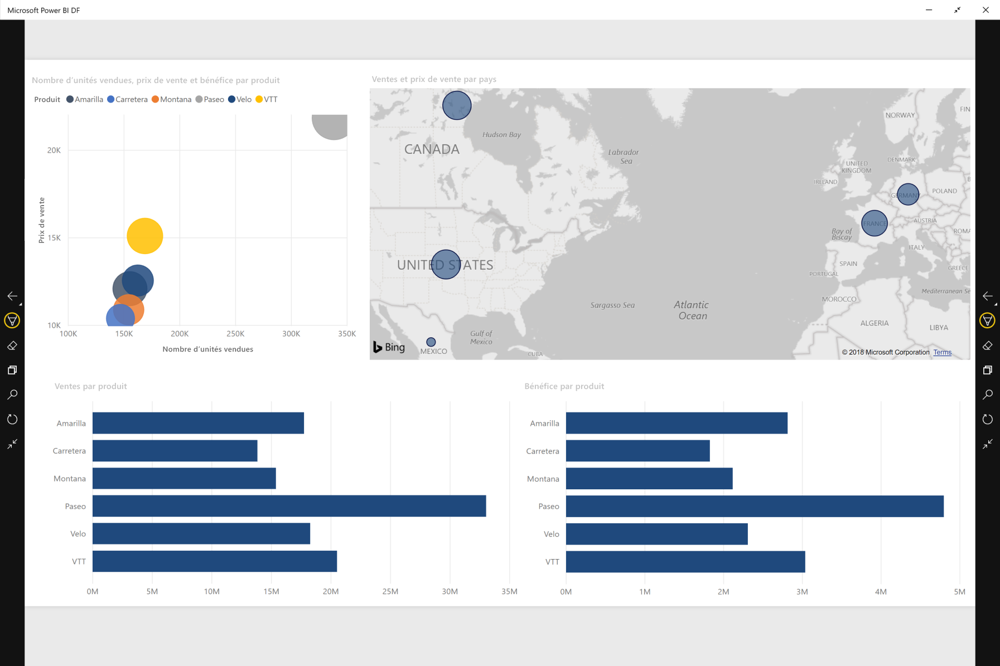
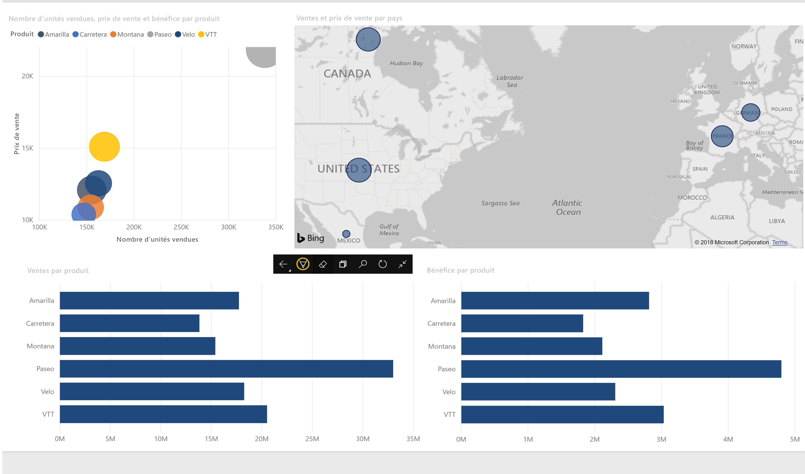

# Afficher des rapports et des tableaux de bord dans le mode de présentation dans les appareils Surface Hub et Windows 10
Vous pouvez utiliser le mode de présentation pour afficher des rapports et des tableaux de bord en plein écran sur les appareils Windows 10 et Surface Hub. 

Le mode de présentation est utile pour afficher Power BI lors d’une réunion ou d’une conférence ou sur un projecteur dédié dans un bureau ou pour optimiser l’espace sur un petit écran. 

Dans le mode de présentation dans l’application mobile Power BI pour Windows 10, tout ce qui est inutile comme les barres de navigation et de menus est supprimé pour vous permettre, aux membres de l’équipe et à vous, de vous limiter aux données de votre rapport. Une barre d’outils avec des actions sera disponible et vous permettra d’interagir et de collaborer avec vos données en mode de présentation.

Vous pouvez également [afficher les tableaux de bord et les rapports en mode Plein écran à partir du service Power BI](../end-user-focus.md) sur le web.

> [!NOTE]
> Le mode de présentation est différent du [mode Focus pour les vignettes](mobile-tiles-in-the-mobile-apps.md).
> 
> 

## Utiliser le mode de présentation
Dans l’application mobile Power BI, appuyez sur l’icône **Plein écran** pour accéder au mode plein écran.
 Tout ce qui est inutile dans l’application disparaît et une barre d’outils s’affiche en bas de l’écran ou sur les côtés gauche et droit (selon la taille de votre écran).

À partir de la barre d’outils, vous pouvez effectuer les actions suivantes :

1. Appuyez sur l’icône Précédent  pour revenir à la page précédente. Un clic long sur l’icône permet d’afficher les fenêtres Fil d’Ariane, ce qui vous permet d’accéder au dossier contenant de votre rapport ou votre tableau de bord.
2. L’icône Encre  vous permet de choisir une couleur lors de l’utilisation du stylet Surface pour annoter et dessiner sur votre page de rapport. 
3. Utilisez l’icône Pages  pour remplacer la page de rapport que vous présentez.
4. Appuyez sur l’icône de recherche  pour rechercher d’autres artefacts dans Power BI.
5. Pour quitter le mode de présentation, appuyez sur l’icône avec deux flèches orientées vers l’intérieur  dans la barre d’outils.

Vous pouvez détacher la barre d’outils et la faire glisser pour la placer n’importe où sur l’écran. Cela est utile pour les grands écrans, lorsque vous souhaitez vous concentrer sur une zone spécifique de votre rapport et placer les outils en regard de celui-ci. Placez simplement votre doigt sur la barre d’outils et faites la défiler dans le canevas de rapport.

## Étapes suivantes
* [Afficher les tableaux de bord et les rapports en mode Plein écran à partir du service Power BI](../end-user-focus.md)
* Vous avez des questions ? [Essayez d’interroger la communauté Power BI](http://community.powerbi.com/)

