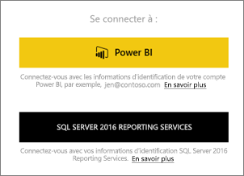
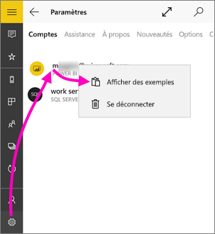
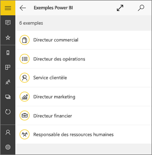
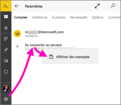
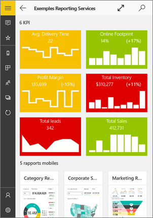
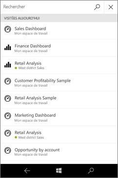
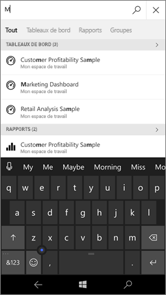
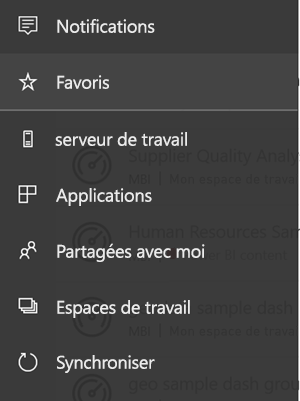
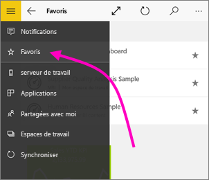

# Prise en main de l’application mobile Power BI pour Windows 10
L’application mobile Power BI pour Windows 10 vous permet d’utiliser Power BI sur votre tablette ou votre smartphone. Vous bénéficiez d’un accès mobile, tactile et toujours à jour aux informations de votre entreprise. Affichez et utilisez vos tableaux de bord d’entreprise où que vous soyez, directement sur l’[écran d’accueil de Windows](mobile-pin-dashboard-start-screen-windows-10-phone-app.md).

Vous [créez des tableaux de bord et des rapports dans le service Power BI](../../fundamentals/service-get-started.md) avec vos données. 

Interagissez ensuite avec vos tableaux de bord et rapports, explorez les données, et partagez-les via l’application mobile Power BI pour Windows 10.

## Avant tout
* [**Obtenez l’application mobile Power BI pour Windows 10**](https://go.microsoft.com/fwlink/?LinkID=526478) dans le Windows Store.
  
  Votre appareil doit exécuter Windows 10. L’application peut fonctionner sur des appareils qui disposent d’au moins 3 Go de RAM et 8 Go de stockage interne.

  >[!NOTE]
  >La prise en charge des applications mobiles Power BI pour les **téléphones utilisant Windows 10 Mobile** ne sera plus disponible après le 16 mars 2021. [En savoir plus](https://go.microsoft.com/fwlink/?linkid=2121400)
   
* Découvrez les [nouveautés sur les applications mobiles Power BI](mobile-whats-new-in-the-mobile-apps.md).

## S’inscrire au service Power BI sur le web
Si vous ne vous êtes pas encore inscrit, accédez au [service Power BI](https://powerbi.com/). Inscrivez-vous pour obtenir votre propre compte en vue de créer et de stocker des tableaux de bord et des rapports, et de rassembler l’ensemble de vos données. Ensuite, connectez-vous à Power BI sur votre appareil Windows 10 pour consulter vos tableaux de bord où que vous soyez.

1. Dans le service Power BI, appuyez sur [S’inscrire](https://go.microsoft.com/fwlink/?LinkID=513879) pour créer un compte Power BI.
2. Commencez à [créer vos propres tableaux de bord et rapports](../../fundamentals/service-get-started.md).

## Prise en main de l’application Power BI
1. Sur l’écran d’accueil de votre appareil Windows 10, ouvrez l’application Power BI.
   
   
2. Pour afficher vos tableaux de bord et vos rapports Power BI, appuyez sur **Power BI**. Connectez-vous avec les mêmes informations d’identification que celles de votre compte Power BI sur le web. 
   
   Pour afficher vos rapports mobiles Reporting Services et les indicateurs de performance clés, appuyez sur **SQL Server 2016 Reporting Services**. Connectez-vous avec les informations d'identification de SQL Server Reporting Services.
   
   
3. Appuyez sur **Commencer à explorer**  pour afficher vos propres tableaux de bord.

## Essayer les exemples Power BI et Reporting Services
Même sans inscription, vous pouvez vous servir des exemples Power BI et Reporting Services. Après avoir téléchargé l’application, vous pouvez afficher les exemples ou vous lancer. Revenez aux exemples quand vous le souhaitez à partir de la page d’accueil des tableaux de bord.

### Exemples Power BI
Vous pouvez afficher et interagir avec les exemples de tableaux de bord Power BI. Toutefois, il y a certaines opérations que vous ne pourrez pas effectuer. Vous ne pouvez pas ouvrir les rapports associés aux tableaux de bord, partager les exemples ou les définir comme favoris.

1. Appuyez sur le bouton de navigation globale  en haut à gauche.
2. Appuyez sur l’icône **Paramètres** , sur votre nom, puis sur **Afficher des exemples**.
   
   
3. Choisissez un rôle et explorez l’exemple de tableau de bord associé.  
   
   

### Exemples de rapports mobiles Reporting Services
1. Appuyez sur le bouton de navigation globale  en haut à gauche.
2. Appuyez sur l’icône **Paramètres**, cliquez avec le bouton droit ou appuyez longuement sur **Se connecter au serveur**, puis appuyez sur **Afficher des exemples**.
   
   
3. Ouvrez le dossier Retail Reports ou Sales Reports pour explorer les indicateurs de performance clés et les rapports mobiles.
   
   

## Rechercher des groupes, des rapports et des applications
Trouvez rapidement vos tableaux de bord, rapports et applications en tapant dans la zone de recherche, toujours située en haut de l’application.

1. Sélectionnez l’icône de recherche située dans le coin supérieur droit.
   
   
   
   Power BI affiche les tableaux de bord, les rapports et les applications les plus récents.
   
   
2. Lorsque vous commencez à taper, Power BI affiche tous les résultats pertinents.
   
   

## Trouver votre contenu dans les applications mobiles Power BI
Dans les applications mobiles Power BI, vos tableaux de bord et rapports sont stockés dans des emplacements différents en fonction de leur provenance. En savoir plus sur la [recherche de votre contenu dans les applications mobiles](mobile-apps-quickstart-view-dashboard-report.md). Par ailleurs, vous pouvez toujours effectuer une recherche dans tout votre contenu dans les applications mobiles Power BI. 

## Afficher vos tableaux de bord, indicateurs de performances clés et rapports favoris
Affichez l’ensemble de vos tableaux de bord Power BI favoris, ainsi que les rapports mobiles et indicateurs de performance clés Reporting Services dans la page Favoris des applications mobiles. Quand vous mettez un tableau de bord en *favoris* dans l’application mobile Power BI, vous pouvez y accéder à partir de tous les appareils, y compris dans le service Power BI dans votre navigateur. 

* Appuyez sur **Favoris**.
  
   
  
   Vos favoris Power BI et du portail web Reporting Services se trouvent tous sur cette page.
  
   

Accédez à des informations supplémentaires sur les [favoris dans les applications mobiles Power BI](mobile-apps-favorites.md).

## Étapes suivantes
Découvrez ce que vous pouvez faire d’autre dans l’application Power BI pour appareils Windows 10 avec les tableaux de bord et les rapports Power BI, ainsi que les rapports mobiles et les indicateurs de performance clés Reporting Services dans le portail web Reporting Services.

### Tableaux de bord et rapports Power BI
* Affichez [vos applications](../../collaborate-share/service-create-distribute-apps.md).
* Affichez vos [tableaux de bord](mobile-apps-view-dashboard.md).
* [Épinglez des vignettes et tableaux de bord Power BI](mobile-pin-dashboard-start-screen-windows-10-phone-app.md) sur l’écran d’accueil de votre appareil sous forme de vignettes dynamiques.
* [Partagez des vignettes](mobile-windows-10-phone-app-get-started.md).
* Partagez des [tableaux de bord](mobile-share-dashboard-from-the-mobile-apps.md).

### Rapports mobiles Reporting Services et indicateurs de performance clés
* [Affichez les rapports mobiles Reporting Services et les indicateurs de performance clés](mobile-app-windows-10-ssrs-kpis-mobile-reports.md) dans l’application Power BI pour appareils Windows 10.
* Créez des [indicateurs de performance clés sur le portail web Reporting Services](https://msdn.microsoft.com/library/mt683632.aspx).
* [Créez vos propres rapports pour appareils mobiles avec l’Éditeur de rapports mobiles Microsoft SQL Server](https://msdn.microsoft.com/library/mt652547.aspx), et publiez-les sur le portail web Reporting Services.

## Étapes suivantes
* [Téléchargez l’application Power BI](https://go.microsoft.com/fwlink/?LinkID=526478) à partir du Windows Store.  
* [Qu’est-ce que Power BI ?](../../fundamentals/power-bi-overview.md)
* Vous avez des questions ? [Essayez d’interroger la communauté Power BI](https://community.powerbi.com/)
