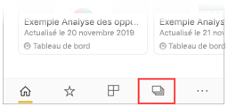
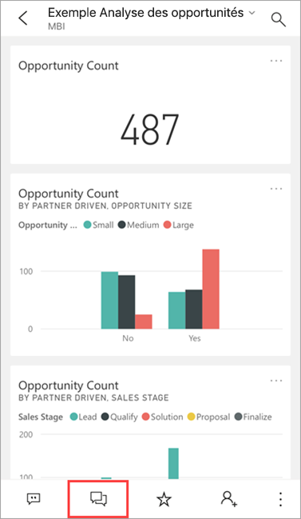
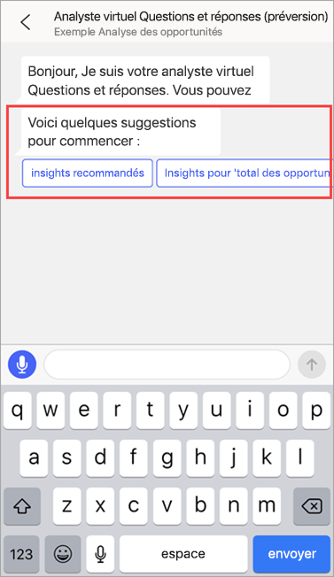
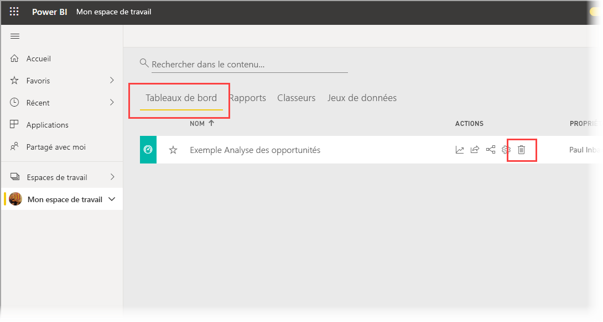
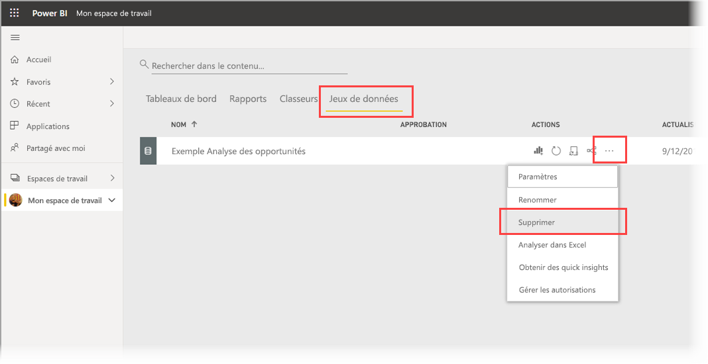

# Tutoriel : poser des questions sur vos données avec l’analyste virtuel Questions et réponses dans des applications iOS pour Power BI

Le moyen le plus simple de tirer des enseignements de vos données consiste à poser des questions à leur sujet en utilisant vos propres mots. Dans ce tutoriel, vous allez poser des questions et consulter les insights proposés sur les exemples de données à l’aide de l’analyste virtuel Questions et réponses de l’application mobile Microsoft Power BI sur votre iPad ou sur votre iPhone. 

S’applique à :

|  |  |
|:--- |:--- |
| iPhone |iPad |

L’analyste virtuel Questions et réponses est un outil décisionnel de type conversationnel qui accède aux données Questions et réponses sous-jacentes du [service Power BI](https://powerbi.com). Il suggère des insights sur les données ; vous pouvez poser vos questions par écrit ou oralement.

Durant ce tutoriel, vous allez effectuer les opérations suivantes :

> [!div class="checklist"]
> * Installer l’application mobile Power BI pour iOS
> * Télécharger un exemple de tableau de bord et de rapport Power BI
> * Consulter les insights proposés par l’application mobile

## Prérequis

* **Inscrivez-vous à Power BI** : Si vous n’êtes pas inscrit à Power BI, [inscrivez-vous à un essai gratuit](https://app.powerbi.com/signupredirect?pbi_source=web) avant de commencer.
* **Installer l’application Power BI pour iOS** : [Téléchargez l’application iOS](https://apps.apple.com/app/microsoft-power-bi/id929738808) à partir de l’Apple App Store sur votre iPad, iPhone ou iPod touch. Les versions suivantes prennent en charge l’application Power BI pour iOS :
  * iPad avec iOS 11 ou ultérieur.
  * iPhone 5 et ultérieur avec iOS 11 ou ultérieur. 
  * iPod touch avec iOS 11 et versions ultérieures
* **Télécharger les exemples de données** : La première étape consiste à télécharger l’**exemple Analyse des opportunités** dans le service Power BI. Pour obtenir des instructions sur la procédure à suivre, consultez [Téléchargement d’exemples dans Mon espace de travail dans le service Power BI](./mobile-apps-download-samples.md).

Une fois que vous avez effectué les prérequis et que vous avez téléchargé les exemples de données, vous pouvez consulter les exemples sur votre appareil iOS.

## Essayer les insights recommandés
1. Sur votre iPhone ou iPad, ouvrez l’application Power BI et connectez-vous avec vos informations d’identification de compte Power BI, les mêmes que celles utilisées dans le service Power BI dans le navigateur.

2. Dans la barre de navigation de la page d’accueil, appuyez sur l’icône **Espaces de travail**.

    

3. Lorsque la page Espaces de travail s’ouvre, appuyez sur **Mes espaces de travail**, puis sur le tableau de bord **Exemple d’analyse des opportunités** pour l’ouvrir.

3. Dans le tableau de bord Exemple d’analyse des opportunités, appuyez sur l’icône de l’analyste virtuel Questions et réponses dans le menu Action.

    

    L’analyste virtuel des questions et réponses commence par proposer des suggestions.

    

3. Appuyez sur **featured insights (Insights recommandés)** .

4. L’analyste virtuel des questions et réponses suggère certaines informations. Faites-les défiler vers la droite, puis appuyez sur **Insight 2**.

    

   L’analyste virtuel des questions et réponses affiche l’information 2.

    

5. Appuyez sur le graphique pour l’ouvrir en mode Focus.

    

6. Appuyez sur la flèche dans l’angle supérieur gauche pour revenir à l’analyste virtuel des questions et réponses.

## Nettoyer les ressources

Une fois que vous avez terminé le tutoriel, vous pouvez supprimer le tableau de bord, le rapport et le jeu de données relatifs à l’exemple Opportunity Analysis (Analyse des opportunités).

1. Ouvrez le service Power BI ([service Power BI](https://app.powerbi.com)), puis connectez-vous.

2. Dans le volet de navigation, sélectionnez **Mon espace de travail**.

3. Cliquez sur l’onglet Tableaux de bord, puis, en regard de la ligne Exemple d’analyse des opportunités, cliquez sur la corbeille.

    

    Sélectionnez l’onglet Rapports et recommencez la même procédure.

4. Sélectionnez l’onglet Jeux de données, cliquez sur **Autres options** (...), puis choisissez **Supprimer**.

    

## Étapes suivantes

Vous avez testé l’assistant virtuel Questions et réponses dans les applications mobiles Power BI pour iOS. En savoir plus sur les questions et réponses dans le service Power BI.
> [!div class="nextstepaction"]
> [Questions et réponses dans le service Power BI](../end-user-q-and-a.md)