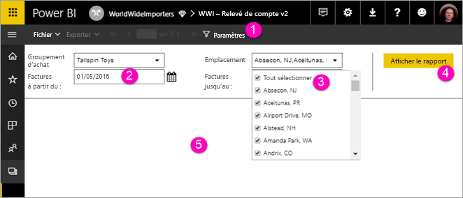

# Afficher les paramètres de rapports paginés dans le service Power BI

Dans cet article, vous allez apprendre à interagir avec les paramètres de rapports paginés dans le service Power BI.  Un paramètre de rapport permet de filtrer les données de rapport. Les paramètres offrent une liste de valeurs disponibles. Vous pouvez choisir une ou plusieurs valeurs, ou saisir dans une zone de texte de paramètre pour rechercher des valeurs. Parfois, les paramètres affichent une valeur par défaut, et parfois vous devez choisir une valeur avant de voir le rapport.  

Quand vous visualisez un rapport qui comporte des paramètres, la barre d’outils de la visionneuse de rapports affiche chaque paramètre pour vous permettre de spécifier des valeurs de manière interactive. L’illustration suivante montre la zone des paramètres d’un rapport avec les paramètres **Groupe d’achat**, **Emplacement**, une **date de début** et une **date de fin**.  

## Volet des paramètres dans le service Power BI

  
1.  **Volet des paramètres** : la barre d’outils de la visionneuse de rapports affiche une invite de commandes telles que « Requis » ou une valeur par défaut pour chaque paramètre.    
  
2.  **Paramètres de date de début et de fin des factures** : les deux paramètres de date ont des valeurs par défaut. Pour modifier la date, entrez une date dans la zone de texte, ou choisissez une date dans le calendrier.  
  
3.  **Paramètre d’emplacement** : le paramètre d’emplacement est configuré pour vous permettre de sélectionner une, plusieurs ou toutes les valeurs. 
  
4.  **Afficher le rapport** : après avoir entré ou modifié les valeurs du paramètre, cliquez sur **Afficher le rapport** pour exécuter le rapport. 

5. **Valeurs par défaut** : si tous les paramètres ont des valeurs par défaut, le rapport s’exécute automatiquement au premier affichage. Certains paramètres de ce rapport n’ont pas de valeurs par défaut, et le rapport n’apparaît que si vous sélectionnez des valeurs.  

## Étapes suivantes

[Rapports paginés dans le service Power BI](end-user-paginated-report.md)
