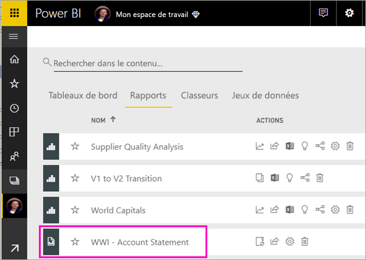
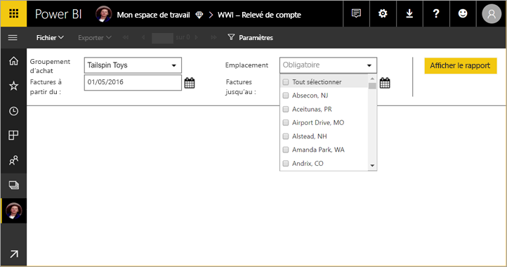
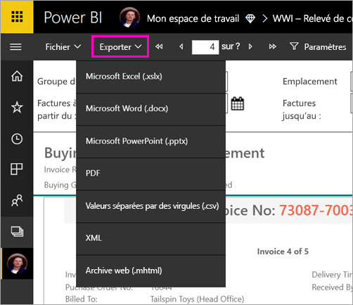

# Afficher un rapport paginé dans le service Power BI

Dans cet article, vous découvrez comment afficher des rapports paginés dans le service Power BI. Les rapports paginés sont des rapports créés dans le Générateur de rapports et chargé vers n’importe quel espace de travail dans une capacité Premium. Rechercher l’icône en forme de losange  en regard du nom de l'espace de travail. 

Les rapports paginés ont leur propre icône .

Vous pouvez également exporter des rapports paginés dans un certain nombre de formats : 

- Microsoft Excel
- Microsoft Word
- Microsoft PowerPoint
- PDF
- Valeurs séparées par des virgules
- XML
- Archive web (.mhtml)

## Afficher un rapport paginé

1. Sélectionnez le rapport paginé dans l’espace de travail.

    

2. Si, comme celui-ci, le rapport a des paramètres, vous ne verrez peut-être pas le rapport tout de suite après l’avoir ouvert. Sélectionnez des paramètres, puis **Afficher le rapport**. 

     

    Vous pouvez également modifier les paramètres à tout moment.

1. Parcourez le rapport en sélectionnant les flèches en haut de la page, ou en tapant un numéro de page dans la zone.
    
   

4. Sélectionnez **Exporter** pour rechercher un format afin d’exporter vos rapports paginés.

    

## Étapes suivantes

[Rapports paginés dans le service Power BI](end-user-paginated-report.md)
