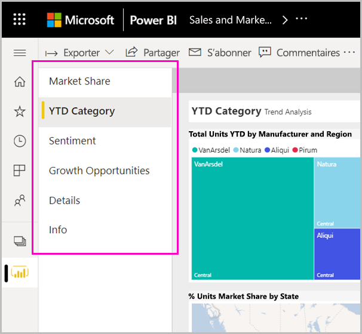
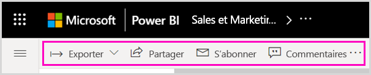

# Nouvelle apparence du service Power BI

Le service Power BI (app.powerbi.com) a une nouvelle apparence qui facilite l’affichage et l’utilisation de vos rapports. La nouvelle présentation est plus simple et s’appuie sur votre connaissance des autres produits Microsoft. Dans le service Power BI, nous avons fait du contenu de rapport le focus principal en optant pour un thème de couleur plus clair et en mettant à jour les icônes. 

Vous recherchez des informations sur la nouvelle apparence de **Power BI Desktop**  ? Consultez [Utiliser le ruban mis à jour dans Power BI Desktop](../create-reports/desktop-ribbon.md).

Voici une vue d’ensemble des modifications apportées à la nouvelle présentation. Pour plus d’informations, reportez-vous aux sections numérotées :

Vous recherchez une action spécifique ? Voir [Nouvelle apparence : où sont passées les actions ?](service-new-look-where-actions.md)

## 1. Liste verticale de pages 
En mode Lecture, les noms des pages de rapport se trouvent dans une liste présentée dans un volet vertical. Ils sont bien visibles, difficiles à manquer, et les parcourir revient à naviguer dans Word et PowerPoint. Vous pouvez agrandir ou diminuer le reste de la zone de rapport : Redimensionnez le volet vertical ou sélectionnez les doubles flèches pour le fermer entièrement.

Si vous êtes autorisé à modifier un rapport, vous pouvez définir le volet de façon à ce que les noms des pages se trouvent en bas, comme en mode Édition de rapport. Pour plus d’informations, consultez la section [Définir le volet Pages](../create-reports/power-bi-report-settings.md#set-the-pages-pane) dans l’article « Modifier les paramètres des rapports Power BI ».

## 2. Barre d’action simplifiée 

La barre d’action mise à jour dans la partie supérieure comporte les commandes les plus pertinentes pour les consommateurs de rapports. Il est plus facile d’exporter, de partager, de converser dans Teams et de s’abonner. 

## 3. Où se trouvent les commandes de rapport ?

Nous n’avons pas supprimé les fonctionnalités de l’ancienne présentation. Sélectionnez **Autres options (...)** pour accéder à d’autres commandes plus avancées. Voir [Nouvelle apparence : où sont passées les actions ?](service-new-look-where-actions.md) pour plus d’informations.

## 4. Nouvelle expérience de filtre

Le nouveau volet Filtres du rapport s’affiche par défaut avec la nouvelle apparence. Quand vous pointez sur l’icône Filtre d’un visuel, vous voyez tous les filtres et segments qui le concerne.

## Afficher les détails d’un rapport 

Consultez rapidement les détails tels que la date de la dernière actualisation et les informations de contact, directement dans la bannière supérieure.  Ouvrez le menu pour afficher des détails supplémentaires sur le rapport. Vous pouvez même envoyer un e-mail au propriétaire du rapport.

## Aucune modification du mode Édition de rapport 

Nous avons maintenu l’expérience de création similaire à celle de Desktop. Les modifications apportées à la nouvelle présentation s’appliquent uniquement au mode Lecture.

## Expérience de la nouvelle présentation du tableau de bord 

Les tableaux de bord ont également une barre d’action simplifiée. Cette barre est la même que celle des rapports et des applications, au nom d’une expérience cohérente, mais elle conserve les différences fonctionnelles. Voici une procédure pas à pas des actions dans un tableau de bord.
 

## Étapes suivantes

- [Utiliser le ruban mis à jour dans Power BI Desktop](../create-reports/desktop-ribbon.md)
- [Adhérer à la « nouvelle apparence » de l’espace de travail](../collaborate-share/service-workspaces-new-look.md)
- [Power BI pour les consommateurs](end-user-consumer.md)
