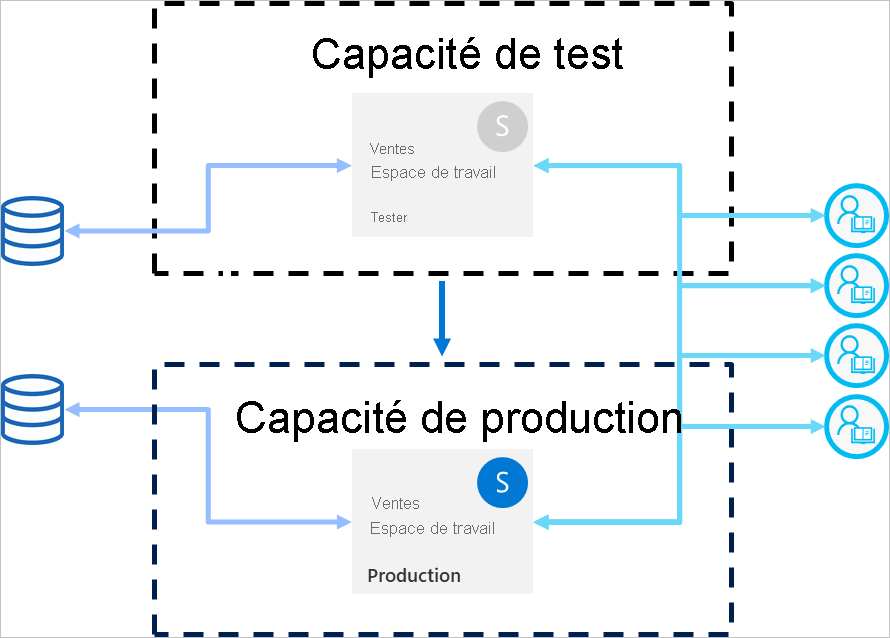

# Meilleures pratiques pour les pipelines de déploiement

Cet article fournit des conseils pour les créateurs BI qui gèrent leur contenu tout au long du cycle de vie. Il se concentre sur l’utilisation des pipelines de déploiement en tant qu’outil de gestion du cycle de vie du contenu BI.

Cet article est divisé en quatre sections :

* **Préparation du contenu** : Préparez votre contenu pour la gestion du cycle de vie.

* **Développement** : Découvrez les meilleures façons de créer du contenu dans l’étape de développement des pipelines de déploiement.

* **Test** : Comprenez comment utiliser l’étape de test des pipelines de déploiement pour tester votre environnement.

* **Production** : Utilisez l’étape de production des pipelines de déploiement lorsque vous rendez votre contenu disponible à la consommation.

## Préparation du contenu

Préparez votre contenu pour la gestion continue tout au long de son cycle de vie. Veillez à passer en revue les informations contenues dans cette section avant d’effectuer l’une des opérations suivantes :

* Publier votre contenu en production

* Commencer à utiliser un pipeline de déploiement pour un espace de travail spécifique

* Publier votre travail

### Traiter chaque espace de travail comme un package complet d’analyses

Dans l’idéal, un espace de travail doit contenir une vue complète d’un aspect (service, division, projet ou marché vertical) dans votre organisation. Cela facilite la gestion des autorisations pour différents utilisateurs et permet de contrôler les versions de contenu pour l’ensemble de l’espace de travail en fonction d’un calendrier planifié.  

Si vous utilisez des [jeux de données centralisés](../connect-data/service-datasets-across-workspaces.md) qui sont utilisés au sein de l’organisation, nous vous recommandons de créer deux types d’espaces de travail :

* **Espaces de travail de modélisation et de données** : Ces espaces de travail contiendront tous les jeux de données centralisés

* **Espaces de travail de création de rapports** : Ces espaces de travail contiendront tous les rapports et tableaux de bord dépendants

### Planifier votre modèle d’autorisation

Un pipeline de déploiement est un objet Power BI, avec ses propres [autorisations](deployment-pipelines-process.md#permissions). En outre, le pipeline contient des espaces de travail, qui ont leurs propres autorisations.

Pour implémenter un flux de travail sécurisé et facile, prévoyez qui a accès à chaque partie du pipeline. Quelques éléments à prendre en compte :

* Qui doit avoir accès au pipeline ?

* Quelles opérations les utilisateurs avec accès au pipeline peuvent-ils effectuer à chaque étape ?

* Qui examine le contenu au cours de l’étape de test ?

* Les réviseurs de l’étape de test doivent-ils avoir accès au pipeline ?

* Qui va surveiller le déploiement à l’étape de production ?

* Quel espace de travail affectez-vous ?

* À quelle étape affectez-vous votre espace de travail ?

* Avez-vous besoin d’apporter des modifications aux autorisations d’espace de travail que vous attribuez ?

### Connecter différentes étapes à différentes bases de données

Une base de données de production doit toujours être stable et disponible. Il est préférable de ne pas la surcharger avec les requêtes générées par les créateurs BI pour leurs jeux de données de développement ou de test. Créez des bases de données distinctes pour le développement et le test. Cela permet de protéger les données de production et ne surcharge pas la base de données de développement avec l’ensemble du volume de données de production, ce qui peut ralentir les choses.

>[!NOTE]
>Si votre organisation utilise [des jeux de données centralisés partagés](../connect-data/service-datasets-share.md), vous pouvez ignorer cette recommandation.

### Utiliser des paramètres dans votre modèle

Comme vous ne pouvez pas modifier les sources de données des jeux de données dans service Power BI, nous vous recommandons d’utiliser des [paramètres](/power-query/power-query-query-parameters) pour stocker les détails de la connexion, comme les noms d’instance et les noms de base de données, au lieu d’utiliser une chaîne de connexion statique. Cela vous permet de gérer les connexions via le portail web du service Power BI ou [via des API](/rest/api/power-bi/datasets/updateparametersingroup) à un moment ultérieur.

Dans les pipelines de déploiement, vous pouvez configurer des règles de paramètres pour définir des valeurs spécifiques pour les phases de développement, de test et de production.

Si vous n’utilisez pas de paramètres pour votre chaîne de connexion, vous pouvez définir des règles de source de données pour spécifier une chaîne de connexion pour un jeu de données particulier. Toutefois, dans les pipelines de déploiement, cela n’est pas pris en charge pour toutes les sources de données. Pour vérifier que vous pouvez configurer des règles pour votre source de données, consultez [Limitations des règles de jeu de données](deployment-pipelines-get-started.md#dataset-rule-limitations).

Les paramètres ont des utilisations supplémentaires, par exemple l’apport de modifications aux requêtes, aux filtres et au texte affiché dans le rapport.

## Development

Cette section fournit des conseils pour travailler avec l’étape de développement des pipelines de déploiement.

### Utiliser Power BI Desktop pour modifier vos rapports et jeux de données

Considérez Power BI Desktop comme votre environnement de développement local. Power BI Desktop vous permet d’essayer, d’explorer et de vérifier les mises à jour de vos rapports et jeux de données. Une fois le travail terminé, vous pouvez télécharger votre nouvelle version à l’étape de développement. Pour les raisons suivantes, il est recommandé de modifier les fichiers PBIX dans la version Desktop (et non dans le service Power BI) :

* Il est plus facile de collaborer avec les créateurs sur le même fichier PBIX, si toutes les modifications sont effectuées dans le même outil.

 * Effectuer des modifications en ligne, télécharger le fichier PBIX, puis le charger à nouveau crée des doublons de rapports et de jeux de données.

* Vous pouvez utiliser le contrôle de version pour tenir à jour vos fichiers PBIX.

### Contrôle de version pour les fichiers PBIX

Si vous souhaitez gérer l’historique des versions de vos rapports et jeux de données, utilisez [la synchronisation automatique Power BI avec OneDrive](../collaborate-share/service-connect-to-files-in-app-workspace-onedrive-for-business.md). Vos fichiers seront mis à jour avec la version la plus récente. Cela vous permet également de récupérer des versions plus anciennes, si nécessaire.

>[!NOTE]
>Utilisez la synchronisation automatique avec OneDrive (ou tout autre référentiel) uniquement avec les fichiers PBIX dans l’étape de développement du pipeline de déploiement. Ne synchronisez pas les fichiers PBIX dans les étapes de test et de production du pipeline de déploiement. Cela entraînerait des problèmes lors du déploiement de contenu dans le pipeline.

### Développement de modélisation distinct du développement de rapports et tableaux de bord

Pour les déploiements à l’échelle de l’entreprise, il est recommandé de séparer le développement de jeux de données et le développement de rapports et tableaux de bord. Pour promouvoir uniquement les modifications apportées à un rapport ou à un jeu de données, utilisez l’option de déploiement sélectif des pipelines de déploiement.  

Cette approche doit commencer dans Power BI Desktop, en créant un fichier PBIX distinct pour les jeux de données et les rapports. Par exemple, vous pouvez créer un fichier jeu de données PBIX et le charger à l’étape de développement. Plus tard, vos auteurs de rapports peuvent créer un nouveau PBIX uniquement pour le rapport, et [le connecter au jeu de données publié](../connect-data/service-datasets-discover-across-workspaces.md) à l’aide d’une connexion active. Cette technique permet à différents créateurs de travailler séparément sur la modélisation et les visualisations, et de les déployer en production indépendamment.

Avec les [jeux de données partagés](../connect-data/service-datasets-share.md), vous pouvez également utiliser cette méthode dans les espaces de travail.

### Gérer vos modèles à l’aide des fonctionnalités de lecture/écriture XMLA

La séparation du développement de la modélisation du développement de rapports et tableaux de bord vous permet d’utiliser des fonctionnalités avancées telles que le contrôle de code source, la fusion de modifications et les processus automatisés. Ces modifications doivent être effectuées à l’étape de développement, afin que le contenu finalisé puisse être déployé aux étapes de test et de production. Cela permet aux modifications de passer par un processus unifié avec d’autres éléments dépendants, avant qu’ils ne soient déployés à l’étape de production.

Vous pouvez séparer le développement de la modélisation des visualisations, en gérant un [jeu de données partagé](../connect-data/service-datasets-share.md) dans un espace de travail externe, à l’aide des fonctionnalités de lecture/écriture XMLA. Le jeu de données partagé peut se connecter à plusieurs rapports dans différents espaces de travail qui sont gérés dans plusieurs pipelines.

## Tester

Cette section fournit des conseils pour travailler avec l’étape de développement des pipelines de test.

### Simuler votre environnement de production

Outre la vérification du bon fonctionnement des nouveaux rapports ou tableaux de bord, il est important de voir comment ils sont exécutés du point de vue de l’utilisateur final. La phase de test des pipelines de déploiement vous permet de simuler un environnement de production réel à des fins de test.

Assurez-vous que ces trois facteurs sont traités dans votre environnement de test :

* Volume de données

* Volume d’utilisation

* Une capacité similaire à celle de la production

Lors du test, vous pouvez utiliser la même capacité que l’étape de production. Toutefois, cela peut rendre la production instable pendant le test de charge. Pour éviter une production instable, utilisez une autre capacité similaire aux ressources de la capacité de production, à des fins de test. Pour éviter les coûts supplémentaires, vous pouvez utiliser des [capacités Azure A](../developer/embedded/azure-pbie-create-capacity.md) pour payer uniquement pour la durée du test.

### Utiliser des règles de jeu de données avec une source de données réelle

Si vous utilisez l’étape de test pour simuler l’utilisation réelle des données, il est recommandé de séparer les sources de données de test et de développement. La base de données de développement doit être relativement petite, et la base de données de test doit être aussi similaire que possible à la base de données de production. Utilisez des [règles de source de données](deployment-pipelines-get-started.md#step-4---create-dataset-rules) pour basculer des sources de données en étape de test.

Le contrôle de la quantité de données que vous importez à partir de votre source de données est utile si vous utilisez une source de données de production au cours de l’étape de test. Pour ce faire, ajoutez un paramètre à votre requête de source de données dans Power BI Desktop. Utilisez les règles de paramètre pour contrôler la quantité de données importées ou modifiez la valeur du paramètre.
Vous pouvez également utiliser cette approche si vous ne souhaitez pas surcharger votre capacité.

### Mesurer les performances

Lorsque vous simulez une phase de production, [vérifiez la charge du rapport et les interactions](../guidance/monitor-report-performance.md) et déterminez si les modifications que vous avez apportées ont un impact.

Vous devez également [surveiller la charge sur la capacité](../admin/service-admin-premium-monitor-capacity.md), afin de pouvoir intercepter les charges extrêmes avant qu’elles atteignent la production.  

>[!NOTE]
>Il est recommandé de surveiller à nouveau les chargements de capacité après le déploiement des mises à jour à l’étape de production.

### Vérifier les éléments connexes

Les temps associés peuvent être affectés par les modifications apportées aux jeux de données ou aux rapports. Pendant le test, vérifiez que vos modifications n’affectent pas ou n’interrompent pas les performances des éléments existants, qui peuvent dépendre des éléments mis à jour.

Vous pouvez facilement rechercher les éléments associés à l’aide de l’espace de travail [Vue de traçabilité](../collaborate-share/service-data-lineage.md).

### Test de l'application

Si vous distribuez du contenu à vos utilisateurs finaux par le biais d’une application, passez en revue la nouvelle version de l’application avant qu’elle ne soit en production. Comme chaque étape du pipeline de déploiement a son propre espace de travail, vous pouvez facilement publier et mettre à jour des applications à des stades de développement et de test. Cela vous permettra de tester l’application du point de vue d’un utilisateur final.

>[!IMPORTANT]
>Le processus de déploiement n’inclut pas la mise à jour du contenu ou des paramètres de l’application. Pour appliquer les modifications apportées au contenu ou aux paramètres, vous devez mettre à jour manuellement l’application dans l’étape de pipeline requise.

## Production

Cette section fournit des conseils pour l’étape de production des pipelines de déploiement.

### Gérer les utilisateurs autorisés à déployer en production

Lorsque le déploiement en production doit être géré avec précaution, il est conseillé d’autoriser uniquement des personnes spécifiques à gérer cette opération sensible. Toutefois, vous souhaitez probablement que tous les créateurs BI pour un espace de travail spécifique aient accès au pipeline. Cela peut être géré à l’aide des [autorisations d’espace de travail](deployment-pipelines-process.md#permissions) de production.  

Pour déployer du contenu entre différentes étapes, les utilisateurs doivent disposer de l’autorisation membre ou administrateur pour les deux étapes. Assurez-vous que seules les personnes que vous souhaitez être en mesure de déployer en production ont des autorisations sur l’espace de travail de production. D’autres utilisateurs peuvent avoir des rôles de contributeur ou de lecteur d’espace de travail de production. Ils peuvent voir le contenu à partir du pipeline, mais ne peuvent pas le déployer.

En outre, vous devez limiter l’accès au pipeline en activant uniquement les autorisations de pipeline pour les utilisateurs qui font partie du processus de création de contenu.

### Définir des règles pour garantir la disponibilité de l’étape de production

Les [règles de jeu de données](deployment-pipelines-get-started.md#step-4---create-dataset-rules) sont un moyen puissant de garantir que les données en production sont toujours connectées et accessibles aux utilisateurs. Une fois les règles de jeu de données appliquées, les déploiements peuvent être exécutés lorsque vous avez la garantie que les utilisateurs finaux verront les informations pertinentes sans perturbation.

Veillez à définir des règles de jeu de données de production pour les sources de données et les paramètres définis dans le jeu de données.

### Mettre à jour l’application de production

Le déploiement dans un pipeline met à jour le contenu de l’espace de travail, mais ne met pas à jour l’application associée automatiquement. Si vous utilisez une application pour la distribution de contenu, n’oubliez pas de mettre à jour l’application après le déploiement en production, afin que les utilisateurs finaux puissent immédiatement utiliser la version la plus récente.  

### Correctifs rapides pour le contenu

Dans le cas où il existe des bogues en production qui requièrent un correctif rapide, ne soyez pas tenté de charger une nouvelle version PBIX directement à l’étape de production ou d’effectuer une modification en ligne dans le service Power BI. Le déploiement vers l’arrière à des étapes de test et de développement n’est pas possible quand il existe déjà un contenu dans ces étapes. En outre, le déploiement d’un correctif sans le tester d’abord est une mauvaise pratique. Par conséquent, la bonne méthode pour traiter ce problème consiste à implémenter le correctif dans l’étape de développement et à le transmettre au reste des étapes du pipeline de déploiement. Cela permet de vérifier que le correctif fonctionne avant de le déployer en production. Le déploiement à travers le pipeline ne prend que quelques minutes.

## Étapes suivantes

>[!div class="nextstepaction"]
>[Présentation des pipelines de déploiement](deployment-pipelines-overview.md)

>[!div class="nextstepaction"]
>[Bien démarrer avec les pipelines de déploiement](deployment-pipelines-get-started.md)

>[!div class="nextstepaction"]
>[Comprendre le processus des pipelines de déploiement](deployment-pipelines-process.md)

>[!div class="nextstepaction"]
>[Résolution des problèmes des pipelines de déploiement](deployment-pipelines-troubleshooting.md)