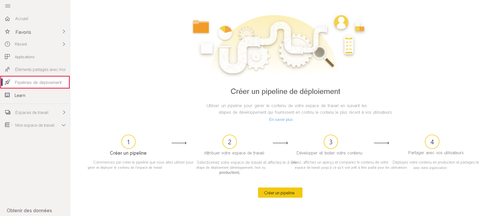
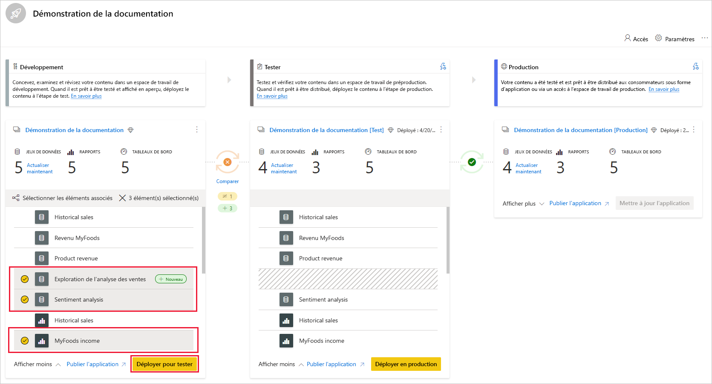
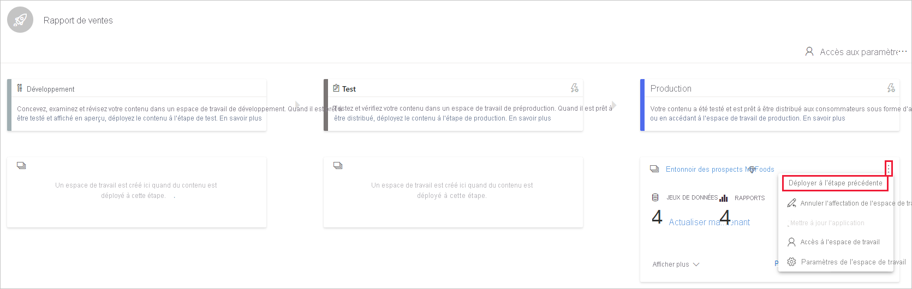
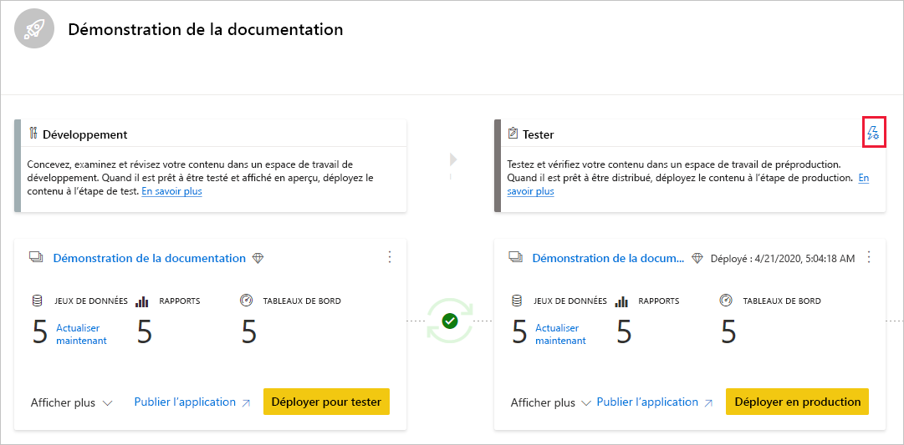
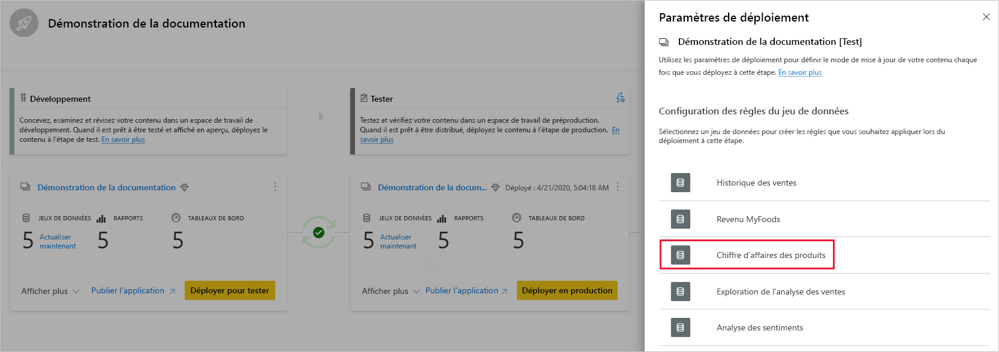
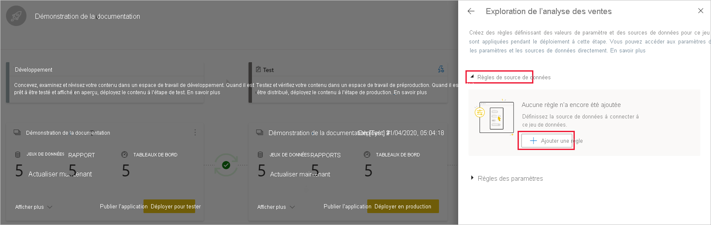
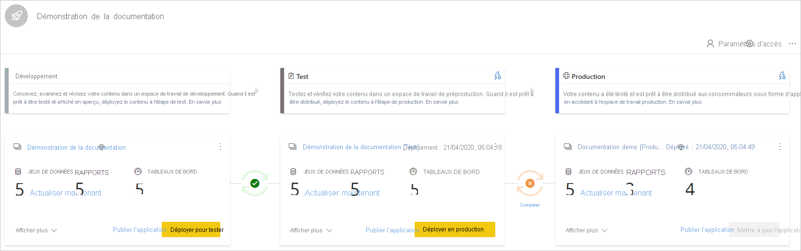
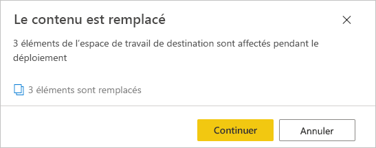

# Bien démarrer avec les pipelines de déploiement (préversion)

Cet article vous guide tout à travers les paramètres de base requis pour l’utilisation des pipelines de déploiement.

## Accès aux pipelines de déploiement

Vous pouvez accéder à la fonctionnalité de pipelines de déploiement si les conditions suivantes sont remplies :

* Vous êtes un [utilisateur Power BI Pro](../admin/service-admin-purchasing-power-bi-pro.md)

* Vous appartenez à une organisation qui dispose d’une capacité Premium

* Vous êtes administrateur d’une [nouvelle expérience d’espace de travail](../collaborate-share/service-create-the-new-workspaces.md)

>[!NOTE]
> Vous pouvez également voir le bouton de pipelines de déploiement si vous avez déjà créé un pipeline ou si un pipeline a été partagé avec vous.

## Étape 1 : Créer un pipeline de déploiement

Pour créer un pipeline de déploiement, procédez comme suit :

1. Dans service Power BI, dans le volet de navigation, sélectionnez **Pipelines de déploiement** et cliquez sur **Créer un pipeline**.

2. Dans la boîte de dialogue *Créer un pipeline de déploiement*, entrez un nom et une description pour le pipeline, puis cliquez sur **Créer**.

Une fois le pipeline créé, vous pouvez le partager avec d’autres utilisateurs ou le supprimer. Lorsque vous partagez un pipeline avec d’autres personnes, les utilisateurs avec lesquels vous partagez le pipeline reçoivent [l’accès au pipeline](deployment-pipelines-process.md#user-with-pipeline-access). L’accès au pipeline permet aux utilisateurs d’afficher, de partager, de modifier et de supprimer le pipeline.

## Étape 2 : Affecter un espace de travail à un pipeline de déploiement

Après avoir créé un pipeline, vous devez ajouter le contenu que vous souhaitez gérer au pipeline. L’ajout de contenu au pipeline s’effectue en affectant un espace de travail à l’étape de pipeline. Vous pouvez affecter un espace de travail à n’importe quelle étape. 

Vous pouvez affecter un espace de travail à un pipeline de déploiement. Les pipelines de déploiement créent des clones du contenu de l’espace de travail, pour l’utiliser à différentes étapes du pipeline.

Pour affecter un espace de travail dans un pipeline de déploiement, procédez comme suit :

1. Dans le pipeline de déploiement que vous venez de créer, cliquez sur **Attribuer un espace de travail**.

2. Dans le menu déroulant *Choisir l'espace de travail*, sélectionnez l’espace de travail que vous souhaitez attribuer au pipeline.

3. Sélectionnez l’étape à laquelle vous souhaitez affecter l’espace de travail.

### Limitations de l’affectation d’espace de travail

* L’espace de travail doit être une [nouvelle expérience d’espace de travail](../collaborate-share/service-create-the-new-workspaces.md).

* Vous devez être administrateur de l’espace de travail.

* L’espace de travail n’est affecté à aucun autre pipeline.

* L’espace de travail doit résider sur une  [capacité Premium](../admin/service-premium-what-is.md).

* Vous ne pouvez pas attribuer un espace de travail avec des [exemples Power BI](../create-reports/sample-datasets.md) à une étape de pipeline.

>[!NOTE]
>Seuls les espaces de travail qui peuvent être utilisés avec les pipelines de déploiement s’affichent dans la liste des espaces de travail que vous pouvez sélectionner.

## Étape 3 : Déployer dans une étape vide

Tout [utilisateur Pro](../admin/service-admin-purchasing-power-bi-pro.md) membre ou administrateur de l’espace de travail source peut déployer le contenu dans une étape vide (une étape qui ne contient pas de contenu). L’espace de travail doit résider sur une capacité pour que le déploiement se termine.

Lorsque vous déployez du contenu dans une étape vide, les relations entre les éléments sont conservées. Par exemple, un rapport lié à un jeu de données à l’étape source est cloné en même temps que son jeu de données, et les clones sont liés de manière similaire dans l’espace de travail cible.

Une fois le déploiement terminé, actualisez le jeu de données. Pour plus d’informations, consultez [Déploiement de contenu dans une étape vide](deployment-pipelines-process.md#deploying-content-to-an-empty-stage).

### Déploiement de tout le contenu

Sélectionnez l’étape à partir de laquelle effectuer le déploiement, puis cliquez sur le bouton de déploiement. Le processus de déploiement crée un espace de travail dupliqué sur l’étape cible. Cet espace de travail comprend tout le contenu existant à l’étape actuelle.

### Déploiement sélectif

Pour déployer uniquement des éléments spécifiques, cliquez sur le lien **Afficher plus**, puis sélectionnez les éléments que vous souhaitez déployer. Lorsque vous cliquez sur le bouton Déployer, seuls les éléments sélectionnés sont déployés à l’étape suivante.

Étant donné que les tableaux de bord, rapports et jeux de données sont liés et présentent des dépendances, vous pouvez utiliser le bouton Sélectionner les éléments associés pour vérifier tous les éléments dont dépendent ces éléments. Par exemple, si vous souhaitez déployer un rapport à l’étape suivante, le fait de cliquer sur le bouton Sélectionner les éléments associés marque le jeu de données auquel le rapport est connecté, afin que les deux soient déployés à la fois et que le rapport ne s’arrête pas.

>[!NOTE]
> * Vous ne pouvez pas déployer un rapport ou un tableau de bord à l’étape suivante si les éléments dont il dépend n’existent pas dans la phase de déploiement.
> * Vous pouvez obtenir des résultats inattendus si vous choisissez de déployer un rapport ou un tableau de bord sans son jeu de données. Cela peut se produire lorsque le jeu de données de l’étape cible a changé et n’est plus identique à celui de l’étape à partir de laquelle vous effectuez le déploiement.

### Déploiement vers l’arrière

Vous pouvez choisir de déployer à une étape précédente, par exemple dans un scénario où vous affectez un espace de travail existant à une étape de production, puis le déployez en arrière, d’abord sur l’étape de test, puis sur celle de développement.

Le déploiement sur une étape précédente ne fonctionne que si l’étape précédente est vide de contenu. Lors du déploiement à l’étape précédente, vous ne pouvez pas sélectionner d’éléments spécifiques. Tout le contenu de la phase sera déployé.

## Étape 4 : Créer des règles de jeu de données

Lorsque vous travaillez dans un pipeline de déploiement, différentes étapes peuvent avoir des configurations différentes. Par exemple, chaque étape peut avoir des bases de données différentes ou des paramètres de requête différents. L’étape de développement peut interroger des exemples de données de la base de données, tandis que les étapes de test et de production interrogent la base de données entière.

Lorsque vous déployez du contenu entre étapes du pipeline, la configuration des règles de jeu de données vous permet d’autoriser les modifications apportées au contenu, tout en conservant les paramètres intacts.

Les règles de jeu de données sont définies sur les sources de données et les paramètres dans chaque jeu de données. Elles déterminent les valeurs des sources de données ou des paramètres pour un jeu de données spécifique. Par exemple, si vous souhaitez qu’un jeu de données dans une étape de production pointe vers une base de données de production, vous pouvez définir une règle pour cela. La règle est définie à l’étape de production, sous le jeu de données approprié. Une fois la règle définie, le contenu déployé du test en production hérite de la valeur telle qu’elle est définie dans les règles du jeu de données et s’applique toujours tant que la règle est inchangée et valide.

>[!NOTE]
> Les règles de jeu de données fonctionnent uniquement lorsque la source de données source et la source de données cible sont du même type.

### Créer une règle de jeu de données

1. Dans l’étape de pipeline pour laquelle vous souhaitez créer une règle de jeu de données, cliquez sur **Paramètres de déploiement**.

    

2. Dans le volet Paramètres de déploiement, sélectionnez le jeu de données pour lequel vous souhaitez créer une règle.

    

3. Sélectionnez le type de règle que vous souhaitez créer, développez la liste, puis cliquez sur **Ajouter une règle**.

     

### Types de règles de jeu de données

Il existe deux types de règles que vous pouvez créer :

* **Règles de source de données** La liste des sources de données est extraite du jeu de données de l’étape du pipeline source. Dans la liste source de données, sélectionnez une source de données à remplacer. Utilisez l’une des méthodes suivantes pour sélectionner une valeur afin de remplacer celle de l’étape source :

    1. Sélectionnez dans une liste.

    2. Cliquez sur **Autres** et ajoutez manuellement la nouvelle source de données. Vous pouvez uniquement modifier une source de données à partir du même type.

* **Règles de paramètres** Sélectionnez un paramètre dans la liste des paramètres ; la valeur actuelle est affichée. Modifiez la valeur en lui affectant la valeur que vous souhaitez appliquer après chaque déploiement.

### Limitations des règles de jeu de données

* Vous devez être le propriétaire du jeu de données pour créer une règle de jeu de données.

* Impossible de créer des règles de jeu de données à l’étape de développement.

* Lorsqu’un élément est retiré ou supprimé, ses règles sont également supprimées. Ces règles ne peuvent pas être restaurées.

* Si le ou les paramètres définis dans une règle sont modifiés ou supprimés du jeu de données source, la règle n’est pas valide et le déploiement échoue.

* Les règles de paramètres ne peuvent pas être définies pour les paramètres de type *Tout* ou *Binaire*. Pour plus d’informations, consultez les [restrictions relatives aux paramètres de mise à jour des jeux de données](https://docs.microsoft.com/rest/api/power-bi/datasets/updateparameters).

* Les règles de source de données ne peuvent être définies que pour les sources de données suivantes :
    * Azure Analysis Services
    * SQL Server Analysis Services (SSAS)
    * Azure SQL Server
    * Serveur SQL
    * Flux OData
    * Oracle
    * SAP HANA (pris en charge uniquement pour le mode importation, et non le mode de requête directe)
    * SharePoint
    * Teradata

    Pour les autres sources de données, nous vous recommandons [d’utiliser des paramètres pour configurer votre source de données](deployment-pipelines-best-practices.md#use-parameters-in-your-model).

## Étape 5 : Déployer du contenu d’une étape à une autre

Une fois que vous disposez de contenu dans une phase de pipeline, vous pouvez le déployer à l’étape suivante. Le déploiement de contenu vers une autre étape est généralement effectué après que vous avez effectué certaines actions dans le pipeline. Par exemple, quand vous avez apporté des modifications à votre contenu au cours de l’étape de développement, ou testé votre contenu au cours de l’étape de test. Un flux de travail classique pour déplacer le contenu d’une phase à une autre est d’aller du développement au test, puis du test à la production. Pour plus d’informations sur ce processus, consultez la section [Déployer du contenu dans un espace de travail existant](deployment-pipelines-process.md#deploy-content-to-an-existing-workspace).

Pour déployer du contenu à l’étape suivante dans le pipeline de déploiement, cliquez sur le bouton Déployer au bas de l’étape.

Lorsque vous examinez les cartes de test et de production, vous pouvez voir la dernière date de déploiement. Cela indique le dernier moment où le contenu a été déployé à l’étape.

La date de déploiement est utile pour établir le moment de la dernière mise à jour d’une phase. Cela peut également être utile si vous souhaitez suivre le temps entre les déploiements de test et de production.

## Étapes de comparaison

Lorsque deux étapes séquentielles ont du contenu, le contenu est comparé en fonction des métadonnées des éléments de contenu. Cette comparaison n’inclut pas la comparaison des données ou le temps d’actualisation entre les étapes.

 

Pour permettre un aperçu visuel rapide des différences entre deux étapes séquentielles, un indicateur d’icône de comparaison apparaît entre eux. L’indicateur de comparaison a deux états :

* **Indicateur vert** : Les métadonnées de chaque élément de contenu dans les deux étapes sont identiques.

* **Indicateur orange** : S’affiche si l’une des conditions suivantes est remplie :
    * Certains éléments de contenu de chaque étape ont été modifiés ou mis à jour (ont des métadonnées différentes).
    * Il existe une différence dans le nombre d’éléments entre les étapes.

Lorsque deux étapes séquentielles ne sont pas les mêmes, un lien **Comparer** apparaît sous l’icône de comparaison orange. Cliquer sur le lien ouvre la liste d’éléments de contenu dans les deux étapes dans la vue de comparaison. La vue de comparaison vous permet de suivre les modifications ou les différences entre les éléments à chaque étape du pipeline. Les éléments modifiés reçoivent une des étiquettes suivantes :

* **Nouveau** : Nouvel élément à l’étape source. Il s’agit d’un élément qui n’existe pas à l’étape cible. Après le déploiement, cet élément sera cloné à l’étape cible.

* **Différent** : Un élément qui existe à la fois dans la source et dans la phase cible, si l’une des versions a été modifiée après le dernier déploiement. Après le déploiement, l’élément à l’étape source remplace l’élément à l’étape cible, quel que soit l’endroit où la modification a été apportée.

* **Manquant dans** : Cette étiquette indique qu’un élément apparaît à l’étape cible, mais pas à l’étape source.

    >[!NOTE]
    >Le déploiement n’a pas d’impact sur les éléments étiquetés *Manquant dans*.

 

## Remplacement du contenu

Lorsque vous effectuez un déploiement après avoir apporté des modifications au contenu de l’étape source, le contenu que vous avez modifié à l’étape cible est remplacé. Après avoir cliqué sur *Déployer*, vous obtenez un avertissement indiquant le nombre d’éléments qui seront remplacés.

Vous pouvez en savoir plus sur [les éléments copiés à l’étape suivante](deployment-pipelines-process.md#deployed-items)et [les éléments qui ne sont pas copiés](deployment-pipelines-process.md#unsupported-items) en consultant [Comprendre le processus de déploiement](deployment-pipelines-process.md).

## Étapes suivantes

>[!div class="nextstepaction"]
>[Présentation des pipelines de déploiement](deployment-pipelines-overview.md)

>[!div class="nextstepaction"]
>[Comprendre le processus des pipelines de déploiement](deployment-pipelines-process.md)

>[!div class="nextstepaction"]
>[Résolution des problèmes des pipelines de déploiement](deployment-pipelines-troubleshooting.md)

>[!div class="nextstepaction"]
>[Meilleures pratiques pour les pipelines de déploiement](deployment-pipelines-best-practices.md)