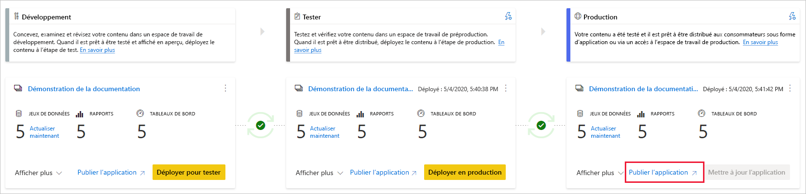

# Comprendre le processus de déploiement (préversion)

Le processus de déploiement vous permet de cloner le contenu d’une étape de pipeline vers une autre, en général du développement au test et du test à la production.

Pendant le déploiement, Power BI copie le contenu de l’étape actuelle vers le contenu cible. Les connexions entre les éléments copiés sont conservées lors du processus de copie. Power BI applique également les règles de jeu de données configurées au contenu mis à jour à l’étape cible. Le déploiement de contenu peut prendre un certain temps, en fonction du nombre d’éléments en cours de déploiement. Pendant ce temps, vous pouvez accéder à d’autres pages dans le portail Power BI, mais vous ne pouvez pas utiliser le contenu dans l’étape cible.

## Déploiement de contenu dans une étape vide

Lorsque vous déployez du contenu dans une étape vide, les métadonnées des rapports, des tableaux de bord et des jeux de données de l’espace de travail à partir duquel vous effectuez le déploiement sont copiées dans l’étape vers laquelle vous effectuez le déploiement. Un nouvel espace de travail pour l’étape sur laquelle vous avez déployé est créé sur une capacité Premium.

Il existe deux façons de déployer du contenu d’une étape à l’autre. Vous pouvez déployer tout le contenu, ou vous pouvez [sélectionner les éléments de contenu à déployer](deployment-pipelines-get-started.md#selective-deployment).

Vous pouvez également déployer le contenu vers l’arrière, d’une étape ultérieure du pipeline de déploiement vers une ancienne.

Une fois le déploiement terminé, actualisez les jeux de données afin de pouvoir utiliser le contenu qui vient d’être copié. L’actualisation du jeu de données est nécessaire, car les données ne sont pas copiées d’une étape à l’autre. Pour savoir quelles propriétés d’élément sont copiées pendant le processus de déploiement et quelles propriétés ne le sont pas copiées, consultez la section [Propriétés d’élément copiées lors du déploiement](#item-properties-copied-during-deployment).

### Création d’un espace de travail de capacité Premium

Lors du premier déploiement, les pipelines de déploiement vérifient si vous disposez d’autorisations de capacité Premium.  

Si vous disposez d’autorisations de capacité, le contenu de l’espace de travail est copié à l’étape vers laquelle vous effectuez le déploiement, et un nouvel espace de travail pour cette étape est créé sur la capacité Premium.

Si vous n’avez pas d’autorisations de capacité, l’espace de travail est créé, mais le contenu n’est pas copié. Vous pouvez demander à un administrateur de capacité d’ajouter votre espace de travail à une capacité ou demander l’attribution d’autorisations pour la capacité. Plus tard, lorsque l’espace de travail est affecté à une capacité, vous pouvez déployer le contenu dans cet espace de travail.

### Propriété de l’espace de travail et du contenu

L’utilisateur qui effectue le déploiement devient automatiquement le propriétaire du jeu de données cloné et le seul administrateur du nouvel espace de travail.

## Déployer du contenu dans un espace de travail existant

Le déploiement de contenu dans un pipeline de production en cours d’utilisation, sur une étape disposant d’un espace de travail existant, inclut les éléments suivants :

* Déploiement de nouveau contenu en tant qu’ajout, à une étape qui contient déjà du contenu.

* Nouveau contenu déployé pour remplacer l’ancien contenu, dans une étape de travail actuelle.

### Processus de déploiement

Le contenu de l’étape actuelle est copié vers l’étape cible. Power BI identifie le contenu existant de l’étape cible et le remplace. Pour identifier l’élément de contenu qui doit être remplacé, les pipelines de déploiement utilisent la connexion entre l’élément parent et ses clones. Cette connexion est conservée lors de la création de nouveau contenu. L’opération de remplacement remplace uniquement le contenu de l’élément. L’ID, l’URL et les autorisations de l’élément restent inchangés.

Dans l’étape cible, les [propriétés d’élément qui ne sont pas copiées](deployment-pipelines-process.md#item-properties-that-are-not-copied) restent telles qu’elles étaient avant le déploiement. Le nouveau contenu et les nouveaux éléments sont copiés de l’étape actuelle à l’étape cible.

### Actualisation du jeu de données

Les données du jeu de données cible sont conservées dans la mesure du possible. Si aucune modification n’est apportée à un jeu de données, les données sont conservées telles qu’elles étaient avant le déploiement.

Avec des modifications mineures, comme l’ajout d’une table ou de mesures, Power BI conserve les données d’origine, et l’actualisation est optimisée pour actualiser uniquement ce qui est nécessaire. Pour les modifications de schéma cassantes ou les modifications apportées à la connexion à la source de données, une actualisation complète est nécessaire.

### Conditions requises pour le déploiement sur une étape avec un espace de travail existant

Tant que le contenu déployé réside sur une [capacité Premium](../admin/service-premium-what-is.md), un utilisateur qui remplit les conditions suivantes peut le déployer à une étape dans un espace de travail existant :

* Un [utilisateur Pro](../admin/service-admin-purchasing-power-bi-pro.md) qui est membre des deux espaces de travail dans les étapes de déploiement source et cible.

* Un propriétaire de tous les jeux de données de l’espace de travail cible qui vont être déployés.

Pour plus d'informations, consultez la section [Autorisations](#permissions).

## Éléments déployés

Lorsque vous déployez du contenu d’une étape de pipeline vers une autre, le contenu copié contient les éléments Power BI suivants :

* Jeux de données

* Rapports

* Tableaux de bord

### Éléments non pris en charge

Les pipelines de déploiement ne prennent pas en charge les éléments suivants :

* Jeux de données qui ne proviennent pas d’un .pbix

* Rapports basés sur des jeux de données non pris en charge

* L’espace de travail ne peut pas utiliser une application de modèle

* Rapports paginés

* Dataflows

* Transmettre des jeux de données

* Classeurs

## Propriétés de l’élément copiées lors du déploiement

Pendant le déploiement, les propriétés d’élément suivantes sont copiées et remplacent les propriétés de l’élément à l’étape cible :

* Sources de données (les [règles de jeu de données](deployment-pipelines-get-started.md#step-4---create-dataset-rules) sont prises en charge)

* Paramètres (les [règles de jeu de données](deployment-pipelines-get-started.md#step-4---create-dataset-rules) sont prises en charge)

* Visuels de rapport

* Pages d’un rapport

* Mise à jour des vignettes de tableau de bord

* Métadonnées du modèle

* Relations d’élément

### Propriétés d’élément qui ne sont pas copiées

Les propriétés d’élément suivantes ne sont pas copiées lors du déploiement :

* Données : les données ne sont pas copiées, seules les métadonnées sont copiées

* URL

* ID

* Autorisations : pour un espace de travail ou un élément spécifique

* Paramètres de l’espace de travail : chaque étape a son propre espace de travail

* Contenu et paramètres de l’application : pour déployer vos applications, consultez [Déploiement d’applications Power BI](#deploying-power-bi-apps)

Les propriétés de jeu de données suivantes ne sont pas copiées non plus lors du déploiement :

* Attribution de rôle
    
* Planification de l’actualisation
    
* Informations d’identification de la source de données
    
* Paramètres de mise en cache des requêtes (peuvent être hérités de la capacité)
    
* Paramètres d’approbation

## Déploiement d’applications Power BI

[Les applications Power BI](../consumer/end-user-apps.md) sont la méthode recommandée pour distribuer du contenu aux consommateurs Power BI gratuits. Avec les pipelines de déploiement, vous pouvez gérer des applications Power BI dans un pipeline de déploiement, afin de disposer de davantage de contrôle et de flexibilité lorsqu’il s’agit du cycle de vie de votre application.

Créez une application pour chaque étape du pipeline de déploiement, afin de pouvoir tester chaque mise à jour d’application du point de vue d’un utilisateur final. Un pipeline de déploiement vous permet de gérer facilement ce processus. Utilisez le bouton Publier ou Afficher de la carte de l’espace de travail pour publier ou afficher l’application dans une étape de pipeline spécifique.

Au cours de l’étape de production, le bouton d’action principal situé dans le coin inférieur gauche ouvre la page Mettre à jour l’application dans Power BI, afin que toutes les mises à jour de contenu soient disponibles pour les utilisateurs de l’application.

>[!IMPORTANT]
>Le processus de déploiement n’inclut pas la mise à jour du contenu ou des paramètres de l’application. Pour appliquer les modifications apportées au contenu ou aux paramètres, vous devez mettre à jour manuellement l’application dans l’étape de pipeline requise.

## Autorisations

Les autorisations de pipeline et d’espace de travail sont accordées et gérées séparément. Par exemple, un utilisateur disposant d’un accès de pipeline qui n’a pas d’autorisations d’espace de travail pourra afficher le pipeline et le partager avec d’autres utilisateurs. Toutefois, cet utilisateur ne pourra pas afficher le contenu de l’espace de travail dans le pipeline, ni dans la page de l’espace de travail, et ne pourra pas effectuer de déploiements.

### Utilisateur avec accès au pipeline

Les utilisateurs disposant d’un accès au pipeline disposent des autorisations suivantes :

* Afficher le pipeline
    
* Partager le pipeline avec d’autres utilisateurs
    
* Modifier et supprimer le pipeline

>[!NOTE]
>L’accès au pipeline n’accorde pas d’autorisations pour afficher ou prendre des mesures sur le contenu de l’espace de travail.

### Visionneuse d’espace de travail

Les visionneuses d’espace de travail qui ont *l’accès au pipeline* peuvent également effectuer les opérations suivantes :

* Consommer du contenu

>[!NOTE]
>Les visionneuses d’espace de travail ne peuvent pas accéder au jeu de données ou modifier le contenu de l’espace de travail.

### Contributeur d’espace de travail

Les contributeurs d’espace de travail qui ont *l’accès au pipeline* peuvent également effectuer les opérations suivantes :

* Consommer du contenu

* Comparer les étapes

* Afficher les jeux de données

### Membre de l’espace de travail

Les membres d’espace de travail qui ont *l’accès au pipeline* peuvent également effectuer les opérations suivantes :

* Voir le contenu de l'espace de travail
    
* Comparer les étapes
    
* Déployer des rapports et des tableaux de bord

* Supprimer des espaces de travail

### Administrateur de l’espace de service

Les administrateurs de l’espace de travail qui ont *l’accès au pipeline* peuvent effectuer les mêmes actions que les *membres de l’espace de travail* ainsi que les opérations suivantes :

* Assigner des espaces de travail

* Supprimer des espaces de travail

### Propriétaire du jeu de données

Les propriétaires de jeux de données qui sont des membres de l’espace de travail ou des administrateurs peuvent également effectuer les opérations suivantes :

* Mettre à jour les jeux de données
    
* Configurer des règles

>[!NOTE]
>Cette section décrit les autorisations des utilisateurs dans les pipelines de déploiement. Les autorisations indiquées dans cette section peuvent avoir des applications différentes dans d’autres fonctionnalités de Power BI.

## Limites

Cette section répertorie la plupart des limitations dans les pipelines de déploiement.

* L’espace de travail doit résider sur une  [capacité Premium](../admin/service-premium-what-is.md).

* Les éléments Power BI, tels que les rapports et les tableaux de bord qui ont des [étiquettes de sensibilité](../admin/service-security-data-protection-overview.md#sensitivity-labels-in-power-bi) Power BI ne peuvent pas être déployés.

* Le nombre maximal d’éléments Power BI pouvant être déployés dans un seul et même déploiement est 300.

* Pour obtenir la liste des limitations des espaces de travail, consultez [Limitations de l’affectation d’espaces de travail](deployment-pipelines-get-started.md#workspace-assignment-limitations).

* Pour obtenir la liste des éléments non pris en charge, consultez [Éléments non pris en charge](#unsupported-items).

### Limitations du jeu de données

* Les jeux de données configurés avec [l’actualisation incrémentielle](../admin/service-premium-incremental-refresh.md) ne peuvent pas être déployés.

* Les jeux de données qui utilisent la connectivité des données en temps réel ne peuvent pas être déployés.

* Pendant le déploiement, si le jeu de données cible utilise une [connexion en direct](../connect-data/desktop-report-lifecycle-datasets.md), le jeu de données source doit également utiliser ce mode de connexion.

* Après le déploiement, le téléchargement d’un jeu de données (à partir de la phase où il a été déployé) n’est pas pris en charge.

* Pour obtenir la liste des limitations des règles de jeu de données, consultez [Limitations des règles de jeu de données](deployment-pipelines-get-started.md#dataset-rule-limitations).

## Étapes suivantes

>[!div class="nextstepaction"]
>[Présentation des pipelines de déploiement](deployment-pipelines-overview.md)

>[!div class="nextstepaction"]
>[Meilleures pratiques pour les pipelines de déploiement](deployment-pipelines-best-practices.md)

>[!div class="nextstepaction"]
>[Bien démarrer avec les pipelines de déploiement](deployment-pipelines-get-started.md)

>[!div class="nextstepaction"]
>[Résolution des problèmes des pipelines de déploiement](deployment-pipelines-troubleshooting.md)