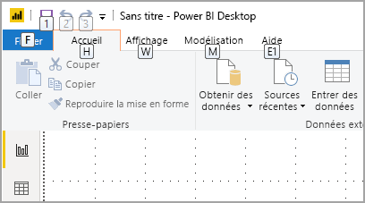
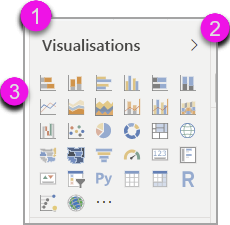
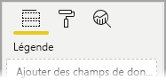
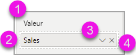
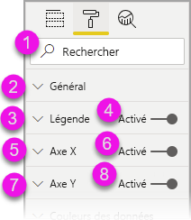
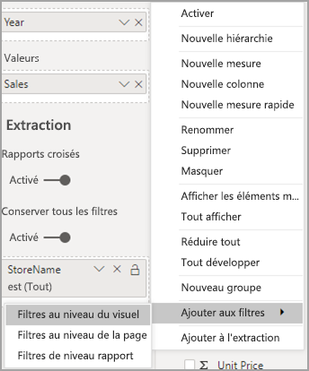
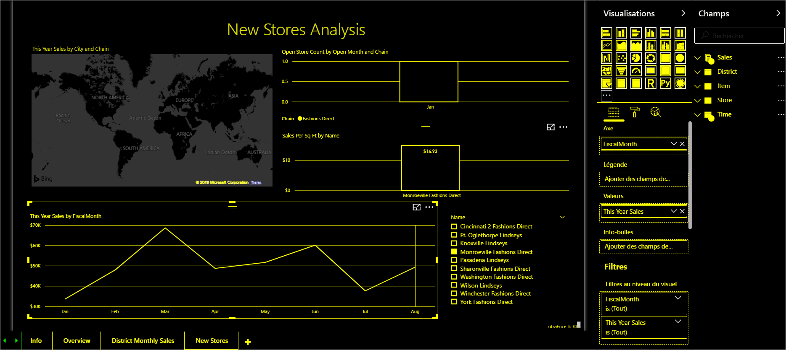

# Création de rapports dans Power BI avec des outils d’accessibilité

Pour les créateurs de rapports qui utilisent des outils d’accessibilité pour créer des rapports, Power BI dispose de nombreuses fonctionnalités intégrées qui peuvent aider dans le processus.

Cet article décrit les nombreux types d’outils d’accessibilité disponibles pour les créateurs de rapports dans Power BI Desktop.

## Navigation au niveau de l’application
Lorsque vous naviguez dans Power BI Desktop, vous pouvez déplacer le focus vers les principales zones de l’application en appuyant sur **Ctrl+F6**. La progression du focus dans la principale zone de Power BI Desktop s’effectue dans l’ordre suivant :

1. Objets sur le canevas
2. Onglets des pages
3. Volets (chacun séparément, de gauche à droite pour tous ceux qui sont ouverts)
4. Navigateur de vues
5. Pied de page
6. Se connecter
7. Barre d’avertissement (icône jaune), d’erreur et de mises à jour

Dans la plupart des cas, l’utilisation de la touche **Entrée** pour sélectionner ou ouvrir une zone et de la touche **Échap** pour quitter sont des procédures courantes dans Power BI.

## Navigation dans le ruban

Appuyez sur **Alt** pour voir les petites cases appelées *touches d’accès* sur chaque commande disponible dans la vue active du ruban. Vous pouvez ensuite appuyer sur la lettre affichée dans la *touche d’accès* qui pointe sur la commande que vous souhaitez utiliser. 

Par exemple, dans l’image suivante, la touche **Alt** a été enfoncée pour afficher les touches d’accès, qui contiennent les lettres pour les commandes accessibles disponibles. En appuyant ensuite sur **M**, vous ouvrez l’onglet **Modélisation** sur le ruban.

Selon la lettre sur laquelle vous appuyez, vous pouvez voir des touches d’accès supplémentaires. Par exemple, si l’onglet **Accueil** est actif et que vous appuyez sur **W**, l’onglet **Vue** s’affiche avec les touches d’accès associées aux groupes dans cet onglet de ruban **Vue**. Vous pouvez continuer d’appuyer sur les lettres affichées dans les touches d’accès jusqu’à ce que vous appuyiez sur la lettre de la commande spécifique que vous souhaitez utiliser. Pour passer à l’ensemble précédent de touches d’accès, appuyez sur **Échap**. Pour annuler l’action que vous effectuez et masquer les touches d’accès, appuyez sur la touche **Alt**.

## Navigation dans le volet des visuels

Pour naviguer dans le volet **Visualisations**, vous devez d’abord vous assurer que votre focus se trouve dans le volet, en appuyant sur **Ctrl+F6** jusqu’à ce que vous l’atteigniez. Quand un utilisateur navigue dans le volet des visualisations, le focus se place d’abord sur l’en-tête. En commençant par le haut, l’ordre de tabulation est le suivant et est illustré dans l’image suivante :

1. Titre d’en-tête
2. Carat Développer/Réduire
3. Icône du premier visuel

Lorsque vous arrivez aux visuels, vous pouvez utiliser les touches de direction pour accéder à un visuel particulier, puis appuyer sur **Entrée** pour le sélectionner. Si vous utilisez un lecteur d’écran, il indique si vous avez créé un graphique et son type, ou si vous avez changé un graphique d’un type particulier en un autre type de graphique. 

Après la section des visuels du volet, l’ordre de focus passe ensuite aux champs dynamiques du volet, comme illustré dans l’image suivante.

Lorsque le focus se trouve sur les champs dynamiques du volet, la tabulation se place uniquement sur l’icône du volet sélectionné. Pour basculer vers d’autres volets, utilisez les touches de direction.

## Zone Champ

Lorsque le focus se trouve sur les champs dynamiques du volet, comme décrit dans la section précédente, le fait d’appuyer à nouveau sur la touche Tab permet d’avancer le focus jusqu’à la **zone Champ**. 

Dans la **zone Champ**, l’ordre de focus devient :

* titre de chaque zone (en premier)
* suivi d’un champ donné dans chaque zone (ensuite)
* puis le bouton de liste déroulante pour ouvrir le menu du champ (après cela)
* enfin le bouton de suppression (en dernier)

L’image suivante montre cet ordre de progression du focus.

Un lecteur d’écran lit le nom de la zone et son info-bulle. Pour chaque champ dans une zone, un lecteur d’écran lit le nom du champ et son info-bulle. Si une zone est vide, le focus doit se déplacer vers l’intégralité de la zone vide. Le lecteur d’écran doit lire le nom de la zone et l’info-bulle, et indiquer qu’elle est vide.

Lorsque le menu du champ est ouvert, vous pouvez le parcourir à l’aide de **Tab** ou **Maj+Tab** ou des touches **Flèche vers le haut** / **Flèche vers le bas**. Un lecteur d’écran indique les noms des options.

Si vous souhaitez déplacer un champ d’un compartiment de la zone Champ vers un autre compartiment, vous pouvez utiliser le clavier, puis l’option **Déplacer vers** dans le menu de la zone Champ, comme illustré dans l’image suivante.

## Volet de mise en forme

L’ordre de focus du volet de **mise en forme** est établi de haut en bas, dans l’ordre des cartes. Le focus passe sur le nom de la carte, suivi de son bouton bascule **Activer/Désactiver**, s’il existe. Lorsque le focus est sur le nom de la carte, un lecteur d’écran lit le nom de la carte et indique si la carte est développée ou réduite. Vous pouvez appuyer sur **Entrée** pour développer ou réduire la carte. La touche **Entrée** fonctionne également pour **Activer** ou **Désactiver** le bouton bascule.

Si une carte est ouverte, **Tab** parcourt les contrôles de la carte avant de passer à la carte suivante. Pour les contrôles d’une carte, un lecteur d’écran indique le titre, la valeur actuelle et le type de contrôle.  

## Navigation dans la liste Champs

Vous pouvez appuyer sur **Tab** pour naviguer dans la liste **Champs**. De même que pour le volet de mise en forme, si les tables sont réduites, l’ordre de focus est établi comme suit :

1. En-tête de liste **Champs**
2. Barre de recherche
3. Nom de chaque table

Pour développer toutes les tables de la zone **Champs**, appuyez sur **Alt+Maj+9**. Pour réduire toutes les tables, appuyez sur **Alt+Maj+1**. Pour développer une seule table, appuyez sur la touche **Flèche vers la droite**. Pour réduire une seule table, appuyez sur la touche **Flèche vers la gauche**. De même que pour le volet de mise en forme, si une table est développée, la tabulation et la navigation dans la liste Champs incluent les champs affichés. Un lecteur d’écran indique si vous avez développé ou réduit une table.

Vous pouvez cocher un champ en y accédant et en appuyant sur **Entrée**.   Un lecteur d’écran indique le champ sur lequel se trouve le focus et si le champ est coché ou non coché.

Les utilisateurs de la souris effectuent généralement un glisser-déposer des champs sur le canevas, ou sur les compartiments de filtres appropriés. Si vous souhaitez utiliser votre clavier, vous pouvez ajouter un champ à un compartiment de filtre en ouvrant le menu contextuel d’un champ en appuyant sur **Maj+F10**, en utilisant les touches de direction pour accéder à **Ajouter aux filtres**, puis en appuyant sur **Entrée** sur le type de filtre auquel vous souhaitez ajouter le champ.

## Navigation dans le volet Sélection
Le volet **Sélection** présente la progression d’ordre de focus suivante :

1. Titre d’en-tête
2. Bouton Quitter
3. Sélecteur de l’ordre de tabulation/des couches
4. Bouton Monter dans la couche
5. Bouton Descendre dans la couche
6. Bouton Afficher
7. Bouton Masquer
8. Objets

Vous pouvez parcourir l’ordre de focus et appuyer sur **Entrée** pour sélectionner l’élément qui vous intéresse.  

Lorsque vous accédez au sélecteur de l’ordre de tabulation/des couches, utilisez les touches de direction gauche et droite pour basculer entre l’ordre des couches et l’ordre de tabulation.

Lorsque vous accédez aux objets dans le volet **Sélection**, appuyez sur **F6** pour activer le volet **Sélection**. Après avoir activé le volet **Sélection**, vous pouvez utiliser les touches Flèche vers le haut et Flèche vers le bas pour accéder aux différents objets dans le volet **Sélection**.
Une fois que vous avez accédé à un objet qui vous intéresse, vous pouvez effectuer différentes actions :

* Appuyez sur **Ctrl+Maj+S** pour masquer/afficher un objet
* Appuyez sur **Ctrl+Maj+F** pour monter un objet dans l’ordre des couches
* Appuyez sur **Ctrl+Maj+B** pour descendre un objet dans l’ordre des couches
* Appuyez sur **Ctrl+Espace** pour sélectionner plusieurs objets

## Boîtes de dialogue Power BI Desktop

Toutes les boîtes de dialogue de Power BI Desktop sont accessibles par le biais de la navigation au clavier et fonctionnent avec les lecteurs d’écran.

Dans Power BI Desktop, les boîtes de dialogue sont notamment :

* Boîte de dialogue Mesures rapides
* Boîte de dialogue Conditional Formatting & data bars (Mise en forme conditionnelle et barres de données)
* Boîte de dialogue Explorateur Q&R
* Boîte de dialogue Bien démarrer
* Boîte de dialogue Menu fichier et À propos
* Barre d’avertissement
* Boîte de dialogue Restaurer le fichier
* Boîte de dialogue Smileys

## Prise en charge du contraste élevé

Lorsque vous utilisez les modes de contraste élevé dans Windows, ces paramètres et la palette que vous sélectionnez sont également appliqués aux rapports dans Power BI Desktop.

Power BI Desktop détecte automatiquement le thème à contraste élevé que Windows utilise et applique ces paramètres à vos rapports. Ces couleurs à contraste élevé suivent le rapport quand celui-ci est publié sur le service Power BI, ou ailleurs.

## Étapes suivantes

Voici la liste des articles dédiés à l’accessibilité dans Power BI :

* [Vue d’ensemble de l’accessibilité dans Power BI](desktop-accessibility-overview.md) 
* [Création de rapports Power BI accessibles](desktop-accessibility-creating-reports.md) 
* [Consommation des rapports dans Power BI avec les outils d’accessibilité](desktop-accessibility-consuming-tools.md)
* [Raccourcis clavier d’accessibilité pour les rapports Power BI](desktop-accessibility-keyboard-shortcuts.md)
* [Liste de vérification de l’accessibilité des rapports](desktop-accessibility-creating-reports.md#report-accessibility-checklist)

