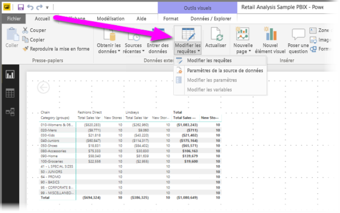
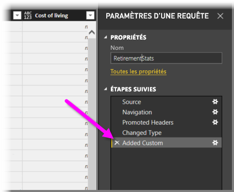
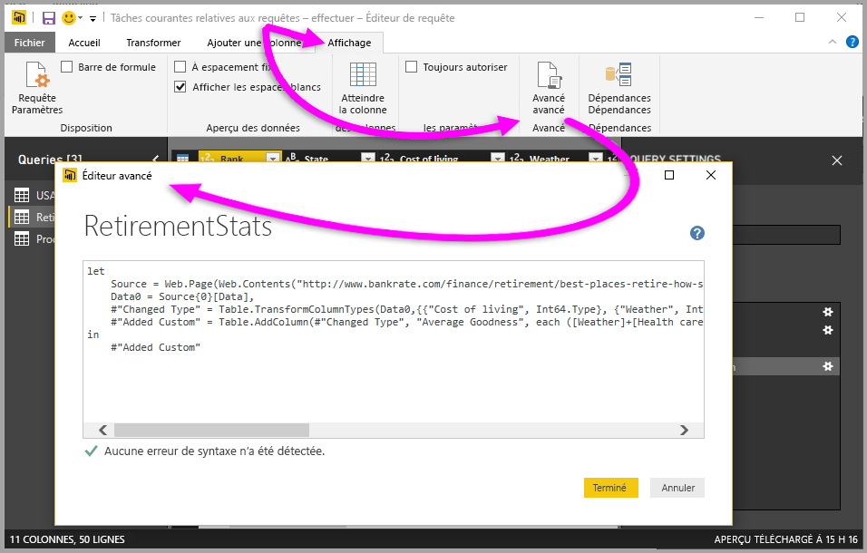

# Ajouter une colonne personnalisée dans Power BI Desktop

Dans Power BI Desktop, vous pouvez facilement ajouter une nouvelle colonne personnalisée de données à votre modèle avec l’Éditeur de requête. Avec l’Éditeur de requête, vous créez et renommez votre colonne personnalisée pour créer des [requêtes de formule Power Query M](https://docs.microsoft.com/powerquery-m/quick-tour-of-the-power-query-m-formula-language) de façon à définir votre colonne personnalisée. Les requêtes de formule Power Query M ont un [ensemble de contenus de référence de fonctions complet](https://docs.microsoft.com/powerquery-m/power-query-m-function-reference). 

Quand vous créez une colonne personnalisée dans l’Éditeur de requête, Power BI Desktop l’ajoute en tant qu’**Étape appliquée** dans les **Paramètres de requête** de la requête. Elle peut être changée, déplacée ou modifiée à tout moment.

## Utiliser l’Éditeur de requête pour ajouter une colonne personnalisée

Pour commencer à créer une colonne personnalisée, effectuez ces étapes :

1. Lancez Power BI Desktop et chargez des données.

2. Sous l’onglet **Accueil** du ruban, sélectionnez **Modifier les requêtes**, puis sélectionnez **Modifier les requêtes** dans le menu.

   

   La fenêtre **Éditeur de requête** apparaît. 

2. Sous l’onglet **Ajouter une colonne** du ruban, sélectionnez **Colonne personnalisée**.

   

   La fenêtre **Ajouter une colonne personnalisée** apparaît.

## Fenêtre Ajouter une colonne personnalisée

La fenêtre **Ajouter une colonne personnalisée** comporte a les fonctionnalités suivantes : 
- Une liste des colonnes disponibles, dans la liste **Colonnes disponibles** à droite.

- Le nom initial de votre colonne personnalisée, dans la zone **Nouveau nom de colonne**. Vous pouvez renommer cette colonne.

- Des [requêtes de formule Power Query M](https://docs.microsoft.com/powerquery-m/power-query-m-function-reference), dans la zone **Formule de colonne personnalisée**. Vous créez ces requêtes en produisant la formule sur laquelle votre nouvelle colonne personnalisée est définie. 

   

## Créer des formules pour votre colonne personnalisée

1. Sélectionnez une colonne dans la liste **Colonnes disponibles** à droite, puis sélectionnez **Insérer** sous la liste pour l’ajouter à la formule de la colonne personnalisée. Vous pouvez également ajouter une colonne en double-cliquant sur celle-ci dans la liste.

2. À mesure que vous entrez la formule et que vous produisez votre colonne, notez l’indicateur en bas de la fenêtre **Ajouter une colonne personnalisée**. 

   S’il n’y a pas d’erreurs, vous voyez une coche verte et le message *Aucune erreur de syntaxe n’a été détectée*.

   

   En cas d’erreur de syntaxe, vous voyez une icône d’avertissement jaune s’affiche ainsi qu’un lien vers l’emplacement où l’erreur s’est produite dans votre formule.

   

3. Sélectionnez **OK**. 

   Power BI Desktop ajoute votre colonne personnalisée au modèle, puis ajoute l’étape **Personnalisée ajoutée** à la liste **Étapes appliquées** de votre requête dans **Paramètres d’une requête**.

   

4. Pour modifier votre colonne personnalisée, double-cliquez sur l’étape **Personnalisée ajoutée** dans la liste **Étapes appliquées**. 

   La fenêtre **Ajouter une colonne personnalisée** apparaît avec la formule de colonne personnalisée que vous avez créée.

## Utiliser l’Éditeur avancé pour les colonnes personnalisées

Une fois que vous avez créé votre requête, vous pouvez aussi utiliser l’**Éditeur avancé** pour modifier une étape de votre requête. Pour cela, procédez comme suit :

1. Dans la fenêtre **Éditeur de requête**, sélectionnez l’onglet **Afficher** sur le ruban. 

2. Sélectionnez **Éditeur avancé**.

   La page **Éditeur avancé** apparaît, qui vous donne un contrôle total sur votre requête. 

   

   
## Étapes suivantes

- Vous pouvez créer une colonne personnalisée de plusieurs autres façons, comme en créant une colonne basée sur des exemples que vous fournissez à l’Éditeur de requête. Pour plus d’informations, consultez [Ajouter une colonne à partir d’un exemple dans Power BI Desktop](desktop-add-column-from-example.md).

- Pour obtenir des informations de référence sur Power Query M, consultez [Informations de référence sur les fonctions Power Query M](/powerquery-m/power-query-m-function-reference).

