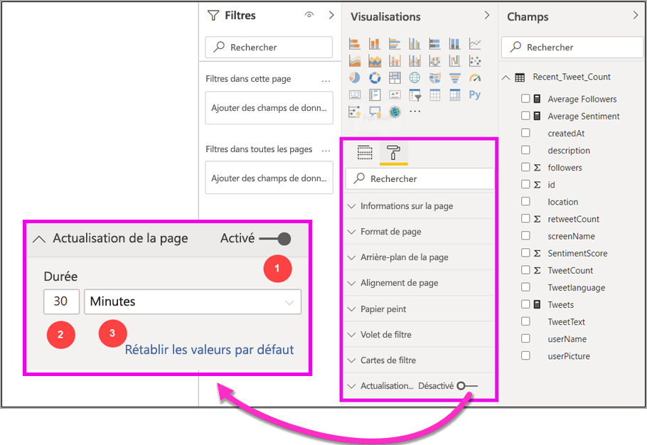
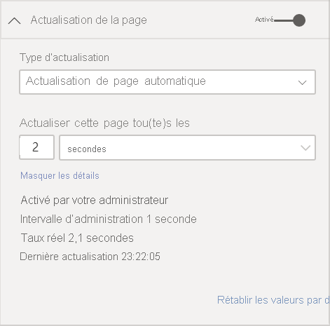
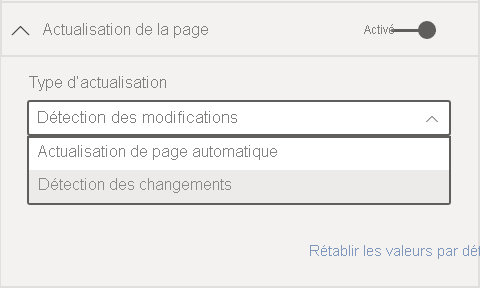
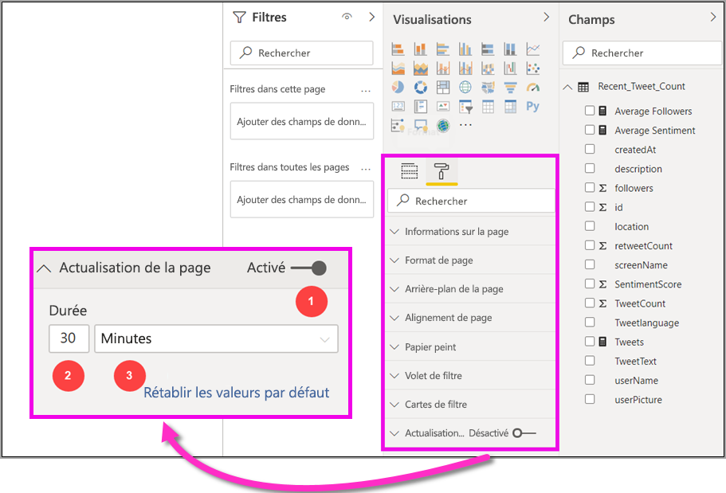

# Actualisation automatique des pages dans Power BI Desktop 

Lors de la surveillance des événements critiques, il est important que les données soient actualisées dès que les données sources sont mises à jour. Par exemple, dans le secteur de la fabrication, il est essentiel de savoir quand un ordinateur ne fonctionne pas correctement ou est sur le point de connaître une défaillance.

La fonctionnalité d’actualisation automatique de la page de Power BI permet à votre page de rapport active de rechercher de nouvelles données, à une cadence prédéfinie, pour les sources [DirectQuery](https://docs.microsoft.com/power-bi/desktop-directquery-about).

## Utilisation de l’actualisation automatique de la page

L’actualisation automatique de la page est disponible uniquement pour les sources de données DirectQuery.

Pour utiliser l’actualisation automatique de la page, sélectionnez la page de rapport pour laquelle vous souhaitez activer l’actualisation. Dans le volet **Visualisations**, sélectionnez le bouton **Mise en forme** (un rouleau de peinture) et recherchez **Actualisation de la page** en bas du volet. 

L’image suivante montre la carte **Actualisation de la page**. Les éléments numérotés sont décrits après l’image.

1.    Active ou désactive l’actualisation de la page
2.    Valeur numérique de l’intervalle d’actualisation de la page
3.    Unité pour l’intervalle d’actualisation de la page

Sur cette carte, vous pouvez activer l’actualisation de la page et sélectionner la durée d’actualisation. La valeur par défaut est 30 minutes. (L’intervalle d’actualisation minimal est d’une seconde.) Votre rapport commence à s’actualiser à l’intervalle que vous avez défini. 

## Détermination de l’intervalle d’actualisation de la page

Lorsque l’actualisation automatique de la page est activée, Power BI Desktop envoie en permanence des requêtes à votre source DirectQuery. Il y aura un délai entre l’envoi de la requête et l’obtention des données renvoyées. Par conséquent, pour des intervalles d’actualisation courts, vous devez vérifier que les requêtes renvoient correctement les données interrogées dans l’intervalle configuré. Si les données ne sont pas retournées dans l’intervalle, les objets visuels seront mis à jour moins fréquemment que ceux configurés.

En guise de meilleure pratique, l’intervalle d’actualisation doit être au moins identique à celui attendu pour le taux d’arrivée de nouvelles données :

* Si de nouvelles données arrivent à la source toutes les 20 minutes, votre intervalle d’actualisation ne peut pas être inférieur à 20 minutes. 

* Si de nouvelles données arrivent chaque seconde, définissez l’intervalle sur une seconde. 

Pour les intervalles d’actualisation faibles comme une seconde, prenez en considération les facteurs suivants :
- Le type de la source de données DirectQuery
- La charge que vos requêtes créent
- La distance entre les observateurs de vos rapports et le centre de données de la capacité 

Vous pouvez estimer les temps de retour à l’aide de l’analyseur de performances dans Power BI Desktop. L’analyseur de performances vous permet de vérifier si chaque requête visuelle a suffisamment de temps pour revenir avec les résultats de la source. Il vous permet également de déterminer où le temps est passé. En fonction des résultats de l’analyseur de performances, vous pouvez ajuster la source de données, ou vous pouvez faire des essais avec d’autres visuels et mesures dans votre rapport.

Cette image montre les résultats d’une DirectQuery dans l’analyseur de performances :

Examinons d’autres caractéristiques de cette source de données : 

-    Les données arrivent avec un rythme de 2 secondes. 
-    L’analyseur de performances affiche un temps maximal de requête + affichage d’environ 4,9 secondes (4 688 millisecondes). 
-    La source de données est configurée pour gérer environ 1 000 requêtes simultanées par seconde. 
-    Environ 10 utilisateurs peuvent afficher le rapport simultanément.

Il en découle l’équation suivante :

**5 visuels x 10 utilisateurs = environ 50 requêtes**

Le résultat de ce calcul indique une charge bien supérieure à celle que la source de données peut prendre en charge. Les données arrivent à un rythme de deux secondes, ce qui doit être votre taux d’actualisation. Toutefois, étant donné que l’exécution de la requête prend environ cinq secondes, vous devez la définir sur plus de cinq secondes. 

Notez également que ce résultat peut différer lorsque vous publiez votre rapport sur le service. Cette différence est due au fait que le rapport utilisera l’instance Azure Analysis Services hébergée dans le cloud. Vous souhaiterez peut-être ajuster vos taux d’actualisation en conséquence. 

Pour prendre en compte les requêtes et la cadence de l’actualisation, Power BI exécute uniquement la requête d’actualisation suivante lorsque toutes les requêtes d’actualisation restantes sont terminées. Par conséquent, même si l’intervalle d’actualisation est plus faible que le temps de traitement de vos requêtes, Power BI n’est actualisé qu’une fois les requêtes restantes terminées. 

Voyons ensuite comment vous pouvez potentiellement détecter et diagnostiquer les problèmes de performances en tant qu’administrateur de capacité. Vous pouvez également consulter la section [Forum Aux Questions](#frequently-asked-questions), plus loin dans cet article, pour voir des questions et des réponses sur les performances et la résolution des problèmes.

## Actualisation automatique de la page dans le service Power BI

Vous pouvez également définir des intervalles d’actualisation automatique de la page pour les rapports qui ont été créés dans Power BI Desktop et qui sont publiés dans le service Power BI. 

Pour configurer l’actualisation automatique des pages pour les rapports dans le service Power BI, vous utilisez des étapes similaires à celles que vous utiliseriez dans Power BI Desktop. Quand elle est configurée dans le service Power BI, l’actualisation automatique des pages prend aussi en charge le contenu [Power BI incorporé](../developer/embedded/embedding.md). Cette illustration montre la configuration **d’actualisation de la page** pour le service Power BI :

Ces descriptions correspondent aux éléments numérotés : 

1.    Active ou désactive l’actualisation des pages.
2.    Valeur numérique de l’intervalle d’actualisation de la page. Doit être un nombre entier.
3.    Unité pour l’intervalle d’actualisation de la page.

### Intervalles d’actualisation de la page

Les intervalles d’actualisation de la page autorisés dans le service Power BI sont affectés par le type d’espace de travail du rapport. Cela s’applique à ces rapports :

* Publication d’un rapport dans un espace de travail pour lequel l’actualisation automatique de la page est activée
* Modification d’un intervalle d’actualisation de page se trouvant déjà dans un espace de travail
* Création d’un rapport directement dans le service

Power BI Desktop n’a aucune restriction pour les intervalles d’actualisation. Son intervalle d’actualisation peut être aussi fréquent que chaque seconde. Mais lorsque les rapports sont publiés sur le service Power BI, certaines restrictions s’appliquent. Ces restrictions sont décrites dans les sections suivantes.

### Restrictions sur les intervalles d’actualisation

Dans le service Power BI, des restrictions d’actualisation automatique de la page s’appliquent en fonction de facteurs tels que l’espace de travail et l’utilisation ou non de services Premium.

Pour clarifier le fonctionnement de ces restrictions, commençons par des informations générales sur les capacités et les espaces de travail.

Les *capacités* sont un concept important de Power BI. Elles représentent un ensemble de ressources (stockage, processeur et mémoire) utilisées pour héberger et distribuer du contenu Power BI. Les capacités sont partagées ou dédiées. Une *capacité partagée* est partagée avec d’autres clients Microsoft. Une *capacité dédiée* est entièrement réservée pour un seul client. Pour une présentation des capacités dédiées, consultez [Gérer les capacités Premium](../admin/service-premium-capacity-manage.md).

Dans une capacité partagée, les charges de travail s’exécutent sur des ressources de calcul partagées avec d’autres clients. Étant donné que la capacité doit partager des ressources, des restrictions sont imposées pour s’assurer d’une *utilisation juste*, par exemple avec la définition d’une taille de modèle maximale (1 Go) et d’une fréquence d’actualisation quotidienne maximale (huit fois par jour).

Les *espaces de travail* Power BI résident sur des capacités. Ils représentent des conteneurs de sécurité, de collaboration et de déploiement. Chaque utilisateur Power BI dispose d’un espace de travail personnel nommé **Mon espace de travail**. Vous pouvez créer d’autres espaces pour permettre la collaboration et le déploiement. Ils sont appelés *espaces de travail*. Par défaut, les espaces de travail, qui incluent également les espaces de travail personnels, sont créés dans une capacité partagée.

Voici quelques détails sur les deux scénarios d’espace de travail :

**Espaces de travail partagés**. Pour les espaces de travail standard (les espaces de travail qui ne font pas partie d’une capacité Premium), l’actualisation automatique de la page a un intervalle minimal de 30 minutes (l’intervalle le plus bas autorisé).

**Espaces de travail Premium**. La disponibilité de l’actualisation automatique de la page dans les espaces de travail Premium dépend des paramètres de charge de travail que votre administrateur Premium a configurés pour la capacité Power BI Premium. Il existe deux variables qui peuvent affecter votre capacité à configurer l’actualisation automatique de la page :

 - **Fonctionnalité activée/désactivée**. Si votre administrateur de capacité a désactivé la fonctionnalité, vous ne pourrez pas configurer le type d’actualisation de page dans votre rapport publié.

 - **Intervalle minimal d’actualisation**. Lors de l’activation de la fonctionnalité, votre administrateur de capacité doit configurer un intervalle d’actualisation minimal. Si votre intervalle est inférieur au minimum, le service Power BI remplace votre intervalle pour respecter l’intervalle minimal défini par votre administrateur de capacité. Ce remplacement est appelé Remplacement par l’administrateur de capacité dans le tableau suivant. 

Ce tableau décrit de façon plus détaillée où cette fonctionnalité est disponible, et les limites de chaque type de capacité et du [mode de stockage](../connect-data/service-dataset-modes-understand.md) :

| Mode de stockage | Capacité dédiée | Capacité partagée |
| --- | --- | --- |
| DirectQuery | **Prise en charge** : Oui  **Intervalle minimal d’actualisation** : 1 seconde  **Remplacement par l’administrateur de capacité** : Oui | **Prise en charge** : Oui  **Intervalle minimal d’actualisation** : 30 minutes  **Remplacement par l’administrateur de capacité** : Non |
| Importer | **Prise en charge** : Non  **Intervalle minimal d’actualisation** : N/A  **Remplacement par l’administrateur de capacité** : N/A | **Prise en charge** : Non  **Intervalle minimal d’actualisation** : N/A  **Remplacement par l’administrateur de capacité** : N/A |
| Mode mixte (DirectQuery + autres sources de données) | **Prise en charge** : Oui  **Intervalle minimal d’actualisation** : 1 seconde  **Remplacement par l’administrateur de capacité** : Oui | **Prise en charge** : Oui  **Intervalle minimal d’actualisation** : 30 minutes  **Remplacement par l’administrateur de capacité** : Non |
| Live Connect AS | **Prise en charge** : Non  **Intervalle minimal d’actualisation** : N/A  **Remplacement par l’administrateur de capacité** : N/A | **Prise en charge** : Non  **Intervalle minimal d’actualisation** : N/A  **Remplacement par l’administrateur de capacité** : N/A |
| Live Connect PBI | **Prise en charge** : Non  **Intervalle minimal d’actualisation** : N/A  **Remplacement par l’administrateur de capacité** : N/A | **Prise en charge** : Non  **Intervalle minimal d’actualisation** : N/A  **Remplacement par l’administrateur de capacité** : N/A |

> [!NOTE]
> Lors de la publication de votre rapport avec actualisation automatique de la page de Power BI Desktop vers le service, vous devez fournir les informations d’identification de la source de données DirectQuery dans le menu de paramètres du jeu de données.

## Considérations et limitations

Il y a quelques éléments à prendre en compte lors de l’utilisation de l’actualisation automatique de la page, dans Power BI Desktop ou dans le service Power BI :

* Les modes de stockage Importer, Connexion active et Push ne sont pas pris en charge pour l’actualisation automatique de la page.  
* Les modèles composites qui ont au moins une source de données DirectQuery sont pris en charge.
* Power BI Desktop n’a aucune restriction pour les intervalles d’actualisation. L’intervalle d’actualisation peut être aussi fréquent que chaque seconde. Lorsque les rapports sont publiés sur le service Power BI, certaines restrictions s’appliquent, comme décrit [précédemment](#restrictions-on-refresh-intervals) dans cet article.
* L’incorporation de SharePoint Online ne prend pas en charge l’actualisation automatique des pages.

### Diagnostics des performances

L’actualisation automatique de la page est utile pour la surveillance des scénarios et l’exploration de données évoluant rapidement. Toutefois, cela peut parfois entraîner une charge excessive sur la capacité ou la source de données.

Pour éviter une charge excessive sur les sources de données, Power BI utilise ces protections :

- Toutes les requêtes d’actualisation automatique de la page s’exécutent avec une priorité inférieure pour s’assurer que les requêtes interactives (comme le chargement de la page et le filtrage croisé des visuels) restent prioritaires.
- Si une requête n’est pas terminée avant le prochain cycle d’actualisation, Power BI n’émet pas de nouvelles requêtes d’actualisation tant que la requête précédente n’est pas terminée. Par exemple, si vous avez un intervalle d’actualisation d’une seconde, et que vos requêtes prennent en moyenne quatre secondes, Power BI émet réellement une requête toutes les quatre secondes.

Il existe deux facteurs qui peuvent constituer des goulots d’étranglement des performances :

1. **La capacité**. La requête atteint d’abord la capacité Premium, qui replie et évalue la requête DAX générée à partir des visualisations de rapport dans les requêtes source.
2. **La source de données DirectQuery**. Les requêtes traduites à l’étape précédente sont ensuite exécutées sur la source. La source correspond à vos instances SQL Server, aux sources SAP Hana, etc.

À l’aide de [l’application Premium Capacity Metrics](../admin/service-admin-premium-monitor-capacity.md) disponible pour les administrateurs, vous pouvez visualiser la quantité de capacité utilisée par les requêtes de faible priorité.

Les requêtes de faible priorité consistent en des requêtes d’actualisation automatique de la page et des requêtes d’actualisation du modèle. Il n’existe actuellement aucun moyen de faire la distinction entre les charges des requêtes d’actualisation automatique de page et celles d’actualisation de modèle.

Si vous remarquez que la capacité est surchargée avec des requêtes de faible priorité, vous pouvez prendre certaines mesures :

- Demandez une référence SKU Premium plus grande.
- Demandez au propriétaire du rapport de réduire l’intervalle d’actualisation.
- Dans le portail d’administration de la capacité, vous pouvez :
   - Désactiver l’actualisation automatique de la page pour cette capacité.
   - Augmenter l’intervalle d’actualisation minimal, qui affectera tous les rapports sur cette capacité.

### Forum Aux Questions

**Je suis un auteur de rapport. J’ai défini l’intervalle d’actualisation de mon rapport sur une seconde sur Power BI Desktop, mais après la publication, mon rapport n’est pas actualisé dans le service.**

* Vérifiez que l’actualisation automatique de la page est activée pour la page. Étant donné que ce paramètre est propre à chaque page, vous devez vous assurer qu’il est activé pour chaque page du rapport que vous voulez actualiser.
* Vérifiez que vous avez téléchargé sur un espace de travail avec une capacité Premium attachée. Si vous ne l’avez pas fait, votre intervalle d’actualisation sera verrouillé sur 30 minutes.
* Si votre rapport se trouve dans un espace de travail Premium, demandez à votre administrateur si cette fonctionnalité est activée pour la capacité attachée. En outre, assurez-vous que l’intervalle d’actualisation minimal pour la capacité est inférieur ou identique l’intervalle de votre rapport.

**Je suis administrateur de capacité. J’ai modifié les paramètres de l’intervalle d’actualisation automatique de la page, mais les modifications ne sont pas reflétées. En d’autres termes, les rapports ne sont toujours pas actualisés au rythme auquel ils devraient l’être ou ne s’actualisent pas, même si j’ai activé l’actualisation automatique de la page.**

* Les modifications apportées aux paramètres d’actualisation automatique de la page prennent jusqu’à 5 minutes pour se propager aux rapports.
* Outre l’activation de l’actualisation automatique de la page pour la capacité, vous devez également l’activer pour les pages des rapports de votre choix.

**Mon rapport fonctionne en mode mixte. (Le mode mixte signifie que le rapport a une connexion DirectQuery et une source de données d’importation.) Certains objets visuels ne sont pas actualisés.**

- Si vos éléments visuels référencent des tables d’importation, ce comportement est attendu. L’actualisation automatique des pages n’est pas prise en charge pour l’importation.
- Consultez la première question de cette section.

**Mon rapport s’actualisait dans le service quand il s’est arrêté soudainement.**

* Essayez d’actualiser la page pour voir si le problème se résout de lui-même.
* Vérifiez auprès de votre administrateur de capacité. L’administrateur a peut-être désactivé la fonctionnalité ou augmenté l’intervalle d’actualisation minimal. (Voir la deuxième question de cette section.)

**Je suis un auteur de rapport. Mes visuels ne sont pas actualisés à la cadence que j’ai indiquée. Ils sont actualisés à un rythme plus lent.**

* Si l’exécution de vos requêtes prend du temps, l’intervalle d’actualisation sera retardé. L’actualisation automatique de la page attend la fin de l’exécution de toutes les requêtes avant d’en exécuter de nouvelles.
* Votre administrateur de capacité a peut-être défini un intervalle d’actualisation minimal supérieur à celui que vous avez défini pour votre rapport. Demandez à votre administrateur de capacité de réduire l’intervalle d’actualisation minimal.

**Les requêtes d’actualisation de page automatique sont-elles traitées à partir du cache ?**

* Non. Toutes les requêtes d’actualisation automatique de la page contournent les données mises en cache.

## Étapes suivantes

Pour plus d’informations, consultez les articles suivants :

* [Utilisation de DirectQuery dans Power BI](../connect-data/desktop-directquery-about.md)
* [Utiliser des modèles composites dans Power BI Desktop](../transform-model/desktop-composite-models.md)
* [Utiliser l’analyseur de performances pour examiner les performances des éléments de rapport](desktop-performance-analyzer.md)
* [Déployer et gérer les capacités Power BI Premium](../guidance/whitepaper-powerbi-premium-deployment.md)
* [Sources de données dans Power BI Desktop](../connect-data/desktop-data-sources.md)
* [Mettre en forme et combiner des données dans Power BI Desktop](../connect-data/desktop-shape-and-combine-data.md)
* [Se connecter à des classeurs Excel dans Power BI Desktop](../connect-data/desktop-connect-excel.md)   
* [Entrer des données directement dans Power BI Desktop](../connect-data/desktop-enter-data-directly-into-desktop.md)   
