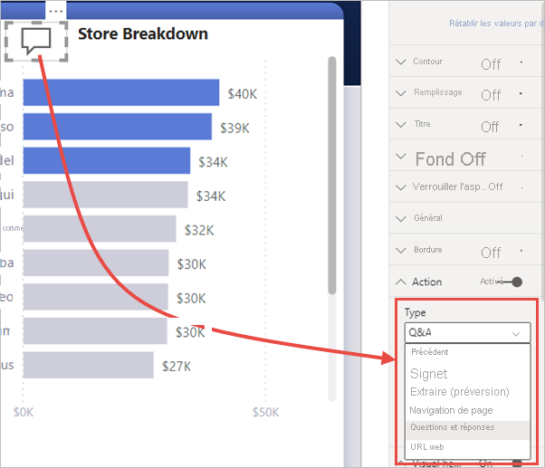

# Utiliser des boutons dans Power BI
En utilisant des **boutons** dans Power BI, vous pouvez créer des rapports qui se comportent comme des applications et donc créer un environnement plus interactif dans lequel les utilisateurs peuvent se déplacer, cliquer et interagir davantage avec le contenu Power BI. Vous pouvez ajouter des boutons aux rapports dans **Power BI Desktop** et dans le **service Power BI**. Lorsque vous partagez vos rapports dans le service Power BI, ils offrent une expérience de type application à vos utilisateurs.

## Créer des boutons dans les rapports

### Créer un bouton dans Power BI Desktop

Pour créer un bouton dans **Power BI Desktop**, dans le ruban **Insertion**, sélectionnez **Boutons**. Un menu déroulant apparaît, dans lequel vous pouvez sélectionner le bouton de votre choix dans une collection d’options, comme illustré ci-dessous. 

### Créer un bouton dans le service Power BI

Pour créer un bouton dans le **service Power BI**, ouvrez le rapport en mode Édition. Sélectionnez **Boutons** dans la barre de menus supérieure et un menu déroulant apparaît, dans lequel vous pouvez sélectionner le bouton de votre choix dans une collection d’options, comme illustré ci-dessous. 

## Personnaliser un bouton

Que vous créiez le bouton dans Power BI Desktop ou le service Power BI, le reste du processus est le même. Quand vous sélectionnez le bouton dans le canevas de rapport, le volet **Visualisations** vous montre les nombreuses façons dont vous pouvez personnaliser le bouton afin de répondre à vos besoins. Par exemple, vous pouvez activer ou désactiver **Texte du bouton** en actionnant le curseur dans la carte du volet **Visualisations**. Vous pouvez également changer l’icône du bouton, le remplissage du bouton, le titre et l’action effectuée quand les utilisateurs sélectionnent le bouton dans un rapport, entre autres propriétés.

## Définir les propriétés d’un bouton quand celui-ci est inactif, survolé ou sélectionné

Les boutons de Power BI présentent trois états : par défaut (comme ils apparaissent quand ils ne sont ni survolés ni sélectionnés), survolé ou sélectionné (souvent quand les utilisateurs *cliquent* dessus). Un grand nombre des cartes du volet **Visualisations** peuvent être modifiées individuellement en fonction de ces trois états, ce qui vous donne une grande souplesse pour personnaliser vos boutons.

Les cartes suivantes du volet **Visualisations** vous permettent d’ajuster la mise en forme ou le comportement d’un bouton en fonction de ses trois états :

* Texte du bouton
* Icône
* Contour
* Remplir

Pour sélectionner la manière dont le bouton doit apparaître pour chaque état, développez l’une de ces cartes et sélectionnez la liste déroulante qui apparaît en haut. Dans l’image suivante, vous voyez la carte **Icône** développée, avec la liste déroulante sélectionnée pour montrer les trois états.

## Sélectionner l’action d’un bouton

Vous pouvez sélectionner l’action à effectuer quand un utilisateur sélectionne un bouton dans Power BI. Vous pouvez accéder aux options des actions de bouton dans la carte **Action** du volet **Visualisations**.

Options des actions de bouton :

- **Précédent** renvoie l’utilisateur à la page précédente du rapport. Cela est utile pour les pages d’extraction.
- **Signet** présente la page de rapport qui est associée à un signet défini pour le rapport en cours. Apprenez-en davantage sur les [signets dans Power BI](desktop-bookmarks.md). 
- **Extraire** permet à l’utilisateur d’accéder à une page d’extraction filtrée en fonction de sa sélection, sans utiliser les signets. Apprenez-en davantage sur les [boutons d’extraction dans les rapports](desktop-drill-through-buttons.md).
- **Navigation entre les pages** permet à l’utilisateur d’accéder à une page différente dans le rapport, sans utiliser de signets. Consultez [Créer une navigation entre les pages](#create-page-navigation) dans cet article pour plus d’informations.
- **Q&R** ouvre une fenêtre **Explorateur Q&R**. 

Certains boutons ont une action par défaut sélectionnée automatiquement. Par exemple, le type de bouton **Questions et réponses** sélectionne automatiquement **Questions et réponses** comme action par défaut. Vous pouvez en savoir plus sur l’**Explorateur de Questions et réponses** en consultant [ce billet de blog](https://powerbi.microsoft.com/blog/power-bi-desktop-april-2018-feature-summary/#Q&AExplorer).

Vous pouvez essayer ou tester les boutons que vous créez pour votre rapport en utilisant *Ctrl + clic* sur le bouton que vous souhaitez utiliser. 

## Créer une navigation entre les pages

Avec le type d’**action** **Navigation entre les pages**, vous pouvez créer une expérience de navigation complète sans avoir à enregistrer ni gérer aucun signet.

Pour configurer un bouton de navigation entre les pages, créez un bouton avec **Navigation entre les pages** comme type d’action, puis sélectionnez la page **Destination**.

Vous pouvez créer un volet de navigation personnalisé et y ajouter des boutons de navigation. Vous évitez d’avoir à modifier et gérer les signets si vous souhaitez changer les pages à afficher dans votre volet de navigation.

En outre, vous pouvez mettre en forme de manière conditionnelle l’info-bulle, comme vous pouvez le faire avec d’autres types de bouton.

## Définir la destination de navigation de manière conditionnelle

Vous pouvez utiliser la mise en forme conditionnelle pour définir la destination de navigation, en fonction de la sortie d’une mesure. Par exemple, vous pourriez vouloir économiser de l’espace sur le canevas de rapport en faisant en sorte qu’un seul bouton permette d’accéder à différentes pages en fonction de la sélection de l’utilisateur.

:::image type="content" source="media/desktop-buttons/button-navigate-go.png" alt-text="Naviguer à l’aide d’un bouton Aller à":::
 
Pour créer l’exemple ci-dessus, commencez par créer une table à une seule colonne avec les noms des destinations de navigation :

:::image type="content" source="media/desktop-buttons/button-create-table.png" alt-text="Création d'une table":::

Power BI utilise une correspondance exacte de chaînes pour définir la destination d’extraction. Par conséquent, vérifiez que les valeurs entrées sont alignées exactement avec les noms de vos pages d’extraction.

Une fois que vous avez créé la table, ajoutez-la à la page en tant que segment à sélection unique :

:::image type="content" source="media/desktop-buttons/button-navigate-slicer.png" alt-text="Segment de navigation":::

Ensuite, créez un bouton de navigation entre les pages et sélectionnez l’option de mise en forme conditionnelle pour la destination :

:::image type="content" source="media/desktop-buttons/button-set-page-nav-destination.png" alt-text="Bouton de navigation de la page":::
 
Sélectionnez le nom de la colonne que vous avez créée. Dans ce cas, il s’agit de **Sélectionner une destination** :

:::image type="content" source="media/desktop-buttons/button-select-destination.png" alt-text="Sélectionner une destination":::

Désormais, le bouton peut donner accès à différentes pages, en fonction de la sélection de l’utilisateur.

:::image type="content" source="media/desktop-buttons/button-navigate-go.png" alt-text="Naviguer à l’aide d’un bouton Aller à":::
 
### Formes et images pour la navigation

L’action de navigation entre les pages est prise en charge pour les formes et les images, pas seulement pour les boutons. Voici un exemple d’utilisation de l’une des formes intégrées :

:::image type="content" source="media/desktop-buttons/button-navigation-arrow.png" alt-text="Utiliser une flèche pour la navigation":::
 
Voici un exemple utilisant une image :

:::image type="content" source="media/desktop-buttons/button-navigation-image.png" alt-text="Utiliser une image pour la navigation":::
 
## Les boutons prennent en charge les images de remplissage

Les boutons prennent en charge les images de remplissage. Vous pouvez personnaliser l’apparence de votre bouton à l’aide d’images de remplissage associées aux états de bouton prédéfinis : par défaut, au survol, à l’appui et désactivé (pour l’extraction).

:::image type="content" source="media/desktop-drill-through-buttons/drill-through-fill-images.png" alt-text="Images de remplissage du bouton d’extraction":::

Définissez **Remplissage** sur **Activé**, puis créez des images pour les différents états.

:::image type="content" source="media/desktop-drill-through-buttons/drill-through-fill-state-settings.png" alt-text="Paramètres de l’image de remplissage":::

## Étapes suivantes
Pour plus d’informations sur les fonctionnalités qui sont similaires ou pour interagir avec des boutons, consultez les articles suivants :

* [Utiliser l’extraction dans les rapports Power BI](desktop-drillthrough.md)
* [Utiliser des signets pour partager des insights et créer des récits dans Power BI](desktop-bookmarks.md)
* [Créer un bouton d’extraction](desktop-drill-through-buttons.md)

