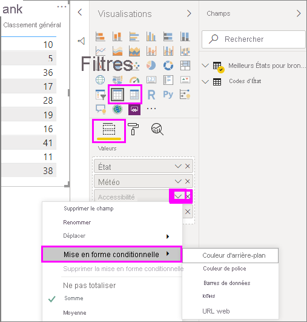
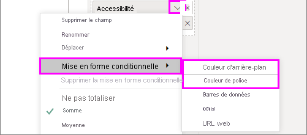
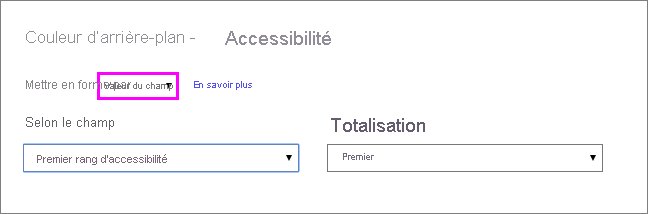

# Utiliser la mise en forme conditionnelle dans les tables 

La mise en forme conditionnelle des tableaux dans Power BI Desktop vous permet de spécifier des couleurs de cellules personnalisées, notamment des dégradés de couleurs, en fonction des valeurs de champs. Vous pouvez aussi représenter les valeurs des cellules avec des barres de données ou des icônes d’indicateurs de performance clés, ou en tant que liens web actifs. Vous pouvez appliquer une mise en forme conditionnelle à n’importe quel champ de texte ou de données, du moment que vous basez la mise en forme sur un champ qui contient une valeur numérique, un nom de couleur, un code hexadécimal ou des valeurs d’URL web. 

Pour appliquer une mise en forme conditionnelle, sélectionnez une visualisation **Table** ou **Matrice** dans Power BI Desktop. Dans la section **Champs** du volet **Visualisations**, sélectionnez ou cliquez avec le bouton droit sur la flèche vers le bas située en regard du champ du volet **Valeurs**  que vous voulez mettre en forme. Sélectionner **Mise en forme conditionnelle**, puis le type de mise en forme à appliquer.

> [!NOTE]
> La mise en forme conditionnelle remplace toute couleur d’arrière-plan ou de police personnalisée que vous appliquez à la cellule faisant l’objet de la mise en forme conditionnelle.

Pour supprimer la mise en forme conditionnelle d’une visualisation, sélectionnez **Supprimer la mise en forme conditionnelle** dans le menu déroulant du champ, puis choisissez le type de mise en forme à supprimer.

Les sections suivantes décrivent chaque option de mise en forme conditionnelle. Vous pouvez combiner plusieurs options dans une même colonne de table.

## Mettre en forme une couleur d’arrière-plan ou de police

Pour mettre en forme la couleur d’arrière-plan ou de police d’une cellule, sélectionnez **Mise en forme conditionnelle** pour un champ, puis choisissez **Couleur d’arrière-plan** ou **Couleur de police** dans le menu déroulant. 

La boîte de dialogue **Couleur d’arrière-plan** ou **Couleur de police** s’ouvre avec le nom du champ que vous mettez en forme en guise de titre. Après avoir sélectionné les options de mise en forme conditionnelle, sélectionnez **OK**. 

Les options **Couleur d’arrière-plan** et **Couleur de police** sont identiques, mais elles s’appliquent à la couleur d’arrière-plan et à la couleur de police de la cellule, respectivement. Vous pouvez appliquer une mise en forme conditionnelle identique ou différente à la couleur de police et à la couleur d’arrière-plan d’un champ. Si vous définissez la même couleur pour la police et l’arrière-plan d’un champ, la police se fondra dans l’arrière-plan, si bien que la colonne du tableau affichera uniquement les couleurs.

## Couleur par échelle de couleurs

Pour mettre en forme la couleur d’arrière-plan ou de police d’une cellule par échelle de couleurs, dans le champ **Mettre en forme par** de la boîte de dialogue **Couleur d’arrière-plan** ou **Couleur de police**, sélectionnez **Échelle de couleurs**. Sous **Basé sur le champ**, sélectionnez le champ sur lequel baser la mise en forme. Vous pouvez baser la mise en forme sur le champ actif ou sur n’importe quel autre champ de votre modèle contenant des données numériques ou de couleur. 

Sous **Résumé**, spécifiez le type d’agrégation que vous souhaitez utiliser pour le champ sélectionné. Sous **Mise en forme par défaut**, sélectionnez la mise en forme à appliquer aux valeurs vides. 

Sous **Minimum** et **Maximum**, indiquez si vous souhaitez appliquer le modèle de couleurs en fonction de la valeur de champ la plus basse et la plus élevée ou des valeurs personnalisées que vous entrez. Dans les listes déroulantes, sélectionnez les échantillons de couleurs que vous souhaitez appliquer aux valeurs minimale et maximale. Cochez la case **Divergent** pour spécifier également une valeur et une couleur pour le paramètre **Centre**. 

Voici un exemple de tableau dont la colonne **Affordability** présente une mise en forme d’arrière-plan avec une échelle de couleurs :

Ici, l’exemple de tableau présente une mise en forme de police avec une échelle de couleurs dans la colonne **Affordability** :

## Colorer selon des règles

Pour mettre en forme un arrière-plan de cellule ou une couleur de police selon des règles, dans le champ **Mettre en forme par** de la boîte de dialogue **Couleur d’arrière-plan** ou **Couleur de police**, sélectionnez **Règles**. Là encore, **Basé sur le champ** indique le champ sur lequel la mise en forme est basée, et **Résumé** indique le type d’agrégation pour le champ. 

Sous **Règles**, entrez une ou plusieurs plages de valeurs, puis définissez une couleur pour chacune d’elles. Chaque plage de valeurs présente une condition *Si la valeur*, une condition de valeur *et* et une couleur. Les arrière-plans ou polices de cellules de chaque plage de valeurs présentent la couleur définie. L’exemple suivant comporte trois règles :

Voici un exemple de tableau dont la colonne **Affordability** présente une mise en forme de couleur d’arrière-plan basée sur des règles  :

## Colorer selon des valeurs de couleur

Si vous avez un champ ou une mesure qui est associé à un nom de couleur ou à des données de valeur hexadécimale, vous pouvez utiliser la mise en forme conditionnelle pour appliquer automatiquement ces couleurs à la couleur d’arrière-plan ou de police d’une colonne. Vous pouvez aussi utiliser une logique personnalisée pour appliquer des couleurs à la police ou à l’arrière-plan.

Le champ peut utiliser n’importe quelle valeur de couleur figurant dans la spécification des couleurs CSS consultable à l’adresse [https://www.w3.org/TR/css-color-3/](https://www.w3.org/TR/css-color-3/). Ces valeurs de couleur peuvent inclure :
- Des codes hexadécimaux à 3, 6 ou 8 chiffres, par exemple #3E4AFF. Veillez à inclure le symbole # au début du code. 
- Des valeurs RVB ou RVBA, comme RGBA(234, 234, 234, 0.5).
- Des valeurs HSL ou HSLA, comme HSLA(123, 75%, 75%, 0.5).
- Des noms de couleurs, tels que Green, SkyBlue ou PeachPuff. 

Dans le tableau suivant, chaque État est associé à un nom de couleur : 

Pour mettre en forme la colonne **Color** en fonction des valeurs de ses champs, sélectionnez **Mise en forme conditionnelle** pour le champ **Color**, puis choisissez **Couleur d’arrière-plan** ou **Couleur de police**. 

Dans la boîte de dialogue **Couleur d’arrière-plan** ou **Couleur de police**, sélectionnez **Valeur du champ** dans le champ de liste déroulante **Mettre en forme par**.

Voici un exemple de tableau dont le champ **Color** présente une mise en forme **Couleur d’arrière-plan** basée sur la valeur du champ :

Si vous utilisez également **Valeur du champ** pour mettre en forme la **Couleur de police** de la colonne, la couleur de la colonne **Color** est unie :

## Couleur basée sur un calcul

Vous pouvez créer un calcul qui génère des valeurs qui varient en fonction des conditions de la logique métier que vous sélectionnez. Il est généralement plus rapide de créer une formule que de créer plusieurs règles dans la boîte de dialogue Mise en forme conditionnelle. 

Par exemple, la formule suivante applique des valeurs de couleur hexadécimales à une nouvelle colonne **Affordability rank**, en fonction des valeurs de la colonne existante **Affordability** :

Pour appliquer les couleurs, sélectionnez la mise en forme conditionnelle **Couleur d’arrière-plan** ou **Couleur de police** pour la colonne **Affordability**, puis basez la mise en forme sur la **Valeur du champ** de la colonne **Affordability rank**. 

Voici comment se présente l’exemple de tableau avec la couleur d’arrière-plan de la colonne **Affordability** qui est basée sur la colonne calculée **Affordability rank** :

Vous pouvez créer de nombreuses autres variantes en faisant simplement appel à votre imagination et à quelques calculs.

## Ajouter des barres de données

Pour afficher des barres de données en fonction des valeurs des cellules, sélectionnez **Mise en forme conditionnelle** pour le champ **Affordability**, puis choisissez **Barres de données** dans le menu déroulant. 

Dans la boîte de dialogue **Barres de données**, l’option **Afficher seulement la barre** est décochée par défaut : les cellules du tableau présentent donc à la fois les barres et les valeurs réelles. Pour afficher uniquement les barres de données, cochez la case **Afficher seulement la barre**.

Vous pouvez spécifier des valeurs minimales et maximales sous **Minimum** et **Maximum**, les couleurs et la direction de la barre de données ainsi que la couleur de l’axe. 

Une fois les barres de données appliquées à la colonne **Affordability**, voici comment se présente l’exemple de tableau :

## Ajouter des icônes

Pour afficher des icônes en fonction des valeurs des cellules, sélectionnez **Mise en forme conditionnelle** pour le champ, puis choisissez **Icônes** dans le menu déroulant. 

Dans la boîte de dialogue **icônes**, sous **Mettre en forme par**, sélectionnez **Règles** ou **Valeur du champ**. 

Pour une mise en forme par règles, sous **Basé sur le champ**, définissez les paramètres suivants : **Résumé**, **Disposition de l’icône**, **Alignement de l’icône**, **Style**, puis définissez une ou plusieurs **Règles**. Sous **Règles**, entrez une ou plusieurs règles avec une condition *Si la valeur* et une condition de valeur *et*, puis sélectionnez l’icône à appliquer à chaque règle. 

Pour une mise en forme par valeurs de champ, sous **Basé sur le champ**, définissez les paramètres **Résumé**, **Disposition de l’icône** et **Alignement de l’icône**.

Dans l’exemple suivant, les icônes sont ajoutées en fonction de trois règles :

Sélectionnez **OK**. Une fois les icônes appliquées à la colonne **Affordability** par règles, voici comment se présente l’exemple de tableau :

## Mettre en forme en tant qu’URL web

Si vous avez une colonne ou une mesure qui contient des URL de site web, vous pouvez utiliser la mise en forme conditionnelle pour appliquer ces URL à des champs sous forme de liens actifs. Par exemple, le tableau suivant contient une colonne **Website** dans laquelle figurent des URL de site web pour chaque État :

Pour afficher chaque nom d’État sous forme de lien dynamique vers le site web correspondant, sélectionnez **Mise en forme conditionnelle** pour le champ **State**, puis choisissez **URL web**. Dans la boîte de dialogue **URL web**, sous **Basé sur le champ**, sélectionnez **Site web**, puis **OK**. 

Une fois la mise en forme **URL web** appliquée au champ **State**, chaque nom d’État est un lien actif vers le site web correspondant. Dans l’exemple de tableau suivant, la mise en forme **URL web** est appliquée à la colonne **State**, et une mise en forme conditionnelle **Barres de données** et **Arrière-plan** est appliquée à la colonne **Affordability**. 

## Totaux et sous-totaux

À partir de la version d’avril 2020, il est possible d’appliquer des règles de mise en forme conditionnelle aux totaux et aux sous-totaux, pour les visuels de type tableau et matrice. 

Pour appliquer les règles de mise en forme conditionnelle, utilisez la liste déroulante **Appliquer à** dans la mise en forme conditionnelle, comme l’illustre l’image suivante.

Vous devez définir manuellement les seuils et les plages des règles de mise en forme conditionnelle. Dans le cas des matrices, les **Valeurs** font référence au niveau visible le plus bas de la hiérarchie.

## Considérations et limitations
Voici quelques éléments à prendre en considération quand vous utilisez la mis en forme conditionnelle de tableau :

- La mise en forme conditionnelle s’applique seulement aux valeurs des visuels Table ou Matrice et ne s’applique à aucune ligne de sous-total, de total général ou **Total**. 
- Les tableaux qui ne présentent aucun regroupement s’affichent sous forme de ligne unique qui ne prend pas en charge la mise en forme conditionnelle.
- Si vos données contiennent des valeurs *NAN*, vous ne pouvez pas appliquer une mise en forme de dégradé avec des valeurs maximales/minimales ni une mise en forme basée sur des règles de pourcentage. NAN signifie « n’est pas un nombre » ; cette erreur est le plus souvent causée par une division par zéro. Vous pouvez utiliser la [fonction DIVIDE() DAX](/dax/divide-function-dax) pour éviter ces erreurs.
- La mise en forme conditionnelle nécessite l’application d’une agrégation ou d’une mesure à la valeur. C’est la raison pour laquelle vous voyez « Premier » ou « Dernier » dans l’exemple **Couleur par valeur**. Si vous générez votre rapport à partir d’un cube multidimensionnel Analysis Services, vous ne pourrez pas utiliser d’attribut pour la mise en forme conditionnelle, sauf si le propriétaire du cube a créé une mesure qui fournit la valeur.

## Étapes suivantes

Pour plus d’informations sur la mise en forme des couleurs, consultez [Trucs et astuces pour la mise en forme des couleurs dans Power BI](../visuals/service-tips-and-tricks-for-color-formatting.md)