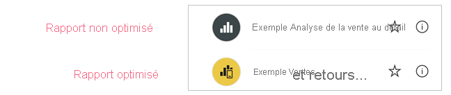
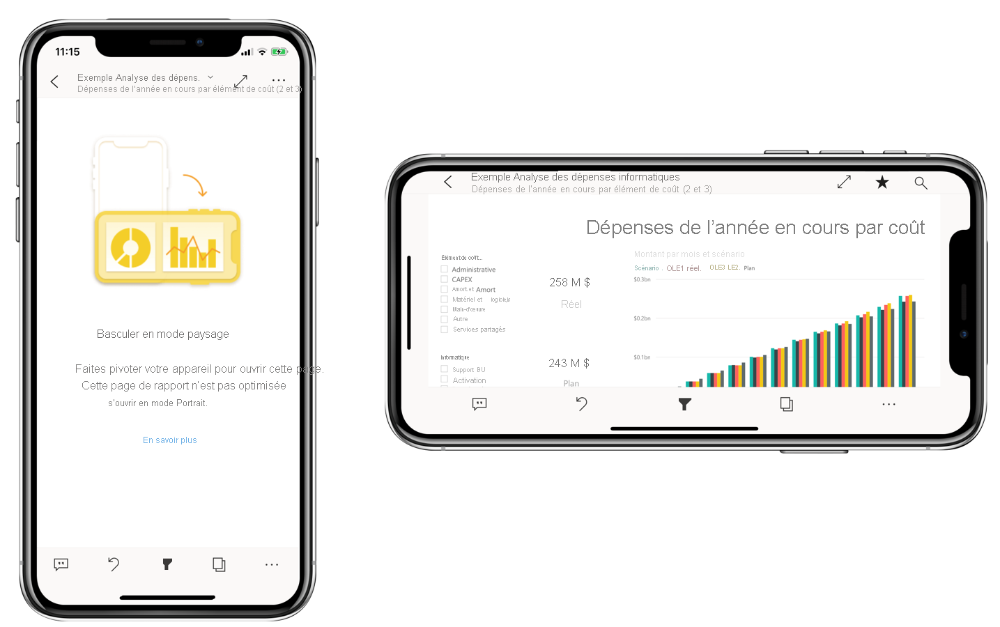

# Optimiser les rapports Power BI pour l’application mobile
Les utilisateurs mobiles peuvent afficher une page de rapport Power BI en orientation paysage. Toutefois, les auteurs de rapports peuvent créer une vue supplémentaire qui est optimisée pour les appareils mobiles et qui s’affiche en orientation portrait. Cette option de conception, disponible à la fois dans Power BI Desktop et dans le service Power BI, permet aux auteurs de sélectionner et de réorganiser uniquement les objets visuels qui ont un sens pour les utilisateurs mobiles en déplacement.

.

Power BI fournit un certain nombre de fonctionnalités pour vous aider à créer des versions optimisées pour les appareils mobiles de vos rapports :
* Une vue de disposition mobile dans laquelle vous pouvez créer un rapport optimisé pour les appareils mobiles en faisant glisser des objets visuels sur un canevas d’émulateur de téléphone.
* Des objets visuels et segments qui peuvent être optimisés pour une utilisation sur de petits écrans mobiles.

Ces fonctionnalités permettent de concevoir et de créer des rapports interactifs et optimisés pour les appareils mobiles.

## Créer une version portrait optimisée pour les appareils mobiles d’une page de rapport

La première étape consiste à concevoir et à créer le rapport en vue web normale. Après avoir créé un rapport, vous pouvez l’optimiser pour les téléphones et les tablettes.

Pour créer la vue optimisée pour les appareils mobiles, ouvrez la vue de disposition pour mobile :
   * Dans Power BI Desktop, sélectionnez le ruban **Affichage** et choisissez **Disposition mobile**.
   * Dans le service Power BI, choisissez **Plus d’options (...) > Modifier le rapport > Disposition mobile**.

   Vous voyez un canevas avec défilement en forme de téléphone et un volet **Visualisations** qui répertorie tous les objets visuels de la page de rapport d’origine.

   .

* Chaque objet visuel du volet **Visualisations** s’affiche avec son nom pour faciliter son identification.
* Chaque objet visuel possède également un indicateur de visibilité. L’indicateur de visibilité d’un objet visuel change en fonction de l’état de visibilité de l’objet visuel dans l’état actuel de la vue de rapport web. L’indicateur de visibilité est utile lorsque vous utilisez des signets.

## Ajouter des objets visuels au canevas de disposition mobile
Pour ajouter un objet visuel à une disposition mobile, faites-le glisser du volet **Visualisations** vers le canevas téléphone. Lorsque vous faites glisser l’objet visuel sur le canevas, il est aligné sur la grille. Vous pouvez également double-cliquer sur l’objet visuel dans le volet Visualisation, et l’objet visuel sera ajouté au canevas.

Vous pouvez ajouter une partie ou la totalité des objets visuels de la page de rapport web à la page de rapport optimisée pour les appareils mobiles. Vous ne pouvez ajouter chaque visuel qu’une seule fois et vous n’avez pas besoin de tous les inclure.

>[!NOTE]
> Vous pouvez glisser-déplacer des objets visuels masqués sur le canevas. Ils seront placés, mais pas affichés, à moins que leur état de visibilité ne change dans la vue de rapport web actuelle.

Les objets visuels peuvent être superposés les uns au-dessus des autres pour créer des rapports interactifs à l’aide de signets ou des rapports attrayants en superposant des objets visuels sur des images.

Une fois que vous avez placé un objet visuel sur le canevas, vous pouvez le redimensionner en faisant glisser les poignées qui apparaissent autour du bord de l’objet visuel quand vous le sélectionnez. Pour conserver les proportions de l’objet visuel lors du redimensionnement, appuyez sur la touche **Maj** tout en faisant glisser les poignées de redimensionnement.

L’image ci-dessous illustre le glissement et la suppression d’objets visuels du volet **Visualisations** sur le canevas, ainsi que le redimensionnement et la superposition de certains d’entre eux.

   

La grille du rapport sur téléphone s’adapte aux téléphones de différentes tailles. Le rapport s’affiche correctement aussi bien sur les petits que les grands écrans.

## Supprimer des objets visuels du canevas de disposition mobile
Pour supprimer un objet visuel de la disposition mobile, cliquez sur le **X** dans le coin supérieur droit de l’objet visuel sur le canevas du téléphone, ou sélectionnez l’objet visuel et appuyez sur **Supprimer**.

Vous pouvez supprimer toutes les visualisations du canevas en cliquant sur la gomme dans le volet de **Visualisation**.

La suppression d’objets visuels du canevas de disposition mobile les supprime du canevas uniquement. Les objets visuels apparaissent toujours dans le volet Visualisation et le rapport d’origine reste inchangé.

## Configurer des objets visuels et des segments pour une utilisation dans les rapports optimisés pour les appareils mobiles

### Visuels

Par défaut, de nombreux objets visuels, en particulier les objets visuels de type graphique, sont réactifs.  Cela signifie qu’ils changent de manière dynamique pour afficher une quantité maximale de données et d’insights, quelle que soit la taille de l’écran.

Quand un visuel change de taille, Power BI donne la priorité aux données. Par exemple, en supprimant le remplissage et en déplaçant automatiquement la légende vers le haut du visuel de façon à ce que celui-ci reste informatif, même quand sa taille diminue.

 
Si, pour une raison quelconque, vous souhaitez désactiver la réactivité, vous pouvez le faire dans la section **Général** des paramètres de mise en forme de l’objet visuel.

### Segments

Les segments offrent un filtrage sur canevas des données de rapport. Quand vous concevez des segments dans le mode de création de rapports standard, vous pouvez modifier certains paramètres des segments pour faciliter leur utilisation dans les rapports optimisés pour les appareils mobiles :
* Vous pouvez décider d’autoriser ou non les lecteurs de rapport à sélectionner un seul élément ou plusieurs éléments.
* Vous pouvez rendre le segment vertical, horizontal ou réactif (les segments réactifs doivent être horizontaux).

Si vous rendez le segment réactif, des options supplémentaires apparaissent lorsque vous modifiez sa taille et sa forme. Il peut être grand, petit, large ou étroit. S’il est suffisamment petit, il se transforme en simple icône de filtre sur la page de rapport.

 
En savoir plus sur la [création de segments réactifs](power-bi-slicer-filter-responsive.md).

## Publier un rapport optimisé pour les appareils mobiles
Pour publier une version optimisée pour les appareils mobiles d’un rapport, [publiez le rapport principal à partir de Power BI Desktop sur le service Power BI](desktop-upload-desktop-files.md). Cela publie la version optimisée pour les appareils mobiles en même temps.

## Affichage des rapports optimisés et non optimisés sur un téléphone ou une tablette

Dans les applications mobiles Power BI, les rapports optimisés pour les appareils mobiles sont indiqués par une icône spéciale.

Sur les téléphones, l’application détecte automatiquement si le rapport est optimisé pour les appareils mobiles.
* S’il existe un rapport optimisé pour les appareils mobiles, l’application ouvre automatiquement le rapport en mode optimisé pour les appareils mobiles.
* Si un rapport optimisé pour les appareils mobiles n’existe pas, le rapport s’ouvre en mode paysage non optimisé.

Tenir un téléphone en orientation paysage ouvre le rapport dans l’affichage non optimisé avec la disposition du rapport d’origine, que le rapport soit optimisé ou non.

Si vous optimisez uniquement certaines pages, lorsque les lecteurs arrivent sur une page non optimisée, ils sont invités à basculer en mode paysage. Le fait de tourner le téléphone ou la tablette permet de voir la page en mode paysage. [Apprenez-en davantage sur l’interaction avec les rapports Power BI optimisés pour le mode portrait](../consumer/mobile/mobile-apps-view-phone-report.md).

## Considérations relatives à la création de dispositions optimisées pour les appareils mobiles
* Pour les rapports contenant plusieurs pages, vous pouvez optimiser toutes les pages ou seulement quelques unes.
* Si vous avez défini la couleur d’arrière-plan d’une page de rapport, le rapport optimisé pour les appareils mobiles a la même couleur d’arrière-plan.
* Vous ne pouvez pas modifier les paramètres de format uniquement pour le rapport optimisé pour les appareils mobiles. La mise en forme est cohérente entre les dispositions principales et mobiles. Par exemple, les tailles de police sont identiques.
* Pour modifier un visuel, comme sa mise en forme, le jeu de données associé, les filtres ou tout autre attribut, revenez au mode de création de rapports web.

## Étapes suivantes
* [Créer une vue téléphone d’un tableau de bord dans Power BI](service-create-dashboard-mobile-phone-view.md)
* [Afficher les rapports Power BI optimisés pour votre téléphone](../consumer/mobile/mobile-apps-view-phone-report.md)
* [Documentation Power BI sur la création de rapports et tableaux de bord](./index.yml).
* D’autres questions ? [Essayez d’interroger la communauté Power BI](https://community.powerbi.com/)