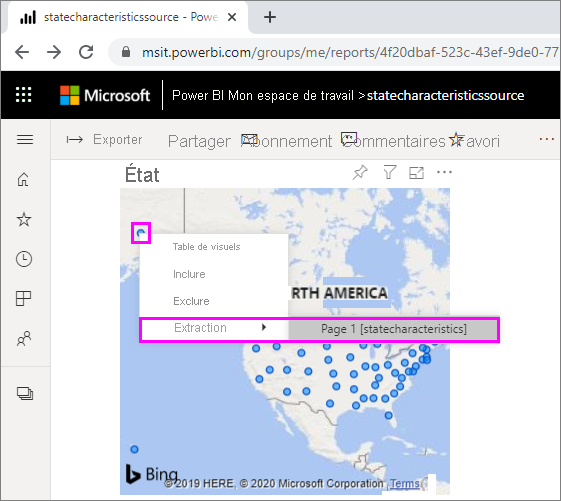
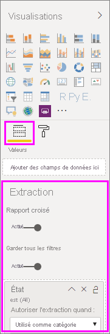

# Utiliser une extraction interrapport dans Power BI

Avec la fonctionnalité d’*extraction interrapport* de Power BI, vous pouvez passer en contexte d’un rapport à un autre dans le même espace de travail ou la même application du service Power BI. Vous pouvez utiliser l’extraction interrapport pour connecter deux rapports ou plus qui ont un contenu associé et transmettre le contexte de filtre avec la connexion interrapport. 

Pour lancer une extraction interrapport, sélectionnez un point de données dans un *visuel source* d’un *rapport source*, puis sélectionnez la cible d’**extraction** interrapport dans le menu contextuel. 

L’action d’extraction ouvre la *page cible* dans le *rapport cible*. 

Cet article explique comment configurer et utiliser l’extraction interrapport pour les rapports Power BI.

> [!NOTE]
> Vous ne pouvez pas utiliser l’extraction interrapport avec des [Rapports partagés avec moi](../collaborate-share/service-share-dashboards.md#share-a-dashboard-or-report) individuellement. Pour utiliser l’extraction interrapport, vous devez accéder aux rapports dans les espaces de travail dont vous êtes membre.

## Activer l’extraction interrapport

La première étape de l’activation de l’extraction interrapport consiste à valider les modèles de données pour les rapports sources et cibles. Même si les schémas de chaque rapport n’ont pas besoin d’être identiques, les champs que vous voulez passer doivent exister dans les deux modèles de données. Les noms des champs et les noms des tables auxquelles ils appartiennent doivent être identiques. Les chaînes doivent correspondre et sont sensibles à la casse.

Par exemple, si vous voulez passer un filtre sur le champ **State** dans la table **US States**, les deux modèles doivent avoir une table **US States** et un champ **State** dans cette table. Si ce n’est pas le cas, vous devez mettre à jour le nom du champ ou le nom de la table dans le modèle sous-jacent. Le simple fait de mettre à jour le nom d’affichage des champs ne fonctionne pas pour l’extraction interrapport.

Après avoir validé vos modèles, activez le rapport source pour utiliser l’extraction interrapport. 

1. Dans Power BI Desktop, sélectionnez **Fichier** > **Options et paramètres** > **Options**. 
1. Dans le volet de navigation gauche de la fenêtre **Options**, en bas de la section **Fichier actuel**, sélectionnez **Paramètres des rapports**. 
1. En bas à droite, sous **Extraction interrapport**, cochez la case **Autoriser les visuels de ce rapport à utiliser des cibles d’extraction d’autres rapports**. 
1. Sélectionnez **OK**. 
   
   

Vous pouvez également activer l’extraction interrapport à partir du service Power BI.
1. Dans le service Power BI, sélectionnez l’espace de travail qui contient vos rapports sources et cibles.
1. En regard du nom du rapport source dans la liste de l’espace de travail, sélectionnez le symbole **Plus d’options**, puis **Paramètres**. 
1. En bas du volet **Paramètres**, sous **Extraction interrapport**, sélectionnez **Autoriser les visuels de ce rapport à utiliser des cibles d’extraction d’autres rapports**, puis **Enregistrer**.
   
   

## Configurer une cible d’extraction interrapport

La configuration d’une page cible pour l’extraction interrapport est similaire à la configuration de l’extraction dans un rapport. L’activation de l’extraction dans la page cible permet à d’autres visuels de cibler la page pour l’extraction. Pour créer une extraction dans un rapport unique, consultez [Utiliser une extraction dans Power BI Desktop](desktop-drillthrough.md).

Vous pouvez configurer une cible pour l’extraction interrapport dans Power BI Desktop ou dans le service Power BI. 
1. Modifiez le fichier cible puis, dans la page cible du rapport cible, sélectionnez la section **Champs** du volet **Visualisations**. 
1. Sous **Extraction**, définissez le bouton bascule **Interrapport** sur **Activé**. 
1. Faites glisser les champs que vous voulez utiliser comme cibles d’extraction dans **Ajouter des champs d’extraction ici**. Pour chaque champ, indiquez si vous voulez autoriser l’extraction quand le champ est utilisé en tant que catégorie ou quand il est synthétisé comme une mesure. 
1. Indiquez si vous voulez **Garder tous les filtres** pour le visuel. Si vous ne voulez pas passer à votre visuel cible les filtres appliqués au visuel source, sélectionnez **Désactivé**.
   
   
   
1. Si vous utilisez la page uniquement pour l’extraction interrapport, supprimez le bouton **Retour** qui est automatiquement ajouté au canevas. Le bouton **Retour** ne fonctionne que pour la navigation dans un rapport. 
1. Après avoir configuré la page cible, enregistrez le rapport si vous êtes dans le service Power BI, ou enregistrez et publiez le rapport si vous utilisez Power BI Desktop.

Voilà. Vos rapports sont prêts pour l’extraction interrapport. 

## Utiliser l’extraction interrapport

Pour utiliser l’extraction interrapport, sélectionnez le rapport source dans le service Power BI, puis sélectionnez un visuel qui utilise le champ d’extraction de la façon que vous avez spécifiée lors de la configuration de la page cible. Cliquez avec le bouton droit sur un point de données pour ouvrir le menu contextuel du visuel, sélectionnez **Extraction**, puis la cible d’extraction. Les cibles d’extraction interrapport sont au format **Nom de la page [Nom du rapport]** .

Les résultats s’affichent dans la page d’extraction interrapport cible, exactement comme vous les avez configurés quand vous avez créé la cible. Les résultats sont filtrés en fonction des paramètres d’extraction.

> [!IMPORTANT]
> Power BI met en cache les cibles d’extraction interrapport. Si vous apportez des changements, veillez à actualiser votre navigateur si vous ne voyez pas les cibles d’extraction comme attendu. 

Si vous définissez **Garder tous les filtres** sur **Activé** quand vous configurez la page cible, le contexte de filtre du visuel source peut inclure les éléments suivants : 

- Filtres de niveau rapport, page et visuel qui affectent le visuel source 
- Filtre croisé et sélection croisée qui affectent le visuel source 
- Segments et segments synchronisés sur la page
- Paramètres d’URL

Quand vous accédez au rapport cible pour l’extraction, Power BI applique uniquement les filtres pour les champs ayant des correspondances de chaîne exactes concernant le nom de champ et le nom de table. 

Power BI n’applique pas les filtres permanents du rapport cible, mais il applique votre signet personnel par défaut si vous en avez un. Par exemple, si votre signet personnel par défaut comprend un filtre au niveau du rapport pour *Country = US*, Power BI applique ce filtre avant d’appliquer le contexte de filtre à partir du visuel source. 

Pour l’extraction interrapport, Power BI passe le contexte de filtre aux pages standard du rapport cible. Power BI ne passe pas le contexte de filtre pour les pages d’info-bulle, car les pages d’info-bulle sont filtrées en fonction de l’objet visuel source qui appelle l’info-bulle.

Si vous souhaitez revenir au rapport source après l’action d’extraction interrapport, utilisez le bouton **Retour** du navigateur. 

## Étapes suivantes

Les articles suivants pourraient également vous intéresser :

- [Segments dans Power BI](../visuals/power-bi-visualization-slicers.md)
- [Utiliser une extraction dans Power BI Desktop](desktop-drillthrough.md)
