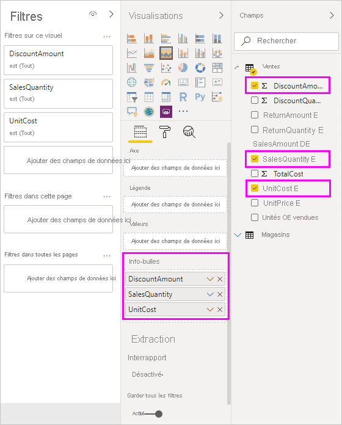
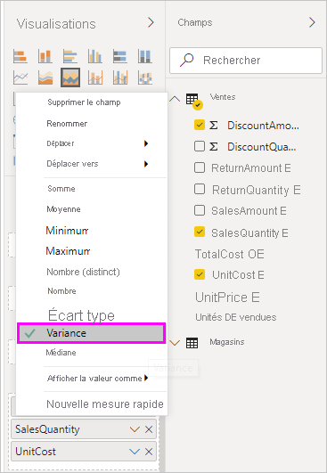

# Personnaliser les info-bulles dans Power BI Desktop

Les info-bulles offrent un moyen élégant de fournir des informations contextuelles et des détails supplémentaires sur les points de données d’un élément visuel. L’illustration suivante montre une info-bulle appliquée à un graphique dans Power BI Desktop.

Quand une visualisation est créée, l’info-bulle par défaut indique la valeur et la catégorie du point de données. Il existe de nombreuses instances dans lesquelles la personnalisation des informations d’info-bulle est utile. La personnalisation des info-bulles fournit du contexte et des informations supplémentaires aux utilisateurs qui affichent le visuel. Les info-bulles personnalisées vous permettent de spécifier des points de données supplémentaires qui s’affichent avec l’info-bulle.

## Comment personnaliser les info-bulles

Pour créer une info-bulle personnalisée, dans la zone **Champs** du volet **Visualisations**, faites glisser un champ dans le compartiment **Info-bulles**, présenté dans l’illustration suivante. Dans l’illustration suivante, trois champs ont été placés dans le compartiment **Info-bulles**.

Après avoir ajouté les info-bulles dans **Info-bulles**, il suffit de pointer sur un point de données dans la visualisation pour que les valeurs des champs s’affichent.

## Personnalisation des info-bulles avec la fonction d’agrégation ou de mesures rapides

Vous pouvez personnaliser davantage une info-bulle en sélectionnant une fonction d’agrégation ou une *mesure rapide*. Sélectionnez la flèche à côté du champ dans le compartiment **Info-bulles**. Puis, faites votre choix parmi les options disponibles.

Il existe plusieurs façons de personnaliser les info-bulles, via les champs disponibles dans un jeu de données, dans le but de communiquer des informations et des indications rapides aux utilisateurs qui visualisent vos tableaux de bord et rapports.
