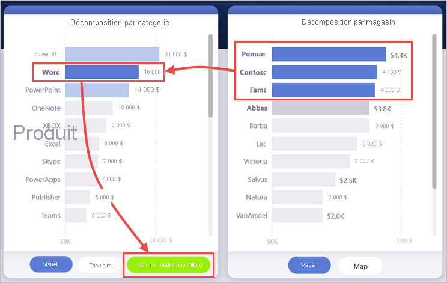
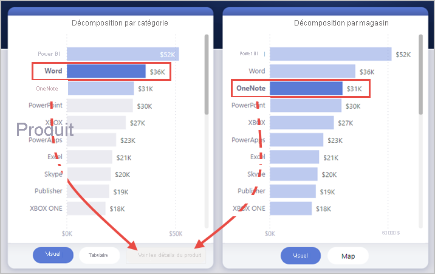
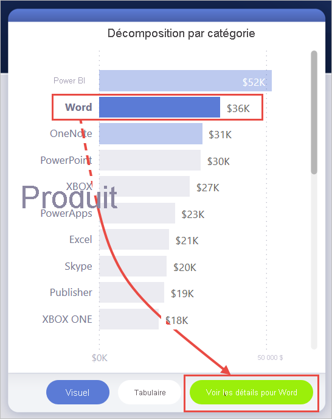
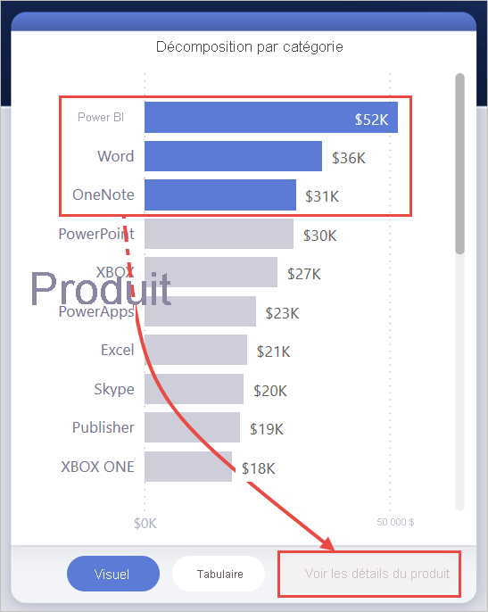

# <a name="create-a-drill-through-button-in-power-bi"></a>Créer un bouton d’extraction dans Power BI

Vous pouvez créer un bouton *d’extraction* dans Power BI, un bouton qui permet d’accéder à une page avec des détails filtrés dans un contexte spécifique.

Une façon d’effectuer une extraction dans un rapport est de cliquer-droit dans un visuel. Si vous souhaitez que l’action d’extraction soit plus évidente, vous pouvez créer un bouton d’extraction à la place. Le bouton d’extraction peut être utile si vous souhaitez augmenter la détectabilité de scénarios d’extraction importants dans vos rapports. Vous pouvez déterminer de manière conditionnelle la plupart des apparences et des comportements du bouton. Par exemple, vous pouvez afficher un texte différent sur un bouton si certaines conditions sont remplies. Lisez la suite pour plus de détails. 

Dans cet exemple, une fois que l’utilisateur a sélectionné la barre Word dans le graphique, le bouton **Voir les détails** est activé.


Lorsqu’un utilisateur sélectionne le bouton **Voir les détails**, il accède à la page Analyse du panier d’achat. Comme vous pouvez le voir dans le visuel de gauche, la page d’extraction est désormais filtrée pour Word.


## <a name="set-up-a-drill-through-button"></a>Configurer un bouton d’extraction

Pour configurer un bouton d’extraction, vous devez d’abord [configurer une page d’extraction valide](desktop-drillthrough.md) au sein de votre rapport. Ensuite, vous devez créer un bouton avec **Extraire** comme type d’action et sélectionner la page d’extraction comme **Destination**.

Le bouton d’extraction a deux états (extraction activée ou désactivée) et il existe donc deux options d’info-bulle.


Si vous laissez les zones d’info-bulle vides, Power BI génère automatiquement les info-bulles. Ces info-bulles sont basées sur le ou les champs de destination et d’extraction.

Voici un exemple de l’info-bulle générée automatiquement lorsque le bouton est désactivé :

« Pour extraire jusqu’à Analyse du panier d’achat ([a page de destination], sélectionnez un seul point de données dans Produit [le champ d’extraction]. »


Et voici un exemple de l’info-bulle générée automatiquement lorsque le bouton est désactivé :

« Cliquez pour extraire jusqu’à Analyse du panier d’achat [la page de destination]. »


Toutefois, si vous souhaitez fournir des info-bulles personnalisées, vous pouvez toujours entrer une chaîne statique. Vous pouvez également appliquer [une mise en forme conditionnelle aux info-bulles](#set-formatting-for-tooltips-conditionally).

## <a name="pass-filter-context"></a>Passer le contexte du filtre

Le bouton fonctionne comme l’extraction normale : Vous pouvez passer aussi des filtres sur des champs supplémentaires en filtrant de façon croisée les visuels qui contiennent le champ d’extraction. Par exemple, en utilisant **Ctrl** + **clic** et le filtrage croisé, vous pouvez passer plusieurs filtres sur le magasin à la page d’extraction, car vos sélections effectuent un filtrage croisé du visuel qui contient Product, le champ d’extraction :



Lorsque vous sélectionnez le bouton d’extraction, vous voyez les filtres sur le magasin et le produit transmis à la page de destination :


### <a name="ambiguous-filter-context"></a>Contexte de filtre ambigu

Comme le bouton d’extraction n’est pas lié à un seul visuel, si votre sélection est ambiguë, le bouton est désactivé.

Dans cet exemple, le bouton est désactivé, car deux visuels contiennent chacun une sélection unique sur Product. Il y a une ambiguïté concernant le point de données de visuel auquel lier l’action d’extraction :



## <a name="customize-formatting-for-disabled-buttons"></a>Personnaliser la mise en forme pour les boutons désactivés
Vous pouvez personnaliser les options de mise en forme pour l’état désactivé des boutons d’extraction.


:::image type="content" source="media/desktop-drill-through-buttons/drill-through-customize-disabled-button.png" alt-text="Personnaliser la mise en forme du bouton désactivé":::
 
Ces options de mise en forme contiennent :
- **Contrôles de texte du bouton** : texte, couleur, remplissage, alignement, taille et famille de polices

    :::image type="content" source="media/desktop-drill-through-buttons/drill-through-disabled-button-text.png" alt-text="Format du texte du bouton désactivé":::

- **Contrôles de remplissage du bouton** : couleur, transparence et *nouvelle* image de remplissage (plus d’informations sur ce point dans la section suivante)

    :::image type="content" source="media/desktop-drill-through-buttons/drill-through-disabled-button-fill.png" alt-text="Remplissage du bouton désactivé":::

- **Contrôles d’icône** : forme, remplissage, alignement, couleur de ligne, transparence et poids

    :::image type="content" source="media/desktop-drill-through-buttons/drill-through-disabled-button-icon.png" alt-text="Icônes du bouton désactivé":::

- **Contrôles de contour**: couleur, transparence, poids, bords arrondis

     :::image type="content" source="media/desktop-drill-through-buttons/drill-through-disabled-button-outline.png" alt-text="Contour du bouton désactivé":::

## <a name="set-formatting-for-button-text-conditionally"></a>Définir la mise en forme d’un texte de bouton de manière conditionnelle
Vous pouvez utiliser la mise en forme conditionnelle pour modifier le texte du bouton en fonction de la valeur sélectionnée d’un champ. Pour ce faire, vous devez créer une mesure qui renvoie la chaîne souhaitée en fonction de la fonction DAX SELECTEDVALUE.

Voici un exemple de mesure qui génère la sortie « See product details » si une valeur Product unique n’est PAS sélectionnée. Dans le cas contraire, elle génère « See details for [le produit sélectionné] » :

```dax
String_for_button = If(SELECTEDVALUE('Product'[Product], 0) == 0, "See product details", "See details for " & SELECTEDVALUE('Product'[Product]))
```

Une fois que vous avez créé cette mesure, vous sélectionnez l’option **Mise en forme conditionnelle** pour le texte du bouton :


Ensuite, vous sélectionnez la mesure que vous avez créée pour le texte du bouton :


Quand un produit unique est sélectionné, le texte du bouton indique :

« See details for Word »



Si aucun produit n’est sélectionné ou si plusieurs produits sont sélectionnés, le bouton est désactivé. Le texte du bouton affiche :

« See product details »



## <a name="set-formatting-for-tooltips-conditionally"></a>Définir la mise en forme de l’info-bulle de manière conditionnelle

Vous pouvez mettre en forme de manière conditionnelle l’info-bulle du bouton d’extraction lorsqu’il est activé ou désactivé. Si vous avez utilisé la mise en forme conditionnelle pour définir dynamiquement la destination d’extraction, vous souhaiterez peut-être que l’info-bulle de l’état du bouton soit plus instructif, en fonction de la sélection de l’utilisateur final. Voici quelques exemples :

- Vous pouvez définir l’info-bulle de l’état désactivé pour qu’elle soit normative au cas par cas à l’aide d’une mesure personnalisée. Par exemple, si vous souhaitez que l’utilisateur sélectionne un produit unique *et* un magasin unique avant de pouvoir accéder à la page Analyse du marché, vous pouvez créer une mesure avec la logique suivante :

    Si l’utilisateur n’a pas sélectionné un seul produit ou un seul magasin, la mesure renvoie : « Sélectionnez un seul produit et appuyez sur Ctrl + clic pour sélectionner un seul magasin. »

    Si l’utilisateur a sélectionné un seul produit, mais pas un seul magasin, la mesure renvoie : « Ctrl + clic pour sélectionner également un seul magasin. »

- De même, vous pouvez définir l’info-bulle de l’état activé de manière à ce qu’elle soit spécifique à la sélection de l’utilisateur. Par exemple, si vous souhaitez que l’utilisateur sache à quel produit et à quel magasin la page d’extraction sera filtrée, vous pouvez créer une mesure qui renvoie :

    « Cliquez pour accéder à [nom de la page d’extraction] pour obtenir plus de détails sur les ventes pour [nom du produit] à [nom du magasin]. »


## <a name="set-the-drill-through-destination-conditionally"></a>Configurer la destination d’extraction de manière conditionnelle

Vous pouvez utiliser la mise en forme conditionnelle pour définir la destination de d’extraction, en fonction de la sortie d’une mesure.

Voici quelques scénarios dans lesquels vous pouvez souhaiter que la destination d’extraction du bouton soit conditionnelle :

- Vous souhaitez uniquement activer l’extraction vers une page **lorsque plusieurs conditions sont remplies**. Sinon le bouton est désactivé.

    Vous voulez, par exemple, que les utilisateurs sélectionne un seul produit *et* un seul magasin avant d’accéder à la page de détails du marché. Sinon le bouton est désactivé.

    :::image type="content" source="media/desktop-drill-through-buttons/drill-through-select-product-store.png" alt-text="Sélectionner un produit et un magasin":::
 
- Vous souhaitez avoir le bouton **prendre en charge plusieurs destinations d’extraction** en fonction des sélections de l’utilisateur.

    Par exemple, imaginons que vous avez plusieurs destinations (Détails du marché et Détails du magasin) que les utilisateurs peuvent extraire. Vous pouvez faire en sorte qu’ils sélectionnent une destination spécifique pour l’extraction avant que le bouton ne soit activé pour cette destination d’extraction.

    :::image type="content" source="media/desktop-drill-through-buttons/drill-through-select-product-destination.png" alt-text="Sélectionner un produit et une destination":::
 
- Vous pouvez également avoir des cas **intéressants pour un scénario hybride** pour prendre en charge des destinations d’extraction multiples et des conditions spécifiques où vous souhaitez désactiver le bouton. En savoir plus sur ces trois options.

### <a name="disable-the-button-until-multiple-conditions-are-met"></a>Désactiver le bouton jusqu’à ce que plusieurs conditions soient remplies

Examinons le premier cas où vous souhaitez que le bouton reste désactivé jusqu’à ce que des conditions supplémentaires soient remplies. Vous devez créer une mesure DAX de base qui génère une chaîne vide (""), à moins que la condition soit remplie. Lorsqu’elle est remplie, il renvoie le nom de la page de destination d’extraction.

Voici un exemple de mesure DAX qui nécessite la sélection d’un magasin avant que l’utilisateur puisse extraire une page de détails de produit :

```dax
Destination logic = If(SELECTEDVALUE(Store[Store], “”)==””, “”, “Store details”)
```

Une fois que vous avez créé cette mesure, vous sélectionnez le bouton de mise en forme conditionnelle (fx) à côté de **Destination** pour le bouton :

:::image type="content" source="media/desktop-drill-through-buttons/drill-through-select-formula.png" alt-text="Sélectionner le bouton de mise en forme conditionnelle":::
 
Pour la dernière étape, vous sélectionnez la mesure DAX que vous avez créée en tant que valeur de champ pour la destination :

:::image type="content" source="media/desktop-drill-through-buttons/drill-through-based-formula.png" alt-text="Destination basée sur le champ"::: 

Vous voyez maintenant que le bouton est désactivé même lorsqu’un seul produit est sélectionné, car la mesure vous oblige également à sélectionner un seul magasin :

:::image type="content" source="media/desktop-drill-through-buttons/drill-through-button-disabled.png" alt-text="Bouton d’extraction désactivé":::

### <a name="support-multiple-destinations"></a>Prendre en charge plusieurs destinations
 
Pour les autres cas courants où vous souhaitez prendre en charge plusieurs destinations, vous commencez par créer une table à une seule colonne avec les noms des destinations d’extraction :

:::image type="content" source="media/desktop-drill-through-buttons/drill-through-create-table.png" alt-text="Création d'une table":::

Power BI utilise une correspondance exacte de chaînes pour définir la destination d’extraction. Par conséquent, vérifiez que les valeurs entrées sont alignées exactement avec les noms de vos pages d’extraction.

Une fois que vous avez créé la table, ajoutez-la à la page en tant que segment à sélection unique :

:::image type="content" source="media/desktop-drill-through-buttons/drill-through-slicer.png" alt-text="Segment d’extraction":::
 
Si vous avez besoin de plus d’espace vertical, convertissez le segment en liste déroulante. Supprimez l’en-tête de segment et ajoutez une zone de texte avec le titre à côté de celui-ci :

:::image type="content" source="media/desktop-drill-through-buttons/drill-through-drop-down-slicer.png" alt-text="Segment d’extraction sans en-tête":::
 
Vous pouvez également remplacer le segment de liste avec une orientation verticale par orientation horizontale :

:::image type="content" source="media/desktop-drill-through-buttons/drill-through-horizontal-slicer.png" alt-text="Segment horizontal":::

Pour l’entrée de destination de l’action d’extraction, sélectionnez le bouton mise en forme conditionnelle (fx) à côté de **Destination** pour le bouton :

:::image type="content" source="media/desktop-drill-through-buttons/drill-through-select-formula.png" alt-text="Sélectionner le bouton de mise en forme conditionnelle":::
 
Sélectionnez le nom de la colonne que vous avez créée. Ici, il s’agit de **Sélectionner une destination** :

:::image type="content" source="media/desktop-drill-through-buttons/drill-through-select-destination.png" alt-text="Sélectionner une destination":::
 
Vous voyez maintenant que le bouton d’extraction est activé uniquement lorsque vous avez sélectionné un produit *et* une destination :

:::image type="content" source="media/desktop-drill-through-buttons/drill-through-select-product-destination.png" alt-text="Sélectionner un produit et une destination":::
 
### <a name="hybrid-of-the-two-scenarios"></a>Hybride des deux scénarios

Si vous êtes intéressé par un hybride des deux scénarios, vous pouvez créer et référencer une mesure DAX pour ajouter une logique supplémentaire pour la sélection de la destination.

Voici un exemple de mesure DAX qui oblige l’utilisateur à sélectionner un magasin avant de pouvoir effectuer une extraction sur un produit vers l’une des pages d’extraction :

```dax
Destination logic = If(SELECTEDVALUE(Store[Store], “”)==””, “”, SELECTEDVALUE(‘Table'[Select a destination]))
```

Puis, vous sélectionnez la mesure DAX que vous avez créée en tant que valeur de champ pour la destination.
Dans cet exemple, l’utilisateur doit sélectionner un produit, un magasin *et* une page de destination avant l’activation du bouton d’extraction :

:::image type="content" source="media/desktop-drill-through-buttons/drill-through-product-store-destination.png" alt-text="Sélectionner un produit, un magasin et une destination":::

## <a name="limitations"></a>Limites

- Ce bouton n’autorise pas les destinations multiples à l’aide d’un seul bouton.
- Ce bouton prend en charge uniquement les extractions dans le même rapport ; en d’autres termes, il ne prend pas en charge l’extraction interrapport.
- La mise en forme de l’état désactivé pour le bouton est liée aux classes de couleur dans votre thème de rapport. Apprenez-en davantage sur les [classes de couleur](desktop-report-themes.md#setting-structural-colors).
- L’action d’extraction fonctionne pour tous les visuels intégrés et fonctionne avec *certains* visuels importés à partir d’AppSource. Toutefois, il n’est pas garanti qu’elle fonctionnera avec *tous* les visuels importés depuis AppSource.

## <a name="next-steps"></a>Étapes suivantes
Pour plus d’informations sur les fonctionnalités qui sont similaires ou pour interagir avec des boutons, consultez les articles suivants :

* [Créer des boutons](desktop-buttons.md)
* [Utiliser l’extraction dans les rapports Power BI](desktop-drillthrough.md)
* [Utiliser des signets pour partager des insights et créer des récits dans Power BI](desktop-bookmarks.md)

