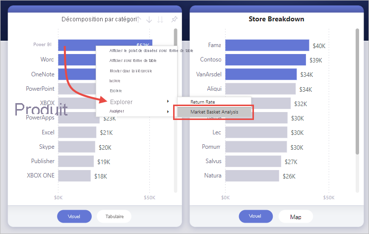
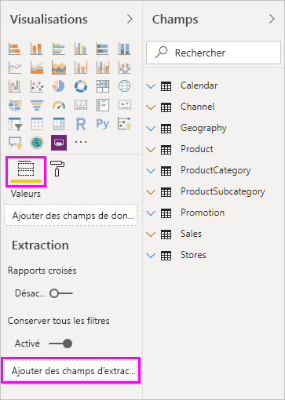
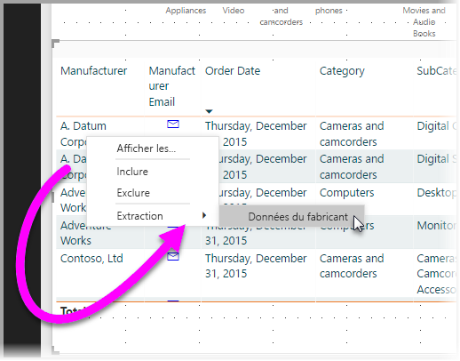

# Configurer l’extraction dans les rapports Power BI
Dans les rapports Power BI, une *extraction* vous permet de créer une page dans votre rapport, qui se concentre sur une entité spécifique, telle qu’un fournisseur, un client ou un fabricant. Lorsque les lecteurs de votre rapport utilisent l’extraction, ils cliquent avec le bouton droit sur un point de données dans d’autre pages de rapport, puis accèdent à la page prioritaire pour obtenir des détails filtrés par rapport à ce contexte. Vous pouvez également [créer un bouton qui permet de réaliser une extraction](desktop-drill-through-buttons.md) jusqu’aux détails lorsqu’ils cliquent dessus.

Vous pouvez configurer l’extraction dans vos rapports dans Power BI Desktop ou dans le service Power BI.

## Configurer la page de destination d’extraction
1. Pour configurer l’extraction, créez une page de rapport contenant les visuels que vous voulez associer au type d’entité pour lequel vous allez proposer l’extraction. 

    Par exemple, supposons que vous souhaitiez proposer l’extraction pour les fabricants. Dans ce cas, vous pouvez créer une page d’extraction avec des visuels présentant le total des ventes, le nombre total d’unités fournies, les ventes par catégorie, les ventes par région, et ainsi de suite. Ainsi, lorsque vous réalisez l’extraction jusqu’à cette page, les visuels sont spécifiques au fabricant que vous avez sélectionné.

2. Ensuite, dans cette page d’extraction, dans la section **Champs** du volet **Visualisations**, faites glisser le champ pour lequel vous souhaitez permettre l’extraction dans le puits **Filtres d’extraction**.

    

    Lorsque vous ajoutez un champ dans le puits **Filtres d’extraction**, Power BI crée automatiquement un visuel de bouton *Précédent*. Ce visuel devient un bouton dans les rapports publiés. Les utilisateurs qui consomment votre rapport dans le service Power BI peuvent utiliser ce bouton pour revenir à la page du rapport où ils étaient précédemment.

    

> [!IMPORTANT]
> Vous pouvez configurer et effectuer une extraction vers une page dans le même rapport. Toutefois, vous ne pouvez pas procéder à une extraction vers une page d’un autre rapport.  

## Utiliser votre propre image pour un bouton Précédent    
 Étant donné que le bouton Précédent est une image, vous pouvez remplacer l’image de ce visuel par n’importe quelle image de votre choix. Il continue à fonctionner comme un bouton Précédent pour permettre aux consommateurs de rapports de revenir à leur page d’origine. 

Si vous souhaitez utiliser votre propre image pour le bouton précédent, effectuez les étapes suivantes :

1. Dans l’onglet **Accueil**, sélectionnez **Image**. Ensuite, recherchez votre image et placez-la dans la page d’extraction.

2. Sélectionnez votre nouvelle image dans la page d’extraction. Dans le volet **Mettre en forme l’image**, définissez le curseur **Action** sur **Activé**, puis définissez le **Type** sur **Précédent**. Votre image fonctionne désormais comme un bouton Précédent.

    

    
     Les utilisateurs peuvent maintenant cliquer avec le bouton droit sur un point de données dans votre rapport et afficher un menu contextuel qui prend en charge l’extraction jusqu’à cette page. 

    

    Lorsque les consommateurs du rapport choisissent d’effectuer l’extraction, la page est filtrée pour afficher les informations relatives au point de données sur lequel ils ont cliqué avec le bouton droit. Par exemple, supposons qu’ils aient cliqué avec le bouton droit sur un point de données concernant Contoso (un fabricant) et qu’ils l’aient sélectionné pour l’extraction. La page d’extraction à laquelle ils accèdent est filtrée sur Contoso.

## Passer tous les filtres dans l’extraction

Vous pouvez passer tous les filtres appliqués dans la fenêtre d’extraction. Par exemple, vous ne pouvez sélectionner qu’une certaine catégorie de produits et les visuels filtrés par rapport à cette catégorie avant de sélectionner l’extraction. Vous aimeriez peut-être savoir à quoi ressemble l’extraction avec tous ces filtres appliqués.

Pour conserver tous les filtres appliqués, dans la section **Extraction** du volet **Visualisations**, définissez **Garder tous les filtres** sur **Activé**. 

Lorsque vous extrayez un visuel, vous pouvez voir les filtres qui ont été appliqués comme résultat du visuel source avec les filtres temporaires appliqués. Dans la section **Extraction** du volet **Visualisation**, ces filtres temporaires apparaissent en italique. 

Vous pouvez effectuer cette opération avec les pages d’info-bulles. Toutefois, celles-ci donneraient l’impression de ne pas fonctionner correctement. Pour cette raison, il n’est pas recommandé de procéder ainsi avec les info-bulles.

## Ajouter une mesure à l’extraction

En plus du passage de tous les filtres dans la fenêtre d’extraction, vous pouvez ajouter une mesure ou une colonne numérique totalisée dans la zone d’extraction. Faites glisser le champ d’extraction dans la carte **Extraction** pour l’appliquer. 

Lorsque vous ajoutez une mesure (ou une colonne numérique totalisée), vous pouvez extraire sur la page si le champ est utilisé dans la zone *Valeur* d’un visuel.

C’est tout ce que vous avez à faire pour utiliser une extraction dans vos rapports. C’est un excellent moyen d’obtenir une vue développée des informations d’une entité que vous avez sélectionnée pour votre filtre d’extraction.

## Étapes suivantes

Les articles suivants pourraient également vous intéresser :

* [Utiliser une extraction interrapport dans les rapports Power BI](desktop-cross-report-drill-through.md)
* [Utilisation de segments Power BI Desktop](../visuals/power-bi-visualization-slicers.md)
