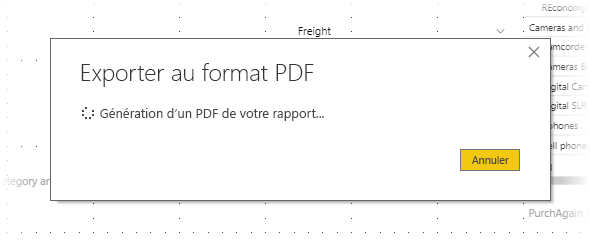

# Exporter des rapports en PDF à partir de Power BI Desktop
Dans **Power BI Desktop** ou le service Power BI, vous pouvez exporter des rapports vers un fichier PDF, et ainsi facilement partager ou imprimer vos rapports à partir de ce PDF.

Le processus d’exportation de votre rapport à partir de **Power BI Desktop** en PDF pour pouvoir l’imprimer ou le partager est simple. Sélectionnez simplement **Fichier > Exporter au format PDF** à partir de Power BI Desktop.

Le processus **Exporter au format PDF** exporte toutes les pages *visibles* du rapport, chaque page du rapport s’exportant dans une page du PDF. Les pages du rapport qui ne sont pas visibles, comme les info-bulles ou les pages masquées, ne sont pas exportées en fichier PDF. 

Quand vous sélectionnez **Fichier > Exporter au format PDF**, l’exportation démarre et une boîte de dialogue apparaît pour indiquer que le processus d’exportation est en cours. La boîte de dialogue reste à l’écran jusqu’à ce que le processus d’exportation soit terminé. Pendant le processus d’exportation, toutes les interactions avec le rapport en cours d’exportation sont désactivées. La seule façon d’interagir avec le rapport est d’attendre la fin du processus d’exportation ou de l’annuler. 

Une fois l’exportation terminée, le fichier PDF est chargé dans la visionneuse PDF par défaut sur l’ordinateur. 

## Considérations et limitations
Vous devez prendre en considération quelques points pour la fonctionnalité **Exporter au format PDF** :

* La fonctionnalité exporte les visuels Power BI, mais elle n’exporte *pas* les éventuels papiers peints que vous avez appliqués au rapport.

Comme le papier peint n’est pas exporté vers le fichier PDF, vous devez prêter une attention particulière aux rapports qui utilisent un papier peint foncé. Si vous avez défini le texte de votre rapport en clair ou en blanc pour qu’il ressorte sur votre papier peint foncé, il sera difficile à lire ou même illisible dans le PDF résultant du processus d’exportation, car le papier peint n’est pas exporté avec le reste du rapport. 

## Étapes suivantes
Une grande variété de fonctionnalités et de visuels intéressants existent dans **Power BI Desktop**. Pour plus d’informations, consultez les ressources suivantes :

* [Utiliser des visuels pour améliorer des rapports Power BI](desktop-visual-elements-for-reports.md)
* [Qu’est-ce que Power BI Desktop ?](../fundamentals/desktop-what-is-desktop.md)
