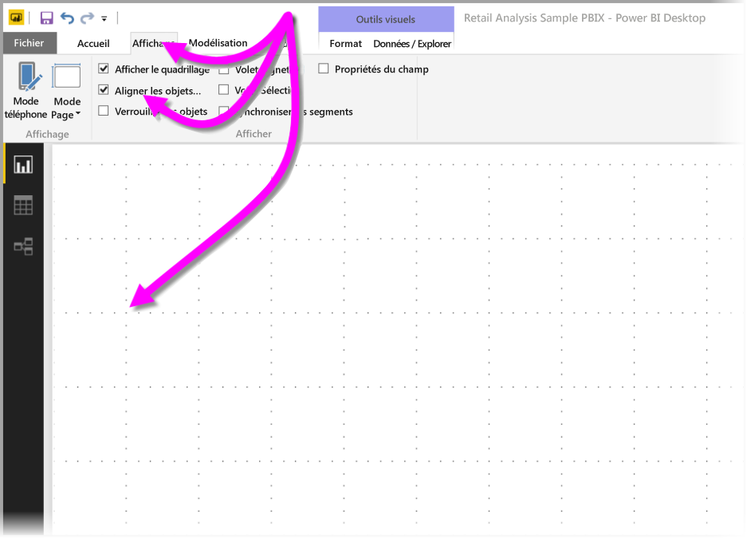
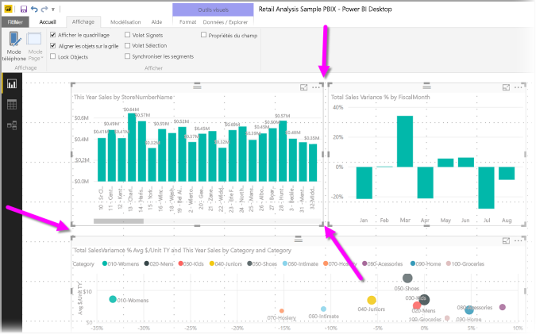
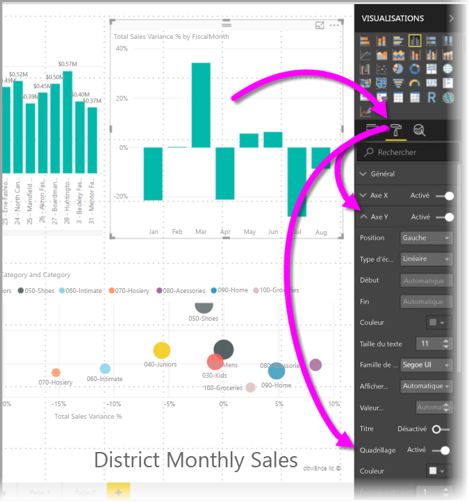
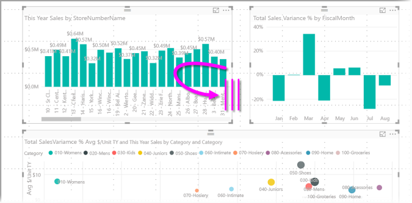
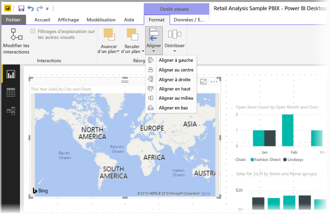
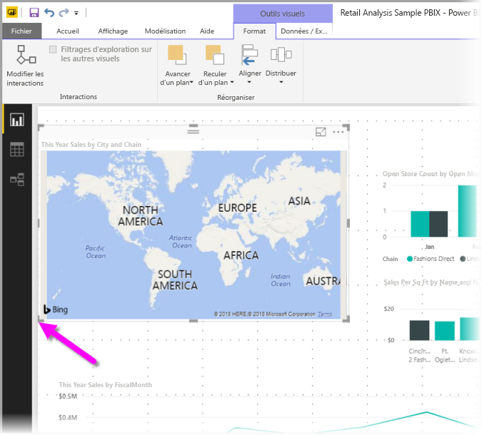
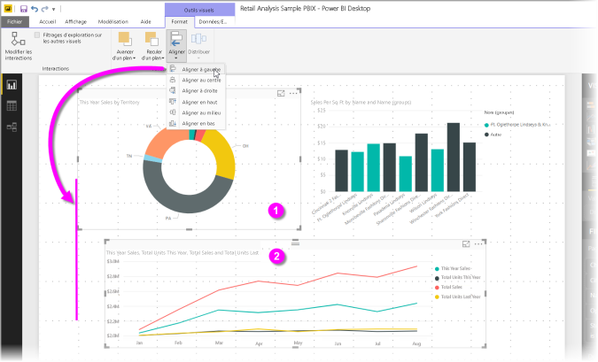
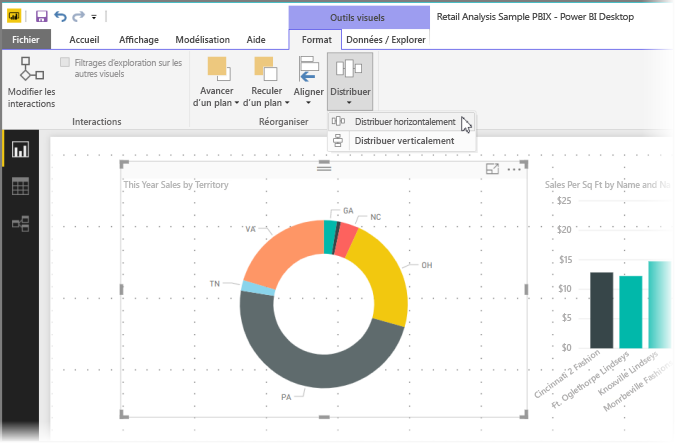

# Utiliser le quadrillage et l’alignement sur la grille dans les rapports Power BI Desktop
Le canevas de rapport **Power BI Desktop** montre un quadrillage qui vous permet d’aligner proprement les visuels sur une page de rapport, ainsi qu’une fonctionnalité d’alignement sur la grille qui permet de respecter les mêmes espaces entre les visuels dans un rapport.

Dans **Power BI Desktop**, vous pouvez également modifier l’ordre de plan (amener à l’avant, placer à l’arrière) des objets sur un rapport, et aligner ou répartir uniformément les visuels sélectionnés sur le canevas.

## Activation du quadrillage et de la grille automatique
Pour activer le quadrillage et l’alignement sur la grille, sélectionnez le ruban **Affichage**, puis cochez les cases **Afficher le quadrillage** et **Aligner les objets sur la grille**. Vous pouvez sélectionner une ou plusieurs options ; elles fonctionnent indépendamment les unes des autres.

> [!NOTE]
> Si les options **Afficher le quadrillage** et **Aligner les objets sur la grille** sont désactivées, connectez-vous à n’importe quelle source de données pour les activer.

## Utilisation du quadrillage
Le quadrillage est constitué de guides visibles qui vous aident à aligner vos visuels. Quand vous tentez de déterminer si deux visuels ou plus sont alignés horizontalement ou verticalement, utilisez le quadrillage pour savoir si leurs bordures sont alignées.

Utilisez Ctrl+Clic pour sélectionner plusieurs visuels à la fois : ceci fait apparaître les bordures de tous ces visuels et montre s’ils sont alignés correctement.

### Utilisation du quadrillage dans les visuels
Dans Power BI, les visuels contiennent également un quadrillage, qui sert de repère visuel pour comparer des valeurs et des points de données. Depuis la publication de septembre 2017 de **Power BI Desktop**, vous pouvez gérer le quadrillage dans les visuels à l’aide de la carte **Axe X** ou **Axe Y** (en fonction du type de visuel), figurant dans la section **Format** du volet **Visualisations**. Vous pouvez gérer les aspect suivants du quadrillage dans un visuel :

* activer ou désactiver le quadrillage ;
* modifier la couleur du quadrillage ;
* ajuster le trait (épaisseur) du quadrillage ;
* sélectionner le style de trait du quadrillage dans le visuel (continu, en tirets ou en pointillés).

La modification de certains aspects d’un quadrillage peut être particulièrement utile dans les rapports où les visuels s’affichent sur un arrière-plan foncé. L’illustration suivante montre la section **Quadrillage** de la carte **Axe Y**.

## Utilisation de l’alignement sur la grille
Lorsque vous activez **l’alignement des objets sur la grille**, tous les visuels du canevas **Power BI Desktop** que vous déplacez (ou redimensionnez) sont automatiquement alignés sur l’axe de grille le plus proche, ce qui permet de vérifier plus aisément que les visuels sont alignés sur le même emplacement ou la même taille dans le sens de la largeur ou de la hauteur.

Ces quelques opérations d’utilisation du **quadrillage** et de l’**alignement sur la grille** suffisent pour vérifier que les visuels sont parfaitement alignés dans vos rapports.

## Utilisation de l’ordre de plan, de l’alignement et de la répartition
Vous pouvez également gérer l’ordre avant-arrière des visuels d’un rapport, souvent appelé *ordre de plan* des éléments. Cette fonctionnalité vous permet de faire se chevaucher les visuels comme vous le souhaitez, puis d’ajuster l’ordre avant-arrière de chacun d’eux. Vous définissez l’ordre de vos visuels avec les boutons **Avancer** et **Reculer**, qui se trouvent dans la section **Organiser** du ruban **Format**. Le ruban **Format** apparaît dès que vous sélectionnez un ou plusieurs visuels dans la page.

Le ruban **Format** vous permet d’aligner vos visuels de différentes façons, ce qui garantit qu’ils apparaissent dans la page avec l’alignement qui convient le mieux.

Le bouton **Aligner** aligne un visuel sélectionné sur le bord (ou le centre) du canevas du rapport, comme illustré dans l’image suivante.

Quand deux visuels ou plus sont sélectionnés, ils sont alignés ensemble et utilisent la limite alignée existante des visuels pour leur alignement. Par exemple, si vous sélectionnez deux visuels et que vous choisissez l’option **Aligner à gauche**, les visuels s’alignent sur la limite la plus à gauche de tous les visuels sélectionnés.

Vous pouvez également répartir vos visuels sur le canevas de rapport, verticalement ou horizontalement. Pour cela, utilisez simplement le bouton **Répartir** du ruban **Format**.

Avec seulement quelques choix effectués dans ces outils de quadrillage, d’alignement et de distribution, vos rapports s’affichent exactement comme vous le souhaitez.

