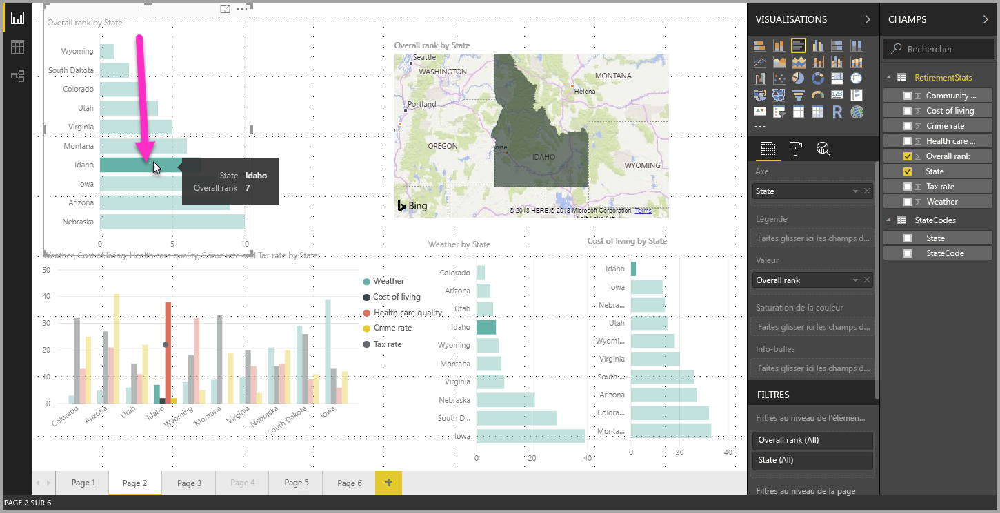
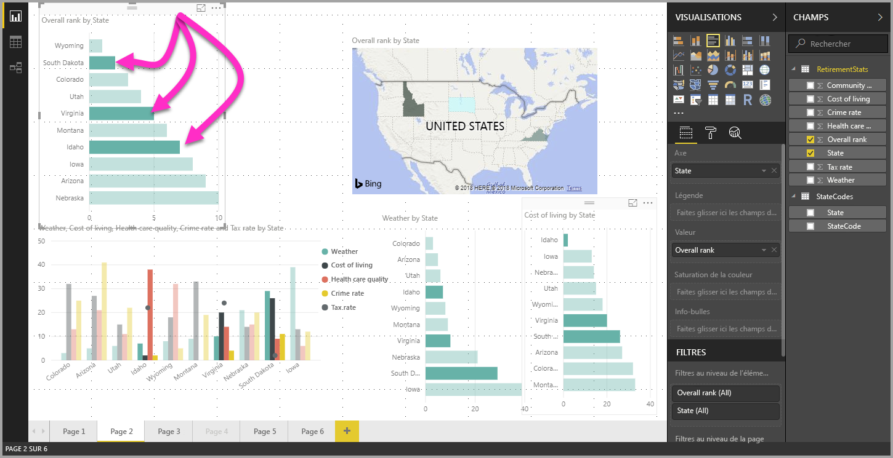

# Multisélection d’éléments de données, de points de données et de visuels à l’aide de Power BI Desktop

Vous pouvez sélectionner plusieurs éléments de données dans un même visuel, plusieurs points de données dans un même visuel ou plusieurs visuels dans un rapport à l’aide de Power BI Desktop. Les sections suivantes décrivent chaque zone tour à tour.

## Sélectionner plusieurs points de données

Dans Power BI Desktop, vous pouvez mettre en surbrillance un point de données dans un visuel spécifique en cliquant simplement sur ce point de données dans le visuel. Par exemple, si votre diagramme à barres ou graphique comporte un élément important et que vous souhaitez que d’autres visuels de la page du rapport mettent en surbrillance des données en fonction de votre sélection, vous pouvez cliquer sur l’élément de données dans un visuel et afficher les résultats dans d’autres visuels sur la page. Il s’agit d’une mise en surbrillance de base ou à sélection unique. L’image suivante montre une mise en surbrillance de base. 

La multisélection vous permet désormais de choisir plusieurs points de données dans votre page de rapport **Power BI Desktop** et de mettre en surbrillance les résultats dans l’ensemble des visuels de la page. Cela équivaut à exécuter une instruction **and** ou une fonctionnalité comme « mettre en surbrillance les résultats pour l’Idaho **et** la Virginie ». Pour sélectionner plusieurs points de données dans des visuels, utilisez la combinaison **CTRL + clic** pour choisir plusieurs points de données. L’illustration suivante montre **plusieurs points de données** sélectionnés (multisélection).

Cela ressemble à une fonctionnalité simple, mais elle ouvre toutes sortes d’opportunités pour créer, partage et interagir avec les rapports. 

## Sélectionner plusieurs éléments à l’aide du rectangle de sélection (préversion)

Vous pouvez sélectionner plusieurs éléments de données dans un visuel, ou plusieurs visuels dans un rapport, à l’aide de l’option de rectangle de sélection, souvent également appelée *Sélection lasso*. 

### Sélectionner plusieurs visuels sur le canevas

Sélectionnez plusieurs visuels et d’autres éléments de rapport en cliquant et en faisant glisser le pointeur de la souris sur la zone de dessin pour créer un lasso rectangulaire. Tous les visuels entièrement encapsulés dans le lasso sont sélectionnés. Si vous appuyez sur la touche *Ctrl* ou *Maj* (à mesure que vous sélectionnez plusieurs visuels), le lasso ajoute des sélections visuelles à la sélection multiple actuelle. 

Si un visuel est déjà sélectionné et pris par le lasso, l’utilisation de *Ctrl* ou *Maj* désactive cette sélection. Le lasso ne sélectionne pas des visuels uniques dans les groupes, mais peut sélectionner des groupes en encapsulant le groupe entier.

La zone de dessin ne défile pas automatiquement avec la sélection rectangulaire du lasso. 

### Sélectionner plusieurs points de données dans un visuel

Vous pouvez sélectionner plusieurs points de données dans un visuel en utilisant les mêmes étapes avec le lasso rectangulaire. Tout en maintenant la touche *Ctrl* enfoncée, cliquez et déplacez le pointeur dans un visuel pour sélectionner plusieurs points de données. Lorsque vous relâchez le bouton de la souris, tous les points qui chevauchent le rectangle de sélection sont sélectionnés, et les sélections de lasso précédentes sont également conservées. Si vous sélectionnez une zone qui incorpore des points déjà sélectionnés avec le lasso tout en maintenant *Ctrl*, ces points de données sont désélectionnés (désactivés) ; l’utilisation du lasso a le même effet que d’utiliser *Ctrl* et le clic gauche sur chaque point individuellement. 

Lorsque vous utilisez la touche *Maj* tout en effectuant une sélection par lasso, les sélections précédentes sont conservées et les points de données déjà sélectionnés restent sélectionnés. Par conséquent, l’utilisation de *Maj* en effectuant un lasso ajoute uniquement des points de données à votre sélection, plutôt que de basculer la sélection des points de données dans la zone sélectionnée.

Vous pouvez effacer votre sélection actuelle en cliquant sur un espace vide sur la zone de traçage sans appuyer sur une touche du clavier.

Pour plus d’informations sur cette fonctionnalité, consultez le [billet de blog sur la publication de cette fonctionnalité](https://powerbi.microsoft.com/blog/power-bi-desktop-august-2020-feature-summary/#_Data_point).

Il existe quelques limitations et considérations relatives à la sélection multiple de points de données dans un visuel :

* Les graphiques en courbes, aires, nuages de points, les treemaps et les cartes prennent en charge la sélection par lasso
* Le nombre maximal de points de données que vous pouvez sélectionner simultanément est de 300
* Lorsque vous affichez un rapport dans le service Power BI, le rectangle de sélection est activé uniquement si la fonctionnalité de sélection par lasso a été activée lors de l’enregistrement et de la publication du rapport

## Étapes suivantes

Les articles suivants pourraient également vous intéresser :

* [Utiliser le quadrillage et l’alignement sur la grille dans les rapports Power BI Desktop](desktop-gridlines-snap-to-grid.md)
* [À propos des filtres et de la mise en surbrillance dans les rapports Power BI](power-bi-reports-filters-and-highlighting.md)

