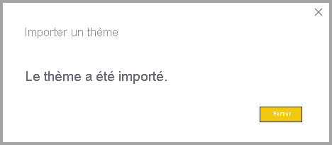
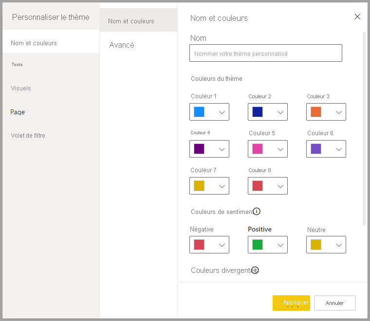
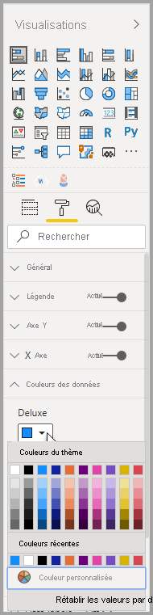
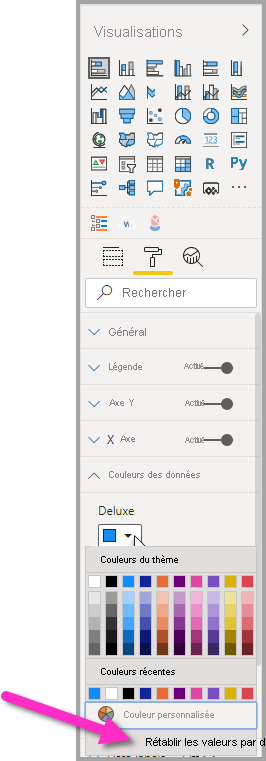
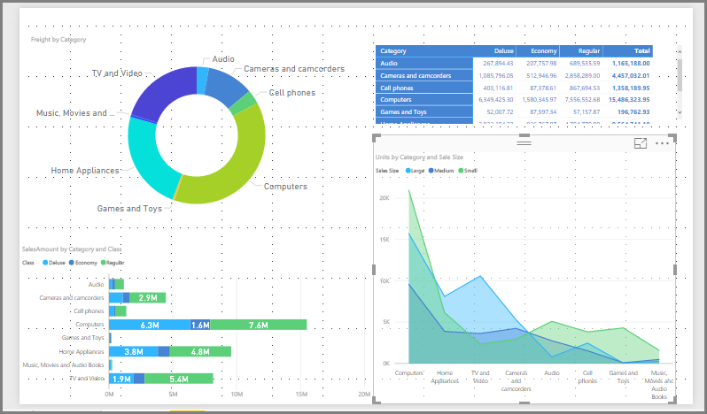
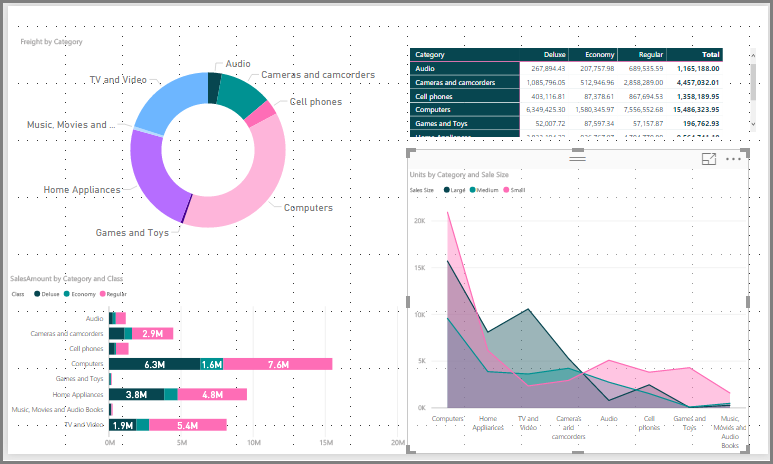
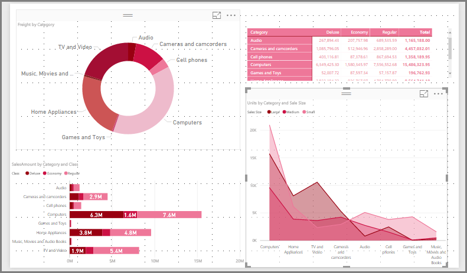

# <a name="use-report-themes-in-power-bi-desktop"></a>Utiliser des thèmes de rapport dans Power BI Desktop

Avec les *thèmes de rapport* Power BI Desktop, vous pouvez appliquer des changements de conception à l’ensemble de votre rapport, par exemple en utilisant les couleurs de votre entreprise, en changeant des jeux d’icônes ou en appliquant une nouvelle mise en forme visuelle par défaut. Quand vous appliquez un thème de rapport, tous les visuels du rapport utilisent les couleurs et la mise en forme du thème sélectionné comme paramètres par défaut. Quelques exceptions s’appliquent. Elles sont décrites plus loin dans cet article.

Vous pouvez sélectionner les thèmes de rapport en accédant au ruban **Afficher**, en sélectionnant le bouton de la flèche déroulante dans la section **Thèmes** du ruban, puis en sélectionnant le thème de votre choix. Les thèmes disponibles sont similaires aux thèmes rencontrés dans d’autres produits Microsoft, comme Microsoft PowerPoint.


Il existe deux types de thèmes de rapport : les thèmes de rapport intégrés et les fichiers de thème de rapport personnalisé.

- Les thèmes de rapport **intégrés** fournissent différents types de schémas de couleurs prédéfinis installés avec Power BI Desktop. Vous sélectionnez les thèmes de rapport intégrés directement dans le menu Power BI Desktop.

- Vous pouvez créer des thèmes de rapport **personnalisés** en adaptant un thème actuel, puis en l’enregistrant comme thème personnalisé, ou en créant votre propre thème personnalisé via un fichier JSON. Le fichier JSON offre un contrôle précis sur de nombreux aspects d’un thème de rapport, comme décrit plus loin dans cet article. 

Nous allons aborder le fonctionnement des thèmes de rapport, puis passer directement à la création de thèmes de rapport personnalisés.


## <a name="how-report-themes-work"></a>Fonctionnement des thèmes de rapport

Pour appliquer un thème de rapport à un rapport Power BI Desktop, vous pouvez sélectionner une des options suivantes :

* Sélectionner parmi les [thèmes de rapport intégrés disponibles](#built-in-report-themes) qui sont intégrés dans Power BI Desktop
* Personnaliser un thème, en utilisant la boîte de dialogue **Personnaliser le thème**
* [Importer un fichier JSON de thème personnalisé](#import-custom-report-theme-files).

Nous allons examiner chacune de ces options.

> [!NOTE]
> Les thèmes peuvent être seulement appliqués lors de l’utilisation de Power BI Desktop. Vous ne pouvez pas appliquer de thèmes à des rapports existants dans le service Power BI. 

### <a name="built-in-report-themes"></a>Thèmes de rapport intégrés

Pour effectuer une sélection parmi les thèmes de rapport intégrés disponibles :

1. Sélectionnez le bouton de la flèche déroulante **Thèmes**, puis **Changer de thème** dans le ruban **Afficher**.

   

2. Sélectionnez parmi les thèmes inclus dans le menu déroulant qui apparaît.

   

   Votre thème de rapport est désormais appliqué au rapport.

    Le tableau suivant affiche les thèmes de rapport intégrés disponibles.
    
    | Thème de rapport intégré | Séquence de couleurs par défaut |
    |------ |---------- |
    | Par défaut | |
    | Tour | |
    | Executive | |
    | Frontière| |
    | Innover | |
    | Bourgeon | |
    | Marée| |
    | Température | |
    | Solaire| |
    | Divergent | |
    | Orage | |
    | Classique | |
    | Jardin public | |
    | Classe | |
    | Adapté aux daltoniens | |
    | Électrique | |
    | Contraste élevé | |
    | Coucher de soleil | |
    | Crépuscule | |
    
3. Vous pouvez également parcourir la collection de thèmes créés par les membres de la communauté Power BI, en sélectionnant **Galerie de thèmes** dans la liste déroulante Thèmes.

   

    Dans la galerie, vous pouvez sélectionner un thème de votre choix et télécharger son fichier JSON associé. 

    Pour installer le fichier téléchargé, sélectionnez **Rechercher des thèmes** dans la liste déroulante **Thèmes**, accédez à l’emplacement où vous avez téléchargé le fichier JSON, puis sélectionnez-le pour importer le thème dans Power BI Desktop comme nouveau thème.

    Quand c’est terminé, Power BI affiche une boîte de dialogue indiquant que l’importation a réussi.

   

## <a name="customize-report-themes"></a>Personnaliser les thèmes de rapport

Vous pouvez également personnaliser et normaliser presque tous les éléments affichés dans la section **Format** du volet **Visualisations** via des personnalisations effectuées directement dans Power BI Desktop ou via un fichier JSON du thème de rapport. L’objectif est de vous donner un contrôle total sur l’apparence par défaut de votre rapport, à un niveau détaillé.

Les deux façons de personnaliser des thèmes de rapport sont les suivantes :

- [Créer et personnaliser un thème dans Power BI Desktop](#create-and-customize-a-theme-in-power-bi-desktop)
- [Créer et personnaliser un fichier JSON de thème de rapport personnalisé](#introduction-to-report-theme-json-files)

Nous considérons chacune de ces approches dans les sections suivantes.

### <a name="create-and-customize-a-theme-in-power-bi-desktop"></a>Créer et personnaliser un thème dans Power BI Desktop

Pour personnaliser un thème directement dans Power BI Desktop, vous pouvez sélectionner un thème proche de ce que vous aimez et y apporter quelques ajustements. Sélectionnez d’abord le thème qui est proche (ou commencez simplement par n’importe quel thème, puis personnalisez-le) et effectuez les étapes suivantes :

1. Dans le ruban **Afficher**, sélectionnez le bouton de liste déroulante **Thèmes**, puis sélectionnez **Personnaliser le thème actuel**.

   

2. Une boîte de dialogue apparaît, où vous pouvez apporter toutes sortes de modifications au thème actuel, puis enregistrer le résultat comme nouveau thème.

   

Les paramètres du thème qui peuvent être personnalisés se trouvent dans les catégories suivantes, qui apparaissent dans la boîte de dialogue **Personnaliser le thème** :

- **Nom et couleurs** : Les paramètres de nom et de couleurs du thème incluent les [couleurs du thème](#how-report-theme-colors-stick-with-your-reports), les couleurs de sentiment, les couleurs divergentes et les [couleurs structurelles (avancé)](#setting-structural-colors).
- **Text** : Les paramètres de texte incluent la famille de polices, la taille et la couleur, qui définissent [les paramètres par défaut de la classe de texte principale](#setting-formatted-text-defaults) pour les étiquettes, les titres, les cartes, les indicateurs de performance clés et les en-têtes d’onglet.
- **Visuels** : Les paramètres des visuels incluent l’arrière-plan, la bordure, l’en-tête et les info-bulles.
- **Page**. Les paramètres des éléments de page incluent le papier peint et l’arrière-plan.
- **Volet Filtre** : Les paramètres du volet de filtre incluent la couleur d’arrière-plan, la transparence, la police et la couleur des icônes, la taille, les cartes de filtre.

Après avoir apporté vos modifications, sélectionnez **Appliquer et enregistrer** pour enregistrer votre thème. Votre thème peut désormais être utilisé dans le rapport actuel et exporté.

Cette personnalisation du thème actuel permet une personnalisation rapide et facile des thèmes. Toutefois, vous pouvez effectuer des ajustements plus affinés des thèmes, ce qui nécessite la modification du [fichier JSON](#report-theme-json-file-format) du thème.

> [!TIP]
> Vous pouvez personnaliser les options de thème de rapport les plus courantes à l’aide des contrôles de la boîte de dialogue **Personnaliser le thème**. Pour un meilleur contrôle encore, vous pouvez éventuellement exporter le fichier JSON d’un thème et apporter des ajustements précis en modifiant manuellement les paramètres dans ce fichier. Vous pouvez renommer ce fichier JSON ajusté et l’importer ultérieurement.

### <a name="import-custom-report-theme-files"></a>Importer des fichiers de thèmes de rapport personnalisés

Vous pouvez également importer un fichier de thème de rapport personnalisé, en effectuant les étapes suivantes :

1. Sélectionnez le ruban **Afficher**, sélectionnez le bouton de liste déroulante **Thèmes**, puis sélectionnez **Rechercher des thèmes**.

   

   Une fenêtre s’affiche dans laquelle vous pouvez naviguer pour accéder à l’emplacement du fichier de thème JSON.

2. Dans l’image suivante, quelques fichiers de thème des vacances sont disponibles. Nous avons choisi un thème sur les vacances pour mars *St Patricks Day.json*.

   

   Une fois le fichier de thème correctement chargé, Power BI Desktop affiche un message de succès.

   

## <a name="introduction-to-report-theme-json-files"></a>Présentation des fichiers JSON de thèmes de rapport

 Lorsque vous ouvrez le fichier JSON de base mentionné dans la section précédente (St Patricks Day.json), il se présente comme suit :

 ```json
    {
        "name": "St Patrick's Day",
        "dataColors": ["#568410", "#3A6108", "#70A322", "#915203", "#D79A12", "#bb7711", "#114400", "#aacc66"],
        "background":"#FFFFFF",
        "foreground": "#3A6108",
        "tableAccent": "#568410"
    }
```

Ce fichier JSON de thème de rapport contient les lignes suivantes :

- **name** : Nom du thème du rapport. Ce champ est le seul obligatoire.
- **dataColors** : La liste des codes hexadécimaux des couleurs à utiliser pour les données dans les visuels Power BI Desktop. Cette liste peut contenir le nombre de couleurs que vous voulez.
- **background**, **firstLevelElements** et **tableAccent** (etc.) : Classes de couleurs. Les classes de couleur vous permettent de définir de nombreuses couleurs structurelles dans votre rapport à la fois.

Vous pouvez utiliser ce fichier JSON comme base pour créer votre propre fichier de thèmes de rapport personnalisés à importer. Si vous souhaitez ajuster uniquement les couleurs de base de votre rapport, modifiez le nom et les codes hexadécimaux dans le fichier.

Dans un fichier JSON de thèmes de rapport, vous définissez uniquement la mise en forme que vous souhaitez modifier. Tout ce que vous ne spécifiez pas dans le fichier JSON est rétabli dans les paramètres par défaut de la Power BI Desktop.

Les avantages de la création d’un fichier JSON sont nombreux. Par exemple, vous pouvez spécifier que tous les graphiques utilisent une taille de police de 12 points, que certains visuels utilisent une famille de polices particulière ou que des étiquettes de données sont désactivées pour des types de graphiques spécifiques. Lorsque vous utilisez un fichier JSON, vous pouvez créer un fichier de thèmes de rapport qui normalise vos graphiques et rapports, facilitant ainsi la mise en cohérence des rapports de votre organisation.

Pour plus d’informations sur le format du fichier JSON, consultez [Format de fichier JSON de thème de rapport](#report-theme-json-file-format).

> [!NOTE]
> La modification d’un thème de rapport JSON personnalisé à l’aide de la [boîte de dialogue **Personnaliser le thème**](#create-and-customize-a-theme-in-power-bi-desktop) est sécurisée.  La boîte de dialogue ne modifie pas les paramètres de thème qu’elle ne peut pas contrôler, et met à jour les modifications apportées sur place au thème du rapport.

## <a name="how-report-theme-colors-stick-with-your-reports"></a>Comment les couleurs de thème de rapport restent associées à vos rapports

Lorsque vous publiez votre rapport sur le Service Power BI, les couleurs de thème du rapport restent associées à celui-ci. La section **Couleurs des données** du volet **Format** reflète votre thème de rapport.

Pour afficher les couleurs disponibles dans un thème de rapport :

1. Sélectionnez un visuel.

2. À partir de la section **Format** du volet **Visualisation**, sélectionnez **Couleurs de données**.

3. Sélectionnez la liste déroulante d’un élément pour afficher les informations sur les **couleurs du thème** sur le thème du rapport.

   

Par exemple, une fois que vous appliquez la palette de couleur verte et marron du thème des rapport St. Patrick's Day, affichez les couleurs du thème. Vous voyez tout ce vert ? C’est parce que ces couleurs faisaient partie du thème de rapport que nous avons importé et appliqué.

Les couleurs de la palette de couleurs sont également relatives au thème actuel. Par exemple, supposons que vous sélectionnez la troisième couleur de la ligne supérieure pour un point de données. Par la suite, si vous passez à un autre thème, la couleur de ce point de données est automatiquement mise à jour sur la troisième couleur de la ligne supérieure dans le nouveau thème, comme vous le feriez lors de la modification des thèmes dans Microsoft Office.

La définition d’un thème de rapport change les couleurs par défaut utilisées dans les visuels dans tout le rapport. Power BI gère une liste de plusieurs centaines de couleurs pour s’assurer que les visuels disposent de nombreuses couleurs uniques pour l’affichage dans un rapport. Lorsque Power BI affecte des couleurs à une série de visuels, les couleurs sont sélectionnées sur la base du premier arrivé, premier servi, à mesure que les couleurs des séries sont affectées. Lorsque vous importez un thème, le mappage des couleurs pour les séries de données est réinitialisé. 

Power BI effectue le suivi de la couleur pour une série dynamique et utilise la même couleur pour la valeur dans d’autres visuels. Dans une *série dynamique*, le nombre de séries présentées dans les visuels peut varier en fonction des mesures, des valeurs ou d’autres aspects. Par exemple, si vous montrez les *bénéfices par région* dans un rapport, vous pourriez avoir cinq régions de ventes, mais vous pourriez également en avoir neuf. Le nombre de régions étant dynamique, il s’agit alors d’une série dynamique. 

À l’inverse, pour les *séries statiques*, le nombre de séries est connu. Par exemple, les *bénéfices* et le *chiffre d’affaires* sont des séries statiques. Dans les séries statiques, Power BI affecte des couleurs par index dans les palettes de thèmes. Vous pouvez substituer l’affectation de couleur par défaut en sélectionnant une couleur dans le volet de mise en forme sous **Couleurs des données**. Vous devrez peut-être changer vos sélections de segment pour voir toutes les valeurs de séries potentielles et définir leurs couleurs. Si vous définissez explicitement la couleur d’un seul visuel à l’aide du volet **Propriétés**, le thème importé ne s’applique à aucune de ces couleurs définies explicitement. 

Pour que le thème s’applique à ces couleurs sélectionnées explicitement, utilisez **Rétablir les valeurs par défaut** dans la section **Couleurs des données** du visuel pour lequel la couleur a été explicitement définie, afin d’annuler l’application de couleur explicite et autoriser l’application du thème.


### <a name="situations-when-report-theme-colors-wont-stick-to-your-reports"></a>Les situations où les couleurs de thème de rapport ne restent pas associées à vos rapports

Supposons que vous appliquez un jeu de couleurs personnalisé (ou une couleur individuelle) à un point de données spécifique dans un élément visuel avec l’option **Couleur personnalisée** du sélecteur de couleur. Lorsque vous appliquez un thème de rapport, il ne remplace *pas* la couleur personnalisée du point de données.

Ou, supposons que vous souhaitez définir manuellement la couleur d’un point de données à l’aide de la section **Couleurs du thème**. Les couleurs ne sont *pas* mises à jour lorsque vous appliquez un nouveau thème de rapport. Pour rétablir vos couleurs par défaut (de façon à ce qu’elles soient mises à jour quand vous appliquez un nouveau thème de rapport), sélectionnez **Rétablir les valeurs par défaut** ou sélectionnez une couleur dans la palette **Couleurs du thème** du sélecteur de couleurs.



Bon nombre de visuels Power BI n’appliquent pas les thèmes de rapport.

## <a name="custom-report-theme-files-you-can-use-right-now"></a>Fichiers de thèmes de rapport que vous pouvez utiliser dès à présent

Vous voulez commencer à utiliser des thèmes de rapports ? Consultez les thèmes de rapport personnalisés dans la [galerie de thèmes](https://community.powerbi.com/t5/Themes-Gallery/bd-p/ThemesGallery) ou essayez les fichiers JSON de thèmes de rapport personnalisés prêts à l’emploi suivants, que vous pouvez télécharger et importer dans votre rapport Power BI Desktop :

- [Thème de forme d’onde](https://community.powerbi.com/t5/Themes-Gallery/Waveform/m-p/140536). Ce thème de rapport a été utilisé dans le [billet de blog](https://powerbi.microsoft.com/blog/power-bi-desktop-march-feature-summary/) qui annonçait la première version des thèmes de rapport. [Téléchargez Waveform.json](https://go.microsoft.com/fwlink/?linkid=843924).

  

- [Thème adapté aux daltoniens](https://community.powerbi.com/t5/Themes-Gallery/Color-Blind-Friendly/m-p/140597).
Ce thème de rapport est plus facile à lire pour les malvoyants. [Téléchargez ColorblindSafe-Longer.json](https://go.microsoft.com/fwlink/?linkid=843923).

  .

- Thèmes Power View, avec Apothecary.json. [Téléchargez les thèmes Power View dans un fichier zip](https://go.microsoft.com/fwlink/?linkid=843925).

  

- Thème Jour de la St Valentin.

  

  Voici le code du fichier JSON du jour de la St Valentin :

   ```json
       {
           "name": "Valentine's Day",
           "dataColors": ["#990011", "#cc1144", "#ee7799", "#eebbcc", "#cc4477", "#cc5555", "#882222", "#A30E33"],
           "background":"#FFFFFF",
           "foreground": "#ee7799",
           "tableAccent": "#990011"
       }
   ```

Voici quelques thèmes de rapport supplémentaires que vous pouvez utiliser comme point de départ :

- [Tournesol-Crépuscule](https://community.powerbi.com/t5/Themes-Gallery/Sunflower-Twilight/m-p/140749)
- [Prune](https://community.powerbi.com/t5/Themes-Gallery/Plum/m-p/140711)
- [Automne](https://community.powerbi.com/t5/Themes-Gallery/Autumn/m-p/140746)
- [Contraste élevé](https://community.powerbi.com/t5/Themes-Gallery/Color-Blind-Friendly/m-p/140597)

Les thèmes de rapport vous permettent de colorer vos rapports Power BI Desktop de façon à refléter votre personnalité, l’image de votre organisation, voire une ambiance saisonnière ou de vacances.

## <a name="export-report-themes"></a>Exporter des thèmes de rapport

Vous pouvez exporter le thème de rapport actuellement appliqué directement depuis Power BI Desktop vers un fichier JSON. Après avoir exporté un thème de rapport, vous pouvez le réutiliser dans d’autres rapports. Cette option vous permet d’exporter le fichier JSON pour la plupart des thèmes intégrés. Les seules exceptions sont les thèmes de base, classique et par défaut, sur lesquels les autres thèmes s’appuient lorsqu’ils sont importés.

Pour exporter le thème actuellement appliqué à partir de Power BI Desktop :

1. sélectionnez **Fichier** > **Options et paramètres** > **Options**.

2. Dans la section **Fonctionnalités d'évaluation**, sélectionnez **Personnaliser le thème actuel** et sélectionnez alors **OK**.

   Vous pouvez être invité à redémarrer Power BI Desktop pour activer la fonctionnalité d’évaluation. Après avoir redémarré, vous pouvez commencer à exporter le thème actuellement appliqué.

3. Dans le ruban **Accueil**, sélectionnez **Changer le thème** > **Exporter le thème actuel**.

4. Dans la boîte de dialogue **Enregistrer sous**, accédez à un répertoire dans lequel enregistrer le fichier JSON, puis sélectionnez **Enregistrer**.

## <a name="report-theme-json-file-format"></a>Format de fichier de JSON de thèmes de rapport

Au niveau le plus basique, le fichier JSON du thème n’a qu’une seule ligne obligatoire : le **nom**.

```json
{
    "name": "Custom Theme"
}
```

En dehors du **nom**, tout le reste est facultatif, ce qui signifie que vous pouvez simplement ajouter les propriétés que vous souhaitez mettre en forme au fichier de thème et continuer à utiliser les valeurs par défaut de Power BI pour le reste.

### <a name="setting-theme-colors"></a>Définition des couleurs du thème

Sous **nom**, vous pouvez ajouter les propriétés de base relatives aux couleurs des données suivantes :

- **dataColors** : liste des codes hexadécimaux des couleurs à utiliser pour colorer les formes qui représentent les données dans les visuels Power BI Desktop. Cette liste peut contenir le nombre de couleurs que vous voulez. Une fois que toutes les couleurs de cette liste ont été utilisées, si le visuel a encore besoin d’autres couleurs, il revient à l’utilisation de la palette de couleurs par défaut de Power BI.
- **bon**, **neutre**, **mauvais** : Ces propriétés définissent les couleurs d’état utilisées par le graphique en cascade et l’élément visuel d’indicateur de performance clé.
- **maximum**, **centre**, **minimum**, **nul** : Ces couleurs définissent les différentes couleurs de dégradé dans la boîte de dialogue de mise en forme conditionnelle.

Un thème de base qui définit ces couleurs devrait apparaitre comme suit :

```json
{
    "name": "Custom Theme",
    "dataColors": [
        "#118DFF",
        "#12239E",
        "#E66C37",
        "#6B007B",
        "#E044A7",
        "#744EC2",
        "#D9B300",
        "#D64550",
        "#197278",
        "#1AAB40"
    ],
    "good": "#1AAB40",
    "neutral": "#D9B300",
    "bad": "#D64554",
    "maximum": "#118DFF",
    "center": "#D9B300",
    "minimum": "#DEEFFF",
    "null": "#FF7F48"
}
```

### <a name="setting-structural-colors"></a>Définition de couleurs structurelles

Vous pouvez ensuite ajouter diverses classes de couleur, telles que **background** et **firstLevelElements**. Ces classes de couleur définissent les couleurs structurelles des éléments du rapport, tels que les lignes de quadrillage, les couleurs de surbrillance et les couleurs d’arrière-plan des éléments visuels.

Le tableau suivant affiche les six classes de couleurs que vous pouvez mettre en forme.  Les noms de **classe de couleur** correspondent aux noms figurant dans la sous-section « Avancé » de la section « Nom et couleurs » de la [boîte de dialogue **Personnaliser le thème**](#create-and-customize-a-theme-in-power-bi-desktop).

|Classe de couleur  |Ce qui est mis en forme  |
|---------|---------|
| **firstLevelElements** <br> **foreground**    (déconseillé) | Couleur d’arrière-plan des étiquettes (en dehors des points de données) <br> Couleur de la courbe de tendance <br>  Couleur par défaut de la zone de texte <br> Valeurs de tableau et de matrice et couleurs de police des totaux, couleur de l’axe des barres de données <br> Étiquettes de données de carte <br> Couleur de valeur de légende de jauge <br> Couleur d’objectif de l’indicateur de performance clé <br>  Couleur du texte d’indicateur de performance clé <br> Couleur de l’élément de segment (en mode Focus)  <br> Couleur de police de l’élément déroulant du segment <br> Couleur de police d’entrée numérique du segment <br> Couleur de police d’en-tête du segment <br> Couleur de ligne du ratio du graphique à nuages de points <br> Couleur de ligne de prévision de graphique en courbes <br> Couleur de ligne d’en-tête de la carte <br> Couleur du volet de filtre et du texte de la carte|
| **secondLevelElements** <br> **foregroundNeutralSecondary** (déconseillé) | [Classes de texte secondaires](#setting-formatted-text-defaults) « claires » <br> Couleurs d’étiquette  <br> Couleu de l’étiquette de légende <br> Couleur des étiquettes de l’axe <br> Couleur de police d’en-tête de tableau et de matrice <br> Couleur de ligne d’en-tête de jauge cible <br>  Couleur de l’axe de tendance de l’indicateur de performance clé <br> Couleur du curseur du segment <br> Couleur de police d’élément de segment <br> Couleur de contour de segment <br> Couleur de pointage de graphique en courbes <br> Couleur de titre de carte à plusieurs lignes <br> Couleur de trait de graphique de ruban <br> Couleur de bordure de carte de formes <br> Couleur de police de texte de bouton <br> Couleur de ligne d’icône de bouton <br> Couleur de contour de bouton |
| **thirdLevelElements** <br >**backgroundLight** (déprécié) | Couleur du quadrillage de l’axe <br> Couleur de grille de table et de matrice <br> Couleur d’arrière-plan d’en-tête de segment (en mode Focus)  <br> Couleur de contour de carte à plusieurs lignes  <br> Couleur de remplissage de forme <br> Couleur d’arrière-plan d’arc de jauge <br> Couleur d’arrière-plan de la carte de filtre appliquée <br> Quand background = FFFFFF : <br> Couleur de remplissage de bouton désactivée <br> Couleur de contour de bouton désactivée <br> |
| **fourthLevelElements** <br> **foregroundNeutralTertiary** (déprécié) | Couleur estompée de légende <br> Couleur d’étiquette de catégorie de carte <br> Couleur des étiquettes de catégorie des cartes à plusieurs lignes <br> Couleur de barre de carte à plusieurs lignes <br> Couleur de trait du taux de conversion de graphique en entonnoir <br> Couleur de police de texte de bouton désactivée <br> Couleur de ligne d’icône de bouton désactivée <br> |
| **background** | Couleur d’arrière-plan des étiquettes (au sein des points de données) <br> Couleur d’arrière-plan des éléments déroulants du segment  <br> Couleur de trait de graphique en anneau <br> Couleur de trait de treemap <br> Couleur d’arrière-plan de graphique combiné <br> Couleur de remplissage de bouton <br> Couleur d’arrière-plan de carte de filtre disponible et de volet de filtre |
| **secondaryBackground** <br> **backgroundNeutral** (déprécié) | Couleur de contour de la grille de table et de matrice <br> Couleur par défaut de la carte de formes <br> Couleur de remplissage du ruban du graphique de ruban (lorsque l’option Faire correspondre la couleur de la série est désactivée) <br> Quand background != FFFFFF : <br> Couleur de remplissage de bouton désactivée <br> Couleur de contour de bouton désactivée <br> |
| **tableAccent** | Remplace la couleur de contour de la grille des tableaux et matrices quand elle est présente |

Voici un exemple de thème qui définit les classes de couleurs :

```json
{
    "name": "Custom Theme",
    "firstLevelElements": "#252423",
    "secondLevelElements": "#605E5C",
    "thirdLevelElements": "#F3F2F1",
    "fourthLevelElements": "#B3B0AD",
    "background": "#FFFFFF",
    "secondaryBackground": "#C8C6C4",
    "tableAccent": "#118DFF"
}
```

> [!TIP]
> Si vous créez un « thème sombre » ou un autre thème coloré qui diverge du style **firstLevelElements** « noir » sur **background** « blanc » standard, veillez à définir également les valeurs pour d’autres couleurs structurelles et les [couleurs de la classe de texte principale](#setting-formatted-text-defaults).  Cela garantira (par exemple) que les étiquettes de données sur les graphiques avec un arrière-plan d’étiquette correspondront au style attendu et seront lisibles, et que les lignes de quadrillage seront visibles.

### <a name="setting-formatted-text-defaults"></a>Définition des paramètres par défaut du texte mis en forme

Vous pouvez ensuite ajouter des classes de texte à votre fichier JSON. Les classes de texte sont similaires aux classes de couleurs, mais sont conçues pour vous permettre de mettre à jour la taille, la couleur et la famille des polices pour des groupes de texte dans votre rapport.

Il existe 12 classes de texte, mais vous n’avez besoin de définir que quatre classes, appelées *classes principales*, pour modifier l’ensemble de la mise en forme du texte dans votre rapport.  Ces quatre classes principales peuvent être définies dans la [boîte de dialogue **Personnaliser le thème**](#create-and-customize-a-theme-in-power-bi-desktop) sous la section « Texte » : « Général » correspond à **label**, « Titre » à **title**, « Cartes et indicateurs de performance clés » à **callout** et « En-têtes d’onglet » à **header**.

Les autres classes de texte, considérées comme des *classes secondaires*, dérivent automatiquement leurs propriétés de leurs classes principales associées. Il arrive souvent qu’une classe secondaire sélectionne une nuance plus claire de couleur de texte ou un pourcentage de taille de texte plus grand ou plus petit par rapport à la classe principale.

Prenez la classe **label** à titre d’exemple. La mise en forme par défaut de la classe **étiquette** est Segoe UI, #252423 (couleur gris foncé) et 12 points. Cette classe est utilisée pour mettre en forme les valeurs de la table et de la matrice. En règle générale, les totaux d’une table ou d’une matrice ont une mise en forme similaire, mais sont mis en gras avec la classe **étiquette en gras** pour qu’ils soient plus visibles. Toutefois, vous n’avez pas besoin de spécifier cette classe dans le thème JSON ; Power BI le fait automatiquement. Par la suite, si vous décidez de spécifier des étiquettes qui ont une police de 14 points dans votre thème, vous n’avez pas besoin de mettre à jour la classe **bold label** (étiquette en gras), car elle hérite de la mise en forme du texte de la classe **label** (étiquette).

La table ci-dessous affiche les informations suivantes :

- Chacune des quatre classes de texte principales, ce qu’elle met en forme et ses paramètres par défaut
- Chaque classe secondaire, ce qu’elle met en forme et son paramètre par défaut, unique par rapport à la classe principale

|Classe principale  |Classes secondaires  |Nom de la classe JSON  | Paramètres par défaut  |Objets visuels associés  |
|---------|---------|---------|---------|---------|
| Légende | N/A | légende | DIN <br> #252423 <br> 45pt |Étiquettes de données de carte <br> Indicateurs de performance clés|
|En-tête|N/A|en-tête|Segoe UI Semibold <br> #252423 <br> 12pt |En-têtes d’influenceurs clés |
| Titre || title |DIN <br> #252423 <br> 12pt |Titre de l'axe de catégorie <br> Titre de l'axe des ordonnées <br> Titre de carte à plusieurs lignes * <br> En-tête de segment|
|-| Grand titre | largeTitle |14pt |Titre visuel |
|Étiquette ||label |Segoe UI<br>#252423<br>10pt |En-têtes de colonnes de tableau et de matrice <br> En-têtes de lignes de matrice<br>Grille de tableau et de matrice<br>Valeurs de table et de matrice |
|-|Demi-gras |semiboldLabel| Segoe UI Semibold | Texte du profil des influenceurs clés
|-|Large |largeLabel |12pt | Étiquettes de données de carte à plusieurs lignes |
|-|Small |smallLabel |9pt |Étiquettes de ligne de référence * <br>Étiquettes de la plage de dates du segment<br> Style de texte d’entrée numérique du segment<br>Zone de recherche de segment<br>Texte d’influenceur pour les influenceurs clés|
|-|Clair |lightLabel |#605E5C |Texte de légende<br>Texte du bouton<br>Étiquettes de l’axe des catégories<br>Étiquettes de données de graphique en entonnoir<br>Étiquettes de taux de conversion de graphique en entonnoir<br>Cible de la jauge<br>Étiquette de catégorie de graphique à nuages de points<br>Éléments de segment|
|-|Gras |boldLabel |Segoe UI Bold |Sous-totaux de la matrice<br>Totaux généraux de la matrice<br>Totaux de tableau |
|-|Grand et clair |largeLightLabel |#605E5C<br>12pt |Étiquettes des catégories de carte<br>Étiquettes de jauge<br>Étiquettes de catégorie de carte à plusieurs lignes |
|-|Petit et clair |smallLightLabel |#605E5C<br>9pt |Étiquettes de données<br>Étiquettes de l’axe des valeurs|

*\* Les éléments marqués d’une étoile sont également colorés en fonction de la première couleur de données du thème du rapport.*

> [!TIP]
> Les variations *claires* des classes de texte prennent leur couleur claire des [couleurs structurelles](#setting-structural-colors) définies ci-dessus.  Si vous créez un « thème sombre », veillez à définir également les couleurs « firstLevelElements » (correspondant à la couleur principale du texte), « secondLevelElements » (correspondant à la couleur « claire » attendue pour le texte) et « background » (avec un contraste suffisant pour les couleurs des éléments des premier et second niveaux).

Voici un exemple de thème qui définit uniquement les classes de texte principales :

```json
{
    "name": "Custom Theme",
    "textClasses": {
        "callout": {
            "fontSize": 45,
            "fontFace": "DIN",
            "color": "#252423"
        },
        "title": {
            "fontSize": 12,
            "fontFace": "DIN",
            "color": "#252423"
        },
        "header": {
            "fontSize": 12,
            "fontFace": "Segoe UI Semibold",
            "color": "#252423"
        },
        "label": {
            "fontSize": 10,
            "fontFace": "Segoe UI",
            "color": "#252423"
        }
    }
}
```

Étant donné que les classes secondaires héritent des classes principales, vous n’avez pas besoin de les définir dans votre fichier de thèmes. Cependant, si vous n’aimez pas les règles d’héritage (par exemple, si vous ne souhaitez pas que vos totaux soient une version en gras des valeurs dans un tableau), vous pouvez mettre en forme explicitement les classes secondaires dans le fichier de thème, comme vous mettriez en forme les classes principales.

### <a name="setting-visual-property-defaults-visualstyles"></a>Définition des valeurs par défaut des propriétés des visuels (`visualStyles`)

Enfin, pour créer un fichier JSON de format étendu, avec un contrôle plus précis et détaillé de la mise en forme de tous les visuels dans un rapport, ajoutez une section **visualStyles** au fichier JSON pour incorporer les spécificités de mise en forme. Voici un exemple basé sur un modèle de la section **visualStyles** :

```json
    "visualStyles": {
        "<visualName>": {
            "<styleName>": {
                "<cardName>": [{
                    "<propertyName>": <propertyValue>
                }]
            }
        }
    }
```

Pour les sections **visualName** et **cardName**, utilisez des valeurs de nom spécifiques. Actuellement, le **styleName** est toujours un astérisque (*), mais dans une version ultérieure, vous serez en mesure de créer différents styles pour vos visuels et de leur attribuer des noms (comme pour la fonctionnalité de style de tableau et de matrice). **PropertyName** est le nom de l’option de mise en forme spécifique et **PropertyValue** est l’endroit où vous placez l’option de mise en forme souhaitée.

Pour **visualName** et **cardName** utilisez un astérisque entre parenthèses si vous souhaitez appliquer ce paramètre à tous les visuels ou toutes les cartes présentant une propriété. Si vous utilisez l’astérisque pour à la fois le nom de l’élément visuel et de la carte, vous appliquerez un paramètre à l’échelle globale dans votre rapport, par exemple une taille de police ou une famille de polices spécifique pour tout le texte dans tous les éléments visuels.

Voici un exemple de définition de quelques propriétés via les styles visuels :

```json
{
   "name":"Custom Theme",
   "visualStyles":{
      "*": {
         "*": {
            "*": [{
                "wordWrap": true
            }],
            "categoryAxis": [{
                "gridlineStyle": "dotted"
            }],
            "filterCard": [
              {
                "$id": "Applied",
                "foregroundColor": {"solid": {"color": "#252423" } }
              },
              {
                "$id":"Available",
                "border": true
              }
            ]
         }
      },
      "scatterChart": {
         "*": {
            "bubbles": [{
                  "bubbleSize": -10
            }]
         }
      }
   }
}
```

Cet exemple repose sur les paramètres suivants :

- Active le retour automatique à la ligne partout
- Définit le style de quadrillage sur pointillés pour tous les éléments visuels avec un axe des abscisses
- Définit la mise en forme des cartes de filtre disponibles et appliquées (notez le format utilisant « $id » pour définir différentes versions des cartes de filtre)
- Définit la taille des bulles pour les nuages de points sur -10.

> [!NOTE]
> Vous devez uniquement spécifier les éléments de mise en forme que vous souhaitez ajuster. Tous les éléments de mise en forme non inclus dans le fichier JSON reprennent simplement leurs valeurs et paramètres par défaut.

### <a name="visualstyles-definition-list"></a>Liste de définitions `visualStyles`

Les tableaux de cette section définissent les noms de visuel (**visualName**), les noms de carte (**cardName**), les noms de propriété (**propertyName**) et les énumérations nécessaires à la création de votre fichier JSON.

| valeurs visualName |
| --- |
| areaChart |
| barChart |
| basicShape |
| carte |
| clusteredBarChart |
| clusteredColumnChart |
| columnChart |
| comboChart |
| donutChart |
| filledMap |
| entonnoir |
| jauge |
| hundredPercentStackedBarChart |
| hundredPercentStackedColumnChart |
| image |
| indicateur de performance clé |
| lineChart |
| lineClusteredColumnComboChart |
| lineStackedColumnComboChart |
| carte |
| multiRowCard |
| graphique à secteurs |
| tableau croisé dynamique |
| ribbonChart |
| scatterChart |
| shapeMap |
| segment |
| stackedAreaChart |
| tableEx |
| treemap |
| waterfallChart |

Le tableau suivant définit les valeurs de **cardName**. La première valeur dans chaque cellule est le terme du fichier JSON. La deuxième valeur est le nom de la carte, tel qu’affiché dans l’interface utilisateur de Power BI Desktop.

| valeurs cardName |
| --- |
| axis : Axe de la jauge |
| breakdown : Répartition |
| bubbles : Bulles |
| calloutValue : Valeur de la légende |
| card : Carte |
| cardTitle : Titre de la carte |
| categoryAxis : Axe X |
| categoryLabels : Étiquettes des catégories |
| columnFormatting : Mise en forme des champs |
| columnHeaders : En-têtes de colonnes |
| dataLabels : Étiquettes de données |
| fill : Remplir |
| fillPoint : Point de remplissage |
| forecast : Feuille |
| general : Général |
| goals : Objectifs |
| grid : Grille |
| header : En-tête |
| imageScaling : Mise à l’échelle |
| indicator : Indicateur |
| items : Éléments |
| labels : Étiquettes de données |
| legend : Légende |
| lineStyles : Formes |
| mapControls : Commandes de la carte |
| mapStyles : Styles de la carte |
| numericInputStyle : Entrées numériques |
| percentBarLabel : Étiquette de taux de conversion |
| plotArea : Zone de traçage |
| plotAreaShading : Symétrie en grisé |
| ratioLine : Ligne du ratio |
| referenceLine : Ligne de constante |
| ribbonChart : Rubans |
| rotation : Rotation |
| rowHeaders : En-têtes de ligne |
| selection : Contrôles de sélection |
| sentimentColors : Couleurs de sentiment |
| shape : Forme |
| slider : Curseur |
| status : Code couleur |
| subTotals : Sous-totaux |
| target : Cible |
| total : Total général |
| trend : Courbe de tendance |
| trendline : Axe de tendance |
| valueAxis : Axe Y |
| values : Valeurs |
| wordWrap : Retour automatique à la ligne |
| xAxisReferenceLine : Ligne de constante de l’axe X |
| y1AxisReferenceLine : Ligne de constante |
| zoom : Zoom |

### <a name="properties-within-each-card"></a>Propriétés au sein de chaque carte

La section suivante définit les propriétés de chaque carte. Le nom de la carte est suivi de chaque nom de propriété. Pour chaque propriété : le nom que vous voyez si le volet de mise en forme s’affiche, une description de ce que fait l’option de mise en forme et le type d’option de mise en forme. Cette approche vous permet de connaître le type de valeur que vous pouvez utiliser dans votre fichier de thème.

Lorsque vous utilisez **dateTime**, la date doit être une date ISO entre apostrophes, avec la valeur de date/heure au début. Voir l’exemple suivant :

  "datetime'2011-10-05T14:48:00.000Z'"

Les valeurs booléennes sont true (vrai) ou false (faux). Les chaînes doivent être entre guillemets, comme dans "ceci est une chaînes". Les nombres sont simplement la valeur elle-même, sans guillemets.

Les couleurs utilisent le format suivant, où votre code hexadécimal personnalisé remplace « FFFFFF » dans l’exemple suivant :

```json
{ "solid": { "color": "#FFFFFF" } }
```

Une énumération, généralement utilisée pour les options de mise en forme de liste déroulante, signifie qu’elle peut être définie sur n’importe laquelle des options affichées dans le volet, par exemple « RightCenter » pour la position de la légende ou « Valeur de données, pourcentage du total » pour l’étiquette de données de secteur. Les options d’énumération sont affichées sous la liste des propriétés.

```json
{
      "general":{
        "responsive": {
          "type": [
            "bool"
          ],
          "displayName": [
            "(Preview) Responsive"
          ],
          "description": [
            "The visual will adapt to size changes"
          ]
        },
        "legend": {
        "show": {
          "type": [
            "bool"
          ],
          "displayName": [
            "Show"
          ]
        },
        "position": {
          "type": [
            "enumeration"
          ],
          "displayName": [
            "Position"
          ],
          "description": [
            "Select the location for the legend"
          ]
        },
        "showTitle": {
          "type": [
            "bool"
          ],
          "displayName": [
            "Title"
          ],
          "description": [
            "Display a title for legend symbols"
          ]
        },
        "labelColor": {
          "type": [
            "fill"
          ],
          "displayName": [
            "Color"
          ]
        },
        "fontFamily": {
          "type": [
            "formatting"
          ],
          "displayName": [
            "Font family"
          ]
        },
        "fontSize": {
          "type": [
            "formatting"
          ],
          "displayName": [
            "Text Size"
          ]
        }
      },
      "categoryAxis": {
        "show": {
          "type": [
            "bool"
          ],
          "displayName": [
            "Show"
          ]
        },
        "axisScale": {
          "type": [
            "enumeration"
          ],
          "displayName": [
            "Scale type"
          ]
        },
        "start": {
          "type": [
            "numeric",
            "dateTime"
          ],
          "displayName": [
            "Start"
          ],
          "description": [
            "Enter a starting value (optional)"
          ]
        },
        "end": {
          "type": [
            "numeric",
            "dateTime"
          ],
          "displayName": [
            "End"
          ],
          "description": [
            "Enter an ending value (optional)"
          ]
        },
        "axisType": {
          "type": [
            "enumeration"
          ],
          "displayName": [
            "Type"
          ]
        },
        "showAxisTitle": {
          "type": [
            "bool"
          ],
          "displayName": [
            "Title"
          ],
          "description": [
            "Title for the X-axis",
            "Title for the Y-axis"
          ]
        },
        "axisStyle": {
          "type": [
            "enumeration"
          ],
          "displayName": [
            "Style"
          ]
        },
        "labelColor": {
          "type": [
            "fill"
          ],
          "displayName": [
            "Color"
          ]
        },
        "fontFamily": {
          "type": [
            "formatting"
          ],
          "displayName": [
            "Font family"
          ]
        },
        "fontSize": {
          "type": [
            "formatting"
          ],
          "displayName": [
            "Text Size"
          ]
        },
        "labelDisplayUnits": {
          "type": [
            "formatting"
          ],
          "displayName": [
            "Display units"
          ],
          "description": [
            "Select the units (millions, billions, etc.)"
          ]
        },
        "labelPrecision": {
          "type": [
            "numeric"
          ],
          "displayName": [
            "Value decimal places"
          ],
          "description": [
            "Select the number of decimal places to display for the values"
          ]
        },
        "concatenateLabels": {
          "type": [
            "bool"
          ],
          "displayName": [
            "Concatenate labels"
          ],
          "description": [
            "Always concatenate levels of the hierarchy instead of drawing the hierarchy."
          ]
        },
        "preferredCategoryWidth": {
          "type": [
            "numeric"
          ],
          "displayName": [
            "Minimum category width"
          ]
        },
        "titleColor": {
          "type": [
            "fill"
          ],
          "displayName": [
            "Title color"
          ]
        },
        "titleFontFamily": {
          "type": [
            "formatting"
          ],
          "displayName": [
            "Font family"
          ]
        },
        "titleFontSize": {
          "type": [
            "formatting"
          ],
          "displayName": [
            "Title text size"
          ]
        },
        "position": {
          "type": [
            "enumeration"
          ],
          "displayName": [
            "Position"
          ],
          "description": [
            "Select left or right"
          ]
        },
        "color": {
          "type": [
            "fill"
          ],
          "displayName": [
            "Color"
          ],
          "description": [
            "Select color for data labels"
          ]
        },
        "duration": {
          "type": [
            "numeric"
          ]
        }
      },
      "valueAxis": {
        "show": {
          "type": [
            "bool"
          ],
          "displayName": [
            "Show"
          ]
        },
        "position": {
          "type": [
            "enumeration"
          ],
          "displayName": [
            "Position"
          ],
          "description": [
            "Select left or right"
          ]
        },
        "axisScale": {
          "type": [
            "enumeration"
          ],
          "displayName": [
            "Scale type"
          ]
        },
        "start": {
          "type": [
            "numeric",
            "dateTime"
          ],
          "displayName": [
            "Start"
          ],
          "description": [
            "Enter a starting value (optional)"
          ]
        },
        "end": {
          "type": [
            "numeric",
            "dateTime"
          ],
          "displayName": [
            "End"
          ],
          "description": [
            "Enter an ending value (optional)"
          ]
        },
        "showAxisTitle": {
          "type": [
            "bool"
          ],
          "displayName": [
            "Title"
          ],
          "description": [
            "Title for the Y-axis",
            "Title for the X-axis"
          ]
        },
        "axisStyle": {
          "type": [
            "enumeration"
          ],
          "displayName": [
            "Style"
          ]
        },
        "labelColor": {
          "type": [
            "fill"
          ],
          "displayName": [
            "Color"
          ]
        },
        "fontFamily": {
          "type": [
            "formatting"
          ],
          "displayName": [
            "Font family"
          ]
        },
        "fontSize": {
          "type": [
            "formatting"
          ],
          "displayName": [
            "Text Size"
          ]
        },
        "labelDisplayUnits": {
          "type": [
            "formatting"
          ],
          "displayName": [
            "Display units"
          ],
          "description": [
            "Select the units (millions, billions, etc.)"
          ]
        },
        "labelPrecision": {
          "type": [
            "numeric"
          ],
          "displayName": [
            "Value decimal places"
          ],
          "description": [
            "Select the number of decimal places to display for the values"
          ]
        },
        "titleColor": {
          "type": [
            "fill"
          ],
          "displayName": [
            "Title color"
          ]
        },
        "titleFontFamily": {
          "type": [
            "formatting"
          ],
          "displayName": [
            "Font family"
          ]
        },
        "titleFontSize": {
          "type": [
            "formatting"
          ],
          "displayName": [
            "Title text size"
          ]
        },
        "axisLabel": {
          "type": [
            "none"
          ],
          "displayName": [
            "Y-Axis (Column)"
          ]
        },
        "secShow": {
          "type": [
            "bool"
          ],
          "displayName": [
            "Show secondary"
          ]
        },
        "alignZeros": {
          "type": [
            "bool"
          ],
          "displayName": [
            "Align zeros"
          ],
          "description": [
            "Align the zero tick marks for both value axes"
          ]
        },
        "secAxisLabel": {
          "type": [
            "none"
          ],
          "displayName": [
            "Y-Axis (Line)"
          ]
        },
        "secPosition": {
          "type": [
            "enumeration"
          ],
          "displayName": [
            "Position"
          ],
          "description": [
            "Select left or right"
          ]
        },
        "secAxisScale": {
          "type": [
            "enumeration"
          ],
          "displayName": [
            "Scale type"
          ]
        },
        "secStart": {
          "type": [
            "numeric"
          ],
          "displayName": [
            "Start"
          ],
          "description": [
            "Enter a starting value (optional)"
          ]
        },
        "secEnd": {
          "type": [
            "numeric"
          ],
          "displayName": [
            "End"
          ],
          "description": [
            "Enter an ending value (optional)"
          ]
        },
        "secShowAxisTitle": {
          "type": [
            "bool"
          ],
          "displayName": [
            "Title"
          ],
          "description": [
            "Title for the Y-axis"
          ]
        },
        "secAxisStyle": {
          "type": [
            "enumeration"
          ],
          "displayName": [
            "Style"
          ]
        },
        "secLabelColor": {
          "type": [
            "fill"
          ],
          "displayName": [
            "Color"
          ]
        },
        "secFontFamily": {
          "type": [
            "formatting"
          ],
          "displayName": [
            "Font family"
          ]
        },
        "secFontSize": {
          "type": [
            "formatting"
          ],
          "displayName": [
            "Text Size"
          ]
        },
        "secLabelDisplayUnits": {
          "type": [
            "formatting"
          ],
          "displayName": [
            "Display units"
          ],
          "description": [
            "Select the units (millions, billions, etc.)"
          ]
        },
        "secLabelPrecision": {
          "type": [
            "numeric"
          ],
          "displayName": [
            "Value decimal places"
          ],
          "description": [
            "Select the number of decimal places to display for the values"
          ]
        },
        "secTitleColor": {
          "type": [
            "fill"
          ],
          "displayName": [
            "Title color"
          ]
        },
        "secTitleFontFamily": {
          "type": [
            "formatting"
          ],
          "displayName": [
            "Font family"
          ]
        },
        "secTitleFontSize": {
          "type": [
            "formatting"
          ],
          "displayName": [
            "Title text size"
          ]
        }
      },
      "dataPoint": {
        "defaultColor": {
          "type": [
            "fill"
          ],
          "displayName": [
            "Default color",
            "Default Column Color"
          ]
        },
        "fill": {
          "type": [
            "fill"
          ],
          "displayName": [
            "Fill"
          ]
        },
        "defaultCategoryColor": {
          "type": [
            "fill"
          ],
          "displayName": [
            "Default color",
            "Default Column Color"
          ]
        },
        "showAllDataPoints": {
          "type": [
            "bool"
          ],
          "displayName": [
            "Show all"
          ]
        }
      },
      "labels": {
        "show": {
          "type": [
            "bool"
          ],
          "displayName": [
            "Show"
          ]
        },
        "showSeries": {
          "type": [
            "bool"
          ],
          "displayName": [
            "Show"
          ]
        },
        "color": {
          "type": [
            "fill"
          ],
          "displayName": [
            "Color"
          ],
          "description": [
            "Select color for data labels"
          ]
        },
        "labelDisplayUnits": {
          "type": [
            "formatting"
          ],
          "displayName": [
            "Display units"
          ],
          "description": [
            "Select the units (millions, billions, etc.)"
          ]
        },
        "labelPrecision": {
          "type": [
            "numeric"
          ],
          "displayName": [
            "Value decimal places"
          ],
          "description": [
            "Select the number of decimal places to display for the values"
          ]
        },
        "showAll": {
          "type": [
            "bool"
          ],
          "displayName": [
            "Customize series"
          ]
        },
        "fontSize": {
          "type": [
            "formatting"
          ],
          "displayName": [
            "Text Size"
          ]
        },
        "fontFamily": {
          "type": [
            "formatting"
          ],
          "displayName": [
            "Font family"
          ]
        },
        "labelDensity": {
          "type": [
            "formatting"
          ],
          "displayName": [
            "Label density"
          ]
        },
        "labelOrientation": {
          "type": [
            "enumeration"
          ],
          "displayName": [
            "Orientation"
          ]
        },
        "labelPosition": {
          "type": [
            "enumeration"
          ],
          "displayName": [
            "Position"
          ]
        },
        "percentageLabelPrecision": {
          "type": [
            "numeric"
          ],
          "displayName": [
            "% decimal places"
          ],
          "description": [
            "Select the number of decimal places to display for the percentages"
          ]
        },
        "labelStyle": {
          "type": [
            "enumeration"
          ],
          "displayName": [
            "Label style"
          ]
        }
      },
      "lineStyles": {
        "strokeWidth": {
          "type": [
            "numeric"
          ],
          "displayName": [
            "Stroke width"
          ]
        },
        "strokeLineJoin": {
          "type": [
            "enumeration"
          ],
          "displayName": [
            "Join type"
          ]
        },
        "lineStyle": {
          "type": [
            "enumeration"
          ],
          "displayName": [
            "Line style"
          ]
        },
        "showMarker": {
          "type": [
            "bool"
          ],
          "displayName": [
            "Show marker"
          ]
        },
        "markerShape": {
          "type": [
            "enumeration"
          ],
          "displayName": [
            "Marker shape"
          ]
        },
        "markerSize": {
          "type": [
            "numeric"
          ],
          "displayName": [
            "Marker size"
          ]
        },
        "markerColor": {
          "type": [
            "fill"
          ],
          "displayName": [
            "Marker color"
          ]
        },
        "showSeries": {
          "type": [
            "bool"
          ],
          "displayName": [
            "Customize series",
            "Show"
          ]
        },
        "shadeArea": {
          "type": [
            "bool"
          ],
          "displayName": [
            "Shade area"
          ]
        }
      },
      "plotArea": {
        "transparency": {
          "type": [
            "numeric"
          ],
          "displayName": [
            "Transparency"
          ],
          "description": [
            "Set transparency for background color"
          ]
        }
      },
      "trend": {
        "show": {
          "type": [
            "bool"
          ],
          "displayName": [
            "Show"
          ]
        },
        "displayName": {
          "type": [
            "text"
          ],
          "displayName": [
            "Name"
          ],
          "description": [
            "Set trend line name"
          ]
        },
        "lineColor": {
          "type": [
            "fill"
          ],
          "displayName": [
            "Color"
          ],
          "description": [
            "Set trend line color"
          ]
        },
        "transparency": {
          "type": [
            "numeric"
          ],
          "displayName": [
            "Transparency"
          ],
          "description": [
            "Set transparency for trend line color"
          ]
        },
        "style": {
          "type": [
            "enumeration"
          ],
          "displayName": [
            "Style"
          ],
          "description": [
            "Set trend line style"
          ]
        },
        "combineSeries": {
          "type": [
            "bool"
          ],
          "displayName": [
            "Combine Series"
          ],
          "description": [
            "Show one trend line per series or combine"
          ]
        }
      },
      "y1AxisReferenceLine": {
        "show": {
          "type": [
            "bool"
          ],
          "displayName": [
            "Show"
          ]
        },
        "value": {
          "type": [
            "numeric"
          ],
          "displayName": [
            "Value"
          ],
          "description": [
            "Set reference line numeric value"
          ]
        },
        "lineColor": {
          "type": [
            "fill"
          ],
          "displayName": [
            "Color"
          ],
          "description": [
            "Set reference line color"
          ]
        },
        "transparency": {
          "type": [
            "numeric"
          ],
          "displayName": [
            "Transparency"
          ],
          "description": [
            "Set transparency for reference line color"
          ]
        },
        "style": {
          "type": [
            "enumeration"
          ],
          "displayName": [
            "Line style"
          ]
        },
        "position": {
          "type": [
            "enumeration"
          ],
          "displayName": [
            "Position"
          ],
          "description": [
            "Arrange relative to chart data points"
          ]
        },
        "dataLabelShow": {
          "type": [
            "bool"
          ],
          "displayName": [
            "Data label"
          ],
          "description": [
            "Display a data label for the reference line"
          ]
        },
        "dataLabelColor": {
          "type": [
            "fill"
          ],
          "displayName": [
            "Color"
          ],
          "description": [
            "Set the reference line data label color"
          ]
        },
        "dataLabelDecimalPoints": {
          "type": [
            "numeric"
          ],
          "displayName": [
            "Decimal Places"
          ]
        },
        "dataLabelHorizontalPosition": {
          "type": [
            "enumeration"
          ],
          "displayName": [
            "Horizontal Position"
          ],
          "description": [
            "Set the horizontal position for the reference line data label"
          ]
        },
        "dataLabelVerticalPosition": {
          "type": [
            "enumeration"
          ],
          "displayName": [
            "Vertical Position"
          ],
          "description": [
            "Set the vertical position for the reference line data label"
          ]
        },
        "dataLabelDisplayUnits": {
          "type": [
            "formatting"
          ],
          "displayName": [
            "Display units"
          ],
          "description": [
            "Select the units (millions, billions, etc.)"
          ]
        }
      },
      "referenceLine": {
        "show": {
          "type": [
            "bool"
          ],
          "displayName": [
            "Show"
          ]
        },
        "displayName": {
          "type": [
            "text"
          ],
          "displayName": [
            "Name"
          ],
          "description": [
            "Set reference line name"
          ]
        },
        "value": {
          "type": [
            "numeric"
          ],
          "displayName": [
            "Value"
          ],
          "description": [
            "Set reference line numeric value"
          ]
        },
        "lineColor": {
          "type": [
            "fill"
          ],
          "displayName": [
            "Color"
          ],
          "description": [
            "Set reference line color"
          ]
        },
        "transparency": {
          "type": [
            "numeric"
          ],
          "displayName": [
            "Transparency"
          ],
          "description": [
            "Set transparency for reference line color"
          ]
        },
        "style": {
          "type": [
            "enumeration"
          ],
          "displayName": [
            "Line style"
          ]
        },
        "position": {
          "type": [
            "enumeration"
          ],
          "displayName": [
            "Position"
          ],
          "description": [
            "Arrange relative to chart data points"
          ]
        },
        "dataLabelShow": {
          "type": [
            "bool"
          ],
          "displayName": [
            "Data label"
          ],
          "description": [
            "Display a data label for the reference line"
          ]
        },
        "dataLabelColor": {
          "type": [
            "fill"
          ],
          "displayName": [
            "Color"
          ],
          "description": [
            "Set the reference line data label color"
          ]
        },
        "dataLabelDecimalPoints": {
          "type": [
            "numeric"
          ],
          "displayName": [
            "Decimal Places"
          ]
        },
        "dataLabelHorizontalPosition": {
          "type": [
            "enumeration"
          ],
          "displayName": [
            "Horizontal Position"
          ],
          "description": [
            "Set the horizontal position for the reference line data label"
          ]
        },
        "dataLabelVerticalPosition": {
          "type": [
            "enumeration"
          ],
          "displayName": [
            "Vertical Position"
          ],
          "description": [
            "Set the vertical position for the reference line data label"
          ]
        },
        "dataLabelDisplayUnits": {
          "type": [
            "formatting"
          ],
          "displayName": [
            "Display units"
          ],
          "description": [
            "Select the units (millions, billions, etc.)"
          ]
        }
      },
      "line": {
        "lineColor": {
          "type": [
            "fill"
          ],
          "displayName": [
            "Line color"
          ]
        },
        "transparency": {
          "type": [
            "numeric"
          ],
          "displayName": [
            "Transparency"
          ],
          "description": [
            "Set transparency for background color"
          ]
        },
        "weight": {
          "type": [
            "numeric"
          ],
          "displayName": [
            "Weight"
          ]
        },
        "roundEdge": {
          "type": [
            "numeric"
          ],
          "displayName": [
            "Round edges"
          ]
        }
      },
      "fill": {
        "show": {
          "type": [
            "bool"
          ],
          "displayName": [
            "Show"
          ]
        },
        "fillColor": {
          "type": [
            "fill"
          ],
          "displayName": [
            "Fill color"
          ]
        },
        "transparency": {
          "type": [
            "numeric"
          ],
          "displayName": [
            "Transparency"
          ],
          "description": [
            "Set transparency for background color"
          ]
        }
      },
      "rotation": {
        "angle": {
          "type": [
            "numeric"
          ],
          "displayName": [
            "Rotation"
          ]
        }
      },
      "categoryLabels": {
        "show": {
          "type": [
            "bool"
          ],
          "displayName": [
            "Show"
          ]
        },
        "color": {
          "type": [
            "fill"
          ],
          "displayName": [
            "Color"
          ],
          "description": [
            "Select color for data labels"
          ]
        },
        "fontSize": {
          "type": [
            "formatting"
          ],
          "displayName": [
            "Text Size"
          ]
        },
        "fontFamily": {
          "type": [
            "formatting"
          ],
          "displayName": [
            "Font family"
          ]
        }
      },
      "wordWrap": {
        "show": {
          "type": [
            "bool"
          ],
          "displayName": [
            "Show"
          ]
        }
      },
      "dataLabels": {
        "color": {
          "type": [
            "fill"
          ],
          "displayName": [
            "Color"
          ],
          "description": [
            "Select color for data labels"
          ]
        },
        "fontSize": {
          "type": [
            "formatting"
          ],
          "displayName": [
            "Text Size"
          ]
        },
        "fontFamily": {
          "type": [
            "formatting"
          ],
          "displayName": [
            "Font family"
          ]
        }
      },
      "cardTitle": {
        "color": {
          "type": [
            "fill"
          ],
          "displayName": [
            "Color"
          ],
          "description": [
            "Select color for data labels"
          ]
        },
        "fontSize": {
          "type": [
            "formatting"
          ],
          "displayName": [
            "Text Size"
          ]
        },
        "fontFamily": {
          "type": [
            "formatting"
          ],
          "displayName": [
            "Font family"
          ]
        }
      },
      "card": {
        "outline": {
          "type": [
            "enumeration"
          ],
          "displayName": [
            "Outline"
          ]
        },
        "outlineColor": {
          "type": [
            "fill"
          ],
          "displayName": [
            "Outline color"
          ],
          "description": [
            "Color of the outline"
          ]
        },
        "outlineWeight": {
          "type": [
            "numeric"
          ],
          "displayName": [
            "Outline weight"
          ],
          "description": [
            "Thickness of the outline in pixels"
          ]
        },
        "barShow": {
          "type": [
            "bool"
          ],
          "displayName": [
            "Show bar"
          ],
          "description": [
            "Display a bar to the left side of the card as an accent"
          ]
        },
        "barColor": {
          "type": [
            "fill"
          ],
          "displayName": [
            "Bar color"
          ]
        },
        "barWeight": {
          "type": [
            "numeric"
          ],
          "displayName": [
            "Bar thickness"
          ],
          "description": [
            "Thickness of the bar in pixels"
          ]
        },
        "cardPadding": {
          "type": [
            "numeric"
          ],
          "displayName": [
            "Padding"
          ],
          "description": [
            "Background"
          ]
        },
        "cardBackground": {
          "type": [
            "fill"
          ],
          "displayName": [
            "Background"
          ]
        }
      },
      "percentBarLabel": {
        "show": {
          "type": [
            "bool"
          ],
          "displayName": [
            "Show"
          ]
        },
        "color": {
          "type": [
            "fill"
          ],
          "displayName": [
            "Color"
          ],
          "description": [
            "Select color for data labels"
          ]
        },
        "fontSize": {
          "type": [
            "formatting"
          ],
          "displayName": [
            "Text Size"
          ]
        },
        "fontFamily": {
          "type": [
            "formatting"
          ],
          "displayName": [
            "Font family"
          ]
        }
      },
      "axis": {
        "min": {
          "type": [
            "numeric"
          ],
          "displayName": [
            "Min"
          ]
        },
        "max": {
          "type": [
            "numeric"
          ],
          "displayName": [
            "Max"
          ]
        },
        "target": {
          "type": [
            "numeric"
          ],
          "displayName": [
            "Target"
          ]
        }
      },
      "target": {
        "show": {
          "type": [
            "bool"
          ],
          "displayName": [
            "Show"
          ]
        },
        "color": {
          "type": [
            "fill"
          ],
          "displayName": [
            "Color"
          ],
          "description": [
            "Select color for data labels"
          ]
        },
        "labelDisplayUnits": {
          "type": [
            "formatting"
          ],
          "displayName": [
            "Display units"
          ],
          "description": [
            "Select the units (millions, billions, etc.)"
          ]
        },
        "labelPrecision": {
          "type": [
            "numeric"
          ],
          "displayName": [
            "Value decimal places"
          ],
          "description": [
            "Select the number of decimal places to display for the values"
          ]
        },
        "fontSize": {
          "type": [
            "formatting"
          ],
          "displayName": [
            "Text Size"
          ]
        },
        "fontFamily": {
          "type": [
            "formatting"
          ],
          "displayName": [
            "Font family"
          ]
        }
      },
      "calloutValue": {
        "show": {
          "type": [
            "bool"
          ],
          "displayName": [
            "Show"
          ]
        },
        "color": {
          "type": [
            "fill"
          ],
          "displayName": [
            "Color"
          ],
          "description": [
            "Select color for data labels"
          ]
        },
        "labelDisplayUnits": {
          "type": [
            "formatting"
          ],
          "displayName": [
            "Display units"
          ],
          "description": [
            "Select the units (millions, billions, etc.)"
          ]
        },
        "labelPrecision": {
          "type": [
            "numeric"
          ],
          "displayName": [
            "Value decimal places"
          ],
          "description": [
            "Select the number of decimal places to display for the values"
          ]
        }
      },
      "forecast": {
        "show": {
          "type": [
            "bool"
          ],
          "displayName": [
            "Show"
          ]
        },
        "displayName": {
          "type": [
            "text"
          ],
          "displayName": [
            "Name"
          ],
          "description": [
            "Set forecast name"
          ]
        },
        "confidenceBandStyle": {
          "type": [
            "enumeration"
          ],
          "displayName": [
            "Confidence band style"
          ],
          "description": [
            "Set forecast confidence band style"
          ]
        },
        "lineColor": {
          "type": [
            "fill"
          ],
          "displayName": [
            "Color"
          ],
          "description": [
            "Set forecast line color"
          ]
        },
        "transparency": {
          "type": [
            "numeric"
          ],
          "displayName": [
            "Transparency"
          ],
          "description": [
            "Set transparency for background color"
          ]
        },
        "style": {
          "type": [
            "enumeration"
          ],
          "displayName": [
            "Line style"
          ]
        },
        "transform": {
          "type": [
            "queryTransform"
          ]
        }
      },
      "bubbles": {
        "bubbleSize": {
          "type": [
            "formatting"
          ],
          "displayName": [
            "Size"
          ]
        }
      },
      "mapControls": {
        "autoZoom": {
          "type": [
            "bool"
          ],
          "displayName": [
            "Auto zoom"
          ]
        },
        "zoomLevel": {
          "type": [
            "numeric"
          ]
        },
        "centerLatitude": {
          "type": [
            "numeric"
          ]
        },
        "centerLongitude": {
          "type": [
            "numeric"
          ]
        }
      },
      "mapStyles": {
        "mapTheme": {
          "type": [
            "enumeration"
          ],
          "displayName": [
            "Theme"
          ]
        }
      },
      "shape": {
        "map": {
          "type": [
            "geoJson"
          ]
        },
        "projectionEnum": {
          "type": [
            "enumeration"
          ],
          "displayName": [
            "Projection"
          ],
          "description": [
            "Projection"
          ]
        }
      },
      "zoom": {
        "autoZoom": {
          "type": [
            "bool"
          ],
          "displayName": [
            "Auto zoom"
          ],
          "description": [
            "Zoom in on shapes with available data"
          ]
        },
        "selectionZoom": {
          "type": [
            "bool"
          ],
          "displayName": [
            "Selection zoom"
          ],
          "description": [
            "Zoom in on selected shapes"
          ]
        },
        "manualZoom": {
          "type": [
            "bool"
          ],
          "displayName": [
            "Manual zoom"
          ],
          "description": [
            "Allow user to zoom and pan"
          ]
        }
      },
      "xAxisReferenceLine": {
        "show": {
          "type": [
            "bool"
          ],
          "displayName": [
            "Show"
          ]
        },
        "value": {
          "type": [
            "numeric"
          ],
          "displayName": [
            "Value"
          ],
          "description": [
            "Set reference line numeric value"
          ]
        },
        "lineColor": {
          "type": [
            "fill"
          ],
          "displayName": [
            "Color"
          ],
          "description": [
            "Set reference line color"
          ]
        },
        "transparency": {
          "type": [
            "numeric"
          ],
          "displayName": [
            "Transparency"
          ],
          "description": [
            "Set transparency for reference line color"
          ]
        },
        "style": {
          "type": [
            "enumeration"
          ],
          "displayName": [
            "Line style"
          ]
        },
        "position": {
          "type": [
            "enumeration"
          ],
          "displayName": [
            "Position"
          ],
          "description": [
            "Arrange relative to chart data points"
          ]
        },
        "dataLabelShow": {
          "type": [
            "bool"
          ],
          "displayName": [
            "Data label"
          ],
          "description": [
            "Display a data label for the reference line"
          ]
        },
        "dataLabelColor": {
          "type": [
            "fill"
          ],
          "displayName": [
            "Color"
          ],
          "description": [
            "Set the reference line data label color"
          ]
        },
        "dataLabelDecimalPoints": {
          "type": [
            "numeric"
          ],
          "displayName": [
            "Decimal Places"
          ]
        },
        "dataLabelHorizontalPosition": {
          "type": [
            "enumeration"
          ],
          "displayName": [
            "Horizontal Position"
          ],
          "description": [
            "Set the horizontal position for the reference line data label"
          ]
        },
        "dataLabelVerticalPosition": {
          "type": [
            "enumeration"
          ],
          "displayName": [
            "Vertical Position"
          ],
          "description": [
            "Set the vertical position for the reference line data label"
          ]
        },
        "dataLabelDisplayUnits": {
          "type": [
            "formatting"
          ],
          "displayName": [
            "Display units"
          ],
          "description": [
            "Select the units (millions, billions, etc.)"
          ]
        }
      },
      "fillPoint": {
        "show": {
          "type": [
            "bool"
          ],
          "displayName": [
            "Show"
          ]
        }
      },
      "colorByCategory": {
        "show": {
          "type": [
            "bool"
          ],
          "displayName": [
            "Show"
          ]
        }
      },
      "plotAreaShading": {
        "show": {
          "type": [
            "bool"
          ],
          "displayName": [
            "Show"
          ]
        },
        "upperShadingColor": {
          "type": [
            "fill"
          ],
          "displayName": [
            "Upper shading"
          ],
          "description": [
            "Shading color of the upper region"
          ]
        },
        "lowerShadingColor": {
          "type": [
            "fill"
          ],
          "displayName": [
            "Lower shading"
          ],
          "description": [
            "Shading color of the lower region"
          ]
        },
        "transparency": {
          "type": [
            "numeric"
          ],
          "displayName": [
            "Transparency"
          ],
          "description": [
            "Set transparency for background color"
          ]
        }
      },
      "ratioLine": {
        "show": {
          "type": [
            "bool"
          ],
          "displayName": [
            "Show"
          ]
        },
        "lineColor": {
          "type": [
            "fill"
          ],
          "displayName": [
            "Color"
          ],
          "description": [
            "Set reference line color"
          ]
        },
        "transparency": {
          "type": [
            "numeric"
          ],
          "displayName": [
            "Transparency"
          ],
          "description": [
            "Set transparency for line color"
          ]
        },
        "style": {
          "type": [
            "enumeration"
          ],
          "displayName": [
            "Line style"
          ]
        }
      },
      "grid": {
        "outlineColor": {
          "type": [
            "fill"
          ],
          "displayName": [
            "Outline color"
          ],
          "description": [
            "Color of the outline"
          ]
        },
        "outlineWeight": {
          "type": [
            "numeric"
          ],
          "displayName": [
            "Outline weight"
          ],
          "description": [
            "Thickness of the outline in pixels"
          ]
        },
        "gridVertical": {
          "type": [
            "bool"
          ],
          "displayName": [
            "Vert grid"
          ],
          "description": [
            "Show/Hide the vertical gridlines"
          ]
        },
        "gridVerticalColor": {
          "type": [
            "fill"
          ],
          "displayName": [
            "Vert grid color"
          ],
          "description": [
            "Color for the vertical gridlines"
          ]
        },
        "gridVerticalWeight": {
          "type": [
            "numeric"
          ],
          "displayName": [
            "Vert grid thickness"
          ],
          "description": [
            "Thickness of the vertical gridlines in pixels"
          ]
        },
        "gridHorizontal": {
          "type": [
            "bool"
          ],
          "displayName": [
            "Horiz grid"
          ],
          "description": [
            "Show/Hide the horizontal gridlines"
          ]
        },
        "gridHorizontalColor": {
          "type": [
            "fill"
          ],
          "displayName": [
            "Horiz grid color"
          ],
          "description": [
            "Color for the horizontal gridlines"
          ]
        },
        "gridHorizontalWeight": {
          "type": [
            "numeric"
          ],
          "displayName": [
            "Horiz grid thickness"
          ],
          "description": [
            "Thickness of the horizontal gridlines in pixels"
          ]
        },
        "rowPadding": {
          "type": [
            "numeric"
          ],
          "displayName": [
            "Row padding"
          ],
          "description": [
            "Padding in pixels applied to top and bottom of every row"
          ]
        },
        "imageHeight": {
          "type": [
            "numeric"
          ],
          "displayName": [
            "Image height"
          ],
          "description": [
            "The height of images in pixels"
          ]
        },
        "textSize": {
          "type": [
            "numeric"
          ],
          "displayName": [
            "Text Size"
          ]
        }
      },
      "columnHeaders": {
        "outline": {
          "type": [
            "enumeration"
          ],
          "displayName": [
            "Outline"
          ]
        },
        "fontColor": {
          "type": [
            "fill"
          ],
          "displayName": [
            "Font color"
          ],
          "description": [
            "Font color of the cells"
          ]
        },
        "backColor": {
          "type": [
            "fill"
          ],
          "displayName": [
            "Background color"
          ],
          "description": [
            "Background color of the cells"
          ]
        },
        "wordWrap": {
          "type": [
            "bool"
          ],
          "displayName": [
            "Word wrap"
          ]
        },
        "fontFamily": {
          "type": [
            "formatting"
          ],
          "displayName": [
            "Font family"
          ]
        },
        "fontSize": {
          "type": [
            "formatting"
          ],
          "displayName": [
            "Text Size"
          ]
        },
        "autoSizeColumnWidth": {
          "type": [
            "bool"
          ],
          "displayName": [
            "Auto-size column width"
          ]
        },
        "urlIcon": {
          "type": [
            "bool"
          ],
          "displayName": [
            "URL icon"
          ],
          "description": [
            "Show an icon instead of the full URL"
          ]
        }
      },
      "values": {
        "outline": {
          "type": [
            "enumeration"
          ],
          "displayName": [
            "Outline"
          ]
        },
        "backColor": {
          "type": [
            "fill"
          ],
          "displayName": [
            "Color scales"
          ]
        },
        "fontColorPrimary": {
          "type": [
            "fill"
          ],
          "displayName": [
            "Font color"
          ],
          "description": [
            "Font color of the odd rows"
          ]
        },
        "backColorPrimary": {
          "type": [
            "fill"
          ],
          "displayName": [
            "Background color"
          ],
          "description": [
            "Background color of the odd rows"
          ]
        },
        "fontColorSecondary": {
          "type": [
            "fill"
          ],
          "displayName": [
            "Alternate font color"
          ],
          "description": [
            "Font color of the even rows"
          ]
        },
        "backColorSecondary": {
          "type": [
            "fill"
          ],
          "displayName": [
            "Alternate background color"
          ],
          "description": [
            "Background color of the even rows"
          ]
        },
        "urlIcon": {
          "type": [
            "bool"
          ],
          "displayName": [
            "URL icon"
          ],
          "description": [
            "Show an icon instead of the full URL"
          ]
        },
        "fontFamily": {
          "type": [
            "formatting"
          ],
          "displayName": [
            "Font family"
          ]
        },
        "fontSize": {
          "type": [
            "formatting"
          ],
          "displayName": [
            "Text Size"
          ]
        },
        "wordWrap": {
          "type": [
            "bool"
          ],
          "displayName": [
            "Word wrap"
          ]
        },
        "bandedRowHeaders": {
          "type": [
            "bool"
          ],
          "displayName": [
            "Banded row style"
          ],
          "description": [
            "Apply banded row style to the last level of the row group headers, using the colors of the values."
          ]
        },
        "valuesOnRow": {
          "type": [
            "bool"
          ],
          "displayName": [
            "Show on rows"
          ],
          "description": [
            "Show values in row groups rather than columns"
          ]
        }
      },
      "total": {
        "outline": {
          "type": [
            "enumeration"
          ],
          "displayName": [
            "Outline"
          ]
        },
        "fontColor": {
          "type": [
            "fill"
          ],
          "displayName": [
            "Font color"
          ],
          "description": [
            "Font color of the cells"
          ]
        },
        "backColor": {
          "type": [
            "fill"
          ],
          "displayName": [
            "Background color"
          ],
          "description": [
            "Background color of the cells"
          ]
        },
        "applyToHeaders": {
          "type": [
            "bool"
          ],
          "displayName": [
            "Apply to labels"
          ]
        },
        "totals": {
          "type": [
            "bool"
          ],
          "displayName": [
            "Totals"
          ]
        },
        "fontFamily": {
          "type": [
            "formatting"
          ],
          "displayName": [
            "Font family"
          ]
        },
        "fontSize": {
          "type": [
            "formatting"
          ],
          "displayName": [
            "Text Size"
          ]
        }
      },
      "columnFormatting": {
        "fontColor": {
          "type": [
            "fill"
          ],
          "displayName": [
            "Font color"
          ],
          "description": [
            "Font color of the cells"
          ]
        },
        "backColor": {
          "type": [
            "fill"
          ],
          "displayName": [
            "Background color"
          ],
          "description": [
            "Background color of the cells"
          ]
        },
        "styleHeader": {
          "type": [
            "bool"
          ],
          "displayName": [
            "Color header"
          ]
        },
        "styleValues": {
          "type": [
            "bool"
          ],
          "displayName": [
            "Color values"
          ]
        },
        "styleTotal": {
          "type": [
            "bool"
          ],
          "displayName": [
            "Color total"
          ]
        },
        "styleSubtotals": {
          "type": [
            "bool"
          ],
          "displayName": [
            "Color subtotals"
          ]
        }
      },
      "rowHeaders": {
        "outline": {
          "type": [
            "enumeration"
          ],
          "displayName": [
            "Outline"
          ]
        },
        "fontColor": {
          "type": [
            "fill"
          ],
          "displayName": [
            "Font color"
          ],
          "description": [
            "Font color of the cells"
          ]
        },
        "backColor": {
          "type": [
            "fill"
          ],
          "displayName": [
            "Background color"
          ],
          "description": [
            "Background color of the cells"
          ]
        },
        "wordWrap": {
          "type": [
            "bool"
          ],
          "displayName": [
            "Word wrap"
          ]
        },
        "fontFamily": {
          "type": [
            "formatting"
          ],
          "displayName": [
            "Font family"
          ]
        },
        "fontSize": {
          "type": [
            "formatting"
          ],
          "displayName": [
            "Text Size"
          ]
        },
        "stepped": {
          "type": [
            "bool"
          ],
          "displayName": [
            "Stepped layout"
          ],
          "description": [
            "Render row headers with stepped layout"
          ]
        },
        "steppedLayoutIndentation": {
          "type": [
            "numeric"
          ],
          "displayName": [
            "Stepped layout indentation"
          ],
          "description": [
            "Set the indentation, in pixels, applied to row headers"
          ]
        },
        "urlIcon": {
          "type": [
            "bool"
          ],
          "displayName": [
            "URL icon"
          ],
          "description": [
            "Show an icon instead of the full URL"
          ]
        }
      },
      "subTotals": {
        "outline": {
          "type": [
            "enumeration"
          ],
          "displayName": [
            "Outline"
          ]
        },
        "fontColor": {
          "type": [
            "fill"
          ],
          "displayName": [
            "Font color"
          ],
          "description": [
            "Font color of the cells"
          ]
        },
        "backColor": {
          "type": [
            "fill"
          ],
          "displayName": [
            "Background color"
          ],
          "description": [
            "Background color of the cells"
          ]
        },
        "fontFamily": {
          "type": [
            "formatting"
          ],
          "displayName": [
            "Font family"
          ]
        },
        "fontSize": {
          "type": [
            "formatting"
          ],
          "displayName": [
            "Text Size"
          ]
        },
        "rowSubtotals": {
          "type": [
            "bool"
          ],
          "displayName": [
            "Total row"
          ]
        },
        "columnSubtotals": {
          "type": [
            "bool"
          ],
          "displayName": [
            "Total column"
          ]
        },
        "applyToHeaders": {
          "type": [
            "bool"
          ],
          "displayName": [
            "Apply to labels"
          ]
        }
      },
      "selection": {
        "selectAllCheckboxEnabled": {
          "type": [
            "bool"
          ],
          "displayName": [
            "Select All"
          ]
        },
        "singleSelect": {
          "type": [
            "bool"
          ],
          "displayName": [
            "Single Select"
          ]
        }
      },
      "header": {
        "show": {
          "type": [
            "bool"
          ],
          "displayName": [
            "Show"
          ]
        },
        "fontColor": {
          "type": [
            "fill"
          ],
          "displayName": [
            "Font color"
          ],
          "description": [
            "Font color of the cells"
          ]
        },
        "background": {
          "type": [
            "fill"
          ],
          "displayName": [
            "Background"
          ]
        },
        "outline": {
          "type": [
            "enumeration"
          ],
          "displayName": [
            "Outline"
          ]
        },
        "textSize": {
          "type": [
            "numeric"
          ],
          "displayName": [
            "Text Size"
          ]
        },
        "fontFamily": {
          "type": [
            "formatting"
          ],
          "displayName": [
            "Font family"
          ]
        }
      },
      "items": {
        "fontColor": {
          "type": [
            "fill"
          ],
          "displayName": [
            "Font color"
          ],
          "description": [
            "Font color of the cells"
          ]
        },
        "background": {
          "type": [
            "fill"
          ],
          "displayName": [
            "Background"
          ]
        },
        "outline": {
          "type": [
            "enumeration"
          ],
          "displayName": [
            "Outline"
          ]
        },
        "textSize": {
          "type": [
            "numeric"
          ],
          "displayName": [
            "Text Size"
          ]
        },
        "fontFamily": {
          "type": [
            "formatting"
          ],
          "displayName": [
            "Font family"
          ]
        }
      },
      "numericInputStyle": {
        "fontColor": {
          "type": [
            "fill"
          ],
          "displayName": [
            "Font color"
          ],
          "description": [
            "Font color of the cells"
          ]
        },
        "textSize": {
          "type": [
            "numeric"
          ],
          "displayName": [
            "Text Size"
          ]
        },
        "fontFamily": {
          "type": [
            "formatting"
          ],
          "displayName": [
            "Font family"
          ]
        },
        "background": {
          "type": [
            "fill"
          ],
          "displayName": [
            "Background"
          ]
        }
      },
      "slider": {
        "show": {
          "type": [
            "bool"
          ],
          "displayName": [
            "Show"
          ]
        },
        "color": {
          "type": [
            "fill"
          ],
          "displayName": [
            "Color"
          ]
        }
      },
      "dateRange": {
        "includeToday": {
          "type": [
            "bool"
          ],
          "displayName": [
            "Include today"
          ]
        }
      },
      "sentimentColors": {
        "increaseFill": {
          "type": [
            "fill"
          ],
          "displayName": [
            "Increase"
          ]
        },
        "decreaseFill": {
          "type": [
            "fill"
          ],
          "displayName": [
            "Decrease"
          ]
        },
        "totalFill": {
          "type": [
            "fill"
          ],
          "displayName": [
            "Total"
          ]
        },
        "otherFill": {
          "type": [
            "fill"
          ],
          "displayName": [
            "Other"
          ]
        }
      },
      "breakdown": {
        "maxBreakdowns": {
          "type": [
            "integer"
          ],
          "displayName": [
            "Max breakdowns"
          ],
          "description": [
            "The number of individual breakdowns to show (rest grouped into Other)"
          ]
        }
      },
      "indicator": {
        "indicatorDisplayUnits": {
          "type": [
            "formatting"
          ],
          "displayName": [
            "Display units"
          ],
          "description": [
            "Select the units (millions, billions, etc.)"
          ]
        },
        "indicatorPrecision": {
          "type": [
            "numeric"
          ],
          "displayName": [
            "Value decimal places"
          ],
          "description": [
            "Select the number of decimal places to display for the values"
          ]
        },
        "kpiFormat": {
          "type": [
            "text"
          ],
          "displayName": [
            "Format"
          ]
        }
      },
      "trendline": {
        "show": {
          "type": [
            "bool"
          ],
          "displayName": [
            "Show"
          ]
        }
      },
      "goals": {
        "showGoal": {
          "type": [
            "bool"
          ],
          "displayName": [
            "Goal"
          ]
        },
        "showDistance": {
          "type": [
            "bool"
          ],
          "displayName": [
            "Distance"
          ]
        }
      },
      "status": {
        "direction": {
          "type": [
            "enumeration"
          ],
          "displayName": [
            "Direction"
          ]
        },
        "goodColor": {
          "type": [
            "fill"
          ],
          "displayName": [
            "Good Color"
          ]
        },
        "neutralColor": {
          "type": [
            "fill"
          ],
          "displayName": [
            "Neutral Color"
          ]
        },
        "badColor": {
          "type": [
            "fill"
          ],
          "displayName": [
            "Bad Color"
          ]
        }
      }
```


### <a name="enumerations-in-the-json-file"></a>Énumérations dans le fichier JSON
La section suivante définit les énumérations que vous pouvez utiliser dans le fichier JSON.

```json
    {
        "legend": {
            "position": [
                {
                    "value": "Top",
                    "displayName": "Top"
                },
                {
                    "value": "Bottom",
                    "displayName": "Bottom"
                },
                {
                    "value": "Left",
                    "displayName": "Left"
                },
                {
                    "value": "Right",
                    "displayName": "Right"
                },
                {
                    "value": "TopCenter",
                    "displayName": "Top Center"
                },
                {
                    "value": "BottomCenter",
                    "displayName": "Bottom Center"
                },
                {
                    "value": "LeftCenter",
                    "displayName": "Left Center"
                },
                {
                    "value": "RightCenter",
                    "displayName": "Right center"
                }
            ],
            "legendMarkerRendering": [
                {
                    "value": "markerOnly",
                    "displayName": "Markers only"
                },
                {
                    "value": "lineAndMarker",
                    "displayName": "Line and markers"
                },
                {
                    "value": "lineOnly",
                    "displayName": "Line only"
                }
            ]
        },
        "categoryAxis": {
            "axisScale": [
                {
                    "value": "linear",
                    "displayName": "Linear"
                },
                {
                    "value": "log",
                    "displayName": "Log"
                }
            ],
            "axisType": [
                {
                    "value": "Scalar",
                    "displayName": "Continuous"
                },
                {
                    "value": "Categorical",
                    "displayName": "Categorical"
                }
            ],
            "axisStyle": [
                {
                    "value": "showTitleOnly",
                    "displayName": "Show title only"
                },
                {
                    "value": "showUnitOnly",
                    "displayName": "Show unit only"
                },
                {
                    "value": "showBoth",
                    "displayName": "Show both"
                }
            ],
            "gridlineStyle": [
                {
                    "value": "dashed",
                    "displayName": "Dashed"
                },
                {
                    "value": "solid",
                    "displayName": "Solid"
                },
                {
                    "value": "dotted",
                    "displayName": "Dotted"
                }
            ],
            "position": [
                {
                    "value": "Left",
                    "displayName": "Left"
                },
                {
                    "value": "Right",
                    "displayName": "Right"
                }
            ]
        },
        "valueAxis": {
            "position": [
                {
                    "value": "Left",
                    "displayName": "Left"
                },
                {
                    "value": "Right",
                    "displayName": "Right"
                }
            ],
            "axisScale": [
                {
                    "value": "linear",
                    "displayName": "Linear"
                },
                {
                    "value": "log",
                    "displayName": "Log"
                }
            ],
            "axisStyle": [
                {
                    "value": "showTitleOnly",
                    "displayName": "Show title only"
                },
                {
                    "value": "showUnitOnly",
                    "displayName": "Show unit only"
                },
                {
                    "value": "showBoth",
                    "displayName": "Show both"
                }
            ],
            "gridlineStyle": [
                {
                    "value": "dashed",
                    "displayName": "Dashed"
                },
                {
                    "value": "solid",
                    "displayName": "Solid"
                },
                {
                    "value": "dotted",
                    "displayName": "Dotted"
                }
            ],
            "secPosition": [
                {
                    "value": "Left",
                    "displayName": "Left"
                },
                {
                    "value": "Right",
                    "displayName": "Right"
                }
            ],
            "secAxisScale": [
                {
                    "value": "linear",
                    "displayName": "Linear"
                },
                {
                    "value": "log",
                    "displayName": "Log"
                }
            ],
            "secAxisStyle": [
                {
                    "value": "showTitleOnly",
                    "displayName": "Show title only"
                },
                {
                    "value": "showUnitOnly",
                    "displayName": "Show unit only"
                },
                {
                    "value": "showBoth",
                    "displayName": "Show both"
                }
            ]
        },
        "lineStyles": {
            "strokeLineJoin": [
                {
                    "value": "miter",
                    "displayName": "Miter"
                },
                {
                    "value": "round",
                    "displayName": "Round"
                },
                {
                    "value": "bevel",
                    "displayName": "Bevel"
                }
            ],
            "lineStyle": [
                {
                    "value": "dashed",
                    "displayName": "Dashed"
                },
                {
                    "value": "solid",
                    "displayName": "Solid"
                },
                {
                    "value": "dotted",
                    "displayName": "Dotted"
                }
            ],
            "markerShape": [
                {
                    "value": "circle",
                    "displayName": "●"
                },
                {
                    "value": "square",
                    "displayName": "■"
                },
                {
                    "value": "diamond",
                    "displayName": "◆"
                },
                {
                    "value": "triangle",
                    "displayName": "▲"
                },
                {
                    "value": "x",
                    "displayName": "☓"
                },
                {
                    "value": "shortDash",
                    "displayName": " -"
                },
                {
                    "value": "longDash",
                    "displayName": "—"
                },
                {
                    "value": "plus",
                    "displayName": "+"
                }
            ]
        },
        "trend": {
            "style": [
                {
                    "value": "dashed",
                    "displayName": "Dashed"
                },
                {
                    "value": "solid",
                    "displayName": "Solid"
                },
                {
                    "value": "dotted",
                    "displayName": "Dotted"
            }
        ]
    },
    "y1AxisReferenceLine": {
        "style": [
            {
                "value": "dashed",
                "displayName": "Dashed"
            },
            {
                "value": "solid",
                "displayName": "Solid"
            },
            {
                "value": "dotted",
                "displayName": "Dotted"
            }
        ],
        "position": [
            {
                "value": "back",
                "displayName": "Behind"
            },
            {
                "value": "front",
                "displayName": "In Front"
            }
        ],
        "dataLabelText": [
            {
                "value": "Value",
                "displayName": "Value"
            },
            {
                "value": "Name",
                "displayName": "Name"
            },
            {
                "value": "ValueAndName",
                "displayName": "Name and Value"
            }
        ],
        "dataLabelHorizontalPosition": [
            {
                "value": "left",
                "displayName": "Left"
            },
            {
                "value": "right",
                "displayName": "Right"
            }
        ],
        "dataLabelVerticalPosition": [
            {
                "value": "above",
                "displayName": "Above"
            },
            {
                "value": "under",
                "displayName": "Under"
            }
        ]
    },
    "referenceLine": {
        "style": [
            {
                "value": "dashed",
                "displayName": "Dashed"
            },
            {
                "value": "solid",
                "displayName": "Solid"
            },
            {
                "value": "dotted",
                "displayName": "Dotted"
            }
        ],
        "position": [
            {
                "value": "back",
                "displayName": "Behind"
            },
            {
                "value": "front",
                "displayName": "In Front"
            }
        ],
        "dataLabelText": [
      {
        "value": "Value",
        "displayName": "Value"
      },
      {
        "value": "Name",
        "displayName": "Name"
      },
      {
        "value": "ValueAndName",
        "displayName": "Name and Value"
      }
    ],
    "dataLabelHorizontalPosition": [
      {
        "value": "left",
        "displayName": "Left"
      },
      {
        "value": "right",
        "displayName": "Right"
      }
    ],
    "dataLabelVerticalPosition": [
      {
        "value": "above",
        "displayName": "Above"
      },
      {
        "value": "under",
        "displayName": "Under"
      }
    ]
    },
    "labels": {
    "labelOrientation": [
      {
        "value": "vertical",
        "displayName": "Vertical"
      },
      {
        "value": "horizontal",
        "displayName": "Horizontal"
      }
    ],
    "labelPosition": [
      {
        "value": "Auto",
        "displayName": "Auto"
      },
      {
        "value": "InsideEnd",
        "displayName": "Inside End"
      },
      {
        "value": "OutsideEnd",
        "displayName": "Outside End"
      },
      {
        "value": "InsideCenter",
        "displayName": "Inside Center"
      },
      {
        "value": "InsideBase",
        "displayName": "Inside Base"
      }
    ],
    "labelStyle": [
      {
        "value": "Category",
        "displayName": "Category"
      },
      {
        "value": "Data",
        "displayName": "Data value"
      },
      {
        "value": "Percent of total",
        "displayName": "Percent of total"
      },
      {
        "value": "Both",
        "displayName": "Category, data value"
      },
      {
        "value": "Category, percent of total",
        "displayName": "Category, percent of total"
      },
      {
        "value": "Data value, percent of total",
        "displayName": "Data value, percent of total"
      },
      {
        "value": "Category, data value, percent of total",
        "displayName": "All detail labels"
      }
     ]
    },
    "card": {
        "outline": [
          {
            "value": "None",
            "displayName": "None"
          },
          {
            "value": "BottomOnly",
            "displayName": "Bottom only"
          },
          {
            "value": "TopOnly",
            "displayName": "Top only"
          },
          {
            "value": "LeftOnly",
            "displayName": "Left only"
          },
          {
            "value": "RightOnly",
            "displayName": "Right only"
          },
          {
            "value": "TopBottom",
            "displayName": "Top + bottom"
          },
          {
            "value": "LeftRight",
            "displayName": "Left + right"
          },
          {
            "value": "Frame",
            "displayName": "Frame"
          }
         ]
    },
    "imageScaling": {
        "imageScalingType": [
          {
            "value": "Normal",
            "displayName": "Normal"
          },
          {
            "value": "Fit",
            "displayName": "Fit"
          },
          {
            "value": "Fill",
            "displayName": "Fill"
          }
        ]
    },
    "forecast": {
        "confidenceBandStyle": [
          {
            "value": "fill",
            "displayName": "Fill"
          },
          {
            "value": "line",
            "displayName": "Line"
          },
          {
            "value": "none",
            "displayName": "None"
          }
        ],
        "style": [
          {
            "value": "dashed",
            "displayName": "Dashed"
          },
          {
            "value": "solid",
            "displayName": "Solid"
          },
          {
            "value": "dotted",
            "displayName": "Dotted"
          }
        ]
        },
        "mapStyles": {
        "mapTheme": [
          {
            "value": "aerial",
            "displayName": "Aerial"
          },
          {
            "value": "canvasDark",
            "displayName": "Dark"
          },
          {
            "value": "canvasLight",
            "displayName": "Light"
          },
          {
            "value": "grayscale",
            "displayName": "Grayscale"
          },
          {
            "value": "road",
            "displayName": "Road"
          }
        ]
    },
    "shape": {
        "projectionEnum": [
          {
            "value": "albersUsa",
            "displayName": "Albers USA"
          },
          {
            "value": "equirectangular",
            "displayName": "Equirectangular"
          },
          {
            "value": "mercator",
            "displayName": "Mercator"
          },
          {
            "value": "orthographic",
            "displayName": "Orthographic"
          }
        ]
        },
        "xAxisReferenceLine": {
        "style": [
          {
            "value": "dashed",
            "displayName": "Dashed"
          },
          {
            "value": "solid",
            "displayName": "Solid"
          },
          {
            "value": "dotted",
            "displayName": "Dotted"
          }
        ],
        "position": [
          {
            "value": "back",
            "displayName": "Behind"
          },
          {
            "value": "front",
            "displayName": "In Front"
          }
        ],
        "dataLabelText": [
          {
            "value": "Value",
            "displayName": "Value"
          },
          {
            "value": "Name",
            "displayName": "Name"
          },
          {
            "value": "ValueAndName",
            "displayName": "Name and Value"
          }
        ],
        "dataLabelHorizontalPosition": [
          {
            "value": "left",
            "displayName": "Left"
          },
          {
            "value": "right",
            "displayName": "Right"
          }
        ],
        "dataLabelVerticalPosition": [
          {
            "value": "above",
            "displayName": "Above"
          },
          {
            "value": "under",
            "displayName": "Under"
          }
        ]
        },
        "ratioLine": {
        "style": [
          {
            "value": "dashed",
            "displayName": "Dashed"
          },
          {
            "value": "solid",
            "displayName": "Solid"
          },
          {
            "value": "dotted",
            "displayName": "Dotted"
          }
        ]
        },
        "columnHeaders": {
        "outline": [
          {
            "value": "None",
            "displayName": "None"
          },
          {
            "value": "BottomOnly",
            "displayName": "Bottom only"
          },
          {
            "value": "TopOnly",
            "displayName": "Top only"
          },
          {
            "value": "LeftOnly",
            "displayName": "Left only"
          },
          {
            "value": "RightOnly",
            "displayName": "Right only"
          },
          {
            "value": "TopBottom",
            "displayName": "Top + bottom"
          },
          {
            "value": "LeftRight",
            "displayName": "Left + right"
          },
          {
            "value": "Frame",
            "displayName": "Frame"
          }
        ]
        },
        "values": {
        "outline": [
          {
            "value": "None",
            "displayName": "None"
          },
          {
            "value": "BottomOnly",
            "displayName": "Bottom only"
          },
          {
            "value": "TopOnly",
            "displayName": "Top only"
          },
          {
            "value": "LeftOnly",
            "displayName": "Left only"
          },
          {
            "value": "RightOnly",
            "displayName": "Right only"
          },
          {
            "value": "TopBottom",
            "displayName": "Top + bottom"
          },
          {
            "value": "LeftRight",
            "displayName": "Left + right"
          },
          {
            "value": "Frame",
            "displayName": "Frame"
          }
        ]
        },
        "total": {
        "outline": [
          {
            "value": "None",
            "displayName": "None"
          },
          {
            "value": "BottomOnly",
            "displayName": "Bottom only"
          },
          {
            "value": "TopOnly",
            "displayName": "Top only"
          },
          {
            "value": "LeftOnly",
            "displayName": "Left only"
          },
          {
            "value": "RightOnly",
            "displayName": "Right only"
          },
          {
            "value": "TopBottom",
            "displayName": "Top + bottom"
          },
          {
            "value": "LeftRight",
            "displayName": "Left + right"
          },
          {
            "value": "Frame",
            "displayName": "Frame"
          }
        ]
        },
        "rowHeaders": {
        "outline": [
          {
            "value": "None",
            "displayName": "None"
          },
          {
            "value": "BottomOnly",
            "displayName": "Bottom only"
          },
          {
            "value": "TopOnly",
            "displayName": "Top only"
          },
          {
            "value": "LeftOnly",
            "displayName": "Left only"
          },
          {
            "value": "RightOnly",
            "displayName": "Right only"
          },
          {
            "value": "TopBottom",
            "displayName": "Top + bottom"
          },
          {
            "value": "LeftRight",
            "displayName": "Left + right"
          },
          {
            "value": "Frame",
            "displayName": "Frame"
          }
        ]
        },
        "subTotals": {
        "outline": [
          {
            "value": "None",
            "displayName": "None"
          },
          {
            "value": "BottomOnly",
            "displayName": "Bottom only"
          },
          {
            "value": "TopOnly",
            "displayName": "Top only"
          },
          {
            "value": "LeftOnly",
            "displayName": "Left only"
          },
          {
            "value": "RightOnly",
            "displayName": "Right only"
          },
          {
            "value": "TopBottom",
            "displayName": "Top + bottom"
          },
          {
            "value": "LeftRight",
            "displayName": "Left + right"
          },
          {
            "value": "Frame",
            "displayName": "Frame"
          }
        ],
        "rowSubtotalsPosition": [
          {
            "value": "Top",
            "displayName": "Top"
          },
          {
            "value": "Bottom",
            "displayName": "Bottom"
          }
        ]
        },
        "general": {
        "orientation": [
          {
            "value": "vertical",
            "displayName": "Vertical"
          },
          {
            "value": "horizontal",
            "displayName": "Horizontal"
          }
        ]
        },
        "data": {
        "relativeRange": [
          {
            "value": "Last",
            "displayName": "Last"
          },
          {
            "value": "Next",
            "displayName": "Next"
          },
          {
            "value": "This",
            "displayName": "This"
          }
        ],
        "relativePeriod": [
          {
            "value": "None",
            "displayName": "Select"
          },
          {
            "value": "Days",
            "displayName": "Days"
          },
          {
            "value": "Weeks",
            "displayName": "Weeks"
          },
          {
            "value": "Calendar Weeks",
            "displayName": "Weeks (Calendar)"
          },
          {
            "value": "Months",
            "displayName": "Months"
          },
          {
            "value": "Calendar Months",
            "displayName": "Months (Calendar)"
          },
          {
            "value": "Years",
            "displayName": "Years"
          },
          {
            "value": "Calendar Years",
            "displayName": "Years (Calendar)"
          }
        ],
        "mode": [
          {
            "value": "Between",
            "displayName": "Between"
          },
          {
            "value": "Before",
            "displayName": "Before"
          },
          {
            "value": "After",
            "displayName": "After"
          },
          {
            "value": "Basic",
            "displayName": "List"
          },
          {
            "value": "Dropdown",
            "displayName": "Dropdown"
          },
          {
            "value": "Relative",
            "displayName": "Relative"
          },
          {
            "value": "Single",
            "displayName": "Single Value"
          }
        ]
        },
        "header": {
        "outline": [
          {
            "value": "None",
            "displayName": "None"
          },
          {
            "value": "BottomOnly",
            "displayName": "Bottom only"
          },
          {
            "value": "TopOnly",
            "displayName": "Top only"
          },
          {
            "value": "LeftOnly",
            "displayName": "Left only"
          },
          {
            "value": "RightOnly",
            "displayName": "Right only"
          },
          {
            "value": "TopBottom",
            "displayName": "Top + bottom"
          },
          {
            "value": "LeftRight",
            "displayName": "Left + right"
          },
          {
            "value": "Frame",
            "displayName": "Frame"
          }
        ]
        },
        "items": {
        "outline": [
          {
            "value": "None",
            "displayName": "None"
          },
          {
            "value": "BottomOnly",
            "displayName": "Bottom only"
          },
          {
            "value": "TopOnly",
            "displayName": "Top only"
          },
          {
            "value": "LeftOnly",
            "displayName": "Left only"
          },
          {
            "value": "RightOnly",
            "displayName": "Right only"
          },
          {
            "value": "TopBottom",
            "displayName": "Top + bottom"
          },
          {
            "value": "LeftRight",
            "displayName": "Left + right"
          },
          {
            "value": "Frame",
            "displayName": "Frame"
          }
        ]
        },
        "status": {
        "direction": [
          {
            "value": "Positive",
            "displayName": "High is good"
          },
          {
            "value": "Negative",
            "displayName": "Low is good"
          }
         ]
       }
    }
  }
}
```

## <a name="limitations-and-considerations"></a>Considérations et limitations

Si vous utilisez l’un de nos thèmes d’origine, le thème « Classique » ou un thème personnalisé que vous avez importé en plus de ceux-ci, la section Texte de la boîte de dialogue du thème n’est pas disponible pour configuration.

Les thèmes intégrés qui sont affectés par cette limitation incluent les thèmes suivants :
* Classique
* Jardin public
* Classe
* Adapté aux daltoniens
* Électrique
* Contraste élevé
* Coucher de soleil
* Crépuscule

Si vous utilisez l’un des thèmes affectés et que vous n’avez pas besoin de modifier les paramètres de texte, vous pouvez utiliser les autres onglets de la boîte de dialogue sans aucun problème. Toutefois, si vous souhaitez utiliser les classes de texte avec l’un des thèmes affectés, vous disposez de deux options :

- Le moyen le plus rapide et le plus simple d’activer les classes de texte consiste à sélectionner les options de thème par défaut.
- Si vous souhaitez conserver votre thème personnalisé actuel, pour activer l’onglet Texte :
  1. Exportez votre thème actuel.
  1. Sélectionnez le thème par défaut.
  1. Importez le thème personnalisé que vous avez exporté à la première étape.

Le texte de votre rapport sera différent, mais vous pourrez accéder à l’onglet Texte de la boîte de dialogue du thème.


