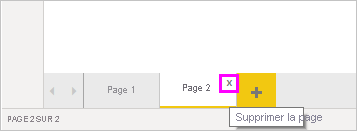
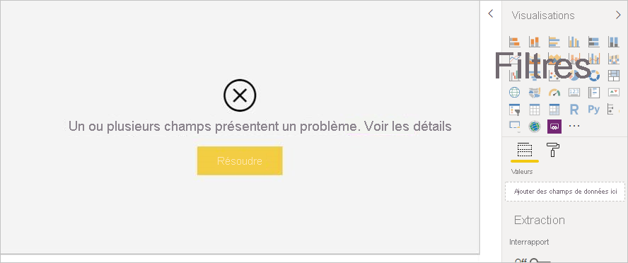
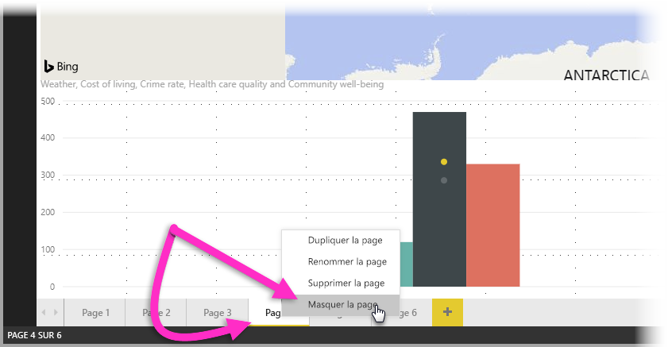
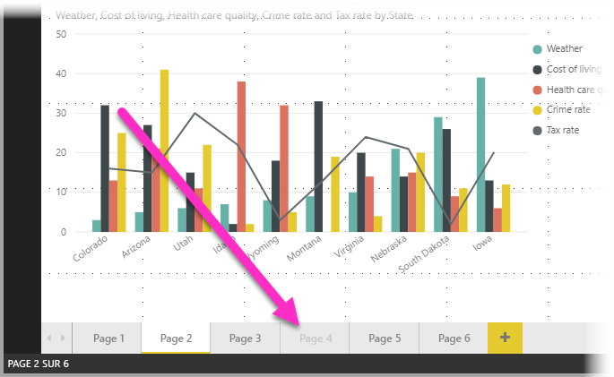

# Utiliser la vue Rapport dans Power BI Desktop

Si vous avez déjà utilisé Power BI, vous savez combien il est facile de créer des rapports fournissant des perspectives et des informations dynamiques de vos données. En outre, Power BI met à votre disposition d’autres fonctions avancées dans Power BI Desktop. Grâce à Power BI Desktop, créez des requêtes avancées, combinez des données de plusieurs sources, créez des relations entre des tables et bien plus encore.

Power BI Desktop comprend une *vue Rapport*, où vous pouvez créer un nombre quelconque de pages de rapport avec des visualisations. La vue Rapport dans Power BI Desktop offre une expérience conceptuelle identique au mode Édition d’un rapport dans le *service Power BI*. Vous pouvez déplacer des visualisations et effectuer des opérations comme copier-coller, fusionner, etc.

La différence est qu’avec Power BI Desktop, vous pouvez utiliser vos requêtes et modéliser vos données pour obtenir les meilleures analyses possibles dans les rapports. Vous pouvez ensuite enregistrer votre fichier Power BI Desktop à l’emplacement de votre choix (lecteur local ou cloud).

## Jetons un œil !

Quand vous chargez pour la première fois des données dans Power BI Desktop, le canevas de la vue Rapport est vide, avec des liens pour vous aider à ajouter des données à votre rapport.

Vous pouvez basculer entre les vues **Rapport**, **Données** et **Relations** en sélectionnant les icônes dans le volet de navigation gauche :

Une fois que vous avez ajouté des données, vous pouvez ajouter des champs à une nouvelle visualisation dans le canevas.

Pour modifier le type de visualisation, vous pouvez le sélectionner sur le canevas, puis sélectionner un nouveau type dans **Visualisations**.

> [!TIP]
> Effectuez des essais avec différents types de visualisations. Il est important que votre visualisation véhicule clairement les informations contenues dans vos données.

Un rapport possède au moins une page vierge au départ. Les pages apparaissent dans le volet de navigation à gauche du canevas. Vous pouvez ajouter toutes sortes de visualisations à une page, mais il est important de ne pas en abuser. Une page qui comporte trop de visualisations apparaît surchargée et devient difficile à explorer. Vous pouvez ajouter de nouvelles pages à votre rapport. Cliquez simplement sur **Nouvelle Page** dans le ruban.

Pour supprimer une page, cliquez sur le **X** sur l’onglet de la page au bas de la vue Rapport.

> [!NOTE]
> Vous ne pouvez pas épingler des rapports et des visualisations à un tableau de bord à partir de Power BI Desktop. Au lieu de cela, vous devez publier sur votre site Power BI. Pour plus d’informations, consultez [Publier des jeux de données et des rapports à partir de Power BI Desktop](desktop-upload-desktop-files.md).

## Faire des copier-coller d’un rapport à un autre

Vous pouvez facilement prendre un visuel d’un rapport Power BI Desktop pour le coller dans un autre rapport. Utilisez simplement le raccourci clavier Ctrl+C pour copier votre visuel de rapport. Dans l’autre rapport Power BI Desktop, utilisez Ctrl+V pour coller le visuel dans l’autre rapport. Vous pouvez sélectionner un seul visuel ou bien tous les visuels d’une page pour les copier, puis les coller dans le rapport Power BI Desktop de destination.

La possibilité de copier-coller des visuels est utile pour les personnes qui créent et mettent fréquemment à jour plusieurs rapports. En cas de copie entre différents fichiers, les paramètres et la mise en forme qui ont été définis explicitement dans le volet Mise en forme sont reportés, tandis que les visuels qui s’appuient sur un thème ou sur les paramètres par défaut sont automatiquement mis à jour en fonction du thème du rapport de destination. Par conséquent, une fois votre visuel mis en forme à votre guise, vous pouvez le copier et le coller dans de nouveaux rapports en préservant ce travail de mise en forme.

Si les champs de votre modèle sont différents, le visuel présentera une erreur et un avertissement sur les champs qui n’existent pas. L’erreur est similaire à celle qui apparaît en cas de suppression d’un champ du modèle utilisé par un visuel.

Pour corriger l’erreur, remplacez simplement les champs rompus par ceux que vous souhaitez utiliser dans le modèle où le visuel a été collé. Si vous utilisez un visuel personnalisé, il doit lui aussi être importé dans le rapport de destination.

## Masquer les pages d’un rapport

Lorsque vous créez un rapport, vous pouvez également masquer les pages d’un rapport. Cette approche peut être utile si vous devez créer des données sous-jacentes ou des visuels dans un rapport, mais souhaitez éviter que ces pages soient visibles à d’autres personnes, par exemple si vous créez des tables ou des visuels utilisés dans d’autres pages du rapport. Il existe de nombreuses autres raisons créatives de créer une page de rapport, puis de la masquer dans un rapport à publier.

Il est facile de masquer une page de rapport. Il suffit de cliquer avec le bouton droit sur l’onglet de la page du rapport puis de sélectionner **Masquer** dans le menu qui s’affiche.

Il existe quelques considérations à prendre en compte lorsque vous masquez une page de rapport :

* Vous pouvez toujours afficher un rapport masqué dans Power BI Desktop, même si le titre de la page est grisé. Dans l’image suivante, la page 4 est masquée.

    

* Vous *ne pouvez pas* afficher une page de rapport masquée lorsque vous visualisez le rapport dans le service Power BI.

* Le masquage d’une page de rapport ne constitue *pas* une mesure de sécurité. La page reste disponible pour les utilisateurs, et son contenu est toujours accessible à l’aide de la méthode d’extraction, entre autres.

* Lorsqu’une page est masquée en mode Affichage, aucune flèche de navigation n’apparaît.
