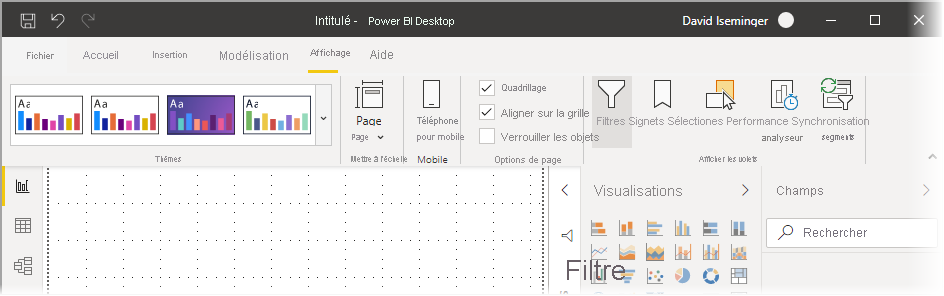
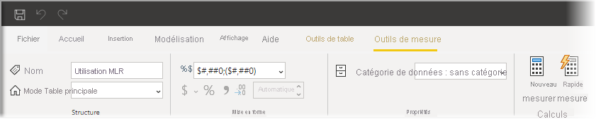

# Utiliser le ruban mis à jour dans Power BI Desktop

Power BI Desktop a modifié son ruban pour mieux aligner son apparence et son expérience avec les autres produits Microsoft, notamment Microsoft Office.

## Comment activer le ruban mis à jour

Le ruban mis à jour est généralement disponible à partir de la version de mai 2020 de Power BI Desktop. À partir de la mise à jour de mars 2020, le ruban mis à jour est activé par défaut. 

## Fonctionnalités du ruban mis à jour

Les avantages de la mise à jour de notre ruban sont destinés à faciliter et à améliorer l'expérience dans Power BI Desktop et dans d'autres produits Microsoft. 

Ces avantages peuvent être regroupés dans les catégories suivantes :

* **Amélioration de l'apparence et de la disposition** : les icônes et les fonctionnalités du ruban Power BI Desktop mis à jour reprennent l'apparence et la disposition des éléments du ruban présents dans les applications Office.

    

* **Une galerie de thèmes intuitive** : la galerie de thèmes, disponible dans le ruban **Affichage**, offre l'aspect familier de la galerie de thèmes PowerPoint. Ainsi, les images dans le ruban vous montrent à quoi ressembleront les changements de thème s'ils sont appliqués à votre rapport, par exemple les combinaisons de couleurs et les polices. 

    

* **Contenu dynamique du ruban basé sur votre affichage** : dans le ruban Power BI Desktop existant, les icônes ou commandes qui n'étaient pas disponibles étaient simplement grisées, créant une expérience non optimale. Avec le ruban mis à jour, les icônes sont affichées et organisées dynamiquement pour vous permettre d’identifier toujours les options à votre disposition selon le contexte.

* **Un ruban à une seule ligne qui vous fait gagner de l'espace une fois réduit** : un autre avantage du ruban mis à jour est la possibilité de réduire le ruban sur une seule ligne afin d’afficher dynamiquement les éléments du ruban selon le contexte. 

    

* **Touches d’accès pour parcourir et sélectionner des boutons** : pour mieux parcourir le ruban, vous pouvez appuyer sur **Alt+touche Windows** pour activer les touches d’accès. Une fois activées, vous pouvez appuyer sur les touches affichées de votre clavier pour naviguer.

    

* **Chaînes de format personnalisées** : en plus de la définition de chaînes de format personnalisées dans le volet *Propriétés*, vous pouvez également les définir dans le ruban. Sélectionnez la mesure ou la colonne à personnaliser et un onglet contextuel **Outils de mesure** ou **Outils de colonne** s’affiche, en fonction de votre sélection. Dans la section de mise en forme de cet onglet, vous pouvez taper votre chaîne de format personnalisée directement dans la zone de liste déroulante.

    

* **Accessibilité** : la barre de titre, le ruban et le menu Fichier sont entièrement accessibles. Appuyez sur Ctrl+F6 pour accéder à la section du ruban. À partir de là, vous pouvez utiliser **Tab** pour vous déplacer entre les barres supérieure et inférieure, et les touches de direction pour vous déplacer entre les éléments.

En plus de ces changements visibles, un ruban mis à jour nous permet également d’intégrer les futures mises à jour à Power BI Desktop et à son ruban, par exemple :

* Créer des commandes plus flexibles et intuitives dans le ruban, notamment la galerie de visuels
* Ajouter les thèmes Office *noir* et *gris foncé* à Power BI Desktop
* Améliorer l’accessibilité

## Étapes suivantes
Vous pouvez connecter toutes sortes de données à l’aide de Power BI Desktop. Pour plus d’informations sur les sources de données, consultez les ressources suivantes :

* [Qu’est-ce que Power BI Desktop ?](../fundamentals/desktop-what-is-desktop.md)
* [Sources de données dans Power BI Desktop](../connect-data/desktop-data-sources.md)
* [Mettre en forme et combiner des données dans Power BI Desktop](../connect-data/desktop-shape-and-combine-data.md)
* [Se connecter à des classeurs Excel dans Power BI Desktop](../connect-data/desktop-connect-excel.md)   
* [Entrer des données directement dans Power BI Desktop](../connect-data/desktop-enter-data-directly-into-desktop.md)   
