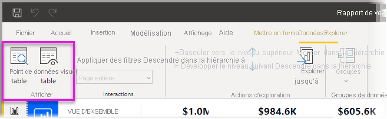
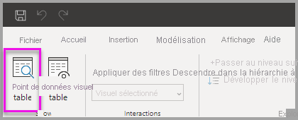
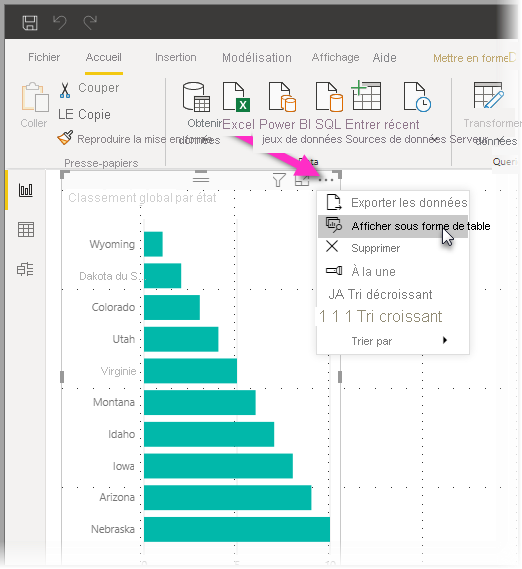
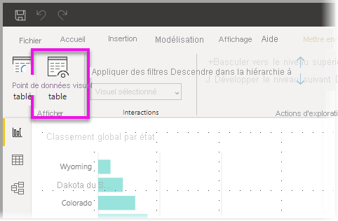

# Utiliser un tableau visuel et un tableau de points de données dans Power BI Desktop
Dans **Power BI Desktop**, vous pouvez explorer les détails d’une visualisation et consulter des représentations textuelles des données sous-jacentes ou enregistrements de données individuelles du visuel sélectionné. Ces fonctionnalités sont parfois appelées *interactif*, *extraction* ou *extraction jusqu’aux détails*.

Vous pouvez utiliser un **Tableau visuel** pour afficher les données d’un visuel sous la forme d’un tableau, ou utiliser un **Tableau de points de données** pour afficher un tableau des données utilisées pour calculer un point de données unique. 

>[!IMPORTANT]
>Le **Tableau de visuel** et le **Tableau de points de données** prennent uniquement en charge les types de visualisation suivants :
>  - Graphique à barres
>  - Histogramme
>  - Graphique en anneau
>  - Carte choroplèthe
>  - Entonnoir
>  - Carte
>  - Graphique en secteurs
>  - Treemap

## Utiliser un tableau visuel dans Power BI Desktop

Le **tableau visuel** vous montre les données sous-jacentes d’une visualisation. **Tableau visuel** s’affiche dans l’onglet **Données / Explorer** dans la section **Affichage** du ruban lorsqu’un visuel est sélectionné.

Vous pouvez également consulter les données en cliquant avec le bouton droit sur une visualisation, puis en sélectionnant **Afficher les données** dans le menu qui s’affiche ; ou en sélectionnant **Plus d’options** (...) dans le coin supérieur droit d’une visualisation, puis en sélectionnant **Afficher sous forme de tableau**.

&nbsp;&nbsp;

> [!NOTE]
> Vous devez pointer la souris sur un point de données du visuel pour que le menu contextuel soit disponible.

Lorsque vous sélectionnez **Tableau visuel** ou **Tableau de points de données**, le canevas de Power BI Desktop affiche en même temps le visuel et la représentation textuelle des données. Dans *l’affichage horizontal*, le visuel est affiché dans la moitié supérieure du canevas et les données s’affichent dans la moitié inférieure. 

Vous pouvez également basculer vers un affichage horizontal ou un *affichage vertical* en sélectionnant l’icône dans l’angle supérieur droit du canevas.

Pour revenir au rapport, sélectionnez **< Retour au rapport** dans l’angle supérieur gauche du canevas.

## Utiliser un tableau de points de données dans Power BI Desktop

Vous pouvez également vous concentrer sur un enregistrement de données et explorer les données qui se trouvent derrière. Pour utiliser **Tableau de points de données**, sélectionnez une visualisation, puis sélectionnez **Tableau de points de données** dans l’onglet **Données/Exploration** dans la section **Outils du visuel** du ruban, puis sélectionnez un point de données ou une ligne sur la visualisation. 

> [!NOTE]
> Si le bouton **Tableau de points de données** du ruban est désactivé et grisé, cela signifie que la visualisation sélectionnée ne prend pas en charge **Tableau de points de données**.

Vous pouvez également cliquer avec le bouton droit sur un élément de données et sélectionner **Tableau de points de données** dans le menu qui s’affiche.

Lorsque vous sélectionnez **Tableau de points de données** pour un élément de données, le canevas de Power BI Desktop affiche toutes les données associées à l’élément sélectionné. 

Pour revenir au rapport, sélectionnez **< Retour au rapport** dans l’angle supérieur gauche du canevas.

> [!NOTE]
>Le **Tableau de points de données** présente les limites suivantes :
> - Vous ne pouvez pas modifier les données dans la vue **Tableau de points de données** et les enregistrer dans le rapport.
> - Vous ne pouvez pas utiliser l’option **Tableau de points de données** si votre visuel utilise une mesure calculée dans un groupe de mesures (multidimensionnel).
> - Vous ne pouvez pas utiliser l’option **Tableau de points de données** quand vous êtes connecté à un modèle multidimensionnel (MD) actif.

## Étapes suivantes
Il existe toutes sortes de fonctionnalités de mise en forme de rapports et de gestion des données dans **Power BI Desktop**. Consultez les ressources suivantes pour voir quelques exemples :

* [Utiliser le regroupement et le compartimentage dans Power BI Desktop](desktop-grouping-and-binning.md)
* [Utiliser le quadrillage, l’alignement sur la grille, l’ordre de plan, l’alignement et la distribution dans les rapports Power BI Desktop](desktop-gridlines-snap-to-grid.md)

