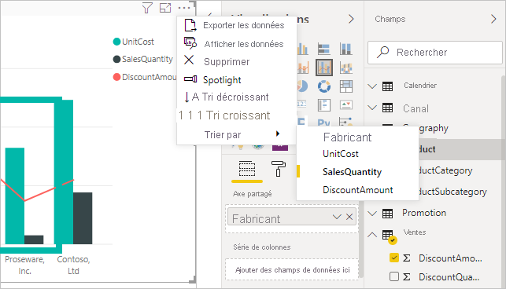
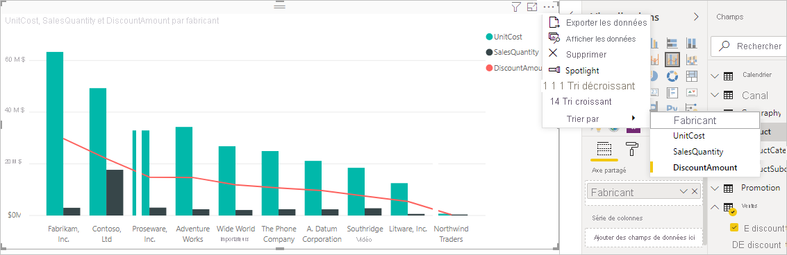
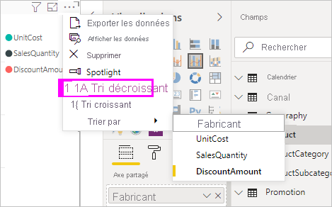
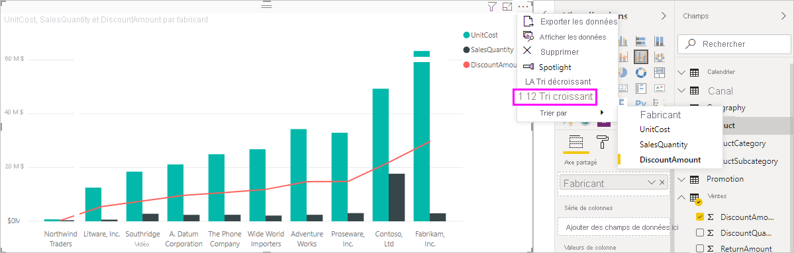
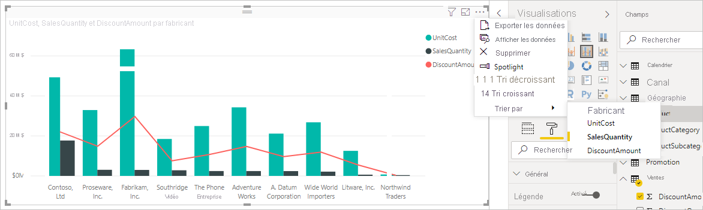

# Trier par colonne dans Power BI Desktop
Dans Power BI Desktop et le service Power BI, vous pouvez changer l’apparence d’un visuel en le triant selon différents champs de données. En changeant la façon dont vous triez un visuel, vous pouvez mettre en évidence les informations que vous voulez transmettre et vérifier que le visuel reflète cette tendance (ou cette importance).

Que vous utilisiez des données numériques (par exemple, des chiffres de ventes) ou des données de texte (comme des noms de région), vous pouvez trier vos visualisations et leur donner l’aspect souhaité. Power BI offre une grande souplesse sur le plan du tri et des menus rapides que vous pouvez utiliser. Pour trier un visuel, sélectionnez son menu **Plus d’options** (...), **Trier par**, puis le champ en fonction duquel vous souhaitez effectuer le tri.

## Exemple de tri
Prenons un exemple plus approfondi et voyons comment il fonctionne dans Power BI Desktop.

La visualisation suivante montre les coûts, les quantités et les montants par nom de fabricant. Voici la visualisation telle qu’elle apparaît avant le tri :

Le visuel est actuellement trié selon la colonne **SalesQuantity**. Nous pouvons identifier la colonne de tri d’après la correspondance entre la couleur des barres croissantes et la légende, mais il existe une meilleure méthode : le menu **Plus d’options**, accessible en sélectionnant les points de suspension (...).

Les sélections de tri sont les suivantes :

* Le champ de tri actuel est **SalesQuantity**, indiqué par l’option **SalesQuantity** en gras précédée d’une barre jaune. 

* L’ordre du tri actuel est croissant, comme indiqué par l’option **Tri croissant** en gras précédée d’une barre jaune.

Nous allons examiner le champ de tri et l’ordre de tri dans les deux sections suivantes.

## Sélectionner la colonne à utiliser pour le tri
Vous avez remarqué la barre jaune précédant **SalesQuantity** dans le menu **Plus d’options**, qui indique que le visuel est trié selon la colonne **SalesQuantity**. Il est simple de trier selon une autre colonne : sélectionnez les points de suspension (...) pour afficher le menu **Plus d’options**, **Trier par**, puis une autre colonne.

Dans l’image suivante, nous sélectionnons **DiscountAmount** comme colonne selon laquelle nous voulons trier. Cette colonne apparaît comme une des lignes sur le visuel, et non comme une des barres. 

Remarquez les changements sur l’élément visuel. Les valeurs sont maintenant classées de la valeur la plus élevée de **DiscountAmount**, Fabrikam Inc., à la valeur la plus faible, Northwind Traders. 

Mais que se passe-t-il si nous souhaitons effectuer un tri en ordre croissant, plutôt que décroissant ? La section suivante montre à quel point cela est simple.

## Sélectionner l’ordre de tri
Lorsque nous examinons de plus près le menu **Plus d’options** à partir de l’image précédente, nous voyons que l’option **Tri décroissant** est en gras précédée d’une barre jaune.

Quand l’option **Tri décroissant** est sélectionnée, cela signifie que le visuel est trié en fonction de la colonne sélectionnée, de la valeur la plus élevée à la plus faible. Vous souhaitez changer cela ? Aucun problème. Il vous suffit de sélectionner **Tri croissant** et l’ordre de tri de la colonne sélectionnée s’établit de la valeur la plus faible à la plus élevée.

Voici le même visuel, après la modification de l’ordre de **DiscountAmount**. Notez que Northwind Traders est maintenant le premier fabricant de la liste et que Fabrikam Inc. est le dernier, c’est-à-dire l’inverse du tri précédent.

Vous pouvez trier selon n’importe quelle colonne incluse dans le visuel : nous pourrions aussi bien avoir sélectionné **SalesQuantity** comme colonne en fonction de laquelle trier pour afficher d’abord les fabricants avec le plus de ventes, tout en conservant les autres colonnes dans le visuel, car elles s’appliquent à ce fabricant. Voici un aperçu du visuel avec ces paramètres :

## Tri à l’aide du bouton Trier par colonne
Il existe une autre façon de trier vos données, en utilisant le bouton **Trier par colonne** situé dans le ruban **Modélisation**.

Cette approche du tri exige que vous sélectionniez d’abord la colonne (le champ) à trier dans le volet **Champs**, puis **Modélisation** > **Trier par colonne** pour trier votre visuel. Si vous ne sélectionnez pas de colonne, le bouton **Trier par colonne** est inactif.

Examinons un exemple courant. Vous avez des données pour chaque mois de l’année et vous voulez les trier par ordre chronologique. Pour cela, procédez comme suit :

1. Notez que quand le visuel est sélectionné, mais qu’aucune colonne n’est sélectionnée dans le volet **Champs**, le bouton **Trier par colonne** est inactif (grisé).
   
   

2. Lorsque vous sélectionnez la colonne selon laquelle effectuer le tri, dans le volet **Champs**, le bouton **Trier par colonne** devient actif.
   
   
3. À présent, le visuel étant sélectionné, vous pouvez sélectionner **MonthOfYear** au lieu de la valeur par défaut **MonthName** pour trier le visuel dans l’ordre souhaité : en fonction du mois de l’année.
   
   

<!---
This functionality is no longer active. Jan 2020

## Getting back to default column for sorting
You can sort by any column you'd like, but there may be times when you want the visual to return to its default sorting column. No problem. For a visual that has a sort column selected, open the **More options** menu and select that column again, and the visualization returns to its default sort column.

For example, here's our previous chart:

When we go back to the menu and select **SalesQuantity** again, the visual defaults to being ordered alphabetically by **Manufacturer**, as shown in the following image.

With so many options for sorting your visuals, creating just the chart or image you want is easy.
--->

## Étapes suivantes

Les articles suivants pourraient également vous intéresser :

* [Use cross-report drillthrough in Power BI Desktop](desktop-cross-report-drill-through.md) (Utiliser une extraction interrapport dans Power BI Desktop)
* [Segments dans Power BI](../visuals/power-bi-visualization-slicers.md)
