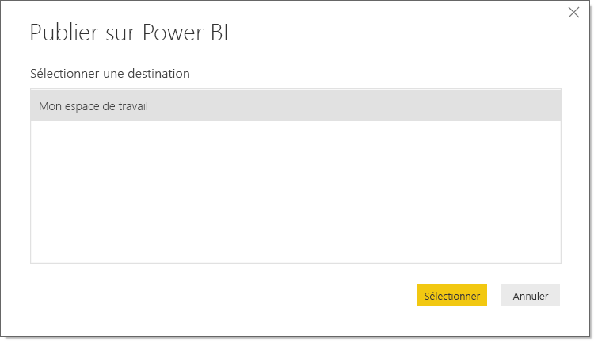
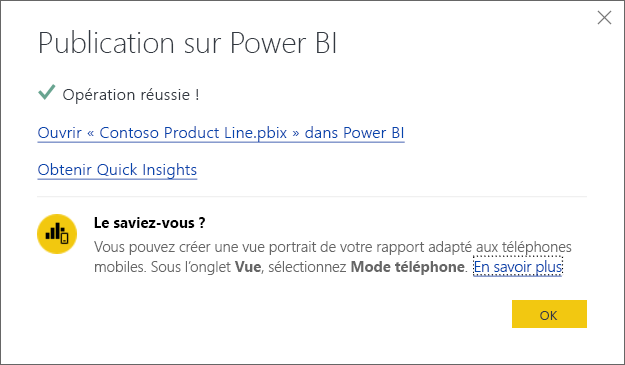
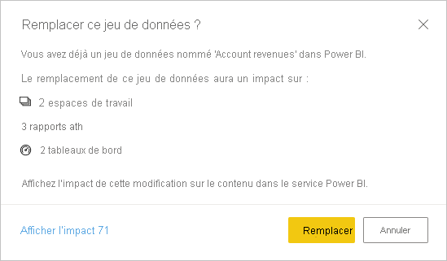

# Publier des jeux de données et des rapports à partir de Power BI Desktop
Quand vous publiez un fichier Power BI Desktop dans le service Power BI, vous publiez les données du modèle dans votre espace de travail Power BI. Il en va de même pour tous les rapports que vous avez créés dans la vue**Rapport**. Un nouveau jeu de données du même nom et tous les rapports seront visibles dans le navigateur de votre espace de travail.

La publication à partir de Power BI Desktop a le même effet que l’utilisation de l’option **Obtenir des données** dans Power BI pour se connecter à un fichier Power BI Desktop et le charger.

> [!NOTE]
> Tous les changements que vous apportez au rapport dans Power BI ne seront pas enregistrés dans le fichier Power BI Desktop d’origine. Cela inclut l’ajout, la suppression ou le changement des visualisations dans les rapports.

## Pour publier un jeu de données et des rapports Power BI Desktop
1. Dans Power BI Desktop, choisissez **Fichier** \> **Publier** \> **Publier sur Power BI** ou sélectionnez **Publier** dans le ruban.  

   

2. Connectez-vous à Power BI.
3. Sélectionnez la destination.

   

Une fois la publication terminée, vous recevez un lien vers votre rapport. Sélectionnez ce lien pour ouvrir le rapport dans votre site Power BI.

## Republier ou remplacer un jeu de données publié à partir de Power BI Desktop
Le jeu de données et tous les rapports que vous avez créés dans Power BI Desktop sont chargés sur votre site Power BI quand vous publiez un fichier Power BI Desktop. Quand vous republiez votre fichier Power BI Desktop, le jeu de données de votre site Power BI est remplacé par le jeu de données mis à jour à partir du fichier Power BI Desktop.

Ce processus est assez simple, mais vous devez savoir un certain nombre de choses :

* Si plusieurs jeux de données dans Power BI portent le même nom que le fichier Power BI Desktop, la publication peut échouer. Veillez à ce que chaque jeu de données dans Power BI porte un nom unique. Vous pouvez également renommer le fichier et le publier, créant ainsi un jeu de données du même nom que le fichier.
* Si vous renommez ou supprimez une colonne ou une mesure, les visualisations que vous avez déjà dans Power BI avec ce champ peuvent être rompues. 
* Power BI ignore certaines modifications de format des colonnes existantes, par exemple, si vous faites passer le format d’une colonne de 0,25 % à 25 %.
* Supposons que vous avez une planification d’actualisation configurée pour votre jeu de données existant dans Power BI. Quand vous ajoutez de nouvelles sources de données à votre fichier et que vous effectuez une republication, vous devez vous connecter à ces sources avant la prochaine actualisation planifiée.
* Quand vous republiez un jeu de données publié à partir de Power BI Desktop et que vous avez défini une planification d’actualisation, une actualisation du jeu de données est démarrée dès que vous effectuez la republication.
* Quand vous apportez une modification à un jeu de données et que vous le republiez ensuite, un message indique le nombre d’espaces de travail, rapports et tableaux de bord susceptibles d’être impactés par la modification, et vous invite à confirmer que vous souhaitez remplacer le jeu de données actuellement publié par celui que vous avez modifié. Ce message contient également un lien vers l’analyse d’impact complète du jeu de données dans le service Power BI, où vous pouvez voir plus d’informations et prendre des mesures pour atténuer les risques liés à vos modifications.

   

   [En savoir plus sur l’analyse d’impact des jeux de données](../collaborate-share/service-dataset-impact-analysis.md).

> [!NOTE]
> Une connexion de données dans des rapports Power BI peut inclure des liens vers des données, au lieu d’inclure les données du jeu de données importé dans le service Power BI. Par exemple, les connexions DirectQuery établissent un lien aux données quand des mises à jour ou des interactions se produisent, au lieu d’importer les données elles-mêmes. Si les sources de données liées dans votre rapport sont locales, vous pouvez avoir besoin d’une passerelle pour y accéder depuis Power BI. Pour plus d’informations, consultez [Qu’est-ce qu’une passerelle de données locale ?](../connect-data/service-gateway-onprem.md).
> 