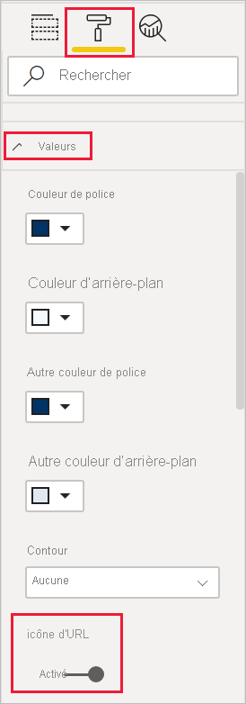
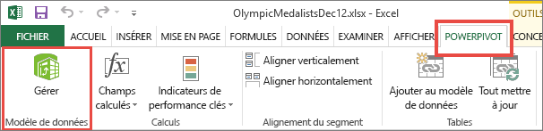
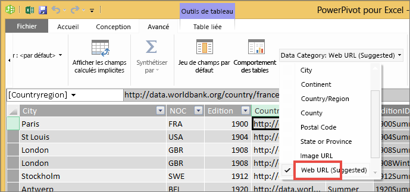

# Ajouter des liens hypertextes (URL) à une table ou à une matrice
Cette rubrique explique comment ajouter des liens hypertextes (URL) à une table. Vous utilisez Power BI Desktop pour ajouter des liens hypertextes (URL) à un jeu de données. Vous pouvez ajouter des liens hypertextes à vos matrices et tables de rapports dans Power BI Desktop ou le service Power BI. Vous pouvez ensuite afficher l’URL ou une icône de lien, ou mettre en forme une autre colonne comme texte de lien.

Vous pouvez également créer des liens hypertextes dans les [zones de texte des rapports](service-add-hyperlink-to-text-box.md) dans le service Power BI et dans Power BI Desktop. Dans le service Power BI, vous pouvez aussi ajouter des liens hypertextes aux [vignettes des tableaux de bord](service-dashboard-edit-tile.md) et aux [zones de texte des tableaux de bord](service-dashboard-add-widget.md). 

## Mettre en forme une URL comme lien hypertexte dans Power BI Desktop

Il est possible de mettre en forme un champ comportant des URL comme liens hypertextes dans Power BI Desktop, mais pas dans le service Power BI. Vous pouvez également [mettre en forme des liens hypertextes dans PowerPivot pour Excel](#create-a-table-or-matrix-hyperlink-in-excel-power-pivot) avant d’importer le classeur dans Power BI.

1. Dans Power BI Desktop, si un champ comportant un lien hypertexte n’existe pas déjà dans votre jeu de données, ajoutez-le en tant que [colonne personnalisée](../transform-model/desktop-common-query-tasks.md).

    > [!NOTE]
    > On ne peut pas créer de colonne en mode DirectQuery.  Mais si vos données contiennent déjà des URL, vous pouvez les convertir en liens hypertexte.

2. Dans la vue Données ou Rapport, sélectionnez la colonne. 

3. Dans l’onglet **Modélisation**, sélectionnez **Catégorie de données** > **URL Web**.
   
    

    > [!NOTE]
    > Les URL doivent commencer par certains préfixes. Pour voir la liste complète, consultez [Considérations et résolution des problèmes](#considerations-and-troubleshooting) dans cet article.

## Créer une table ou une matrice avec un lien hypertexte

1. Une fois que vous avez [affiché un lien hypertexte sous forme d’URL](#format-a-url-as-a-hyperlink-in-power-bi-desktop), basculez vers l’affichage Rapport.
2. Créez une table ou une matrice avec le champ que vous avez catégorisé comme URL Web. Les liens hypertextes sont en bleu et soulignés.

    

## Afficher une icône de lien hypertexte à la place d’une URL

Si vous ne souhaitez pas afficher une URL longue dans une table, vous pouvez afficher une icône de lien hypertexte  à la place. 

> [!NOTE]
> On ne peut pas afficher d’icônes dans une matrice.
   
1. Tout d’abord, [créez une table avec un lien hypertexte](#create-a-table-or-matrix-with-a-hyperlink).

2. Sélectionnez la table pour l’activer.

    Sélectionnez l’icône **Mettre en forme**  pour ouvrir l’onglet Mettre en forme.

    Développez **Valeurs**, recherchez **Icône d’URL** et **activez-la**.

    

1. (Facultatif) [Publiez le rapport](desktop-upload-desktop-files.md) de Power BI Desktop dans le service Power BI. Lorsque vous ouvrez le rapport dans le service Power BI, les liens hypertextes fonctionnent également.

## Mettre en forme le texte de lien comme lien hypertexte

Vous pouvez également mettre en forme un autre champ d’une table comme lien hypertexte et ne pas avoir de colonne pour l’URL. Dans ce cas, vous ne mettez pas en forme la colonne comme URL Web.

> [!NOTE]
> Il n’est pas possible de mettre en forme un autre champ comme lien hypertexte dans une matrice.

1. Si un champ comportant un lien hypertexte n’existe pas déjà dans votre jeu de données, utilisez Power BI Desktop pour l’ajouter en tant que [colonne personnalisée](../transform-model/desktop-common-query-tasks.md). Là encore, on ne peut pas créer de colonne en mode DirectQuery.  Mais si vos données contiennent déjà des URL, vous pouvez les convertir en liens hypertexte.

2. Dans la vue Données ou Rapport, sélectionnez la colonne qui contient l’URL. 

3. Sous l’onglet **Modélisation**, sélectionnez **Catégorie de données**. Vérifiez que la colonne est mise en forme comme **Sans catégorie**.

2. Dans la vue Rapport, créez une table ou une matrice avec la colonne d’URL et la colonne que vous allez mettre en forme comme texte de lien.

3. Une fois la table sélectionnée, sélectionnez l’icône **Mettre en forme**  pour ouvrir l’onglet Mettre en forme.

4. Développez **Mise en forme conditionnelle**, en veillant à ce que le nom dans la zone corresponde à la colonne que vous souhaitez mettre en forme comme texte de lien. Recherchez **URL web** et **activez-la**.

    

    > [!NOTE]
    > Si vous ne voyez pas d’option **URL web**, vérifiez que la colonne qui contient les liens hypertexte n’est *pas* mise en forme comme **URL web** dans la zone de liste déroulante **Catégorie de données**.

5. Dans la boîte de dialogue **URL Web**, sélectionnez le champ contenant l’URL dans la zone **En fonction du champ** > **OK**.

    

    Le texte de cette colonne est maintenant mis en forme comme lien.

    

1. (Facultatif) [Publiez le rapport](desktop-upload-desktop-files.md) de Power BI Desktop dans le service Power BI. Lorsque vous ouvrez le rapport dans le service Power BI, les liens hypertextes fonctionnent également.

## Créer un lien hypertexte de tableau ou matrice dans Excel PowerPivot

Une autre méthode pour ajouter des liens hypertexte à vos tableaux et matrices Power BI consiste à créer des liens hypertexte dans le jeu de données avant d’importer ce dernier ou de vous y connecter à partir de Power BI. Cet exemple utilise un classeur Excel.

1. Ouvrez le classeur dans Excel.
2. Sélectionnez l’onglet **PowerPivot**, puis choisissez **Gérer**.
   
   
1. Quand PowerPivot s’ouvre, sélectionnez l’onglet **Avancé**.
   
   
4. Placez votre curseur dans la colonne qui contient les URL que vous voulez transformer en liens hypertexte dans les tables Power BI.
   
   > [!NOTE]
   > Les URL doivent commencer par certains préfixes. Consultez [Considérations et résolution des problèmes](#considerations-and-troubleshooting) pour obtenir la liste complète.
   > 
   
5. Dans le groupe **Propriétés de rapport** , sélectionnez la liste déroulante **Catégorie des données** , puis choisissez **URL web**. 
   
   

6. Depuis le service Power BI ou Power BI Desktop, connectez-vous à ce classeur ou importez-le.
7. Créez une visualisation de table comprenant le champ d’URL.
   
   

## Considérations et résolution des problèmes

Les URL doivent commencer l’un des préfixes suivants :
- http
- https
- -mailto
- ftp
- news
- telnet

Q : Peut-on utiliser une URL personnalisée comme lien hypertexte dans un tableau ou dans une matrice ?    
A : Non. Il est possible d’utiliser une icône de lien. Si vous avez besoin d’un texte personnalisé pour vos liens hypertextes et que votre liste d’URL est courte, vous pouvez utiliser une zone de texte à la place.

## Étapes suivantes
[Visualisations dans des rapports Power BI](../visuals/power-bi-report-visualizations.md)

[Fondamentaux pour les concepteurs dans le service Power BI](../fundamentals/service-basic-concepts.md)

D’autres questions ? [Posez vos questions à la communauté Power BI](https://community.powerbi.com/)
