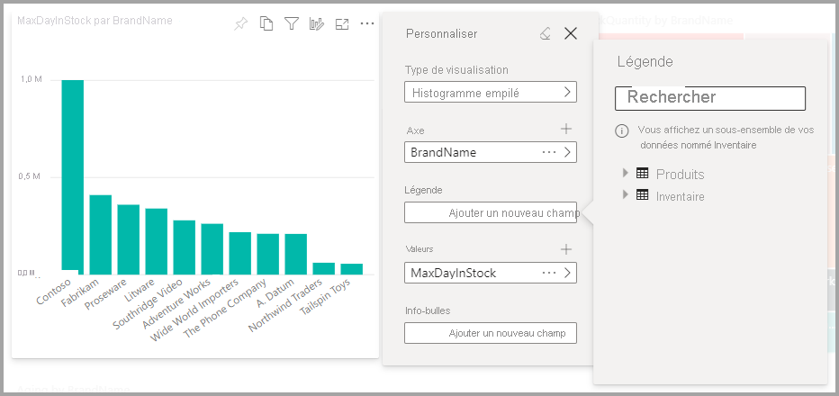
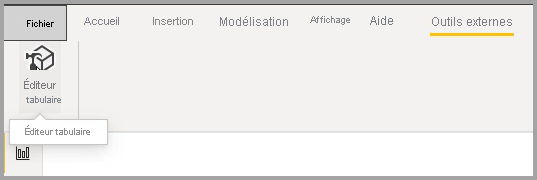
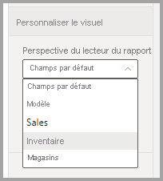

# Permettre aux utilisateurs de personnaliser les visuels dans un rapport

[!INCLUDE [applies-to](../includes/applies-to.md)] [!INCLUDE [yes-desktop](../includes/yes-desktop.md)] [!INCLUDE [yes-service](../includes/yes-service.md)]

Lorsque vous partagez un rapport avec un large public, il se peut que certains de vos utilisateurs veuillent voir des affichages légèrement différents des visuels : par exemple, permuter les données de l’axe, changer le type de visuel ou ajouter un élément à l’info-bulle. Il est difficile de créer un visuel qui réponde aux exigences de tout le monde. Avec cette nouvelle fonctionnalité, vous pouvez donner à vos utilisateurs professionnels la possibilité d’explorer et de personnaliser des visuels, le tout en mode lecture de rapport. Ils peuvent ajuster le visuel à leur guise et l’enregistrer dans leurs signets pour y revenir par la suite. Ils n’ont besoin ni de disposer d’une autorisation de modification sur le rapport, ni de demander une modification à l’auteur du rapport.

:::image type="content" source="media/power-bi-personalize-visuals/power-bi-personalize-visual.png" alt-text="Personnalisation d’un visuel":::
 
## Éléments modifiables par les utilisateurs de rapports

Cette fonctionnalité permet aux utilisateurs professionnels d’obtenir davantage d’insights grâce à l’exploration ad hoc des visuels d’un rapport Power BI. Pour découvrir comment utiliser cette fonctionnalité en tant qu’utilisateur professionnel, consultez [Personnaliser les visuels dans vos rapports](../consumer/end-user-personalize-visuals.md). Elle est idéale pour les créateurs de rapports qui veulent proposer des scénarios d’exploration de base aux lecteurs de leurs rapports. Voici quelques-unes des modifications que ces derniers peuvent effectuer :

- Changer de type de visualisation
- Permuter une mesure ou une dimension
- Ajouter ou supprimer une légende
- Comparer deux ou plusieurs mesures
- Modifier les agrégations

Cette fonctionnalité offre non seulement de nouvelles fonctionnalités d’exploration, mais aussi le moyen pour les utilisateurs professionnels de capturer et de partager leurs modifications :

- Capturer leurs modifications
- Partager leurs modifications
- Réinitialiser toutes leurs modifications dans un rapport
- Réinitialiser toutes leurs modifications dans un visuel
- Effacer leurs modifications récentes

## Utiliser les Perspectives pour une vue plus ciblée

Pour personnaliser les visuels, vous pouvez utiliser des **perspectives** pour choisir un sous-ensemble d’un modèle qui fournit une vue plus ciblée. Le choix d’un sous-ensemble peut être utile lors de l’utilisation d’un modèle de données volumineux, ce qui vous permet de vous concentrer sur un sous-ensemble gérable de champs et de ne pas saturer les lecteurs de rapports avec la collection complète des champs de ce modèle volumineux. 

Tenez compte des points suivants lorsque vous travaillez avec les perspectives :

* Les perspectives ne sont pas censées servir de mécanisme de sécurité ; elles constituent plutôt un outil qui optimise l'expérience de l'utilisateur final. Toute la sécurité d'une perspective est héritée du modèle sous-jacent.

* Les perspectives sont prises en charge à la fois dans les modèles tabulaires et multidimensionnels. Toutefois, pour les perspectives dans les modèles multidimensionnels, vous pouvez uniquement définir la perspective pour qu’elle soit identique au cube de base pour le rapport.

* Avant de supprimer une perspective d’un modèle, vérifiez que la perspective n’est pas utilisée dans l’expérience Personnaliser les visuels. 

Pour utiliser les perspectives, vous devez activer Personnaliser les visuels pour le rapport. Vous devez également créer au moins une perspective qui comprend les dimensions et les mesures auxquelles les utilisateurs finaux peuvent interagir pour l’expérience Personnaliser les visuels.

Pour créer la perspective, utilisez l’[éditeur tabulaire](https://tabulareditor.com/), que vous pouvez télécharger à partir de l’emplacement suivant : Téléchargement de l’éditeur tabulaire

Une fois que vous avez installé l’**éditeur tabulaire**, ouvrez votre rapport dans **Power BI Desktop** et lancez l’**éditeur tabulaire** à partir de l’onglet **Outils externes** du ruban, comme illustré dans l’image suivante.

Dans l’éditeur tabulaire, cliquez avec le bouton droit sur le dossier **Perspectives** pour créer une perspective.

Vous pouvez double-cliquer sur le texte pour renommer la perspective.

Ensuite, ajoutez des champs à la perspective en ouvrant le dossier **Tables** dans l’éditeur tabulaire ; cliquez alors avec le bouton droit sur les champs que vous souhaitez afficher dans la perspective.

Répétez ce processus pour chaque champ que vous souhaitez ajouter à la perspective. Vous ne pouvez pas ajouter de champs dupliqués dans une perspective, donc tous les champs que vous avez déjà ajoutés à une perspective auront l’option d’ajout désactivée.

Une fois que vous avez ajouté tous les champs souhaités, veillez à enregistrer vos paramètres, à la fois dans l’éditeur tabulaire et dans Power BI Desktop.

Une fois que vous avez enregistré la nouvelle perspective dans le modèle et enregistré le rapport Power BI Desktop, accédez au volet **Mise en forme** de la page, où vous voyez une nouvelle section pour **Personnaliser le visuel**.

La sélection pour *Perspective du lecteur du rapport* est définie sur *Champs par défaut* initialement. Une fois que vous avez sélectionné la flèche déroulante, vous voyez les autres perspectives que vous avez créées.

Une fois que vous avez défini la perspective pour la page de rapport, l’expérience Personnaliser les visuels de cette page est filtrée sur la perspective sélectionnée. Si vous sélectionnez **Appliquer à toutes les pages**, vous pouvez appliquer votre paramètre de perspective à toutes les pages existantes de votre rapport.

## Activation de la personnalisation dans un rapport

Vous pouvez activer la fonctionnalité dans Power BI Desktop ou dans le service Power BI. Vous pouvez également l’activer dans les rapports incorporés.

### Dans Power BI Desktop

Pour activer la fonctionnalité dans Power BI Desktop, accédez à **Fichier** > **Options et paramètres** > **Options** > **Fichier actuel** > **Paramètres du rapport**. Activez **Personnaliser les visuels**.

:::image type="content" source="media/power-bi-personalize-visuals/personalize-report-setting-desktop.png" alt-text="Activation de la personnalisation dans un rapport":::

### Dans le service Power BI

Si vous souhaitez plutôt activer la fonctionnalité dans le service Power BI, accédez aux **Paramètres** de votre rapport.

:::image type="content" source="media/power-bi-personalize-visuals/power-bi-report-service-settings-personalize-visual.png" alt-text="Paramètres du rapport dans le service Power BI":::

Activez **Personnaliser les visuels** > **Enregistrer**.

:::image type="content" source="media/power-bi-personalize-visuals/personalize-report-setting-service.png" alt-text="Activation de Personnaliser les visuels dans le service":::

## Activer ou désactiver la fonctionnalité au niveau d’une page ou d’un visuel

Lorsque vous activez Personnaliser les visuels pour un rapport donné, tous les visuels de ce rapport sont par défaut personnalisables. Si vous ne souhaitez pas que tous les visuels soient personnalisés, vous pouvez activer ou désactiver le paramètre pour chaque page ou visuel.

### Par page

Sélectionnez l’onglet Page > sélectionnez **Mise en forme** dans le volet **Visualisations**.

:::image type="content" source="media/power-bi-personalize-visuals/personalize-page-level-setting.png" alt-text="Sélectionnez Personnaliser les visuels pour une page.":::
 
Faites glisser **Personnaliser le visuel** >  **Activé** ou **Désactivé**.

### Par visuel

Sélectionnez le visuel > sélectionnez **Format** dans le volet **Visualisations** > développez **En-tête de visuel**.

:::image type="content" source="media/power-bi-personalize-visuals/power-bi-format-visual-header-personalize.png" alt-text="Sélection de En-tête de visuel":::
 
Faites glisser **Personnaliser le visuel** >  **Activé** ou **Désactivé**.

:::image type="content" source="media/power-bi-personalize-visuals/power-bi-format-visual-personalize-on-off.png" alt-text="Curseur Personnaliser le visuel activé ou désactivé":::

## Limites

La fonctionnalité présente actuellement quelques limitations à connaître.

- Cette fonctionnalité n’est pas prise en charge pour la publication sur le web.
- Les explorations des utilisateurs ne sont pas automatiquement conservées. Vous devez enregistrer votre affichage dans les signets personnels pour capturer vos modifications.
- Cette fonctionnalité est prise en charge dans les applications mobiles Power BI pour les tablettes iOS et Android, ainsi que dans l’application Windows Power BI. Elle n’est pas prise en charge dans les applications mobiles Power BI pour les téléphones. Toutefois, les modifications de visuels enregistrées dans un signet personnel au sein du service Power BI sont respectées dans les applications mobiles Power BI.

## Étapes suivantes

[Personnaliser les visuels dans vos rapport](../consumer/end-user-personalize-visuals.md).     

Essayez la nouvelle expérience de personnalisation de visuels. Faites-nous part de vos commentaires pour cette fonctionnalité et de la façon dont nous pouvons continuer à améliorer cette expérience, sur le [site Power BI Ideas](https://ideas.powerbi.com/forums/265200-power-bi). 

D’autres questions ? [Posez vos questions à la communauté Power BI](https://community.powerbi.com/)
