# <a name="design-filters-in-power-bi-reports"></a>Conception de filtres dans les rapports Power BI

[!INCLUDE [applies-to](../includes/applies-to.md)] [!INCLUDE [yes-desktop](../includes/yes-desktop.md)] [!INCLUDE [yes-service](../includes/yes-service.md)]

Avec la nouvelle expérience de filtre, vous disposez d’un grand contrôle sur la conception et les fonctionnalités du filtre de rapport. Vous pouvez mettre en forme le volet Filtres pour qu’il ressemble au reste du rapport. Vous pouvez verrouiller et même masquer les filtres. Lorsque vous concevez votre rapport, l’ancien volet Filtres n’apparaît plus dans volet Visualisations. Toutes les opérations d’édition et de mise en forme sont réalisées dans un même volet Filtres. 

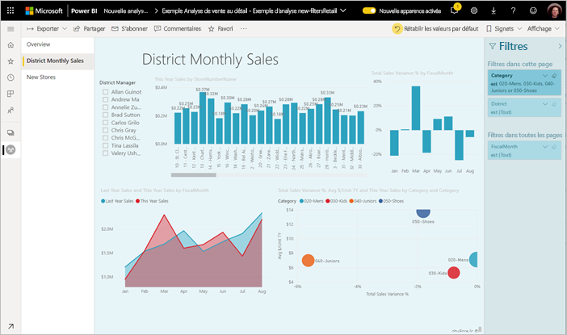

En tant que concepteur de rapports, voici quelques-unes des tâches que vous pouvez effectuer dans le nouveau volet Filtres :

- Ajoutez et supprimez des champs à filtrer. 
- Modifiez l’état du filtre.
- Mettez en forme et personnalisez le volet Filtres afin qu’il fasse partie de votre rapport.
- Définissez si le volet Filtres est ouvert ou réduit par défaut lorsqu’un consommateur ouvre le rapport.
- Masquez la totalité du volet Filtres ou des filtres spécifiques que vous ne souhaitez pas afficher pour les consommateurs du rapport.
- Contrôlez et créez même un signet de l’état de visibilité, ouvert et réduit du volet Filtres.
- Verrouillez les filtres que vous ne souhaitez pas que les consommateurs modifient.

Lors de la lecture d’un rapport, les consommateurs du rapport peuvent pointer sur n’importe quel visuel pour afficher la liste en lecture seule de tous les filtres ou segments affectant ce visuel.

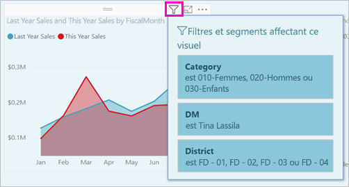

Découvrez [comment les lecteurs de rapports utilisent les filtres](../consumer/end-user-report-filter.md) dans votre rapport.

## <a name="view-filters-for-a-visual-in-reading-mode"></a>Afficher les filtre pour un visuel en mode Lecture

En mode Lecture, pointez sur l’icône de filtre d’un visuel pour voir une fenêtre contextuelle avec tous les filtres, les segments et ainsi de suite, qui affectent ce visuel. La mise en forme de la liste de filtres est identique à celle du volet Filtres.

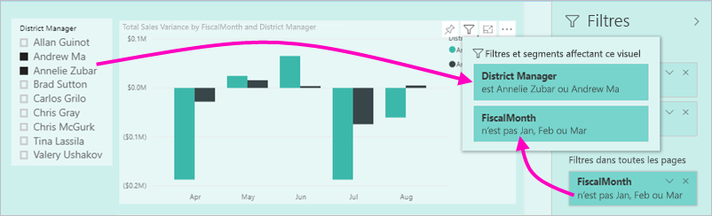

Voici les types de filtres affichés par cette vue :

- Filtres de base
- Segments
- Mise en surbrillance croisée 
- Filtrage croisé
- Filtres avancés
- N filtres principaux
- Filtres de date relative
- Segments synchronisés
- Filtres Inclure/Exclure
- Filtres transmis via une URL

Découvrez-en plus sur l’[interaction avec les filtres en mode Lecture](../consumer/end-user-report-filter.md).

## <a name="build-the-filters-pane"></a>Générer le volet Filtres

Après avoir activé le nouveau volet Filtres, il s’affiche à droite de la page du rapport, mis en forme par défaut en fonction de vos paramètres de rapport actuels. Dans le volet Filtres, vous configurez les filtres à inclure et mettez à jour les filtres existants. Le volet Filtres s’affiche de la même façon pour les consommateurs de votre rapport lorsque vous publiez votre rapport. 

1. Par défaut, les consommateurs de votre rapport peuvent voir le volet Filtres. Si vous ne souhaitez pas que ces consommateurs voient le volet, sélectionnez l’icône représentant un œil en regard de **Filtres**.

    

2. Pour commencer à créer votre volet Filtres, faites glisser les champs d’intérêt dans le volet Filtres en tant que filtres au niveau du visuel, de la page ou du rapport.

Quand vous ajoutez un visuel à un canevas de rapport, Power BI ajoute automatiquement un filtre au volet Filtres pour chaque champ dans le visuel. 

## <a name="hide-the-filters-pane-while-editing"></a>Masquer le volet de filtres lors de la modification

Power BI Desktop a un nouveau ruban en préversion. Sous l’onglet **Affichage**, le bouton bascule **Filtres** vous permet d’afficher ou de masquer le volet Filtres. Cette fonctionnalité est utile lorsque vous n’utilisez pas le volet Filtres et que vous avez besoin d’espace supplémentaire sur l’écran. Cet ajout aligne le volet Filtres avec les autres volets que vous pouvez ouvrir et fermer, tels que les volets Signets et Sélection. 

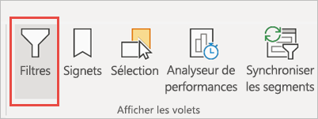

Ce paramètre masque uniquement le volet Filtres dans Power BI Desktop. Si vous souhaitez masquer le volet Filtres pour vos utilisateurs finaux, sélectionnez à la place l’icône représentant un **œil** en regard de **Filtres**.

 

## <a name="lock-or-hide-filters"></a>Verrouiller ou masquer des filtres

Vous pouvez verrouiller ou masquer des cartes de filtre individuelles. Si vous verrouillez un filtre, vos consommateurs de rapports peuvent l’afficher, mais pas le modifier. Si vous le masquez, ils ne peuvent pas l’afficher. Le masquage des cartes de filtre est généralement utile si vous avez besoin de masquer des filtres de nettoyage de données qui excluent les valeurs NULL ou des valeurs inattendues. 

- Dans le volet Filtres, sélectionnez ou désélectionnez les icônes **Verrouiller le filtre** ou **Masquer le filtre** dans une carte de filtre.

   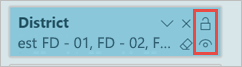

Lorsque vous activez et désactivez ces paramètres dans le volet Filtres, les modifications sont répercutées dans le rapport. Les filtres masqués ne s’affichent pas dans la fenêtre contextuelle de liste de filtres pour un visuel.

Vous pouvez également configurer l’état de votre volet Filtres pour qu’il s’accorde aux signets de votre rapport. L’état ouvert, fermé et la visibilité du volet peuvent être configurés comme signets.
 
## <a name="format-the-filters-pane"></a>Mettre en forme le volet Filtres

Une grande partie de cette expérience de filtre est que vous pouvez mettre en forme le volet Filtres pour qu’il corresponde à l’apparence de votre rapport. Vous pouvez également mettre en forme le volet Filtres différemment pour chaque page du rapport. Voici les éléments que vous pouvez mettre en forme : 

- Couleur d'arrière-plan
- Transparence d’arrière-plan
- Bordure activée ou désactivée
- Couleur de la bordure
- Police du titre et de l’en-tête, couleur et taille du texte

Vous pouvez également mettre en forme ces éléments pour les cartes de filtre, selon qu’elles sont appliquées (définies sur quelque chose) ou disponibles (désactivées) : 

- Couleur d'arrière-plan
- Transparence d’arrière-plan
- Bordure : activée ou désactivée
- Couleur de la bordure
- Police, couleur et taille de texte
- Couleur de la zone d’entrée

### <a name="format-the-filters-pane-and-cards"></a>Mettre en forme le volet Filtres et les cartes

1. Dans le rapport, cliquez sur le rapport lui-même, ou l’arrière-plan (*papier peint*), puis dans le volet **Visualisations**, sélectionnez **Format**. 
    Les options de mise en forme de la page du rapport, du papier peint et également du volet Filtres et des cartes de filtre s’affichent.

1. Développez le **volet Filtres** pour définir la couleur de l’arrière-plan, l’icône et la bordure gauche de la page du rapport.

    

1. Développez **Cartes de filtre** pour définir la couleur et la bordure des options **Disponible** et **Appliqué**. Si les cartes disponibles et appliquées sont de différentes couleurs, les filtres appliqués deviennent évidents. 
  
    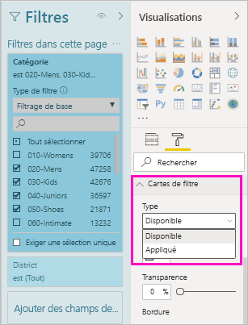

## <a name="theming-for-filters-pane"></a>Choix des thèmes du volet Filtres
Vous pouvez maintenant modifier les paramètres par défaut du volet Filtres avec le fichier de thèmes. Voici un exemple d’extrait de thème pour bien commencer :

 
```
"outspacePane": [{ 

"backgroundColor": {"solid": {"color": "#0000ff"}}, 

"foregroundColor": {"solid": {"color": "#00ff00"}}, 

"transparency": 50, 

"titleSize": 35, 

"headerSize": 8, 

"fontFamily": "Georgia", 

"border": true, 

"borderColor": {"solid": {"color": "#ff0000"}} 

}], 

"filterCard": [ 

{ 

"$id": "Applied", 

"transparency": 0, 

"backgroundColor": {"solid": {"color": "#ff0000"}}, 

"foregroundColor": {"solid": {"color": "#45f442"}}, 

"textSize": 30, 

"fontFamily": "Arial", 

"border": true, 

"borderColor": {"solid": {"color": "#ffffff"}}, 

"inputBoxColor": {"solid": {"color": "#C8C8C8"}} 

}, 

{ 

"$id": "Available", 

"transparency": 40, 

"backgroundColor": {"solid": {"color": "#00ff00"}}, 

"foregroundColor": {"solid": {"color": "#ffffff"}}, 

"textSize": 10, 

"fontFamily": "Times New Roman", 

"border": true, 

"borderColor": {"solid": {"color": "#123456"}}, 

"inputBoxColor": {"solid": {"color": "#777777"}} 

}] 
```

## <a name="sort-the-filters-pane"></a>Trier le volet Filtres

La fonctionnalité de tri personnalisé est disponible dans le volet Filtres. Lors de la création de votre rapport, vous pouvez glisser-déplacer des filtres pour les réorganiser dans n’importe quel ordre.


Pour les filtres, l’ordre de tri par défaut est l’ordre alphabétique. Pour démarrer le mode de tri personnalisé, faites glisser n’importe quel filtre vers une nouvelle position. Vous pouvez uniquement trier les filtres d’un même niveau, par exemple un filtre au niveau du visuel, de la page ou du rapport.

## <a name="improved-filters-pane-accessibility"></a>Amélioration de l’accessibilité du volet Filtres

Nous avons amélioré la navigation au clavier dans le volet Filtres. Vous pouvez faire défiler chaque partie du volet Filtres et utiliser la touche de contexte sur votre clavier ou les touches MAJ+F10 pour ouvrir le menu contextuel.

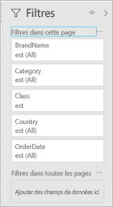

## <a name="rename-filters"></a>Renommer des filtres
Lorsque vous modifiez le volet Filtres, vous pouvez double-cliquer sur le titre pour le modifier. Changer de nom est utile si vous souhaitez mettre à jour la carte du filtre afin de la rendre plus visible pour les utilisateurs finaux. N’oubliez pas que la modification du nom de la carte du filtre ne renomme *pas* le nom complet du champ dans la liste des champs. Elle modifie uniquement le nom complet utilisé dans la carte du filtre.


## <a name="filters-pane-search"></a>Recherche dans le volet Filtres

La fonctionnalité de recherche dans le volet Filtres vous permet d’effectuer une recherche par titre dans vos cartes de filtre. Cette fonctionnalité est utile si vous avez plusieurs cartes de filtre dans le volet Filtres et que vous avez besoin d’aide pour trouver celles qui vous intéressent.

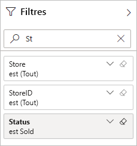

Vous pouvez aussi mettre en forme la zone de recherche, de la même façon que vous pouvez mettre en forme les autres éléments du volet Filtres.

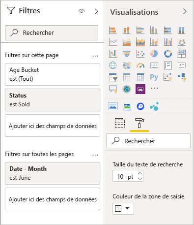

Bien que cette fonctionnalité de recherche dans le volet Filtres soit activée par défaut, vous pouvez aussi choisir de l’activer ou de la désactiver en sélectionnant **Activer la recherche pour le volet Filtres** dans les paramètres **Rapport** de la boîte de dialogue **Options**.

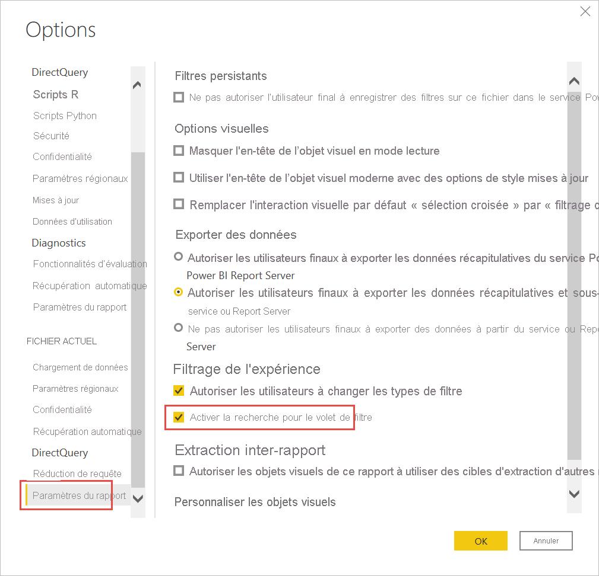

## <a name="restrict-changes-to-filter-type"></a>Limiter les modifications au type de filtre

Dans la section **Expérience de filtrage** des paramètres **Rapport**, une option vous permet de déterminer si les utilisateurs peuvent modifier le type de filtre.

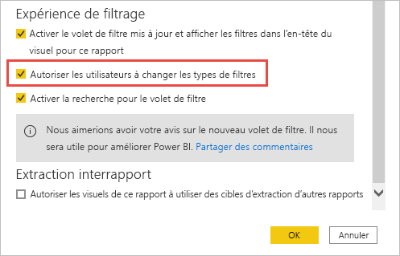

## <a name="allow-saving-filters"></a>Autoriser l’enregistrement des filtres

Par défaut, vos lecteurs de rapports peuvent enregistrer des filtres pour votre rapport. Vous pouvez choisir de ne pas les autoriser à enregistrer des filtres.

- De plus, dans les paramètres **Rapport** de la boîte de dialogue **Options**, sous **Filtres persistants**, sélectionnez **Ne pas autoriser les utilisateurs finaux à enregistrer des filtres sur ce rapport**.

    :::image type="content" source="media/power-bi-report-filter/power-bi-persistent-filters.png" alt-text="Capture d’écran de l’option Ne pas autoriser les utilisateurs finaux à enregistrer des filtres sur ce rapport.":::

## <a name="apply-filters-button"></a>Bouton Appliquer des filtres

Vous pouvez ajouter un bouton **Appliquer** unique au volet Filtre ; il vous permet à vous et à vos utilisateurs finaux d’appliquer toutes les modifications de filtre à la fois. Ce bouton peut être utile si vous souhaitez différer l’application des modifications de filtre. Vous n’avez à attendre qu’une seule fois, une fois que vous êtes prêt à appliquer toutes les modifications de filtre au rapport ou aux visuels.

:::image type="content" source="media/power-bi-report-filter/apply-filter-button.png" alt-text="Bouton Appliquer le filtre":::

### <a name="turn-on-the-apply-button"></a>Activer le bouton Appliquer

Vous pouvez définir cette fonctionnalité au niveau du rapport. Toutefois, la fonctionnalité est désactivée par défaut.

1. Sélectionnez **Fichier** > **Options et paramètres** > **Options** > **Réduction de requête**.

1. Sélectionnez **Ajouter un seul bouton Appliquer au volet des filtres pour appliquer tous les changements à la fois**.

    :::image type="content" source="media/power-bi-report-filter/apply-all-filters.png" alt-text="Activer le bouton Appliquer le filtre":::

### <a name="format-the-apply-button"></a>Mettre en forme le bouton Appliquer

Actuellement, vous pouvez contrôler une partie de la mise en forme pour le texte **Appliquer** du bouton. Dans le volet **Filtre** du volet **Format**, définissez les options suivantes :

- **Couleur de la case et du texte Appliquer** contrôle la couleur de remplissage. 
- **Couleur de police et d’icône** contrôle la couleur du texte.
- **Taille du texte de l’en-tête** contrôle la taille du texte.
- **Famille de polices** contrôle la police.

    :::image type="content" source="media/power-bi-report-filter/format-apply-filter.gif" alt-text="Mettre en forme le texte du bouton Appliquer le filtre":::

## <a name="considerations-and-limitations"></a>Considérations et limitations

La publication sur le web n’affiche pas le volet Filtres. Si vous envisagez de publier un rapport sur le web, envisagez d’ajouter des sélecteurs pour le filtrage.

## <a name="next-steps"></a>Étapes suivantes

- [Utilisation des filtres de rapport](../consumer/end-user-report-filter.md)
- [Filtres et mise en évidence dans les rapports](power-bi-reports-filters-and-highlighting.md)
- [Différents types de filtres dans Power BI](power-bi-report-filter-types.md)

D’autres questions ? [Posez vos questions à la communauté Power BI](https://community.powerbi.com/)
