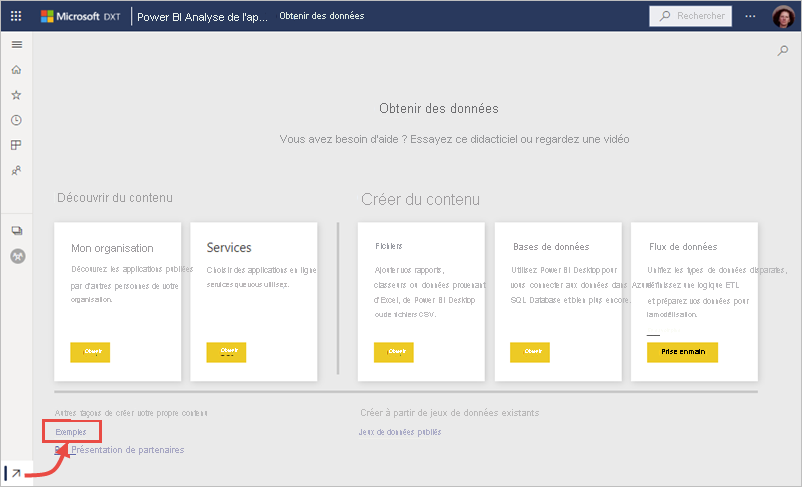
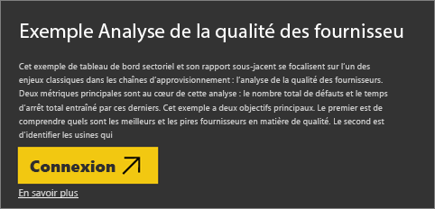

# Obtenir des exemples pour Power BI
Vous n’avez pas de données sous la main pour essayer Power BI ?  Ou peut-être souhaitez-vous consulter des rapports qui illustrent certaines des fonctionnalités de Power BI. Nous nous occupons de tout.

Power BI offre différents genres d’échantillons, à des fins différentes : 
- Un **[rapport Power BI](#sales--returns-sample-pbix-file) (fichier. pbix)** que vous pouvez afficher dans la Galerie d’histoires de données, ouvrir et explorer dans Power BI Desktop ou télécharger vers le service Power BI.
- Un **[échantillon d’application](#sample-app-from-appsource)** que vous téléchargez à partir de AppSource, également directement dans le service Power BI. Les applications incluent des tableaux de bord, des rapports et des jeux de données. Vous pouvez les modifier, puis les distribuer à vos collègues.
- **[Huit échantillons intégrés d’origine](#eight-original-samples)** dans le service Power BI en tant que *packs de contenu*, avec des tableaux de bord, des rapports et des jeux de données. Vous les installez directement dans le service Power BI. Les échantillons intégrés sont également disponibles sous forme de rapports Power BI (. pbix) et classeurs Excel (. xlsx).
- Les versions **[Classeur Excel](#download-sample-excel-files)** des échantillons intégrés, contenant le modèle de données et les feuilles Power View. Vous pouvez explorer ou modifier le modèle de données dans Excel, utiliser le classeur Excel comme source de données pour un rapport de Power BI. Vous pouvez également charger le classeur en tant que fichier Excel et afficher les éléments visuels et les tableaux croisés dynamiques Excel dans des rapports Power BI. 
- En outre, un **[classeur d’échantillons de données financières](sample-financial-download.md)** , tableau plat simple dans un fichier Excel disponible pour le téléchargement. Il contient des données anonymes avec des produits fictifs, avec des ventes divisées par segments et pays/régions. Il constitue une source de données de base utile pour un rapport Power BI.

Notre documentation en ligne utilise les mêmes échantillons dans les tutoriels et les exemples, ce qui vous permettra de suivre.

## Échantillon de fichier .pbix, Ventes et retours

:::image type="content" source="media/sample-datasets/sales-returns-sample-pbix.png" alt-text="Échantillon de fichier .pbix, Ventes et retours":::

*L’échantillon de rapport, Ventes et retours*

Les concepteurs du rapport Power BI, Miguel Myers et Chris Hamill, ont créé le fichier .pbix, Ventes et retours, pour illustrer de nombreuses nouvelles fonctionnalités dans Power BI, y compris les boutons, l’extraction, la mise en forme conditionnelle, les scénarios de simulation et les info-bulles personnalisées. 

Le scénario de ce rapport est une entreprise qui vend des skateboards marqués Microsoft. Ils souhaitent voir l’état de leurs ventes et retours et analyser la manière dont ils doivent modifier leurs opérations. 

Vous pouvez les explorer de la manière suivante :

- Affichez-les et interagissez dans la [Galerie d’histoires de données](https://community.powerbi.com/t5/Data-Stories-Gallery/Sales-amp-Returns-Sample-Report/m-p/876607) de la Communauté Power BI.
- Téléchargez le fichier .pbix et examinez-le en profondeur. Regardez « derrière le décors » pour voir comment fait Miguel. Sélectionnez ce lien pour télécharger le fichier automatiquement : [Échantillon de rapport, Ventes et retours](https://go.microsoft.com/fwlink/?linkid=2113239).
- Pour en savoir plus sur le rapport, lisez le billet de blog Power BI, [Suivre la présentation du nouvel échantillon de rapport Ventes et retours](https://powerbi.microsoft.com/blog/take_a_tour_of_the_new_sales_returns_sample_report/).

## Échantillon d’application à partir d’AppSource

L’*application* Marketing et ventes est disponible à partir de Microsoft AppSource. Une application est un type de contenu Power BI qui combine des tableaux de bord et des rapports connexes. Une application peut ainsi rassembler un ou plusieurs tableaux de bord et un ou plusieurs rapports. Vous pouvez télécharger l’application Marketing et ventes à partir de **Apps** dans le service Power BI ou en accédant à AppSource dans votre navigateur.

- L’article [Installer et utiliser les applications](../consumer/end-user-app-view.md) explique comment télécharger une application à partir de l’intérieur du service Power BI.
- Ce lien vous dirige vers l’[application Sales & marketing](https://appsource.microsoft.com/product/power-bi/microsoft-retail-analysis-sample.salesandmarketingsample?tab=Overview) dans AppSource.

Après l’avoir installé, vous pouvez le voir dans votre collection d’applications.

:::image type="content" source="media/sample-datasets/power-bi-sales-marketing-app.png" alt-text="Mosaïque de l’application Ventes et marketing":::

Une fois ouverte, sélectionnez **Explorer avec les échantillons de données**. 

:::image type="content" source="media/sample-datasets/power-bi-explore-app.png" alt-text="Explorer l’application":::

L’application s’affiche avec le tableau de bord et les pages du rapport individuel dans le volet de navigation. 

:::image type="content" source="media/sample-datasets/power-bi-sales-marketing-app-navigation.png" alt-text="Volet de navigation de l’application":::

Étant donné que vous l’avez installé, vous pouvez également ouvrir *l’espace de travail* et modifier les éléments de l’application. Sélectionnez l’icône en forme de crayon **Modifier** pour ouvrir l’espace de travail.

:::image type="content" source="media/sample-datasets/power-bi-app-edit-pencil.png" alt-text="Modifier l'application":::

Le tableau de bord, le rapport et le jeu de données s’affichent à présent à partir de l’application en mode Liste de l’espace de travail. Dans l’espace de travail, vous pouvez modifier chaque élément.

:::image type="content" source="media/sample-datasets/power-bi-sales-marketing-workspace.png" alt-text="Espace de travail Ventes et marketing":::

Si vous le souhaitez, vous pouvez distribuer cette application à toute personne de votre organisation. Sélectionnez **Mettre à jour l’application**.

:::image type="content" source="media/sample-datasets/power-bi-update-app.png" alt-text="Mettre à jour le bouton Application":::

Renseignez l’onglet **Configuration**, y compris le choix d’une **Couleur du thème de l’application**. 

:::image type="content" source="media/sample-datasets/power-bi-app-setup.png" alt-text="Sélectionner la configuration de l'application":::

Renseignez les onglets **Navigation** et **Autorisation**, puis sélectionnez **Mettre à jour l’application**.

:::image type="content" source="media/sample-datasets/power-bi-select-update-app.png" alt-text="Sélectionnez l’application Mettre à jour pour la publier":::

Découvrez-en plus sur la [publication d’applications dans Power BI](../collaborate-share/service-create-distribute-apps.md).

## Huit échantillons originaux
Les huit échantillons originaux sont mis à votre disposition. Chaque échantillon représente un secteur d’activité particulier. Vous pouvez vous adresser à chacun dans différents formats :

- Installez les [packs de contenu intégrés](#install-built-in-content-packs) dans le service Power BI.
- Téléchargez les [fichiers de rapport Power BI](#download-original-sample-power-bi-files) (.pbix).
- Téléchargez les [fichiers du classeur Excel](#download-sample-excel-files) (.xlsx), puis, chargez les dans le service Power BI.
- Explorez les [fichiers Excel dans Excel](#explore-excel-samples-inside-excel) eux-mêmes.

La société obviEnce ([www.obvience.com](http://www.obvience.com/)) et Microsoft a créé des échantillons que vous pouvez utiliser avec Power BI.  Ces données sont anonymes et représentatives de différents secteurs d’activité : finances, ressources humaines, ventes et bien plus encore. 

Chacun de ces échantillons est disponible sous plusieurs formats : pack de contenu, classeur Excel et fichier .pbix Power BI. Si vous ne connaissez pas ces formats ou ignorez comment y accéder, pas de problème : Cet article vous explique comment faire. Pour chacun de ces échantillons, nous avons créé une *visite guidée*. Les visites guidées sont des articles qui expliquent la raison d’être des échantillons et vous guident dans différents scénarios. Voici quelques exemples de scénarios : répondre aux questions de votre responsable, rechercher des informations sur la concurrence, mais aussi créer des rapports et tableaux de bord pour partager ou expliquer une évolution commerciale.

Avant de démarrer, lisez les mentions légales concernant l’utilisation des échantillons. Après, nous présenterons les exemples et vous montrerons comment les utiliser.

### Instructions d’utilisation des échantillons de classeurs Excel

&copy;2015 Microsoft Corporation. All rights reserved. Les documents et les classeurs sont fournis « en l’état ». Les informations et les opinions exprimées dans les classeurs, y compris les URL et les autres références à des sites web Internet, sont susceptibles d’être modifiées sans préavis. Vous assumez les risques liés à leur utilisation. Certains exemples sont fournis à des fins d’illustration et sont fictifs. Aucune association réelle n’est voulue ni sous-entendue. Microsoft exclut toute garantie, expresse ou implicite, concernant les informations fournies ici.

Les classeurs ne vous confèrent aucun droit légal sur toute propriété intellectuelle dans un quelconque produit Microsoft. Vous pouvez copier et utiliser ce classeur pour un usage interne, à titre de référence.

Les classeurs et les données associées sont fournis par obviEnce. [www.obvience.com](http://www.obvience.com)

ObviEnce est un éditeur de logiciels et un incubateur de propriété intellectuelle (IP) spécialiste de Microsoft Business Intelligence. ObviEnce travaille en étroite collaboration avec Microsoft pour développer des meilleures pratiques et un leadership éclairé visant à faire émerger et à déployer des solutions Microsoft Business Intelligence.

Les classeurs et les données sont la propriété d’obviEnce, LLC et sont partagés uniquement dans le but d’illustrer les fonctionnalités de Power BI avec des exemples de données issus de l’industrie.

Toutes les utilisations des classeurs et/ou des données doivent inclure l’attribution ci-dessus (qui figure également sur la feuille de calcul Info incluse dans chaque classeur). Le classeur et toutes les visualisations doivent être accompagnés de la mention de copyright suivante : obviEnce&copy;.

En cliquant sur les liens ci-dessous pour télécharger les fichiers des classeurs Excel ou .pbix, vous acceptez les conditions ci-dessus.

### Exemple Rentabilité des clients  
[Découvrez l’exemple Rentabilité des clients](sample-customer-profitability.md)

Cet exemple de secteur d’activité analyse les principales métriques des cadres, produits et clients d’une directrice financière. Vous pouvez examiner quels facteurs ont un impact sur la rentabilité de l’entreprise.

### Exemple Ressources humaines 
[Découvrez l’exemple Ressources humaines](sample-human-resources.md)

Cet exemple de secteur d’activité se focalise sur la stratégie de recrutement d’une entreprise en analysant les nouvelles embauches, les employés actifs et les employés ayant quitté l’entreprise.  En explorant les données, vous pouvez rechercher les tendances en matière de départs volontaires et de stratégie d’embauche.

### Exemple Analyse des dépenses informatiques 
[Découvrez l’exemple Analyse des dépenses informatiques](sample-it-spend.md)

Dans cet exemple, nous analysons les coûts prévus par rapport aux coûts réels du service informatique d’une entreprise. Cette comparaison nous aide à évaluer la pertinence des prévisions de l’entreprise pour l’année et à analyser les secteurs qui présentent des écarts importants par rapport aux prévisions. L’entreprise décrite dans cet exemple suit un cycle de prévision annuel. Ensuite, tous les trimestres, elle produit ses toutes dernières estimations pour faciliter l’analyse des changements survenus en matière de dépenses informatiques pendant l’année fiscale.

### Exemple Analyse des opportunités 
[Découvrez l’exemple Analyse des opportunités](sample-opportunity-analysis.md)

Cet exemple de secteur d’activité explore le canal de vente d’une société. Les responsables des ventes surveillent les ventes de leurs canaux de vente directs et des partenaires en suivant les opportunités et les chiffres d’affaires par région, par volume de transactions et par canal.

### Exemple Analyse de l’approvisionnement  
[Découvrez l’exemple Analyse de l’approvisionnement](sample-procurement.md)

Cet exemple de secteur d’activité analyse les principales métriques des cadres, produits et clients d’une directrice financière. Vous pouvez examiner quels facteurs ont un impact sur la rentabilité de l’entreprise.

### Exemple Analyse de la vente au détail  
[Découvrez l’exemple Analyse de la vente au détail](sample-retail-analysis.md)

Cet exemple de secteur d’activité analyse les données de vente au détail d’articles vendus dans plusieurs magasins et régions. Les métriques comparent les performances de l’année à celles de l’année précédente dans les domaines suivants : ventes, unités, marge brute, écart et analyse des nouveaux magasins.

### Exemple Ventes et marketing  
[Découvrez l’exemple Vente et marketing](sample-sales-and-marketing.md)

Cet exemple de secteur d’activité analyse une entreprise de fabrication, VanArsdel Ltd. Il permet au directeur marketing d’observer l’évolution de l’industrie et la part de marché de VanArsdel.  En explorant cet exemple, vous pouvez découvrir la part de marché de l’entreprise, son volume de produits et ses ventes, ainsi que le climat des affaires.

### Exemple Qualité des fournisseurs  
[Découvrez l’exemple Qualité des fournisseurs](sample-supplier-quality.md)

Cet exemple de secteur d’activité se focalise sur l’un des enjeux classiques dans une chaîne d’approvisionnement : l’analyse de la qualité des fournisseurs. Deux métriques principales sont au cœur de cette analyse : le nombre total de défauts et le temps d’arrêt total entraîné par ces derniers. Cet exemple a deux objectifs majeurs : comprendre quels sont les meilleurs et les pires fournisseurs en matière de qualité, et identifier les usines qui réussissent le mieux à détecter et à éliminer les défauts pour réduire le temps d’arrêt.

### Installer des packs de contenu intégrés

Commençons par les *packs de contenu*. Les échantillons intégrés sont disponibles dans le service Power BI ; vous n’avez pas à quitter Power BI pour les trouver. Un pack de contenu est une offre groupée de un ou plusieurs tableaux de bord, jeux de données et rapports créée par une personne et qui peut être utilisée avec le service Power BI. Chaque échantillon de pack de contenu Power BI contient un jeu de données, un rapport et un tableau de bord.  Les packs de contenu sont toujours disponibles, mais sont dépréciés. Elles ne sont pas disponibles dans Power BI Desktop.

1. Ouvrez le service Power BI (app.powerbi.com) et connectez-vous.
2. Accédez à votre espace de travail ou à un autre espace de travail dans lequel vous souhaitez installer l’échantillon. 
2. Dans le coin inférieur gauche, sélectionnez **Obtenir des données**.

    
3. Dans la page Obtenir des données qui s’affiche, sélectionnez **Échantillons**.

   
4. Sélectionnez un des échantillons pour ouvrir une description de cet échantillon et choisissez **Connecter**.  

   
5. Power BI importe le pack de contenu, puis ajoute un tableau de bord, un rapport et un jeu de données à votre espace de travail. Utilisez les exemples pour tester Power BI.  

   

Maintenant que vous avez des données, vous êtes sur la bonne voie.  Suivez certains de nos didacticiels en utilisant les échantillons de packs de contenu ou ouvrez simplement le service Power BI pour le découvrir.

### Télécharger les fichiers Power BI d’échantillons originaux
Chacun des exemples de packs de contenu est également disponible en tant que fichier .pbix pour Power BI. Les fichiers .pbix sont conçus pour être utilisés avec Power BI Desktop.  

1. Téléchargez les fichiers individuellement en utilisant les liens ci-dessous. Quand vous sélectionnez ces liens, le fichier est enregistré automatiquement dans votre dossier Téléchargements. 

   - [PBIX Exemple Rentabilité des clients](https://download.microsoft.com/download/6/A/9/6A93FD6E-CBA5-40BD-B42E-4DCAE8CDD059/Customer%20Profitability%20Sample%20PBIX.pbix)
   - [PBIX Exemple Ressources humaines](https://download.microsoft.com/download/6/9/5/69503155-05A5-483E-829A-F7B5F3DD5D27/Human%20Resources%20Sample%20PBIX.pbix)
   - [PBIX Exemple Analyse de l’approvisionnement](https://download.microsoft.com/download/D/5/3/D5390069-F723-413B-8D27-5888500516EB/Procurement%20Analysis%20Sample%20PBIX.pbix)
   - [PBIX Exemple Analyse de la vente au détail](https://download.microsoft.com/download/9/6/D/96DDC2FF-2568-491D-AAFA-AFDD6F763AE3/Retail%20Analysis%20Sample%20PBIX.pbix)
   - [PBIX Exemple Vente et marketing](https://download.microsoft.com/download/9/7/6/9767913A-29DB-40CF-8944-9AC2BC940C53/Sales%20and%20Marketing%20Sample%20PBIX.pbix)
   - [PBIX Exemple Analyse de la qualité des fournisseurs](https://download.microsoft.com/download/8/C/6/8C661638-C102-4C04-992E-9EA56A5D319B/Supplier-Quality-Analysis-Sample-PBIX.pbix)

1. À partir de Power BI Desktop, sélectionnez **Fichier > Ouvrir**, puis accédez à l’emplacement où vous avez enregistré l’échantillon de fichier .pbix.

4. Sélectionnez le fichier .pbix pour l’ouvrir dans Power BI Desktop.

### Télécharger des échantillons de fichiers Excel
Chacun des exemples de packs de contenu est également disponible en tant que classeur Excel. Les classeurs Excel sont conçus pour être utilisés avec le service Power BI.  

1. Téléchargez les fichiers individuels à l’aide des liens ci-dessous ou [téléchargez un fichier zip contenant tous les exemples de fichiers](https://go.microsoft.com/fwlink/?LinkId=535020). Si vous êtes un utilisateur expérimenté, nous vous recommandons de télécharger les classeurs Excel pour explorer ou modifier les modèles de données.

   - [Exemple Rentabilité des clients](https://go.microsoft.com/fwlink/?LinkId=529781)
   - [Exemple Ressources humaines](https://go.microsoft.com/fwlink/?LinkId=529780)
   - [Exemple Suivi d’opportunités](https://go.microsoft.com/fwlink/?LinkId=529782)
   - [Exemple Analyse de l’approvisionnement](https://go.microsoft.com/fwlink/?LinkId=529784)
   - [Exemple Analyse de la vente au détail](https://go.microsoft.com/fwlink/?LinkId=529778)
   - [Exemple Vente et marketing](https://go.microsoft.com/fwlink/?LinkId=529785)
   - [Exemple Analyse de la qualité des fournisseurs](https://go.microsoft.com/fwlink/?LinkId=529779)

2. Enregistrez le fichier téléchargé. L’emplacement d’enregistrement de votre fichier change tout.

      **Local** – Si vous enregistrez votre fichier sur un disque local de votre ordinateur ou à un autre emplacement au sein de votre organisation, vous pouvez importer votre fichier dans Power BI, à partir de Power BI. Votre fichier reste sur votre disque local. Il n’est donc pas entièrement importé dans Power BI. En réalité, un nouveau jeu de données est créé dans votre site Power BI, et les données (et parfois, le modèle de données) sont chargées dans ce jeu de données. Si votre fichier contient des rapports, ceux-ci s’affichent dans votre site Power BI sous Rapports.
    
     **OneDrive Entreprise** – Si vous disposez de OneDrive Entreprise et que vous vous connectez avec le même compte que pour Power BI, c’est de loin la méthode la plus efficace pour que votre travail dans Excel, Power BI ou un fichier CSV reste synchronisé avec votre jeu de données, vos rapports et vos tableaux de bord dans Power BI. Power BI et OneDrive étant tous les deux dans le cloud, Power BI se connecte à votre fichier sur OneDrive toutes les heures environ. Si des modifications sont détectées, vos jeu de données, rapports et tableaux de bord sont automatiquement mis à jour dans Power BI.
    
     **Sites d’équipe SharePoint** – La procédure d’enregistrement de fichiers Power BI sur des sites d’équipe SharePoint est presque la même que dans OneDrive Entreprise. La différence majeure réside dans la manière dont vous vous connectez au fichier à partir de Power BI. Vous pouvez spécifier une URL ou vous connecter au dossier racine.
1. Ouvrez le service Power BI (app.powerbi.com) et connectez-vous.

1. Accédez à votre espace de travail ou à un autre espace de travail ou créez un espace de travail uniquement pour l’échantillon.

4. Dans le coin inférieur gauche du volet de navigation, sélectionnez **Obtenir des données**.

    
5. Dans la page **Obtenir des données** qui s’affiche, sélectionnez **Fichiers > Obtenir**.

    
6. Sélectionnez l’emplacement où vous avez téléchargé et enregistré l’échantillon.

    
7. Sélectionnez le fichier. Selon l’emplacement où vous avez enregistré le fichier, sélectionnez **Connecter** ou **Ouvrir**.

8. Vous pouvez choisir d’importer les données ou d’afficher le classeur dans Power BI pour l’afficher exactement de la même manière que dans Excel Online.

    
9. Si vous sélectionnez **Importer**, Power BI importe l’échantillon de classeur et l’ajoute en tant que nouveau tableau de bord, rapport et jeu de données, tous nommés **Échantillon d’analyse de l’approvisionnement**.

    - Étant donné que le classeur contient des feuilles Power View, Power BI crée un rapport avec une page pour chaque feuille Power BI. 
    - Power BI crée un nouveau tableau de bord avec une nouvelle mosaïque vide.  Sélectionnez cette mosaïque pour accéder au rapport que vous venez d’ajouter.

10. Ouvrez le rapport. Sélectionnez les différents éléments du rapport pour explorer leurs interactions. 

    

### Explorez les échantillons Excel dans Excel

(Facultatif) Vous voulez savoir comment les données d’un classeur Excel sont converties en jeux de données et rapports Power BI ? Pour cela, vous pouvez ouvrir les exemples Excel *dans Excel* et parcourir les feuilles de calcul.

- Quand vous ouvrez pour la première fois un classeur d’exemples, deux avertissements peuvent s’afficher. Le premier avertissement indique que le classeur est en mode protégé. Sélectionnez **Activer la modification**. Le deuxième avertissement peut indiquer que le classeur contient des connexions de données externes. Sélectionnez **Activer le contenu**.
- Chaque classeur contient plusieurs feuilles Power View. Si vous souhaitez voir les feuilles Power View dans Excel, vous devez [activer le complément Power View](https://support.office.com/article/flash-silverlight-and-shockwave-controls-blocked-in-microsoft-office-55738f12-a01d-420e-a533-7cef1ff6aeb1) en téléchargeant un package de clés de Registre.
- Où se trouvent les données réelles ? Elles sont situées dans le modèle de données Power Pivot. Vous n’avez pas besoin des feuilles Power View pour afficher les données. Sous l’onglet **PowerPivot**, sélectionnez **Gérer**.

    Vous ne voyez pas l’onglet **PowerPivot** ? [Activez le complément PowerPivot](https://support.office.com/article/Start-Power-Pivot-in-Microsoft-Excel-2013-add-in-A891A66D-36E3-43FC-81E8-FC4798F39EA8).

    Dans PowerPivot, vous pouvez voir les données de toutes les tables sous-jacentes, ainsi que toutes les formules DAX. 

- L’onglet Info fournit des informations sur obviEnce, la société qui a créé l’exemple.

## Étapes suivantes
[Fondamentaux pour les concepteurs dans le service Power BI](../fundamentals/service-basic-concepts.md)

[Tutoriel : Se connecter aux exemples Power BI](sample-tutorial-connect-to-the-samples.md)

[Sources de données pour Power BI](../connect-data/service-get-data.md)

D’autres questions ? [Posez vos questions à la communauté Power BI](https://community.powerbi.com/)
