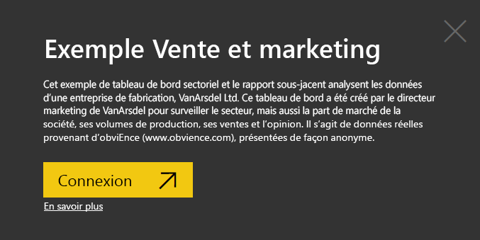
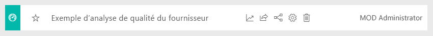
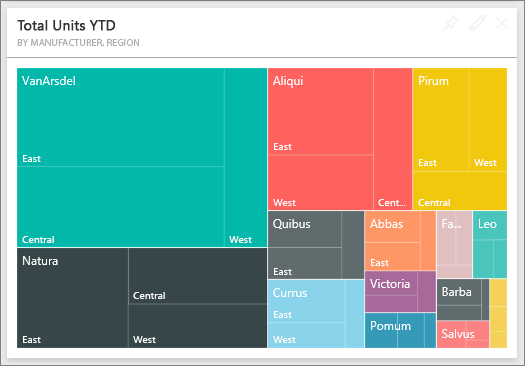
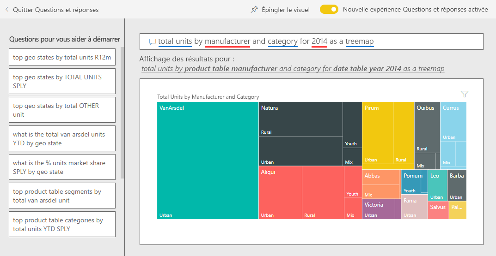
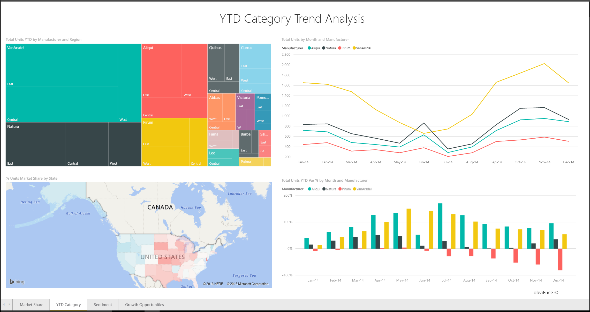
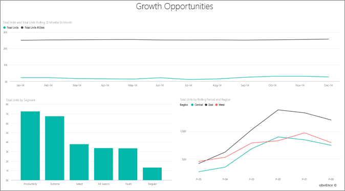

# Exemple Vente et marketing pour Power BI : Visite guidée

L’exemple Vente et marketing contient un tableau de bord et un rapport qui concernent une société de fabrication fictive nommée VanArsdel Ltd. Ce tableau de bord a été créé par le directeur marketing de VanArsdel pour surveiller le secteur, mais aussi la part de marché de la société, ses volumes de production, ses ventes et l’opinion.

VanArsdel a de nombreux concurrents, mais est leader dans son secteur d’activité. Le directeur marketing souhaite augmenter la part de marché et découvrir des opportunités de croissance. Or, pour des raisons inconnues, la part de marché de VanArsdel a commencé à diminuer, avec des baisses significatives en juin.

Cet exemple fait partie d’une série d’exemples qui illustre la façon dont vous pouvez utiliser Power BI avec des données, des rapports et des tableaux de bord orientés métier. Il a été créé par [obviEnce](http://www.obvience.com/) avec des données réelles qui sont présentées de façon anonyme. Les données sont disponibles dans plusieurs formats : échantillon dans le produit, fichier .pbix Power BI Desktop ou classeur Excel. Consultez [Exemples pour Power BI](sample-datasets.md). 

Ce tutoriel utilise l’exemple Vente et marketing dans le service Power BI. Les expériences d’utilisation des rapports étant similaires dans Power BI Desktop et dans le service, vous pouvez également poursuivre avec et l’exemple de fichier .pbix dans Power BI Desktop. 

Vous n’avez pas besoin d’une licence Power BI pour explorer les exemples dans Power BI Desktop. Si vous n’avez pas de licence Power BI Pro, vous pouvez enregistrer l’exemple dans votre espace Mon espace de travail du service Power BI. 

## Obtenir l’exemple

Avant de pouvoir utiliser l’exemple, vous devez tout d’abord télécharger le [tableau de bord, le rapport et le jeu de données](#get-the-sample-from-the-power-bi-service), le [fichier .pbix](#get-the-pbix-file-for-this-sample) ou le [classeur Excel](#get-the-excel-workbook-for-this-sample).

### Obtenir l’exemple à partir du service Power BI

1. Ouvrez le service Power BI (app.powerbi.com), connectez-vous et ouvrez l’espace de travail où vous souhaitez enregistrer l’exemple.

   Si vous n’avez pas de licence Power BI Pro, vous pouvez enregistrer l’exemple dans votre espace Mon espace de travail.

2. Dans le coin inférieur gauche, sélectionnez **Obtenir des données**.
   
   
3. Dans la page **Obtenir des données** qui s’affiche, sélectionnez **Exemples**.
   
4. Sélectionnez l’**exemple Vente et marketing**, puis choisissez **Se connecter**.   
  
   
   
5. Power BI importe l’exemple, puis ajoute un tableau de bord, un rapport et un jeu de données à votre espace de travail actuel.
   
   
  
### Se procurer le fichier .pbix pour cet exemple

Vous pouvez également télécharger l’exemple Vente et marketing en tant que [fichier .pbix](https://download.microsoft.com/download/9/7/6/9767913A-29DB-40CF-8944-9AC2BC940C53/Sales%20and%20Marketing%20Sample%20PBIX.pbix), qui est conçu pour une utilisation avec Power BI Desktop.

### Se procurer le classeur Excel pour cet exemple

Si vous souhaitez afficher la source de données de cet exemple, elle est également disponible en tant que [classeur Excel](https://go.microsoft.com/fwlink/?LinkId=529785). Le classeur contient des feuilles Power View que vous pouvez consulter et modifier. Pour afficher les données brutes, activez les compléments Analyse de données, puis sélectionnez **Power Pivot > Gérer**. Pour plus d’informations sur l’activation des compléments Power View et Power Pivot, consultez [Explorer des échantillons Excel dans Excel](sample-datasets.md#explore-excel-samples-inside-excel).

## Que nous révèle ce tableau de bord ?
Commençons notre tour d’horizon sur le tableau de bord et examinons les mosaïques que le directeur marketing a choisi d’épingler. On y trouve des informations sur la part de marché, les ventes et l’opinion. Les données sont ventilées par région, période et concurrence.

* Les vignettes de nombres au bas de la colonne de gauche indiquent le volume des ventes du secteur au cours de l’exercice précédent (50 000), la part de marché (32,86 %), le volume des ventes (16 000), le score d’opinion (68), l’écart d’opinion (4) et le nombre total d’unités vendues (1 million).
* Le graphique en courbes supérieur **(% Units Market Share vs. % Units Market Share** sur une période glissante de 12 mois) illustre la fluctuation de notre part de marché au fil du temps. Notez la grande chute en juin. Notre part de marché sur une période glissante de 12 mois (« R12M »), qui avait augmenté pendant un certain temps, commence maintenant à fléchir.
* Le principal concurrent de l’entreprise est Aliqui, la vignette d’histogramme du milieu le montre bien (**Total Units YTD Variance %** ).
* Le plus gros de l’activité de l’entreprise se concentre dans les régions Est (« East ») et Centre (« Central »).
* Le graphique en courbes du bas (**Total Units for 2014**) montre que la baisse du mois de juin n’est pas saisonnière : aucun de nos concurrents ne suit cette tendance.
* Les vignettes **Total Units Overall** et **Total Units YTD** à droite indiquent les unités vendues, par segment et par région/fabricant. Les plus gros segments de marché du secteur sont **Productivity** (Productivité) et **Convenience** (Commodité).

## Utilisation de Q&R pour approfondir l’analyse

En utilisant le Q&R, vous pouvez découvrir des détails supplémentaires dans les données.

### Quels sont les segments qui tirent nos ventes ? Est-ce que cela correspond à la tendance du secteur ?
1. Sélectionnez la vignette **Total Units Overall by Segment**, qui ouvre le Q & R et le remplit avec la requête *Total Units by Segment*.
2. À la fin de la requête existante, ajoutez : *for VanArsdel*. Q&R interprète la question et affiche un graphique mis à jour avec la réponse. Notez que le volume de votre produit provient principalement des segments **Convenience** et **Moderation**.

   
3. Sa part dans les catégories **Moderation** et **Convenience** est très importante ; ce sont les segments sur lesquels l’entreprise est compétitive.
4. Revenez au tableau de bord en sélectionnant l’**exemple Vente et marketing** dans le volet de navigation supérieur.

### Quelle est la part de marché en nombre total d’unités par catégorie (comparée à la région) ?
1. Notez le titre **Total Units YTD by Manufacturer, Region** (Nombre total d’unités de l’année en cours par fabricant, par région). Qu’est-ce que la part de marché par catégorie ?

   
2. Sélectionnez la zone de question en haut du tableau de bord et tapez la question *total units by manufacturer and category for 2014 as a treemap* (nombre total d’unités par fabricant et par catégorie pour 2014, treemap). Comme vous pouvez le constater, la visualisation se met à jour à mesure que vous tapez la question.

   
3. Pour comparer les résultats, épinglez le graphique à votre tableau de bord. Notez ce fait intéressant : En 2014, VanArsdel n’a vendu que des produits de la catégorie **Urbain**.
4. Retournez au tableau de bord.

## Rapport d’échantillon Vente et marketing

Les tableaux de bord sont un point d’entrée dans les rapports. Si une vignette a été créée à partir d’un rapport sous-jacent, il suffit de sélectionner sur cette vignette pour ouvrir le rapport.

Dans notre tableau de bord, la ligne **% Units Market Share R12M** dans le graphique **% Units Market Share vs.% Units Market Share sur 12 mois glissants** montre que notre part de marché n’augmente plus au fil du temps. Elle décline même un peu. Et comment expliquer cette forte baisse de part de marché en juin ? 

Le rapport pour l’exemple Vente et marketing comporte quatre pages.
 
### VanArsdel - Page Market Share
La page 1 du rapport porte sur la part de marché de VanArsdel.

1. Dans le tableau de bord, sélectionnez le graphique **% Units Market Share vs. % Units Market Share Rolling 12 Months** pour ouvrir la page **VanArsdel - Market Share** du rapport de l’exemple Vente et marketing.

   

2. Examinez l’histogramme au bas du rapport, intitulé **Total Units by Month and isVanArsdel** (Nombre total d’unités par mois pour VanArsdelen). La colonne noire représente VanArsdel (ses produits) et la verte ses concurrents. La baisse enregistrée par VanArsdel en juin 2014 ne se retrouve pas chez les concurrents.

3. Le graphique à barres **Volume total de la catégorie par segment**, à droite, est filtré pour afficher les 2 principaux segments de VanArsdel. Voyons comment ce filtre a été créé :  

   a. Sélectionnez le graphique **Total Category Volume by Segment**.

   b. Sélectionnez le volet **Filtres** à droite pour le développer.  

   c. Sous **Filtres au niveau de l’élément visuel**, notez que **Segment** est filtré pour n’inclure que les catégories **Convenience** et **Moderation**.  

   d. Modifiez le filtre en sélectionnant **Segment** pour développer cette section, puis cochez **Productivity** pour ajouter aussi ce segment.  

4. Dans **Total Units by Month and isVanArsdel** (Nombre total d’unités par mois pour VanArsdel), sélectionnez **Oui** dans la légende pour effectuer un filtrage croisé de la page sur VanArsdel. Dans le graphique **Volume des catégories totales par segment**, notez que nous n’avons pas de concurrence dans le segment **Productivité**.

5. Sélectionnez de nouveau **Oui** dans la légende pour effacer le filtre.

6. Examinez le graphique en courbes **% Units Market Share and % Units Market Share R12M by Month**. Il présente la part de marché mensuelle de l’entreprise et ses parts de marché sur une période glissante de 12 mois. Les données de cette période permettent de lisser les variations mensuelles et dégage les tendances sur le long terme. Dans le graphique à barres volume **Total Category Volume by Segment**, sélectionnez **Convenience**, puis **Moderation** pour voir la fluctuation de la part de marché pour chaque segment. Notez que le segment **Moderation** présente une variation de la part de marché bien plus importante.

Nous cherchons toujours à savoir pourquoi la part de marché a autant diminué en juin. Nous allons ensuite vérifier la page **Analyse des sentiments** du rapport.

### Page Analyse des sentiments
La page 3 du rapport se concentre sur le sentiment des consommateurs.

Les tweets, Facebook, les blogs et les articles contribuent tous au sentiment du grand public, qui apparaît dans les deux graphiques en courbes sur le côté gauche de la page. Le graphique **VanArsdel - Sentiment by Month** situé en haut à gauche montre que l’opinion vis-à-vis des produits de l’entreprise est restée assez neutre jusqu’en février. Une chute importante s’est amorcée en février pour atteindre son plus bas en juin. Qu’est-ce qui explique cette chute de l’opinion ? 

Nous devons nous appuyer sur des sources externes. En février, plusieurs articles et billets de blog ont décrit le service client de VanArsdel comme étant le pire du secteur. Cette mauvaise publicité a eu une corrélation directe sur l’opinion des clients et les ventes. VanArsdel a travaillé dur pour améliorer son service client, ce qu’ont noté les clients et le secteur. En juillet, les opinions positives ont commencé à décoller pour atteindre leur plus haut historique des années 60. Ce cycle de sentiment est reflété dans les graphiques **Total Units by Month** sur les pages 1 et 2 du rapport. Cela explique-t-il peut-être en partie la baisse de part de marché de juin ?

L’écart de sentiment peut être une autre zone à explorer. Quelles circonscriptions ont l’écart de sentiment le plus élevé, comment la direction peut-elle en tirer parti et comment peut-elle le répliquer dans d’autres circonscriptions ?

### Page YTD Category Trend Analysis
La page deux du rapport se concentre sur la tendance de la catégorie de cumul annuel jusqu’à ce jour.

Notez les points suivants :
* VanArsdel est le leader de sa catégorie et ses principaux concurrents sont Natura, Aliqui et Pirium. Analysons cela de plus près.
* Aliqui se développe, mais sa production reste modeste par rapport à celle de VanArsdel.
* VanArsdel apparaît en vert dans le treemap. Dans la région East (Est), les clients préfèrent notre compétition, mais dans la région Central (centrale), nous nous débrouillons bien. Notre part dans la région Est est la plus basse.
* Les unités vendues varient fortement en fonction du secteur géographique. La région Est est la région dominante pour la plupart des fabricants et VanArsdel a aussi une forte présence dans la région Centre.
* Dans le graphique **Total Units YTD Var % by Month and Manufacturer** dans le coin inférieur droit, notez que nous avons un écart positif, ce qui est bon signe. Nous sommes plus performants que l’année dernière, mais notre concurrent, Aliqui, aussi.

### Page Growth Opportunities
La page 4 du rapport porte sur l’analyse des produits concurrents.

Notez les points suivants :
* En bas à gauche du graphique **Unités totales par segment** les segments de toutes les catégories sont affichés, sauf les deux principaux segments de VanArsdel. Sélectionnez chacun des segments l’un après l’autre pour identifier les zones d’expansion potentielles pour VanArsdel. 
* Notez que les segments **Extreme** (Extrême) et **Productivity** (Productivity) progressent plus vite que les autres. Cependant, nous ne faisons pas concurrence dans ces segments. Pour s’y investir, la société peut s’appuyer sur ces données pour cibler les segments porteurs dans les différentes régions. Nous pouvons aller plus loin dans l’analyse en formulant des questions. Par exemple, quelles sont les régions qui progressent le plus vite et quel serait le principal concurrent dans ce segment ?
* Vous vous souvenez de cette diminution de la part de marché en juin ? Le mois de juin est important pour le segment **Productivité**, segment sur lequel la société n’est pas du tout présente. Ce détail pourrait nous aider à comprendre la diminution de notre part de marché en juin.

En filtrant les visualisations sur VanArsdel, par segment, par mois et par région, nous pouvons découvrir des opportunités de croissance pour VanArsdel.

## Étapes suivantes : Vous connecter à vos données
Cet environnement est sécurisé pour y jouer, étant donné que vous pouvez choisir ne pas enregistrer vos modifications. Mais si vous les enregistrez, vous pouvez toujours sélectionner **Obtenir des données** pour obtenir une nouvelle copie de cet exemple.

Nous espérons qu’à travers cette visite guidée, vous aurez cerné tout l’intérêt des tableaux de bord Power BI, de Q&R et des rapports pour tirer des informations des données de ressources humaines. À présent, c’est votre tour : connectez-vous à vos propres données. Avec Power BI, vous pouvez vous connecter à une grande variété de sources de données. Pour en savoir plus, consultez [Prise en main du service Power BI](../fundamentals/service-get-started.md).
