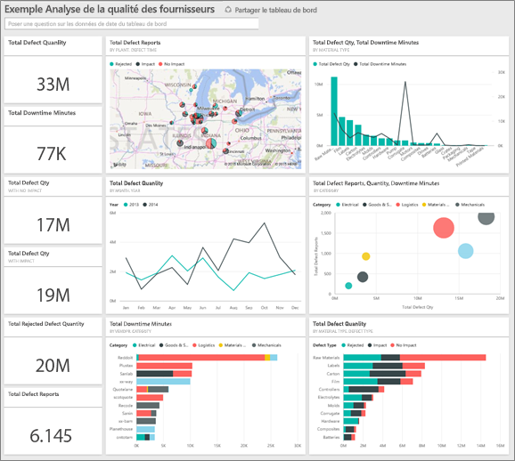
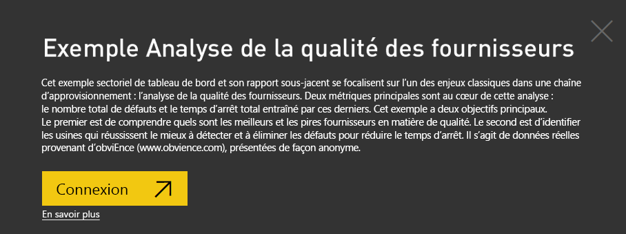
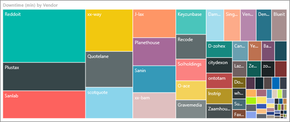
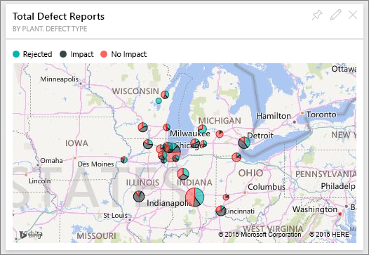
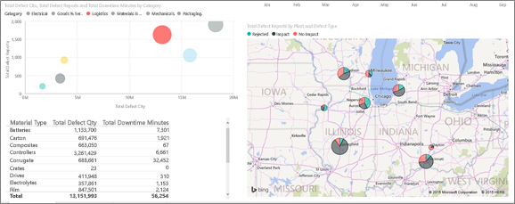
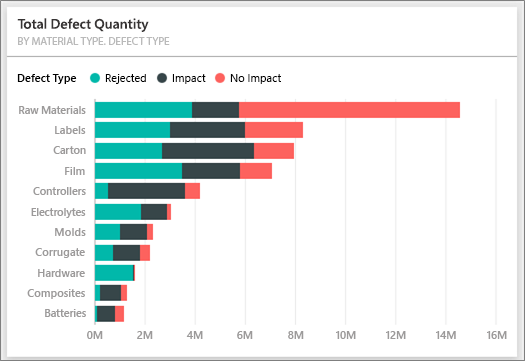
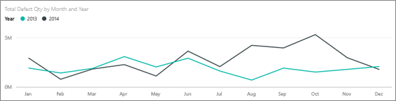
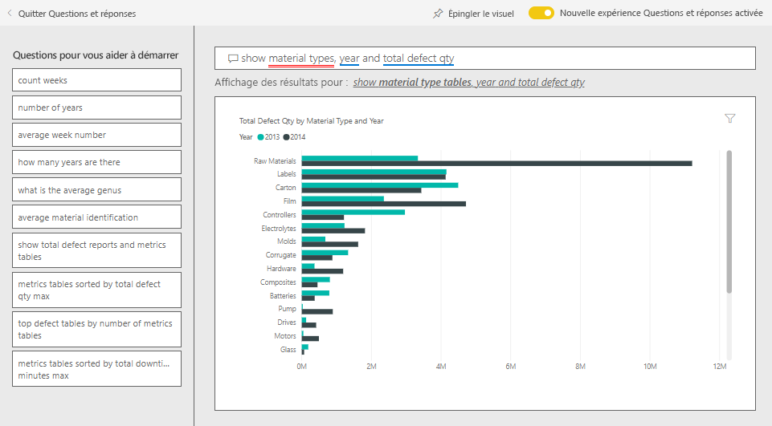
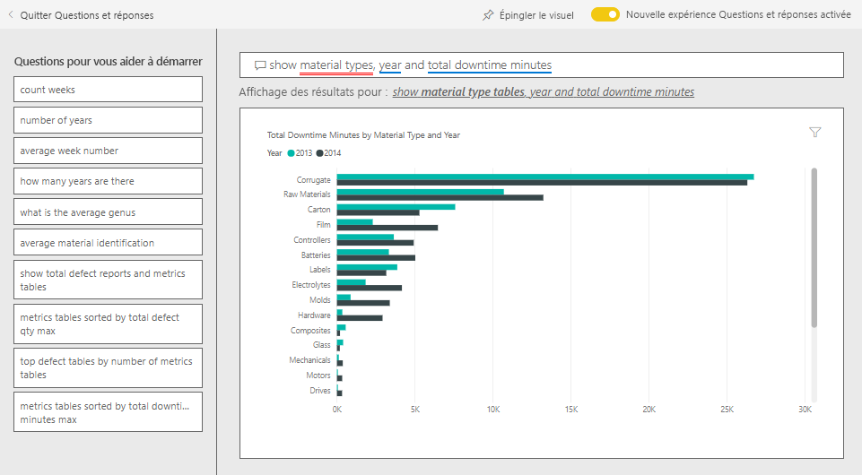
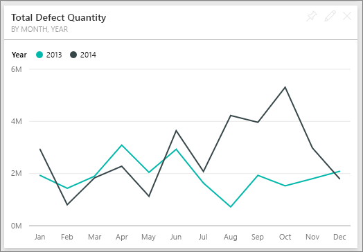

# Exemple Analyse de la qualité des fournisseurs pour Power BI : Visite guidée

Cet exemple sectoriel de tableau de bord et son rapport sous-jacent se focalisent sur l’un des enjeux classiques dans une chaîne d’approvisionnement : l’analyse de la qualité des fournisseurs. Deux métriques principales sont au cœur de cette analyse : le nombre total de défauts et le temps d’arrêt total entraîné par ces derniers. 

Cet exemple a deux objectifs principaux :

* identifier les fournisseurs qui répondent le mieux aux critères de qualité et ceux qui y répondent le moins bien ;
* identifier les usines qui réussissent le mieux à détecter et rejeter les défauts pour réduire les temps d’arrêt.

Cet exemple fait partie d’une série d’exemples qui illustre la façon dont vous pouvez utiliser Power BI avec des données, des rapports et des tableaux de bord orientés métier. Il a été créé par [obviEnce](http://www.obvience.com/) avec des données réelles qui sont présentées de façon anonyme. Les données sont disponibles dans plusieurs formats : pack de contenu, fichier .pbix Power BI Desktop ou classeur Excel. Consultez [Exemples pour Power BI](sample-datasets.md). 

Ce tutoriel explore le pack de contenu Exemple Analyse de la qualité des fournisseurs dans le service Power BI. Les expériences d’utilisation des rapports étant similaires dans Power BI Desktop et dans le service, vous pouvez également poursuivre avec et l’exemple de fichier .pbix dans Power BI Desktop. 

Vous n’avez pas besoin d’une licence Power BI pour explorer les exemples dans Power BI Desktop. Si vous n’avez pas de licence Power BI Pro, vous pouvez enregistrer l’exemple dans votre espace Mon espace de travail du service Power BI. 

## Obtenir l’exemple

Avant de pouvoir utiliser l’exemple, vous devez le télécharger en tant que [pack de contenu](#get-the-content-pack-for-this-sample), [fichier .pbix](#get-the-pbix-file-for-this-sample) ou [classeur Excel](#get-the-excel-workbook-for-this-sample).

### Se procurer le pack de contenu pour cet exemple

1. Ouvrez le service Power BI (app.powerbi.com), connectez-vous et ouvrez l’espace de travail où vous souhaitez enregistrer l’exemple.

   Si vous n’avez pas de licence Power BI Pro, vous pouvez enregistrer l’exemple dans votre espace Mon espace de travail.

2. Dans le coin inférieur gauche, sélectionnez **Obtenir des données**.
   
   
3. Dans la page **Obtenir des données** qui s’affiche, sélectionnez **Exemples**.
   
4. Sélectionnez l’**exemple Analyse de la qualité des fournisseurs**, puis choisissez **Se connecter**.  
   
   

5. Power BI importe le pack de contenu, puis ajoute un tableau de bord, un rapport et un jeu de données à votre espace de travail actuel.
   
   
  
### Se procurer le fichier .pbix pour cet exemple

Vous pouvez aussi télécharger l’exemple Analyse de la qualité des fournisseurs sous forme de [fichier .pbix](https://download.microsoft.com/download/8/C/6/8C661638-C102-4C04-992E-9EA56A5D319B/Supplier-Quality-Analysis-Sample-PBIX.pbix), qui est conçu pour être utilisé avec Power BI Desktop.

### Se procurer le classeur Excel pour cet exemple

Si vous souhaitez afficher la source de données de cet exemple, elle est également disponible en tant que [classeur Excel](https://go.microsoft.com/fwlink/?LinkId=529779). Le classeur contient des feuilles Power View que vous pouvez consulter et modifier. Pour afficher les données brutes, activez les compléments Analyse de données, puis sélectionnez **Power Pivot > Gérer**. Pour plus d’informations sur l’activation des compléments Power View et Power Pivot, consultez [Explorer des échantillons Excel dans Excel](sample-datasets.md#explore-excel-samples-inside-excel).

## Temps d’arrêt causés par des articles défectueux
Analysons les temps d’arrêt provoqués par des articles défectueux et voyons quels fournisseurs en sont responsables.  

1. Dans le tableau de bord, sélectionnez la vignette **Total Defect Quantity** (Quantité totale de défauts) ou **Total Downtime Minutes** (Total des temps d’arrêt en minutes).

     

   Le rapport de l’exemple Analyse de la qualité des fournisseurs s’ouvre à la page **Downtime Analysis** (Analyse des temps d’arrêt).

   Notez que nous avons 33 millions de pièces défectueuses, ce qui entraîne un temps d’arrêt de 77 000 minutes au total. Bien que certains matériaux présentent moins de pièces défectueuses, ils peuvent entraîner des retards, engendrant davantage de temps d’arrêt. Explorons-les dans la page du rapport.  
2. Si nous examinons la ligne **Total Downtime Minutes** (Total des temps d’arrêt en minutes) du graphique combiné **Defects and Downtime (min) by Material Type** (Défauts et temps d’arrêt (min) par type d’article), nous pouvons constater que ce sont les cartons ondulés qui causent le plus de temps d’arrêt.  
3. Sélectionnez la colonne **Corrugate** (Ondulé) pour identifier les usines les plus impactées par ce défaut et le fournisseur qui en est responsable.  

     
4. Dans le mappage **Downtime (min) by Plant** (Temps d’arrêt par usine), sélectionnez une usine pour déterminer quel fournisseur ou quel article est responsable du temps d’arrêt dans l’usine en question.

### Quels sont les pires fournisseurs ?
 Nous voulons identifier les huit pires fournisseurs et déterminer le pourcentage de temps d’arrêt qui leur est attribuable. Pour cela, nous pouvons changer le graphique en aires **Downtime (min) by Vendor** (Temps d’arrêt (min) par fournisseur) en treemap.  

1. Sur la page **Downtime Analysis** (Analyse des temps d’arrêt) du rapport, sélectionnez **Modifier le rapport** dans l’angle supérieur gauche.  
2. Sélectionnez le graphique en aires **Downtime (min) by Vendor** (Temps d’arrêt (min) par fournisseur) puis, dans le volet **Visualisations**, sélectionnez l’icône **Treemap**.  

     

    Le treemap fait automatiquement du champ **Vendor** (Fournisseur) un **groupe**.  

      

   Dans ce treemap, nous constatons que les huit principaux fournisseurs sont les huit blocs situés à gauche du treemap. Nous pouvons aussi constater qu’ils représentent environ 50 % des temps d’arrêt en minutes.  
3. Sélectionnez **Supplier Quality Analysis Sample** (Exemple Analyse de la qualité des fournisseurs) dans le volet de navigation du haut pour revenir au tableau de bord.

### Comparaison au niveau des usines
À présent, voyons quelle usine gère le mieux les articles défectueux et qui subit de ce fait le moins de temps d’arrêt.  

1. Sur le tableau de bord, sélectionnez la vignette de carte géographique **Total Defect Reports by Plant, Defect Type** (Nombre total de défauts signalés par usine, type de défaut).      

     

   Le rapport s’ouvre à la page **Supplier Quality Analysis** (Analyse de la qualité des fournisseurs).  

2. Dans la légende de **Total Defect Reports by Plant and Defect Type**, sélectionnez le cercle **Impact**.  

      

    Notez dans le graphique en bulles que la catégorie **Logistique** est la plus problématique. C’est la plus grande en termes de quantité totale de défauts, de rapports de défauts et de minutes de temps d’arrêt. Intéressons-nous de plus près à cette catégorie.  
3. Sélectionnez la bulle **Logistics** (Logistique) dans le graphique en bulles et observez les usines de Springfield et Naperville dans l’Illinois. Visiblement, l’usine de Naperville parvient beaucoup mieux à gérer les approvisionnements défectueux. Elle compte un grand nombre de rejets et peu de répercussions par rapport à l’usine de Springfield qui en connaît beaucoup.  

     
4. Sélectionnez **Supplier Quality Analysis Sample** (Exemple Analyse de la qualité des fournisseurs) dans le volet de navigation du haut pour revenir au tableau de bord.

## Quel type d’article est le mieux géré ?
Le type d’article le mieux géré est celui qui connaît le moins de temps d’arrêt ou qui ne subit aucune répercussion (« impact »), indépendamment du nombre de défauts.

1. Dans le tableau de bord, examinons la vignette **Total Defect Quantity by Material Type, Defect Type** (Nombre total de défauts par type d’article, Type de défaut).

   

   Notez que bien que le type de matériau **Raw Materials** (Matières premières) comptabilise un grand nombre de défauts, la plupart d’entre eux sont soit rejetés, soit ils n’ont aucune répercussion.

   Vérifions que ce type de matériau ne provoque pas beaucoup de temps d’arrêt, en dépit des nombreux défauts.

2. Dans le tableau de bord, examinons la vignette **Total Defect Qty, Total Downtime Minutes by Material Type** (Nombre total de défauts, total des temps d’arrêt en minutes par type d’article).

   

   Les matières premières semblent bien gérées. Bien qu’elles présentent plus de défauts, les temps d’arrêt qu’elles provoquent durent moins longtemps.

### Analyse de la corrélation entre défauts et temps d'arrêt par année
1. Sélectionnez la vignette de carte géographique **Total Defect Reports by Plant, Defect Type** (Nombre total de défauts signalés par usine, par type de défaut) pour ouvrir le rapport à la page **Supplier Quality Analysis** (Analyse de la qualité des fournisseurs).
2. Dans le graphique **Total Defect Qty by Month and Year**, notez que le nombre de défauts est plus élevé en 2014 qu’en 2013.  

      
3. Y a-t-il une corrélation entre le nombre de défauts et les temps d’arrêt ? Posez des questions dans la zone Q&R pour le découvrir.  
4. Sélectionnez **Supplier Quality Analysis Sample** (Exemple Analyse de la qualité des fournisseurs) dans le volet de navigation du haut pour revenir au tableau de bord.  
5. Bien que nous sachions que les matières premières comptent le plus de défauts, dans la zone de question, tapez *show material types, year and total defect qty* (afficher types d’articles, année et nombre total de défauts).  

    Il y a eu beaucoup plus de défauts de matières premières en 2014 qu’en 2013.  

      
6. Ensuite, posons la question suivante : _show material types, year, and total **downtime minutes**_ .  

   

   Notez que les temps d’arrêt liés aux matières premières ont été à peu près équivalents en 2013 et en 2014, même s’il y a eu beaucoup plus de matières premières défectueuses en 2014. Il semble que l’augmentation des défauts pour les matières premières en 2014 n’a pas entraîné plus de temps d’arrêt pour les matières premières cette même année.

### Analyse de la corrélation entre défauts et temps d’arrêt mois par mois
Examinons une autre mosaïque de tableau de bord relative à la quantité défectueuse totale.  

1. Sélectionnez **Quitter le Q & R** dans le coin supérieur gauche pour revenir au tableau de bord.  

    Regardez plus en détail la vignette **Total Defect Quantity by Month, Year**. On constate que le nombre de défauts au premier semestre 2014 était équivalent à celui de 2013, mais que ce nombre a bondi au deuxième semestre 2014.  

      

    Voyons si cette augmentation du nombre de défauts s’est traduite par une évolution égale des temps d’arrêt en minutes.  
2. Dans la zone de question, tapez *total downtime minutes by month and year as a line chart* (total des temps d’arrêt en minutes par mois et par année, graphique en courbes.  

   

   S’il est à constater une forte augmentation des temps d’arrêt en minutes pour les mois de juin et octobre, l’augmentation du nombre de défauts n’a pourtant pas entraîné beaucoup plus de temps d’arrêt. Ce résultat montre que les défauts ont bien été gérés.  
3. Pour épingler ce graphique à votre tableau de bord, sélectionnez l’icône d’épingle  au-dessus de la zone de questions.  
4. Pour explorer les mois aberrants, vérifiez les temps d’arrêt en minutes en octobre par type d’article, lieu d’implantation des usines, catégorie, etc. en posant des questions telles que *total downtime minutes in October by plant* (total des temps d’arrêt en minutes en octobre par usine). 
5. Sélectionnez **Quitter le Q & R** dans le coin supérieur gauche pour revenir au tableau de bord.

## Étapes suivantes : Vous connecter à vos données
Cet environnement est sécurisé pour y jouer, étant donné que vous pouvez choisir ne pas enregistrer vos modifications. Mais si vous les enregistrez, vous pouvez toujours sélectionner **Obtenir des données** pour obtenir une nouvelle copie de cet exemple.

Nous espérons que cette visite guidée vous a montré comment les tableaux de bord, Questions et réponses et les rapports Power BI peuvent fournir des insights sur des exemples de données. À présent, c’est votre tour : connectez-vous à vos propres données. Avec Power BI, vous pouvez vous connecter à une grande variété de sources de données. Pour en savoir plus, consultez [Prise en main du service Power BI](../fundamentals/service-get-started.md).
