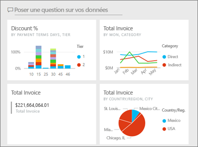
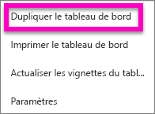
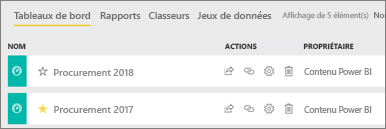

# Créer une copie d’un tableau de bord dans Power BI

 Il existe de nombreuses raisons pour effectuer une copie d’un tableau de bord. Vous voulez peut-être y apporter des modifications et tester ses performances par rapport à l’original, ou créer des versions légèrement différentes à distribuer par collègue, région ou équipe. Par exemple un collègue admire la conception de votre tableau de bord et souhaite l’utiliser pour générer des rapports destinés à ses responsables. Ou bien, vous avez une base de données avec la même structure de données et les mêmes types de données, et vous souhaitez réutiliser le tableau de bord que vous avez déjà créé. Cela est également possible dans Power BI Desktop, mais nécessiterait du travail. 

Les tableaux de bord sont créés (et copiés) à l’aide du service Power BI et peuvent être consultés dans Power BI Mobile et Power BI Embedded.  Les tableaux de bord ne sont pas disponibles dans Power BI Desktop. 

Pour effectuer une copie d’un tableau de bord, vous devez être le *créateur* du tableau de bord. Les tableaux de bord qui ont été partagés avec vous en tant qu’application ne peuvent pas être dupliqués.

1. Ouvrez le tableau de bord.
2. Dans l’angle supérieur droit, sélectionnez **Plus d’options** (…) et choisissez **Dupliquer le tableau de bord**.
   
   
3. Nommez le tableau de bord, puis sélectionnez **Dupliquer**. 
   
   
4. Le nouveau tableau de bord est enregistré dans le même espace de travail que l’original. 
   
   

5.    Ouvrez le nouveau tableau de bord et modifiez-le, le cas échéant. Voici quelques éléments que vous pouvez faire ensuite :    
    a. [Déplacer, renommer, redimensionner ou supprimer des vignettes](service-dashboard-edit-tile.md).  
    b. Modifier les détails des vignettes et les liens hypertexte en sélectionnant la vignette **Plus d’options** (...) et en choisissant **Modifier les détails**.  
    c. [Ajouter des vignettes à partir de la barre de menus du tableau de bord](service-dashboard-add-widget.md) (**Ajouter une vignette**)  
    d. Épingler des vignettes [à partir de Questions et réponses](service-dashboard-pin-tile-from-q-and-a.md) ou [à partir de rapports](service-dashboard-pin-tile-from-report.md).  
    e. Renommer le tableau de bord, activer ou désactiver Questions et réponses et définir le flux de vignettes à partir du volet de paramètres du tableau de bord.  (Sélectionnez la liste déroulante **Plus d’options** (...) du tableau de bord et choisissez **Paramètres**)  
    f. Partager votre tableau de bord directement avec vos collègues ou dans le cadre d’une application Power BI. 

## Étapes suivantes
* [Conseils pour la conception d’un tableau de bord réussi](service-dashboards-design-tips.md) 

D’autres questions ? [Posez vos questions à la communauté Power BI](https://community.powerbi.com/)

