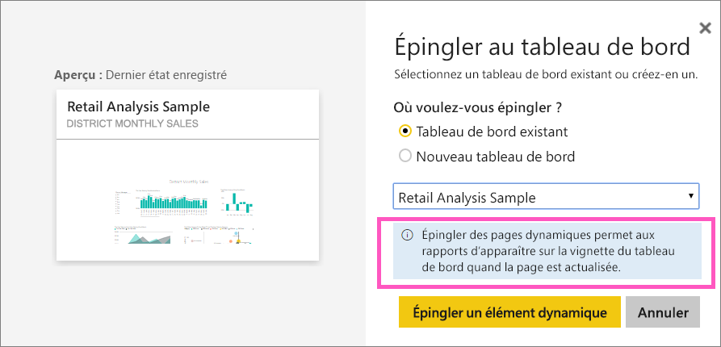
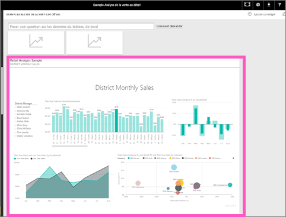

# Épingler une page entière de rapport, sous forme de vignette dynamique, sur un tableau de bord Power BI
Pour ajouter une nouvelle [vignette de tableau de bord](../consumer/end-user-tiles.md), vous pouvez aussi épingler une page entière de rapport. Il s’agit d’un moyen simple d’épingler plusieurs visualisations à la fois.  De plus, quand vous épinglez une page entière, les vignettes sont *dynamiques*: vous pouvez interagir avec elles directement sur le tableau de bord. Les modifications apportées ultérieurement à des visualisations dans l’éditeur de rapports, comme ajouter un filtre ou changer les champs utilisés dans le graphique, sont également répercutées dans la vignette du tableau de bord.  

L’épinglage de vignettes dynamiques sur des tableaux de bord à partir de rapports n’est disponible que dans le service Power BI (app.powerbi.com).

> [!NOTE]
> Vous ne pouvez pas épingler les vignettes de rapports qui sont partagés avec vous.
> 
> 

## Épingler une page de rapport
Regardez Amanda épingler une page de rapport dynamique sur un tableau de bord, puis suivez les instructions détaillées sous la vidéo pour essayer vous-même.

<iframe width="560" height="315" src="https://www.youtube.com/embed/EzhfBpPboPA" frameborder="0" allowfullscreen></iframe>

1. Ouvrez un rapport en [mode Édition](service-interact-with-a-report-in-editing-view.md).
2. Sans qu’aucune visualisation soit sélectionnée, dans la barre de menus, sélectionnez **Épingler une page dynamique**.
   
    
3. Épinglez la vignette à un tableau de bord existant ou à un nouveau tableau de bord. Notez le texte en surbrillance : *Épingler une page dynamique a pour effet de faire apparaître les modifications apportées aux rapports dans la vignette du tableau de bord quand la page est actualisée.*
   
   * Tableau de bord existant : sélectionnez le nom du tableau de bord dans la liste déroulante. Les tableaux de bord qui ont été partagés avec vous n’apparaissent pas dans la liste déroulante.
   * Nouveau tableau de bord : tapez le nom du nouveau tableau de bord.
     
     
4. Sélectionnez **Épingler un élément dynamique**. Un message de réussite (en haut à droite) vous indique que la page a été ajoutée sous forme de vignette à votre tableau de bord.

## Ouvrir le tableau de bord pour voir la vignette dynamique épinglée
1. Dans le volet de navigation, sélectionnez le tableau de bord avec la nouvelle vignette dynamique. Vous pouvez dès lors [renommer, redimensionner, lier et déplacer](service-dashboard-edit-tile.md) la page de rapport épinglée.  
2. Interagissez avec la vignette dynamique.  Dans la capture d’écran ci-dessous, la sélection d’une barre sur l’histogramme a appliqué un filtrage croisé et une mise en surbrillance croisée des autres visualisations de la vignette.
   
    

## Étapes suivantes
[Tableaux de bord dans Power BI](../consumer/end-user-dashboards.md)

D’autres questions ? [Posez vos questions à la communauté Power BI](https://community.powerbi.com/)
