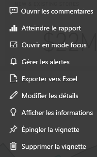

# Introduction aux vignettes de tableau de bord pour les concepteurs Power BI

Une vignette est une capture instantanée de vos données, épinglée au tableau de bord. Une vignette peut être créée à partir d’un rapport, d’un jeu de données, d’un tableau de bord, de la zone Questions et réponses, d’Excel, de rapports SSRS (SQL Server Reporting Services), etc.  Cette capture d’écran montre différentes vignettes épinglées à un tableau de bord.

Les tableaux de bord et vignettes de tableau de bord caractérisent le service Power BI et non Power BI Desktop. Vous ne pouvez pas créer de tableaux de bord sur des appareils mobiles, mais vous pouvez [les afficher et les partager](../consumer/mobile/mobile-apps-view-dashboard.md) sur ceux-ci.

Outre la possibilité d’épingler des vignettes, vous pouvez créer des vignettes autonomes directement dans le tableau de bord à l’aide du contrôle [Ajouter une vignette](service-dashboard-add-widget.md). Les vignettes autonomes incluent des zones de texte, des images, des vidéos, des données de streaming et du contenu web.

Vous avez du mal à comprendre les éléments qui composent Power BI ? Consultez [Fondamentaux pour les concepteurs dans le service Power BI](../fundamentals/service-basic-concepts.md).

> [!NOTE]
> Si la visualisation d’origine utilisée pour créer la vignette change, la vignette ne change pas.  Par exemple, si vous avez épinglé un graphique en courbes à partir d’un rapport et que vous changez ce graphique en graphique à barres, la vignette du tableau de bord continue à afficher un graphique en courbes. Les données s’actualisent, mais pas le type de visualisation.
> 
> 

## Épingler une vignette
Vous pouvez ajouter (épingler) une vignette à un tableau de bord de plusieurs manières. Vous pouvez épingler des vignettes à partir de :

* [Q&R Power BI](service-dashboard-pin-tile-from-q-and-a.md)
* [Un rapport](service-dashboard-pin-tile-from-report.md)
* [Un autre tableau de bord](service-pin-tile-to-another-dashboard.md)
* [Un classeur Excel sur OneDrive Entreprise](service-dashboard-pin-tile-from-excel.md)
* [Quick Insights (Informations rapides)](service-insights.md)
* [Un rapport paginé local dans Power BI Report Server ou SQL Server Reporting Services](/sql/reporting-services/pin-reporting-services-items-to-power-bi-dashboards)

Vous pouvez créer des vignettes autonomes pour les images, les zones de texte, les vidéos, les données de streaming et le contenu web directement dans le tableau de bord à l’aide du contrôle [Ajouter une vignette](service-dashboard-add-widget.md).

  

## Interagir avec des vignettes dans un tableau de bord
Après avoir ajouté une vignette à un tableau de bord, vous pouvez la déplacer et la redimensionner ou encore modifier son apparence et son comportement.

### Déplacement et redimensionnement d'une vignette
Saisissez une vignette et [déplacez-la dans le tableau de bord](service-dashboard-edit-tile.md). Pointez sur la  et sélectionnez-la pour redimensionner la vignette.

### Placer le curseur sur une vignette pour modifier son apparence et son comportement
1. Placez le curseur sur la vignette pour afficher les points de suspension.
   
    
2. Sélectionnez les points de suspension pour ouvrir le menu d’actions de vignette.
   
    
   
    Vous pouvez ici :
   
     * [Ajouter des commentaires au tableau de bord](../consumer/end-user-comment.md).
     * [Ouvrir le rapport qui a servi à créer cette vignette ](../consumer/end-user-reports.md).  
     * [Afficher en mode Focus](../consumer/end-user-focus.md).   
     * [Exporter les données utilisées dans la vignette](../visuals/power-bi-visualization-export-data.md).
     * [Modifier le titre et le sous-titre et ajouter un lien hypertexte](service-dashboard-edit-tile.md). 
     * [Exécuter des insights ](service-insights.md). 
     * [Épingler la vignette à un autre tableau de bord](service-pin-tile-to-another-dashboard.md).
     * [Supprimer la vignette](service-dashboard-edit-tile.md).

3. Pour fermer le menu d’actions, sélectionnez une zone vide dans le tableau de bord.

### Sélectionner une vignette
Quand vous sélectionnez une vignette, ce qui se passe ensuite dépend de la façon dont la vignette a été créée. Dans le cas contraire, la sélection de la vignette ouvre le rapport, le classeur Excel Online, le rapport Reporting Services local ou la question Q&R ayant permis de créer la vignette. Ou bien, si elle comporte un [lien personnalisé](service-dashboard-edit-tile.md), la sélection de la vignette vous fait accéder à ce lien.

> [!NOTE]
> Une exception concerne les vignettes de vidéo créées directement dans le tableau de bord via **Ajouter une vignette**. En sélectionnant une vignette de vidéo (créée de cette façon), la vidéo est lue directement dans le tableau de bord.   
> 
> 

## Considérations et résolution des problèmes

* Si le rapport qui a servir à créer la visualisation n’a pas été enregistré, la sélection de la vignette ne produit aucun effet.
* Si elle a été créée à partir d’un classeur dans Excel Online, il vous faut au moins des autorisations en lecture sur ce classeur. Sinon, la sélection de la vignette n’ouvre pas le classeur dans Excel Online.
* Supposez que vous créez une vignette directement dans le tableau de bord via **Ajouter une vignette** et que vous lui affectez un lien hypertexte personnalisé. Dans ce cas, quand vous sélectionnez le titre, le sous-titre ou la vignette, cette URL s’ouvre. Sinon, par défaut, quand vous sélectionnez une vignette créée directement dans le tableau de bord pour une image, du code web ou une zone de texte, il ne se passe rien.
* Il est possible de créer des vignettes à partir de rapports paginés locaux dans Power BI Report Server ou SQL Server Reporting Services. Si vous n’êtes pas autorisé à accéder au rapport local, la sélection de la vignette vous dirige vers une page indiquant que vous n’avez pas d’accès (rsAccessDenied).
* Supposez que vous sélectionnez une vignette créée à partir d’un rapport paginé local dans Power BI Report Server ou SQL Server Reporting Services. Si vous n’avez pas accès au réseau où se trouve le serveur de rapports, la sélection d’une vignette créée à partir de ce rapport paginé vous dirige vers une page qui indique que la localisation du serveur est impossible (HTTP 404). Votre appareil doit disposer de l’accès réseau au serveur de rapports pour afficher le rapport.
* Si la visualisation d’origine qui a servi à pour créer la vignette change, la vignette ne change pas. Par exemple, si vous épinglez un graphique en courbes à partir d’un rapport et que vous remplacez le graphique en courbes par un graphique à barres, la vignette du tableau de bord continue à afficher un graphique en courbes. Les données s’actualisent, mais pas le type de visualisation.

## Étapes suivantes
- [Créer une carte (vignette représentant un nombre important) pour votre tableau de bord](../visuals/power-bi-visualization-card.md)
- [Introduction aux tableaux de bord pour les concepteurs Power BI](service-dashboards.md)  
- [Actualisation des données dans Power BI](../connect-data/refresh-data.md)
- [Fondamentaux pour les concepteurs dans le service Power BI](../fundamentals/service-basic-concepts.md)
- [Intégration de vignettes Power BI dans les documents Office](https://powerbi.microsoft.com/blog/integrating-power-bi-tiles-into-office-documents/)
- [Épingler des éléments Reporting Services à des tableaux de bord Power BI](/sql/reporting-services/pin-reporting-services-items-to-power-bi-dashboards)

D’autres questions ? [Posez vos questions à la Communauté Power BI](https://community.powerbi.com/).