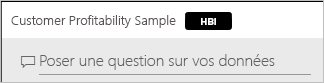
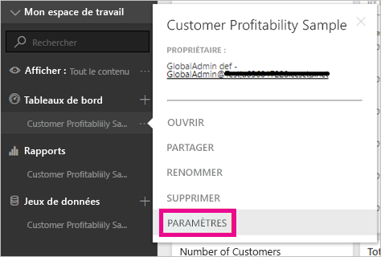
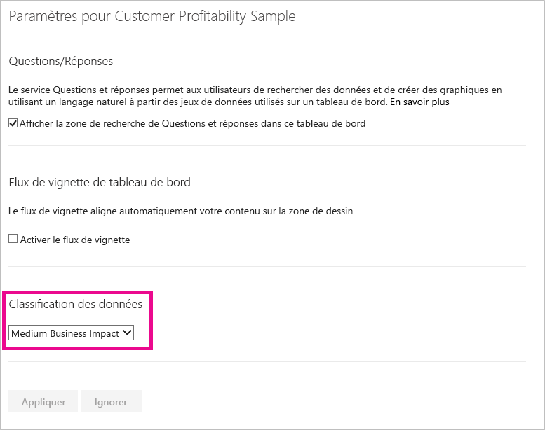
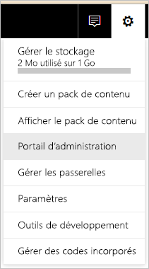
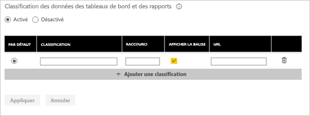
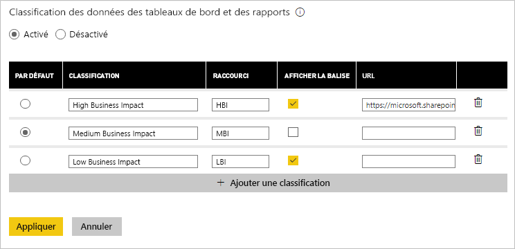

# Classification des données des tableaux de bord
Chaque tableau de bord est différent et en fonction de la source de données à laquelle vous vous connectez, vous constaterez probablement que vous et les collègues avec qui vous les partagez devez prendre des précautions différentes en fonction de la sensibilité des données. Certains tableaux de bord ne doivent jamais être partagés avec des personnes extérieures à votre entreprise ou imprimés, tandis que d’autres peuvent l’être librement. À l’aide de la classification des données des tableaux de bord, vous pouvez sensibiliser les personnes qui accèdent à ces derniers sur le niveau de sécurité qui doit être utilisé. Vous pouvez baliser vos tableaux de bord avec des classifications définies par le service informatique de votre entreprise afin que toutes les personnes qui affichent le contenu aient le même niveau de compréhension de la sensibilité des données.

## Balises de classification des données
Les balises de classification des données s’affichent en regard du nom du tableau de bord. Elles permettent aux personnes qui l’affichent de connaître le niveau de sécurité à appliquer au tableau de bord et aux données associées.

Elles s’affichent également en regard de la vignette du tableau de bord dans votre liste de favoris.

Lorsque vous pointez sur la balise, le nom complet de la classification s’affiche.

Les administrateurs peuvent également définir une URL de balise afin de fournir des informations supplémentaires.

> [!NOTE]
> Selon les paramètres de classification définies par votre administrateur, certains types de classification peuvent ne pas s’afficher en tant que balise sur le tableau de bord. Si vous êtes propriétaire d’un tableau de bord, vous pouvez toujours vérifier le type de classification associé sous les paramètres de ce dernier.
> 
> 

## Définition de la classification d’un tableau de bord
Si la classification des données est activée pour votre entreprise, tous les tableaux de bord ont un type de classification par défaut, mais en tant que propriétaire d’un tableau de bord, vous pouvez modifier la classification en fonction du niveau de sécurité requis.

Pour modifier le type de classification, procédez comme suit :

1. Pour accéder aux paramètres du tableau de bord, sélectionnez les **points de suspension** en regard du nom du tableau de bord, puis sélectionnez **Paramètres**.
   
    
2. Sous les paramètres de tableau de bord, vous pouvez voir la classification actuelle de votre tableau de bord et utiliser la liste déroulante pour modifier le type de classification.
   
    
3. Lorsque vous avez terminé, sélectionnez **Appliquer**.

Une fois que la modification a été appliquée, les utilisateurs avec qui vous avez partagé le tableau de bord voient la mise à jour dès qu’ils rechargent le tableau de bord.

## Utilisation des balises de classification des données en tant qu’administrateur
La classification des données est définie par l’administrateur global de votre organisation. Pour activer la classification des données, procédez comme suit :

1. Sélectionnez l’engrenage Paramètres, puis **Portail d’administration**.
   
    
2. Définissez **Classification des données des tableaux de bord et des rapports** sur *Activé* sous l’onglet **Paramètres du client**.
   
    

Le formulaire qui s’affiche ensuite permet de créer différentes classifications dans votre organisation.

Chaque classification a un **nom** et un **raccourci** qui apparaissent sur le tableau de bord. Pour chaque classification, vous pouvez indiquer si la balise raccourcie s’affiche sur le tableau de bord en sélectionnant **Afficher la balise**. Si vous décidez de ne pas afficher le type de classification sur le tableau de bord, le propriétaire peut toujours voir cette information en consultant les paramètres du tableau de bord. En outre, si vous le souhaitez, vous pouvez ajouter une **URL** qui contient des informations supplémentaires sur les instructions de classification et les conditions d’utilisation définies par votre organisation.  

Pour terminer, choisissez le type de classification par défaut.  

Une fois que vous avez rempli le formulaire avec vos types de classification, sélectionnez **Appliquer** pour enregistrer les modifications.

À ce stade, la classification par défaut est affectée à tous les tableaux de bord. Les propriétaires des tableaux de bord peuvent désormais mettre à jour le type de classification en fonction de leur contenu. Vous pouvez revenir ici ultérieurement pour ajouter ou supprimer des types de classification ou modifier ceux définis par défaut.  

> [!NOTE]
> Il existe quelques points importants à retenir lorsque vous revenez apporter des modifications :
> 
> * Si vous désactivez la classification des données, aucune des balises n’est mémorisée. Vous devez recommencer si vous décidez de la réactiver ultérieurement.  
> * Si vous supprimez un type de classification, les tableaux de bord affectés au type de classification supprimé sont attribués au type par défaut jusqu’à ce que le propriétaire le définisse une nouvelle fois.  
> * Si vous modifiez la valeur par défaut, tous les tableaux de bord qui n’étaient pas déjà associés à un type de classification par le propriétaire obtiennent la nouvelle valeur par défaut.
> 
> 

