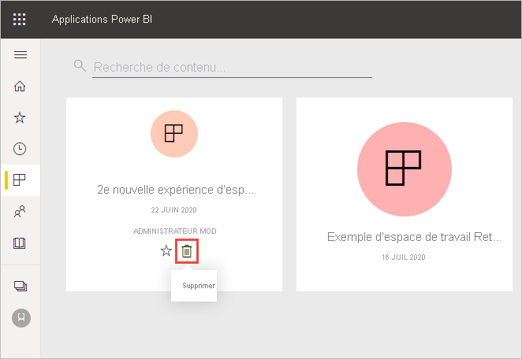
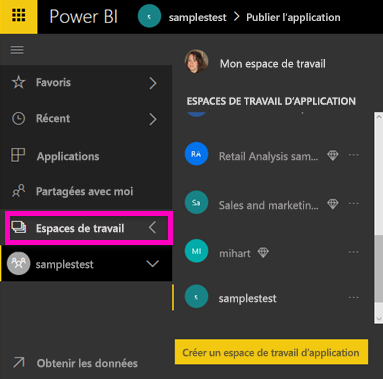

# Supprimer quasiment tout dans le service Power BI
Cet article explique comment supprimer un tableau de bord, un rapport, un classeur, un jeu de données, une application, une visualisation ou un espace de travail dans le service Power BI. Vous pouvez supprimer quasiment tout dans le service Power BI, à quelques exceptions près. 

## Supprimer un tableau de bord, un rapport, un jeu de données ou un classeur

1. Dans votre espace de travail, sélectionnez l’onglet **Tout**.
1. Sélectionnez **Plus d’options (...)** à côté de l’élément à supprimer, puis sélectionnez **Supprimer**.

    

1. Sélectionnez **Supprimer** pour confirmer la suppression.

## Supprimer une application de la page de votre liste d’applications

Vous pouvez facilement supprimer des applications de votre liste d’applications. Lorsque vous supprimez une application, vous ne la supprimez pas pour les autres membres. Seul un administrateur, un membre ou un espace de travail peut supprimer définitivement l’application de cet espace de travail.

1. Dans le volet de navigation, sélectionnez **Applications** pour ouvrir la page de la liste d’applications.
2. Pointez sur l’application à supprimer, puis sélectionnez l’icône Supprimer :::image type="icon" source="media/service-delete/power-bi-delete-report2.png" border="false":::.

   

   Si vous supprimez accidentellement une application, vous disposez de plusieurs options pour la récupérer.  Vous pouvez demander au créateur de l’application de la renvoyer, rechercher l’e-mail d’origine contenant le lien vers l’application, consulter votre [centre de notifications](../consumer/end-user-notification-center.md) pour voir si la notification relative à cette application y figure toujours, ou vérifier l’[AppSource de votre organisation](../consumer/end-user-apps.md).

## Supprimer ou effacer un espace de travail

Power BI propose deux types différents d’espaces de travail : les *classiques*, ceux d’origine, et les nouveaux. Supprimer et effacer un espace de travail sont deux choses différentes. En savoir plus sur les [espaces de travail nouveaux et classiques](../collaborate-share/service-new-workspaces.md).

### Supprimer des membres d’un nouvel espace de travail

Seuls les administrateurs de l’espace de travail peuvent supprimer des membres d’un nouvel espace de travail. Si vous êtes administrateur, vous pouvez vous supprimer vous-même ou tout autre membre. Par contre, si vous êtes le seul administrateur d’un espace de travail, Power BI ne vous permet pas de vous supprimer.

1. Dans la liste des espaces de travail, sélectionnez **Accès** en haut à droite.

    :::image type="content" source="media/service-delete/power-bi-select-access.png" alt-text="Capture d’écran de la sélection d’Accès.":::

1. Dans le volet **Accès**, sélectionnez **Plus d’options (...)** en regard du nom du membre à supprimer, puis sélectionnez **Supprimer**.

    :::image type="content" source="media/service-delete/power-bi-access-remove.png" alt-text="Capture d’écran de la sélection de l’option Supprimer dans le volet Accès.":::

### Supprimer un nouvel espace de travail

Lorsque vous créez un *nouvel espace de travail*, vous ne créez pas de groupe Microsoft 365 associé. Si vous êtes administrateur d’espace de travail, vous pouvez supprimer un nouvel espace de travail sans impacter les groupes Microsoft 365. En savoir plus sur les [espaces de travail nouveaux et classiques](../collaborate-share/service-new-workspaces.md).

En tant qu’administrateur d’un espace de travail, vous pouvez le supprimer ou en supprimer les membres. Lorsque vous le supprimez, l’application associée est également supprimée pour tous les membres du groupe, ainsi que d’AppSource. 

1. Dans le volet de navigation, sélectionnez **Espaces de travail**.

2. Sélectionnez **Plus d’options** (...) à droite de l’espace de travail à supprimer, puis choisissez **Paramètres d’espace de travail**.

    

3. Dans le volet **Paramètres d’espace de travail**, sélectionnez **Supprimer l’espace de travail** > **Supprimer**.

### Retirer un espace de travail classique de la liste

Si vous ne voulez plus être membre d’un espace de travail classique, vous pouvez le **_quitter_* _ : il sera alors retiré de votre liste. Lorsque vous quittez un espace de travail, celui-ci reste en place pour tous ses autres membres.  

> [!NOTE]
> Si vous êtes l’unique administrateur de l’espace de travail, Power BI ne vous autorise pas à quitter celui-ci.
>

1. Démarrez dans l’espace de travail que vous voulez supprimer.

2. En haut à droite, sélectionnez _ *Plus d’options** (…), puis choisissez **Quitter l’espace de travail** > **Quitter**.

      :::image type="content" source="media/service-delete/power-bi-leave-workspace.png" alt-text="Capture d’écran de l’option Quitter l’espace de travail dans Plus d’options.":::

   > [!NOTE]
   > Les options qui apparaissent dans la liste déroulante varient selon que vous êtes administrateur ou membre de cet espace de travail.
   >

### Supprimer un espace de travail classique

> [!WARNING]
> Quand vous créez un espace de travail *classique*, vous créez un groupe Microsoft 365. Quand vous supprimez un espace de travail classique, vous supprimez également ce groupe Microsoft 365. Le groupe est également supprimé des autres produits Microsoft 365, comme SharePoint et Microsoft Teams.
> 

Supprimer un espace de travail n’est pas quitter un espace de travail. Vous devez être administrateur d’espace de travail pour le supprimer. Lorsque vous le supprimez, l’application associée est également supprimée pour tous les membres du groupe, ainsi que d’AppSource. Par contre, si vous êtes le seul administrateur d’un espace de travail, Power BI ne vous permet pas de le quitter.

1. Dans le volet de navigation, sélectionnez **Espaces de travail**.

2. À côté de l’espace de travail à supprimer, sélectionnez **Plus d’options(...)**  > **Paramètres d’espace de travail**.

    

3. Dans le volet **Paramètres**, sélectionnez **Supprimer l’espace de travail**, puis confirmez en sélectionnant **Supprimer**.

    

## Considérations et limitations

- La suppression d’un *tableau de bord* n’entraîne pas celle du jeu de données sous-jacent ni des rapports qui peuvent lui être associés.
- Si vous êtes *propriétaire d’un tableau de bord ou d’un rapport*, vous pouvez le supprimer. Si vous l’avez partagé avec des collègues, le fait de le supprimer de votre espace de travail Power BI le supprimera également de leurs espaces de travail Power BI.
- Si un *tableau de bord ou un rapport sont partagés avec vous*, vous ne pouvez pas les supprimer.
- La suppression d’un rapport ne supprime pas le jeu de données sur lequel il est basé.  Toutes les visualisations que vous avez épinglées au tableau de bord à partir du rapport sont également conservées. Elles restent sur le tableau de bord tant que vous ne les supprimez pas une par une.
- Vous pouvez supprimer un *jeu de données*. Toutefois, la suppression d’un jeu de données a également pour effet de supprimer l’ensemble des rapports et vignettes de tableau de bord contenant des données de ce jeu de données.
- Vous pouvez supprimer des *classeurs*. Toutefois, la suppression d’un classeur a également pour effet de supprimer l’ensemble des rapports et vignettes de tableau de bord contenant des données de ce classeur. Si un classeur est stocké sur OneDrive Entreprise, sa suppression de Power BI n’aura pas pour effet de le supprimer de OneDrive.
- Si un *tableau de bord ou un rapport* fait partie d’un [pack de contenu d’organisation](../collaborate-share/service-organizational-content-pack-disconnect.md), vous ne pouvez pas le supprimer à l’aide de cette méthode.  Voir [Suppression de votre connexion à un pack de contenu d’organisation](../collaborate-share/service-organizational-content-pack-disconnect.md).
- Si un *jeu de données* fait partie d’un ou plusieurs packs de contenu d’organisation, la seule manière de le supprimer est de le retirer des packs de contenu dans lesquels il est utilisé, d’attendre la fin du traitement de l’opération, puis de réessayer de le supprimer.

## Étapes suivantes

Cet article a expliqué comment supprimer les principaux composants du service Power BI. Voici d’autres éléments que vous pouvez supprimer.  

- [Supprimer votre tableau de bord par défaut](../consumer/end-user-featured.md)
- [Retirer un tableau de bord des favoris](../consumer/end-user-favorite.md)
- [Supprimer une vignette de tableau de bord](service-dashboard-edit-tile.md)

D’autres questions ? [Posez vos questions à la communauté Power BI](https://community.powerbi.com/)